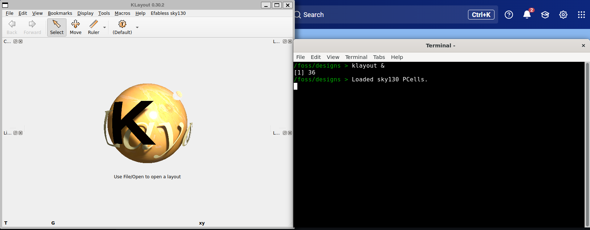
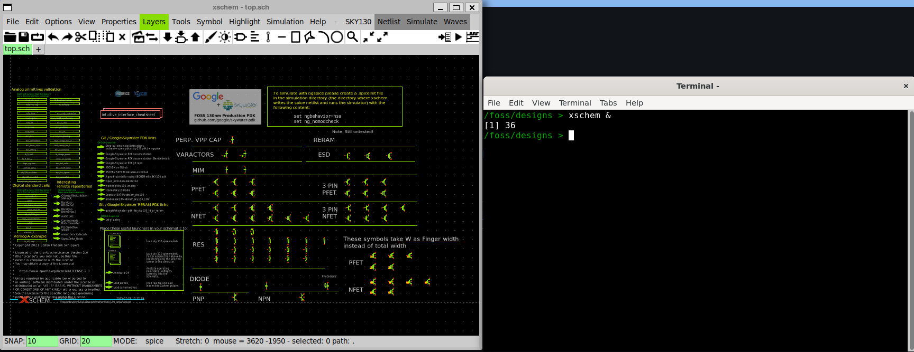

# Setup su Linux

> Guida testata su **Ubuntu 22.04 LTS** e **Ubuntu 24.04 LTS**. Dovrebbe funzionare anche su Fedora e altre distribuzioni con adattamenti minimi. Tempo stimato: 20–30 minuti.

---

## Panoramica dei passaggi

```
1. Installare git  →  2. Installare Docker  →  3. Clonare IIC-OSIC-TOOLS
→  4. Configurare le variabili d'ambiente  →  5. Avviare il container
→  6. Clonare LibreLane Summary  →  7. Configurazione del PDK  →  8. Test finale
→  9. Installare VS Code (editor VHDL)
```

---

## Passo 1 — Installare git

Se git non è già presente sul sistema, installalo con:

```bash
sudo apt-get install git
```

Su Fedora:

```bash
sudo dnf install git
```

---

## Passo 2 — Installare Docker

Segui le istruzioni ufficiali di IIC-OSIC-TOOLS per installare Docker Engine:

👉 https://github.com/iic-jku/IIC-OSIC-TOOLS?tab=readme-ov-file#4-quick-launch-for-designers

> ⚠️ **Post-install obbligatorio:** segui le istruzioni post-installazione per aggiungere il tuo utente al gruppo `docker`. Questo evita di dover eseguire i tool come `root`, il che causerebbe problemi di permessi sui file di progetto.
>
> ```bash
> sudo usermod -aG docker $USER
> ```
> Dopo questo comando, **esci dalla sessione e rientra** (oppure riavvia) affinché la modifica sia effettiva.

Verifica che Docker funzioni correttamente eseguendo:

```bash
docker run hello-world
```

Se vedi il messaggio di benvenuto, Docker è installato correttamente.

---

## Passo 3 — Clonare IIC-OSIC-TOOLS

Apri un terminale e clona il repository alla versione **2025.07**:

```bash
git clone https://github.com/iic-jku/IIC-OSIC-TOOLS.git -b 2025.07
```

> 🔒 **Perché una versione specifica?** Fissare la versione garantisce che tutti gli studenti del corso abbiano esattamente gli stessi tool e le stesse librerie. Non usare `latest` o `main` — potrebbero introdurre incompatibilità con gli esercizi del corso.

---

## Passo 4 — Configurare le variabili d'ambiente

Il container ha bisogno di due variabili d'ambiente prima di partire:

| Variabile | Significato |
|-----------|-------------|
| `DESIGNS` | Cartella sul tuo PC dove salverai tutti i tuoi progetti |
| `DOCKER_TAG` | Versione del container da usare (deve essere `2025.07`) |

### 4a — Creare la cartella dei progetti

Crea una cartella dedicata ai tuoi design ASIC:

```bash
mkdir ~/asic
```

### 4b — Rendere le variabili persistenti

Per non doverle reimpostare ad ogni sessione, aggiungile in fondo al file `~/.bashrc`:

```bash
echo 'export DOCKER_TAG=2025.07' >> ~/.bashrc
echo 'export DESIGNS=~/asic' >> ~/.bashrc
source ~/.bashrc
```

> ✅ Il comando `source ~/.bashrc` applica le modifiche nella sessione corrente senza dover aprire un nuovo terminale.

---

## Passo 5 — Avviare il container

Portati nella cartella dove hai clonato IIC-OSIC-TOOLS ed esegui lo script di avvio:

```bash
cd IIC-OSIC-TOOLS
./start_x.sh
```

La **prima volta** il comando scaricherà l'immagine Docker dal registro remoto (~15 GB). Ci vorranno alcuni minuti a seconda della tua connessione. Le volte successive il container si avvierà in pochi secondi.

Al termine si aprirà automaticamente una finestra del browser con l'interfaccia grafica del container.

### Riavvii successivi

La prossima volta che vorrai usare il container, riesegui `./start_x.sh` dalla stessa cartella. Lo script ti proporrà due opzioni se il container esiste già:

- **`s`** — avvia il container esistente
- **`r`** — rimuovi il container e ricrealo da zero

Usa `s` nella maggior parte dei casi. Usa `r` solo se il container è corrotto o vuoi ripartire pulito (non perderai i file in `~/asic` perché sono sul tuo filesystem, non dentro il container).

---

## Passo 6 — Clonare LibreLane Summary

LibreLane Summary è uno script che fornisce un riepilogo leggibile dei risultati prodotti dal flusso OpenLane. Lo useremo nei moduli avanzati del corso.

Dal terminale dentro il container, portati nella cartella dei design ed esegui il clone:

```bash
cd /foss/designs
git clone https://github.com/mattvenn/librelane_summary
```

Troverai la cartella `librelane_summary/` direttamente nella tua cartella `~/asic/` — è persistente e non andrà persa al riavvio del container.

---

## Passo 7 — Configurazione del PDK

Dobbiamo creare il file `.designinit` che il container legge automaticamente ad ogni avvio per impostare tutte le variabili d'ambiente del PDK.

**Dove va creato:** nella cartella `/foss/designs/` dentro il container, che corrisponde alla tua cartella `~/asic/` su Linux. Essendo una cartella montata (non interna al container), il file **sopravvive ai riavvii e alle ricreazioni del container**.

Dal terminale dentro il container, esegui:

```bash
cat > /foss/designs/.designinit << 'EOF'
PDK_ROOT=/foss/pdks
PDK=sky130A
PDKPATH=/foss/pdks/sky130A
STD_CELL_LIBRARY=sky130_fd_sc_hd
SPICE_USERINIT_DIR=/foss/pdks/sky130A/libs.tech/ngspice
KLAYOUT_PATH=/headless/.klayout:/foss/pdks/sky130A/libs.tech/klayout:/foss/pdks/sky130A/libs.tech/klayout/tech
PATH=$PATH:/foss/designs/librelane_summary

# Aggiunge opzioni mancanti a .spiceinit (KLU solver, noinit, skywaterpdk)
grep -q "option klu" ~/.spiceinit 2>/dev/null || cat >> ~/.spiceinit << 'SPICEINIT'
* added by .designinit
set skywaterpdk
option noinit
option klu
SPICEINIT
EOF
```

In alternativa, puoi crearlo direttamente dal terminale Linux (fuori dal container) nella cartella `~/asic/`:

```bash
cat > ~/asic/.designinit << 'EOF'
PDK_ROOT=/foss/pdks
PDK=sky130A
PDKPATH=/foss/pdks/sky130A
STD_CELL_LIBRARY=sky130_fd_sc_hd
SPICE_USERINIT_DIR=/foss/pdks/sky130A/libs.tech/ngspice
KLAYOUT_PATH=/headless/.klayout:/foss/pdks/sky130A/libs.tech/klayout:/foss/pdks/sky130A/libs.tech/klayout/tech
PATH=$PATH:/foss/designs/librelane_summary

# Aggiunge opzioni mancanti a .spiceinit (KLU solver, noinit, skywaterpdk)
grep -q "option klu" ~/.spiceinit 2>/dev/null || cat >> ~/.spiceinit << 'SPICEINIT'
* added by .designinit
set skywaterpdk
option noinit
option klu
SPICEINIT
EOF
```

Il risultato è identico — il file apparirà come `/foss/designs/.designinit` dentro il container.

> 💡 `.designinit` è l'equivalente di un `.bashrc` specifico per il PDK: le variabili qui definite saranno disponibili automaticamente in ogni sessione del container, senza doverle riesportare ogni volta.

> 💡 **Nota sul .spiceinit:** il container IIC-OSIC-TOOLS include già un `.spiceinit` di base. Il blocco nel `.designinit` aggiunge le opzioni mancanti: `option klu` (solver più veloce), `option noinit` (sopprime stampa OP all'avvio), `set skywaterpdk` (caricamento modelli più veloce). Il `grep` evita duplicati nei riavvii. La configurazione di xschem viene gestita nel file `xschemrc` locale di ogni progetto — vedi Modulo 1.

---

## Passo 8 — Test finale

Esegui questi comandi all'interno del container per verificare che tutto funzioni:

```bash
echo $IIC_OSIC_TOOLS_VERSION   # atteso: 2025.07
echo $PDK                       # atteso: sky130A
klayout &                       # deve aprire KLayout 0.30.2
xschem &                        # deve aprire xschem
```




Se tutti i comandi producono l'output atteso, l'ambiente è configurato correttamente. 🎉

---

## Passo 9 — Installare VS Code come editor VHDL

Il container IIC-OSIC-TOOLS include tutti i tool necessari per simulare e sintetizzare codice VHDL (`ghdl`, `gtkwave`, `librelane --flow VHDLClassic`), ma non dispone di un editor con supporto moderno al linguaggio. Il flusso di lavoro raccomandato per il corso è scrivere e fare il debug del codice VHDL in **Visual Studio Code** sul tuo sistema, e poi simulare e sintetizzare dal terminale del container.

Questo funziona senza alcuna configurazione aggiuntiva: la cartella `~/asic/` sul tuo sistema è la stessa cartella che il container vede come `/foss/designs/`. Qualsiasi file che scrivi in VS Code è immediatamente disponibile nel container.

```
VS Code (Linux)             Container Docker
~/asic/mio_progetto/  ──►  /foss/designs/mio_progetto/
  top.vhd                    ghdl -a top.vhd          ← compilazione/simulazione
  testbench.vhd              ghdl -e tb && ghdl -r tb ← esecuzione testbench
                             gtkwave dump.vcd          ← forme d'onda
                             librelane --flow VHDLClassic ← sintesi RTL→GDS
```

### 9a — Installare VS Code

Su **Ubuntu/Debian**, il metodo più semplice è il pacchetto snap:

```bash
sudo snap install code --classic
```

In alternativa, puoi scaricarlo come pacchetto `.deb` dal sito ufficiale e installarlo con:

```bash
sudo dpkg -i code_*.deb
sudo apt-get install -f   # risolve eventuali dipendenze mancanti
```

Su **Fedora**:

```bash
sudo rpm --import https://packages.microsoft.com/keys/microsoft.asc
sudo dnf install https://packages.microsoft.com/yumrepos/vscode/code-latest.x86_64.rpm
```

Sito ufficiale per il download manuale: 👉 https://code.visualstudio.com/

### 9b — Installare le estensioni VHDL

Apri VS Code, poi accedi al pannello estensioni (`Ctrl+Shift+X`) e installa:

#### Estensione 1 — VHDL LS (obbligatoria)

Cerca: **`VHDL LS`** — autore: _Henrik Bohlin_

ID marketplace: `hbohlin.vhdl-ls`

Questa estensione implementa un Language Server completo per VHDL. Fornisce:
- rilevamento errori di sintassi e semantici in tempo reale (senza GHDL installato localmente)
- completamento automatico di segnali, porte, componenti
- navigazione: _Go to Definition_, _Find All References_
- hover con informazioni sul tipo

> 💡 VHDL LS funziona autonomamente senza dipendenze esterne. Basta installarla e aprire un file `.vhd` o `.vhdl` per avere il linting attivo.

#### Estensione 2 — TerosHDL (consigliata)

Cerca: **`TerosHDL`** — autore: _Teros Technology_

ID marketplace: `teros-technology.teroshdl`

Estensione avanzata per VHDL e Verilog/SystemVerilog, con:
- visualizzatore di gerarchia del progetto
- visualizzatore di macchine a stati FSM (disegna automaticamente il diagramma dal codice)
- generatore di template per entity, architecture, testbench
- integrazione con simulatori tra cui GHDL (configurabile in seguito)
- documentazione automatica del codice

> 💡 TerosHDL è utile soprattutto per i progetti più complessi del corso (Modulo 4 e Modulo 5). Per i primi esercizi è sufficiente VHDL LS.

### 9c — Aprire la cartella dei progetti in VS Code

Per lavorare comodamente, apri la cartella `~/asic/` come workspace di VS Code:

```
File → Apri cartella... → /home/<tuonome>/asic
```

In questo modo VS Code vedrà tutti i tuoi progetti e potrai navigare tra i file con l'explorer laterale.

> 💡 Su Linux puoi anche aprire VS Code direttamente da terminale nella cartella del progetto:
> ```bash
> code ~/asic/mio_progetto
> ```

---

## Troubleshooting

### Errore "permission denied" eseguendo `./start_x.sh`
Lo script non ha i permessi di esecuzione. Correggilo con:
```bash
chmod +x start_x.sh
```

### Errore "Got permission denied while trying to connect to the Docker daemon"
Il tuo utente non è nel gruppo `docker`. Esegui:
```bash
sudo usermod -aG docker $USER
```
Poi esci dalla sessione e rientra.

### La GUI non si apre nel browser
Il container usa un server X accessibile via browser sulla porta 6080. Se non si apre automaticamente, prova ad aprire manualmente:
```
http://localhost
```
Controlla anche che nessun firewall locale blocchi la porta.

### Le variabili d'ambiente non sono riconosciute dentro il container
Verifica che `DESIGNS` e `DOCKER_TAG` siano impostate correttamente nel terminale da cui hai lanciato `./start_x.sh`:
```bash
echo $DESIGNS
echo $DOCKER_TAG
```
Se sono vuote, ricontrolla il tuo `~/.bashrc` e riesegui `source ~/.bashrc`.

---

## Prossimo passo

Una volta completato il setup, passa al [Modulo 1 — Schematic & Simulazione con xschem/ngspice](../01_xschem_ngspice/).
