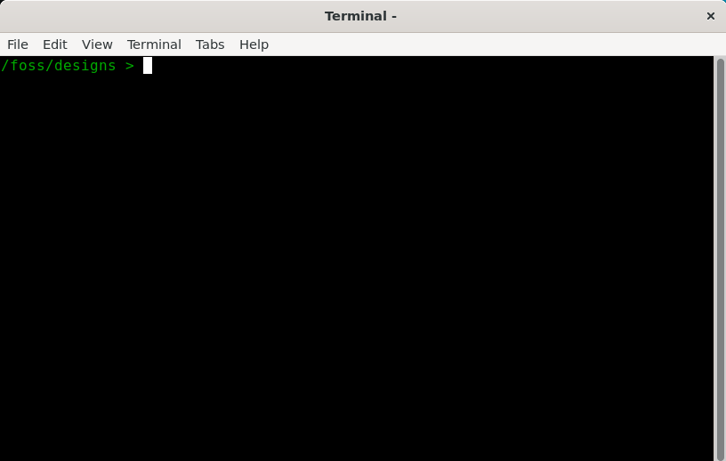

# Setup su macOS

> Guida testata su **macOS con Apple Silicon (M1/M2/M3)** e **macOS con Intel**. Tempo stimato: 30–45 minuti.

---

## Panoramica dei passaggi

```
1. Installare git (Xcode CLI)  →  2. Installare Docker  →  3. Installare XQuartz (server X11)
→  4. Clonare IIC-OSIC-TOOLS  →  5. Configurare le variabili d'ambiente
→  6. Avviare il container  →  7. Clonare LibreLane Summary
→  8. Configurazione del PDK  →  9. Test finale
→  10. Installare VS Code (editor VHDL)
```

---

## Passo 1 — Installare git

Su macOS, git è incluso negli strumenti da riga di comando di Xcode. Apri un terminale ed esegui:

```bash
xcode-select --install
```

Segui il processo di installazione guidata. Se git è già installato, il comando lo segnalerà e potrai procedere.

---

## Passo 2 — Installare Docker

Segui le istruzioni ufficiali di IIC-OSIC-TOOLS per installare Docker Desktop:

👉 https://github.com/iic-jku/IIC-OSIC-TOOLS?tab=readme-ov-file#4-quick-launch-for-designers

Assicurati di scaricare la versione corretta per il tuo chip:
- **Apple Silicon (M1/M2/M3):** scarica il file `.dmg` per la piattaforma **Apple Silicon**
- **Intel:** scarica il file `.dmg` per la piattaforma **Intel**

Dopo l'installazione, avvia Docker Desktop dal Launchpad o dalla cartella Applicazioni. Al primo avvio ti verrà chiesto di creare un account Docker Hub — puoi registrarti gratuitamente oppure accedere con il tuo account Google o GitHub.

> ⚠️ Docker Desktop deve essere **in esecuzione** (icona visibile nella barra dei menu) ogni volta che vuoi usare il container.

---

## Passo 3 — Installare XQuartz (server X11)

A differenza di Windows e Linux, macOS non include un server X11 nativo. Il container IIC-OSIC-TOOLS ne ha bisogno per aprire le interfacce grafiche dei tool EDA. Il server consigliato e testato è **XQuartz**.

Segui le istruzioni di installazione ufficiali di IIC-OSIC-TOOLS:

👉 https://github.com/iic-jku/IIC-OSIC-TOOLS?tab=readme-ov-file#434-installing-x11-server

Dopo l'installazione, apri XQuartz e vai su **Preferenze → Sicurezza** e abilita l'opzione:

> ✅ **"Allow connections from network clients"**

Questo passaggio è **obbligatorio**: senza di esso il container non riuscirà a inviare la grafica al tuo schermo.

> 💡 Dopo aver modificato questa impostazione, **riavvia XQuartz** affinché la modifica sia attiva.

---

## Passo 4 — Clonare IIC-OSIC-TOOLS

Apri un terminale e clona il repository alla versione **2025.07**:

```bash
git clone https://github.com/iic-jku/IIC-OSIC-TOOLS.git -b 2025.07
```

> 🔒 **Perché una versione specifica?** Fissare la versione garantisce che tutti gli studenti del corso abbiano esattamente gli stessi tool e le stesse librerie. Non usare `latest` o `main` — potrebbero introdurre incompatibilità con gli esercizi del corso.

---

## Passo 5 — Configurare le variabili d'ambiente

Il container ha bisogno di due variabili d'ambiente prima di partire:

| Variabile | Significato |
|-----------|-------------|
| `DESIGNS` | Cartella sul tuo Mac dove salverai tutti i tuoi progetti |
| `DOCKER_TAG` | Versione del container da usare (deve essere `2025.07`) |

### 5a — Creare la cartella dei progetti

Crea una cartella dedicata ai tuoi design ASIC:

```bash
mkdir ~/asic
```

### 5b — Rendere le variabili persistenti

Su macOS la shell predefinita è **zsh**. Aggiungi le variabili in fondo al file `~/.zprofile` (che viene letto ad ogni avvio della shell):

```bash
echo 'export DOCKER_TAG=2025.07' >> ~/.zprofile
echo 'export DESIGNS=~/asic' >> ~/.zprofile
source ~/.zprofile
```

> ✅ Il comando `source ~/.zprofile` applica le modifiche nella sessione corrente senza dover aprire un nuovo terminale.

> 💡 Se usi bash invece di zsh (meno comune su macOS recente), modifica `~/.bash_profile` invece di `~/.zprofile`.

---

## Passo 6 — Avviare il container

Assicurati che sia **Docker Desktop** che **XQuartz** siano in esecuzione, poi portati nella cartella dove hai clonato IIC-OSIC-TOOLS ed esegui lo script di avvio:

```bash
cd IIC-OSIC-TOOLS
./start_x.sh
```

La **prima volta** il comando scaricherà l'immagine Docker dal registro remoto (~15 GB). Ci vorranno alcuni minuti a seconda della tua connessione. Le volte successive il container si avvierà in pochi secondi.

Al termine si aprirà automaticamente una finestra con il terminale del container.



### Riavvii successivi

La prossima volta che vorrai usare il container, riesegui `./start_x.sh` dalla stessa cartella. Lo script ti proporrà due opzioni se il container esiste già:

- **`s`** — avvia il container esistente
- **`r`** — rimuovi il container e ricrealo da zero

Usa `s` nella maggior parte dei casi. Usa `r` solo se il container è corrotto o vuoi ripartire pulito (non perderai i file in `~/asic` perché sono sul tuo filesystem, non dentro il container).

---

## Passo 7 — Clonare LibreLane Summary

LibreLane Summary è uno script che fornisce un riepilogo leggibile dei risultati prodotti dal flusso OpenLane. Lo useremo nei moduli avanzati del corso.

Dal terminale dentro il container, portati nella cartella dei design ed esegui il clone:

```bash
cd /foss/designs
git clone https://github.com/mattvenn/librelane_summary
```

Troverai la cartella `librelane_summary/` direttamente nella tua cartella `~/asic/` — è persistente e non andrà persa al riavvio del container.

---

## Passo 8 — Configurazione del PDK

Dobbiamo creare il file `.designinit` che il container legge automaticamente ad ogni avvio per impostare tutte le variabili d'ambiente del PDK.

**Dove va creato:** nella cartella `/foss/designs/` dentro il container, che corrisponde alla tua cartella `~/asic/` sul Mac. Essendo una cartella montata (non interna al container), il file **sopravvive ai riavvii e alle ricreazioni del container**.

Dal terminale dentro il container, esegui:

```bash
cat > /foss/designs/.designinit << 'EOF'
PDK_ROOT=/foss/pdks
PDK=sky130A
PDKPATH=/foss/pdks/sky130A
STD_CELL_LIBRARY=sky130_fd_sc_hd
SPICE_USERINIT_DIR=/foss/pdks/sky130A/libs.tech/ngspice
KLAYOUT_PATH=/headless/.klayout:/foss/pdks/sky130A/libs.tech/klayout:/foss/pdks/sky130A/libs.tech/klayout/tech
PATH=$PATH:/foss/designs/librelane_summary

# Aggiunge opzioni mancanti a .spiceinit (KLU solver, noinit, skywaterpdk)
grep -q "option klu" ~/.spiceinit 2>/dev/null || cat >> ~/.spiceinit << 'SPICEINIT'
* added by .designinit
set skywaterpdk
option noinit
option klu
SPICEINIT
EOF
```

In alternativa, puoi crearlo direttamente dal terminale macOS (fuori dal container) nella cartella `~/asic/`:

```bash
cat > ~/asic/.designinit << 'EOF'
PDK_ROOT=/foss/pdks
PDK=sky130A
PDKPATH=/foss/pdks/sky130A
STD_CELL_LIBRARY=sky130_fd_sc_hd
SPICE_USERINIT_DIR=/foss/pdks/sky130A/libs.tech/ngspice
KLAYOUT_PATH=/headless/.klayout:/foss/pdks/sky130A/libs.tech/klayout:/foss/pdks/sky130A/libs.tech/klayout/tech
PATH=$PATH:/foss/designs/librelane_summary

# Aggiunge opzioni mancanti a .spiceinit (KLU solver, noinit, skywaterpdk)
grep -q "option klu" ~/.spiceinit 2>/dev/null || cat >> ~/.spiceinit << 'SPICEINIT'
* added by .designinit
set skywaterpdk
option noinit
option klu
SPICEINIT
EOF
```

Il risultato è identico — il file apparirà come `/foss/designs/.designinit` dentro il container.

> 💡 `.designinit` è l'equivalente di un `.bashrc` specifico per il PDK: le variabili qui definite saranno disponibili automaticamente in ogni sessione del container, senza doverle riesportare ogni volta.

> 💡 **Nota sul .spiceinit:** il container IIC-OSIC-TOOLS include già un `.spiceinit` di base. Il blocco nel `.designinit` aggiunge le opzioni mancanti: `option klu` (solver più veloce), `option noinit` (sopprime stampa OP all'avvio), `set skywaterpdk` (caricamento modelli più veloce). Il `grep` evita duplicati nei riavvii. La configurazione di xschem viene gestita nel file `xschemrc` locale di ogni progetto — vedi Modulo 1.

---

## Passo 9 — Test finale

Esegui questi comandi all'interno del container per verificare che tutto funzioni:

```bash
echo $IIC_OSIC_TOOLS_VERSION   # atteso: 2025.07
echo $PDK                       # atteso: sky130A
klayout &                       # deve aprire KLayout 0.30.2
xschem &                        # deve aprire xschem
```


Se tutti i comandi producono l'output atteso, l'ambiente è configurato correttamente. 🎉

---

## Passo 10 — Installare VS Code come editor VHDL

Il container IIC-OSIC-TOOLS include tutti i tool necessari per simulare e sintetizzare codice VHDL (`ghdl`, `gtkwave`, `librelane --flow VHDLClassic`), ma non dispone di un editor con supporto moderno al linguaggio. Il flusso di lavoro raccomandato per il corso è scrivere e fare il debug del codice VHDL in **Visual Studio Code** sul tuo Mac, e poi simulare e sintetizzare dal terminale del container.

Questo funziona senza alcuna configurazione aggiuntiva: la cartella `~/asic/` sul tuo Mac è la stessa cartella che il container vede come `/foss/designs/`. Qualsiasi file che scrivi in VS Code è immediatamente disponibile nel container.

```
VS Code (macOS)             Container Docker
~/asic/mio_progetto/  ──►  /foss/designs/mio_progetto/
  top.vhd                    ghdl -a top.vhd          ← compilazione/simulazione
  testbench.vhd              ghdl -e tb && ghdl -r tb ← esecuzione testbench
                             gtkwave dump.vcd          ← forme d'onda
                             librelane --flow VHDLClassic ← sintesi RTL→GDS
```

### 10a — Installare VS Code

Scarica e installa VS Code dal sito ufficiale:

👉 https://code.visualstudio.com/

Trascina l'applicazione nella cartella **Applicazioni**. Al primo avvio, apri anche il Command Palette (`Cmd+Shift+P`) e cerca **"Shell Command: Install 'code' command in PATH"** per abilitare il comando `code` dal terminale.

### 10b — Installare le estensioni VHDL

Apri VS Code, poi accedi al pannello estensioni (`Cmd+Shift+X`) e installa:

#### Estensione 1 — VHDL LS (obbligatoria)

Cerca: **`VHDL LS`** — autore: _Henrik Bohlin_

ID marketplace: `hbohlin.vhdl-ls`

Questa estensione implementa un Language Server completo per VHDL. Fornisce:
- rilevamento errori di sintassi e semantici in tempo reale (senza GHDL installato localmente)
- completamento automatico di segnali, porte, componenti
- navigazione: _Go to Definition_, _Find All References_
- hover con informazioni sul tipo

> 💡 VHDL LS funziona autonomamente senza dipendenze esterne. Basta installarla e aprire un file `.vhd` o `.vhdl` per avere il linting attivo.

#### Estensione 2 — TerosHDL (consigliata)

Cerca: **`TerosHDL`** — autore: _Teros Technology_

ID marketplace: `teros-technology.teroshdl`

Estensione avanzata per VHDL e Verilog/SystemVerilog, con:
- visualizzatore di gerarchia del progetto
- visualizzatore di macchine a stati FSM (disegna automaticamente il diagramma dal codice)
- generatore di template per entity, architecture, testbench
- integrazione con simulatori tra cui GHDL (configurabile in seguito)
- documentazione automatica del codice

> 💡 TerosHDL è utile soprattutto per i progetti più complessi del corso (Modulo 4 e Modulo 5). Per i primi esercizi è sufficiente VHDL LS.

### 10c — Aprire la cartella dei progetti in VS Code

Per lavorare comodamente, apri la cartella `~/asic/` come workspace di VS Code:

```
File → Apri cartella... → /Users/<tuonome>/asic
```

In questo modo VS Code vedrà tutti i tuoi progetti e potrai navigare tra i file con l'explorer laterale.

---

## Troubleshooting

### Le finestre grafiche non si aprono (nessuna GUI)
XQuartz deve essere in esecuzione **prima** di avviare il container. Verifica che:
- XQuartz sia aperto (icona nella barra dei menu)
- L'opzione "Allow connections from network clients" sia abilitata nelle preferenze di XQuartz
- Dopo aver modificato quell'opzione, XQuartz sia stato riavviato

### Errore "Cannot connect to X server"
Prova a eseguire questo comando nel terminale macOS (fuori dal container) prima di avviare `./start_x.sh`:
```bash
xhost +localhost
```

### Prestazioni grafiche lente su Apple Silicon
Docker su Apple Silicon emula un ambiente Linux ARM. Le prestazioni grafiche dei tool EDA sono generalmente buone, ma alcuni rendering complessi (es. layout grandi in KLayout) possono essere più lenti rispetto a Linux nativo. È normale.

### Le variabili d'ambiente non sono riconosciute dentro il container
Verifica che `DESIGNS` e `DOCKER_TAG` siano impostate correttamente nel terminale da cui hai lanciato `./start_x.sh`:
```bash
echo $DESIGNS
echo $DOCKER_TAG
```
Se sono vuote, ricontrolla `~/.zprofile` e riesegui `source ~/.zprofile`.

### Errore "port is already allocated"
Un altro servizio sta usando la stessa porta. Riavvia Docker Desktop, oppure ferma tutti i container attivi con:
```bash
docker stop $(docker ps -q)
```

---

## Prossimo passo

Una volta completato il setup, passa al [Modulo 1 — Schematic & Simulazione con xschem/ngspice](../01_xschem_ngspice/).
