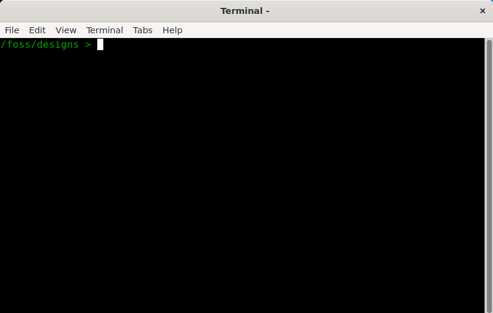
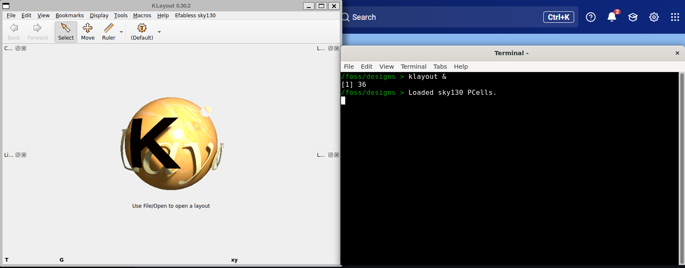
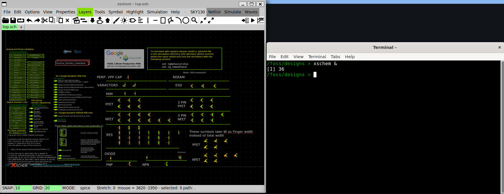
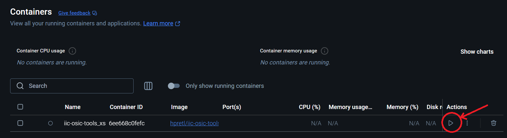

# Setup su Windows

> Guida testata su **Windows 10 (22H2)** e **Windows 11**. Tempo stimato: 30–45 minuti.

---

## Panoramica dei passaggi

```
1. Abilitare WSL2  →  2. Installare Docker Desktop  →  3. Scaricare IIC-OSIC-TOOLS
→  4. Configurare le variabili d'ambiente  →  5. Avviare il container
→  6. Clonare LibreLane Summary  →  7. Configurazione del PDK  →  8. Test finale
→  9. Installare VS Code (editor VHDL)
```

---

## Passo 1 — WSL2 (Windows Subsystem for Linux)

Docker su Windows si appoggia a **WSL2** per eseguire container Linux in modo efficiente. Prima di installare Docker, verifica se WSL è già presente aprendo un terminale (`cmd` o PowerShell) ed eseguendo:

```cmd
wsl --status
```

**Se WSL non è installato**, esegui questi due comandi in sequenza:

```cmd
wsl --install
wsl --update
```

Al termine, **riavvia il computer** prima di procedere.

> 💡 `wsl --install` installa automaticamente Ubuntu come distribuzione predefinita. Non è necessario usarla direttamente — serve solo come backend per Docker.

---

## Passo 2 — Docker Desktop

Scarica e installa Docker Desktop per Windows seguendo le istruzioni ufficiali di IIC-OSIC-TOOLS:

👉 https://github.com/iic-jku/IIC-OSIC-TOOLS?tab=readme-ov-file#4-quick-launch-for-designers

Durante l'installazione, assicurati che l'opzione **"Use WSL 2 instead of Hyper-V"** sia selezionata (di solito lo è per default su Windows 10/11).

**Riavvia nuovamente il computer** al termine dell'installazione.

Dopo il riavvio, avvia Docker Desktop dal menu Start. Al primo avvio ti verrà chiesto di creare un account Docker Hub — puoi registrarti gratuitamente oppure accedere con il tuo account Google o GitHub.

> ⚠️ Docker Desktop deve essere **in esecuzione** (icona visibile nella barra delle applicazioni) ogni volta che vuoi usare il container. Se l'icona non è presente, avvia Docker Desktop dal menu Start.

---

## Passo 3 — Scaricare IIC-OSIC-TOOLS

Scarica il file archivio della versione **2025.07** da questo link:

👉 https://github.com/iic-jku/IIC-OSIC-TOOLS/archive/refs/tags/2025.07.zip

Decomprimi il file in una posizione comoda, ad esempio `C:\Users\<tuonome>\iic-osic-tools`.

> 🔒 **Perché una versione specifica?** Fissare la versione garantisce che tutti gli studenti del corso abbiano esattamente gli stessi tool e le stesse librerie. Non usare `latest` — potrebbe introdurre incompatibilità con gli esercizi del corso.

---

## Passo 4 — Configurare le variabili d'ambiente

Il container ha bisogno di due informazioni prima di partire:

| Variabile | Significato |
|-----------|-------------|
| `DESIGNS` | Cartella sul tuo PC dove salverai tutti i tuoi progetti |
| `DOCKER_TAG` | Versione del container da usare (deve essere `2025.07`) |

### 4a — Creare la cartella dei progetti

Crea una cartella dedicata ai tuoi design ASIC. Esempio:

```
C:\Users\<tuonome>\asic
```

Puoi farlo da Esplora File o da terminale:

```cmd
mkdir C:\Users\%USERNAME%\asic
```

### 4b — Impostare le variabili in modo permanente

Apri **PowerShell come Amministratore** (tasto destro sull'icona PowerShell → "Esegui come amministratore") ed esegui:

```powershell
setx DOCKER_TAG "2025.07" /M
setx DESIGNS "C:\Users\<tuonome>\asic" /M
```

Sostituisci `<tuonome>` con il tuo nome utente Windows effettivo.

Il flag `/M` rende le variabili **persistenti a livello di sistema**, quindi sopravvivono ai riavvii. Senza questo passaggio, dovresti reimpostare le variabili ogni volta che apri un nuovo terminale.

> ✅ Dopo aver eseguito questi comandi, **chiudi e riapri il terminale** affinché le variabili siano attive.

> 💡 **Se in futuro vuoi usare anche le [modalità di avvio alternative](#modalità-di-avvio-alternative-in-caso-di-problemi-grafici)** (VNC, X-server via MobaXterm), che richiedono più container distinti con tag/nomi diversi, `setx /M` diventa scomodo: è permanente e globale, quindi andrebbe ri-eseguito (con un nuovo terminale) ogni volta che cambi configurazione. In quel caso conviene usare variabili di **sessione** (`$env:DOCKER_TAG = "..."` in PowerShell, valide solo nella finestra corrente) impostate una sola volta al momento della creazione di ciascun container — vedi [Configurazione avanzata](#configurazione-avanzata-far-convivere-più-modalità) in fondo a questa guida. Per un setup con **una sola modalità** (quella standard qui sopra), `setx /M` resta la scelta più semplice.

---

## Passo 5 — Avviare il container

1. Assicurati che **Docker Desktop sia in esecuzione**
2. Apri un terminale (`cmd` o PowerShell) nella cartella dove hai decompresso IIC-OSIC-TOOLS
3. Esegui:

```cmd
.\start_x.bat
```

La **prima volta** il comando scaricherà l'immagine Docker dal registro remoto (~15 GB). Ci vorranno alcuni minuti a seconda della tua connessione. Le volte successive il container si avvierà in pochi secondi.

Al termine vedrai aprirsi il terminale del container.




---

## Passo 6 — Clonare LibreLane Summary

LibreLane Summary è uno script che fornisce un riepilogo leggibile dei risultati prodotti dal flusso OpenLane. Lo useremo nei moduli avanzati del corso.

Dal terminale dentro il container, portati nella cartella dei design ed esegui il clone:

```bash
cd /foss/designs
git clone https://github.com/mattvenn/librelane_summary
```

Troverai la cartella `librelane_summary/` direttamente nella tua directory `asic\` su Windows — è persistente e non andrà persa al riavvio del container.

---

## Passo 7 — Configurazione del PDK

Dobbiamo creare il file `.designinit` che il container legge automaticamente ad ogni avvio per impostare tutte le variabili d'ambiente del PDK.

**Dove va creato:** nella cartella `/foss/designs/` dentro il container, che corrisponde alla tua cartella `asic\` su Windows. Essendo una cartella montata (non interna al container), il file **sopravvive ai riavvii e alle ricreazioni del container**.

Dal terminale dentro il container, esegui:

```bash
cat > /foss/designs/.designinit << 'EOF'
PDK_ROOT=/foss/pdks
PDK=sky130A
PDKPATH=/foss/pdks/sky130A
STD_CELL_LIBRARY=sky130_fd_sc_hd
SPICE_USERINIT_DIR=/foss/pdks/sky130A/libs.tech/ngspice
KLAYOUT_PATH=/headless/.klayout:/foss/pdks/sky130A/libs.tech/klayout:/foss/pdks/sky130A/libs.tech/klayout/tech
PATH=$PATH:/foss/designs/librelane_summary

# Aggiunge opzioni mancanti a .spiceinit (KLU solver, noinit, skywaterpdk)
grep -q "option klu" ~/.spiceinit 2>/dev/null || cat >> ~/.spiceinit << 'SPICEINIT'
* added by .designinit
set skywaterpdk
option noinit
option klu
SPICEINIT
EOF
```

**In alternativa**, puoi creare il file `.designinit` direttamente da Windows con un editor di testo (Notepad, VS Code) nella cartella `asic\`, incollandoci il seguente contenuto. Il risultato è identico.

```bash
PDK_ROOT=/foss/pdks
PDK=sky130A
PDKPATH=/foss/pdks/sky130A
STD_CELL_LIBRARY=sky130_fd_sc_hd
SPICE_USERINIT_DIR=/foss/pdks/sky130A/libs.tech/ngspice
KLAYOUT_PATH=/headless/.klayout:/foss/pdks/sky130A/libs.tech/klayout:/foss/pdks/sky130A/libs.tech/klayout/tech
PATH=$PATH:/foss/designs/librelane_summary

# Aggiunge opzioni mancanti a .spiceinit (KLU solver, noinit, skywaterpdk)
grep -q "option klu" ~/.spiceinit 2>/dev/null || cat >> ~/.spiceinit << 'SPICEINIT'
* added by .designinit
set skywaterpdk
option noinit
option klu
SPICEINIT
```

> ⚠️ Il container deve essere **riavviato** affinché il contenuto del file `.designinit` abbia effetto. 

> 💡 `.designinit` è l'equivalente di un `.bashrc` specifico per il PDK: le variabili qui definite saranno disponibili automaticamente in ogni sessione del container, senza doverle riesportare ogni volta.

> 💡 **Nota sul .spiceinit:** il container IIC-OSIC-TOOLS include già un `.spiceinit` di base. Il blocco nel `.designinit` aggiunge le opzioni mancanti: `option klu` (solver più veloce), `option noinit` (sopprime stampa OP all'avvio), `set skywaterpdk` (caricamento modelli più veloce). Il `grep` evita duplicati nei riavvii. La configurazione di xschem viene gestita nel file `xschemrc` locale di ogni progetto — vedi Modulo 1.


---

## Passo 8 — Test finale

Esegui questi comandi all'interno del container per verificare che tutto funzioni:

```bash
echo $IIC_OSIC_TOOLS_VERSION   # atteso: 2025.07
echo $PDK                       # atteso: sky130A
klayout &                       # deve aprire KLayout 0.30.2
xschem &                        # deve aprire xschem
```




Se tutti i comandi producono l'output atteso, l'ambiente è configurato correttamente. 🎉

---

## Passo 9 — Installare VS Code come editor VHDL

Il container IIC-OSIC-TOOLS include tutti i tool necessari per simulare e sintetizzare codice VHDL (`ghdl`, `gtkwave`, `librelane --flow VHDLClassic`), ma non dispone di un editor con supporto moderno al linguaggio. Il flusso di lavoro raccomandato per il corso è scrivere e fare il debug del codice VHDL in **Visual Studio Code** sul tuo sistema operativo, e poi simulare e sintetizzare dal terminale del container.

Questo funziona senza alcuna configurazione aggiuntiva: la cartella `asic\` sul tuo PC è la stessa cartella che il container vede come `/foss/designs/`. Qualsiasi file che scrivi in VS Code è immediatamente disponibile nel container.

```
VS Code (Windows)           Container Docker
~/asic/mio_progetto/  ───►  /foss/designs/mio_progetto/
  top.vhd                     ghdl -a top.vhd          ← compilazione/simulazione
  testbench.vhd               ghdl -e tb && ghdl -r tb ← esecuzione testbench
                              gtkwave dump.vcd          ← forme d'onda
                              librelane --flow VHDLClassic ← sintesi RTL→GDS
```

### 9a — Installare VS Code

Scarica e installa VS Code dal sito ufficiale:

👉 https://code.visualstudio.com/

Durante l'installazione, seleziona le opzioni:
- ✅ **"Aggiungi l'azione 'Apri con Code' al menu contestuale di Esplora risorse"**
- ✅ **"Registra Code come editor per i tipi di file supportati"**

### 9b — Installare le estensioni VHDL

Apri VS Code, poi accedi al pannello estensioni (`Ctrl+Shift+X`) e installa:

#### Estensione 1 — VHDL LS (obbligatoria)

Cerca: **`VHDL LS`** — autore: _Henrik Bohlin_

ID marketplace: `hbohlin.vhdl-ls`

Questa estensione implementa un Language Server completo per VHDL. Fornisce:
- rilevamento errori di sintassi e semantici in tempo reale (senza GHDL installato localmente)
- completamento automatico di segnali, porte, componenti
- navigazione: _Go to Definition_, _Find All References_
- hover con informazioni sul tipo

> 💡 VHDL LS funziona autonomamente senza dipendenze esterne. Basta installarla e aprire un file `.vhd` o `.vhdl` per avere il linting attivo.

#### Estensione 2 — TerosHDL (consigliata)

Cerca: **`TerosHDL`** — autore: _Teros Technology_

ID marketplace: `teros-technology.teroshdl`

Estensione avanzata per VHDL e Verilog/SystemVerilog, con:
- visualizzatore di gerarchia del progetto
- visualizzatore di macchine a stati FSM (disegna automaticamente il diagramma dal codice)
- generatore di template per entity, architecture, testbench
- integrazione con simulatori tra cui GHDL (configurabile in seguito)
- documentazione automatica del codice

> 💡 TerosHDL è utile soprattutto per i progetti più complessi del corso (Modulo 4 e Modulo 5). Per i primi esercizi è sufficiente VHDL LS.

### 9c — Aprire la cartella dei progetti in VS Code

Per lavorare comodamente, apri la cartella `asic\` come workspace di VS Code:

```
File → Apri cartella... → C:\Users\<tuonome>\asic
```

In questo modo VS Code vedrà tutti i tuoi progetti e potrai navigare tra i file con l'explorer laterale.

---

## Modalità di avvio alternative (in caso di problemi grafici)

IIC-OSIC-TOOLS su Windows (Docker Desktop + WSL2) può mostrare la grafica delle app Linux in tre
modi. Su macchine **4K con GPU AMD** (integrata o ibrida AMD+NVIDIA), la modalità standard descritta
sopra (WSLg) non è sempre perfetta: possono comparire un **cursore del mouse enorme** (schermi ad
alto DPI) o **lag nei menu/finestre**. In quel caso puoi tenere la modalità standard per il rendering
pesante e usare una delle due alternative sotto per il lavoro quotidiano — coesistono tutte e tre
senza conflitti (container con nomi diversi).

| Modalità | Avvio | Punti di forza | Punti deboli | Ideale per |
|----------|-------|----------------|--------------|-----------|
| **X via WSLg** (predefinita, sopra) | `start_x.bat` | Accelerazione GPU reale (OpenGL), nitidezza nativa, `magic -d XR/-d OGL` | Lag dei menu su GPU AMD, cursore enorme su schermi 4K | rendering pesante, magic in modalità XR/OGL |
| **X via MobaXterm** (o VcXsrv/GWSL) | `start_x.bat` con `DISP` rediretto | Fluidità dei menu, nitidezza nativa, cursore gestibile | X-server software (no GPU vera), `magic -d XR` fallisce | **lavoro quotidiano**: xschem, KLayout, magic "liscio" |
| **VNC** (noVNC nel browser) | `start_vnc.bat` | Indipendente da GPU/scaling, cursore e scaling risolti, zero attriti su 4K | Nitidezza inferiore (immagine compressa), no GPU | fallback robusto su 4K/AMD, accesso remoto |

**Regola pratica:**
- **VNC** → la più semplice e priva di grane per schermi 4K e/o GPU AMD → 👉 [guida VNC](./alternative-launch-vnc.md)
- **MobaXterm** → finestre native fluide e nitide per il lavoro di tutti i giorni → 👉 [guida MobaXterm](./alternative-launch-xserver-mobaxterm.md)
- **WSLg** → per ciò che richiede GPU/pixmap vere (`magic -d XR`, OpenGL) — resta la modalità standard descritta sopra in questa pagina

---

## Gestione del container

### Chiudere il container
Il container si ferma automaticamente quando chiudi la finestra del terminale principale. Puoi anche fermarlo dalla GUI di Docker Desktop usando il pulsante ■ (Stop).

### Riavviare il container
Assicurati che Docker Desktop sia in esecuzione, poi:

```cmd
.\start_x.bat
```

Se il container è già stato avviato in precedenza ma è fermo, puoi riavviarlo più rapidamente con:

```cmd
docker start iic-osic-tools_xserver
```

Oppure usa il pulsante ▶ (Play) nella GUI di Docker Desktop.



---

## Troubleshooting

### La GUI non si apre / schermo nero
Il container usa un server X per la grafica. Se la GUI non appare:
- Controlla che nessun firewall blocchi le connessioni locali sulla porta 6080
- Prova ad aprire manualmente `http://localhost` nel browser

### Errore "WSL 2 installation is incomplete"
Riesegui `wsl --update` in un terminale con privilegi di amministratore e riavvia.

### Errore "port is already allocated"
Un altro servizio sta usando la stessa porta. Riavvia Docker Desktop, oppure ferma tutti i container attivi con:
```cmd
docker stop $(docker ps -q)
```

### Le variabili d'ambiente non sono riconosciute
Dopo `setx`, devi aprire un **nuovo** terminale. Le variabili non vengono aggiornate nelle finestre già aperte.

### Warning `libEGL` / `MESA` / `ZINK` all'avvio di KLayout (modalità WSLg standard)
Su alcune combinazioni GPU (es. laptop con GPU ibrida AMD+NVIDIA), all'avvio di KLayout o altre app OpenGL puoi vedere:
```
libEGL warning: failed to get driver name for fd -1
MESA: error: ZINK: failed to choose pdev
libEGL warning: egl: failed to create dri2 screen
```
Sono avvisi non bloccanti (l'app si apre comunque, ripiegando sul rendering software) dovuti a WSLg che non seleziona correttamente la GPU per l'accelerazione OpenGL. Se hai una GPU NVIDIA e vuoi forzarne l'uso corretto (elimina anche i warning), aggiungi al tuo `.designinit`:
```bash
export GALLIUM_DRIVER=d3d12
export MESA_LOADER_DRIVER_OVERRIDE=d3d12
export MESA_D3D12_DEFAULT_ADAPTER_NAME=NVIDIA
export LD_LIBRARY_PATH=$LD_LIBRARY_PATH:/usr/lib/wsl/lib
```
Verifica con `glxinfo -B | grep -iE "renderer|accel"` — atteso: `D3D12 (NVIDIA GeForce RTX ...)` e `Accelerated: yes`. Se il lag dei menu persiste nonostante questo fix, la causa è la GPU AMD integrata non esposta a WSL (limite strutturale, non risolvibile via configurazione) — valuta le [modalità di avvio alternative](#modalità-di-avvio-alternative-in-caso-di-problemi-grafici).

---

## Configurazione avanzata: far convivere più modalità

Se usi (o pensi di usare) più di una modalità di avvio — WSLg standard, [VNC](./alternative-launch-vnc.md), [MobaXterm](./alternative-launch-xserver-mobaxterm.md) — questa sezione ti serve solo se vuoi un `.designinit` condiviso fra tutte e dei launcher `.bat` dedicati per passare dall'una all'altra con un doppio click.

### `.designinit` condiviso fra tutte le modalità

Il `.designinit` vive nella **root del mount `DESIGNS`** (disco Windows), quindi **sopravvive alla
ricreazione del container** ed è **condiviso da tutte le modalità** (WSLg, VNC, MobaXterm), perché
tutte puntano alla stessa cartella `DESIGNS`. Questo blocco va **aggiunto in coda** al `.designinit`
già creato al Passo 7 (non lo sostituisce: quello resta necessario per la configurazione del PDK).

```bash
# --- Accelerazione GL in WSLg (innocua/ininfluente in MobaXterm e VNC) ---
export GALLIUM_DRIVER=d3d12
export MESA_LOADER_DRIVER_OVERRIDE=d3d12
export MESA_D3D12_DEFAULT_ADAPTER_NAME=NVIDIA
export LD_LIBRARY_PATH=$LD_LIBRARY_PATH:/usr/lib/wsl/lib

# --- Wrapper cursore per-app (utili con X-server nativo su 4K, vedi guida MobaXterm) ---
mkdir -p ~/bin
cat > ~/bin/xschem << 'WRAP'
#!/bin/bash
REAL=$(PATH=$(echo "$PATH" | tr ':' '\n' | grep -v "$HOME/bin" | paste -sd:) command -v xschem)
XCURSOR_THEME=Adwaita XCURSOR_SIZE=40 exec "$REAL" "$@"
WRAP
cat > ~/bin/klayout << 'WRAP'
#!/bin/bash
REAL=$(PATH=$(echo "$PATH" | tr ':' '\n' | grep -v "$HOME/bin" | paste -sd:) command -v klayout)
XCURSOR_THEME=Adwaita XCURSOR_SIZE=12 exec "$REAL" "$@"
WRAP
chmod +x ~/bin/xschem ~/bin/klayout
export PATH="$HOME/bin:$PATH"

# --- (Opzionale) neutralizza un plugin KLayout bacato in /headless (effimero, va ripetuto se serve) ---
rm -rf /headless/.klayout/salt/NetlistImportPlugin 2>/dev/null
```

> ⚠️ **Non lasciare un `export XCURSOR_SIZE=...` globale** nel `.designinit` (fuori dai wrapper qui
> sopra): imporrebbe un valore unico sia a xschem (Tk) che a KLayout (Qt), che hanno esigenze
> opposte. Verifica con `grep -n -i xcursor /foss/designs/.designinit` → `XCURSOR_*` deve comparire
> **solo** dentro i wrapper.

### Launcher `.bat` separati

Accanto a `start_x.bat`/`start_vnc.bat`, per aprire ciascun ambiente con un doppio click. Adatta
percorsi, `DOCKER_TAG`, `DESIGNS`, IP host.

**`start_moba.bat`** (X nativo — lavoro quotidiano):
```bat
@echo off
cd /d "%~dp0"
set CONTAINER_NAME=iic-osic-tools_moba
set DOCKER_TAG=2026.06
set DESIGNS=C:\percorso\ai_tuoi_designs
set DISP=192.168.65.254:0.0
call start_x.bat
```

**`start_wslg.bat`** (X via WSLg — GPU / magic -d XR):
```bat
@echo off
cd /d "%~dp0"
set CONTAINER_NAME=iic-osic-tools_wslg
set DOCKER_TAG=2026.06
set DESIGNS=C:\percorso\ai_tuoi_designs
call start_x.bat
```

**`start_vnc.bat`** (wrapper con nome/risoluzione dedicati):
```bat
@echo off
cd /d "%~dp0"
set CONTAINER_NAME=iic-osic-tools_vnc
set DOCKER_TAG=2026.06
set DESIGNS=C:\percorso\ai_tuoi_designs
set VNC_RESOLUTION=2560x1440
call start_vnc.bat
```

> I tre container hanno nomi distinti → **coesistono** e condividono lo stesso `DESIGNS` (stessi
> progetti, stesso `.designinit`): una volta creati, riavvii ciascuno con ▶ Play da Docker Desktop,
> senza più bisogno di terminale.

---

## Prossimo passo

Una volta completato il setup, passa al [Modulo 1 — Schematic & Simulazione con xschem/ngspice](../01_xschem_ngspice/).
