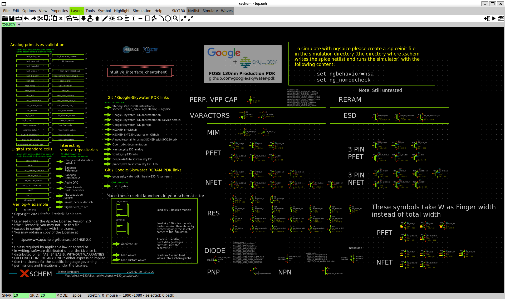
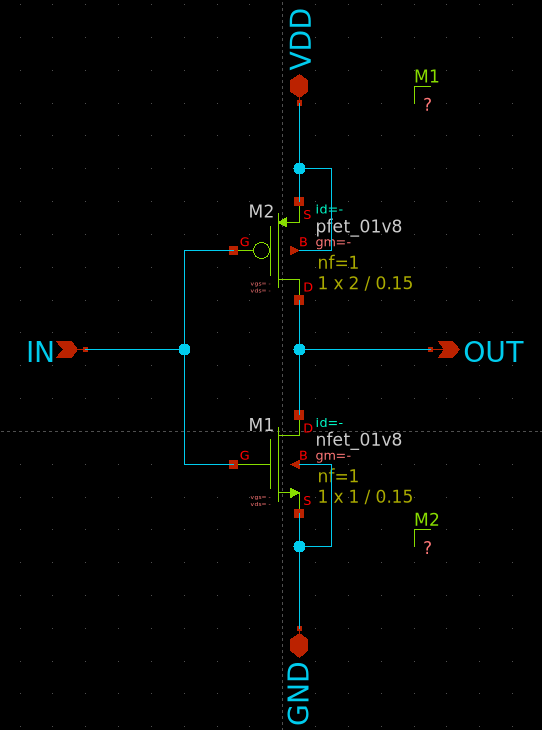
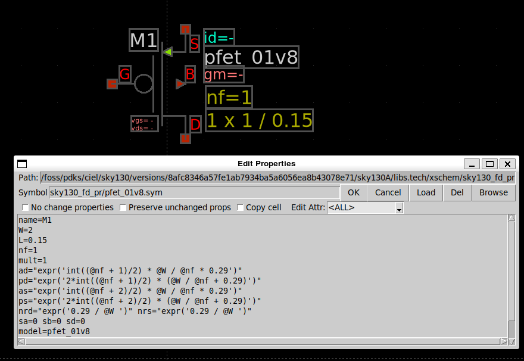
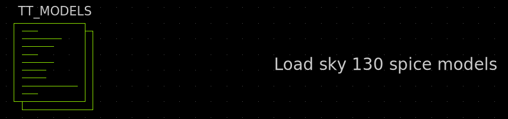
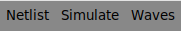
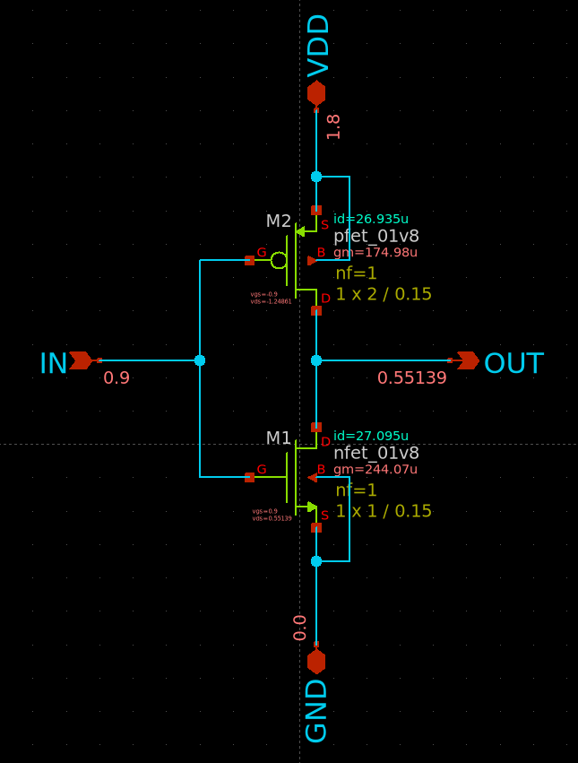

# Lab 1 — Primi passi con xschem e ngspice

**Tempo stimato:** 1.5 ore  
**Cartella di lavoro:** `/foss/designs/modulo1/lab01/xschem/`

---

## Obiettivo

In questo lab prenderemo confidenza con xschem e ngspice usando un circuito che già conosci bene: l'**inverter CMOS**. L'obiettivo non è imparare nulla di nuovo sul circuito, ma acquisire padronanza degli strumenti e introdurre due concetti fondamentali del flusso di design analogico professionale: la creazione di **simboli** e l'uso di **testbench** separati.

Al termine saprai:
- Navigare l'interfaccia di xschem e usare i comandi principali
- Istanziare MOSFET dal PDK SKY130A e impostarne i parametri
- Eseguire simulazioni DC sweep e transitorie con ngspice
- Creare un simbolo xschem a partire da uno schematico
- Strutturare un progetto con schematico + simbolo + testbench separati

---

## Struttura delle cartelle del progetto

Prima di aprire xschem, creiamo la cartella di lavoro e configuriamo l'`xschemrc` locale del progetto:

```bash
mkdir -p /foss/designs/modulo1/lab01/xschem
cd /foss/designs/modulo1/lab01/xschem

cat > xschemrc << 'EOF'
# Carica la configurazione completa del PDK SKY130A
source /foss/pdks/sky130A/libs.tech/xschem/xschemrc

# Salva netlist e simulazioni nella cartella locale del progetto
set netlist_dir [file normalize [file dirname [info script]]/simulation]

# Aggiunge la cartella del progetto ai path di ricerca dei simboli
append XSCHEM_LIBRARY_PATH :[file dirname [info script]]
EOF
```

Questi comandi vanno eseguiti **una volta sola** per ogni nuovo progetto. Ecco cosa fanno:

- **`source`** — carica la configurazione completa del PDK (path librerie, layer, colori, esempi). È fondamentale usare `source` invece di copiare il file, per evitare che i link agli esempi del PDK si rompano
- **`netlist_dir`** — imposta la directory di simulazione come path assoluto basato sulla posizione dell'`xschemrc` locale. Questo garantisce che le simulazioni finiscano sempre in `xschem/simulation/` del progetto, indipendentemente da quale schematico è aperto
- **`XSCHEM_LIBRARY_PATH`** — aggiunge la cartella del progetto ai path di ricerca


> ⚠️ **Regola fondamentale:** lancia sempre xschem **dalla cartella `xschem/` del lab**. Solo così l'`xschemrc` locale viene letto e le simulazioni finiscono nel posto giusto.

La cartella `simulation/` verrà creata **automaticamente** da xschem la prima volta che generi una netlist:

```
/foss/designs/modulo1/lab01/
└── xschem/
    ├── xschemrc             ← configurazione locale del progetto
    ├── inverter.sch
    ├── inverter.sym
    ├── tb_dc.sch
    ├── tb_tran.sch
    ├── tb_op.sch
    └── simulation/          ← creata automaticamente
        ├── tb_dc.raw
        └── tb_tran.raw
```

---

## Prima di iniziare — Esplora gli esempi di xschem con SKY130A

Prima di costruire il nostro circuito da zero, vale la pena esplorare gli esempi già pronti che il PDK SKY130A mette a disposizione. Quando lanci xschem dalla cartella del lab, si apre automaticamente lo schematico `top.sch` del PDK — una raccolta di esempi organizzati per tipo di simulazione.

```bash
cd /foss/designs/modulo1/lab01/xschem
xschem &
```

Nella schermata iniziale trovi esempi di:

- simulazioni DC, AC e transitorie su vari dispositivi SKY130A
- testbench per resistori, condensatori, MOSFET, diodi
- uso di corner e variazioni di processo



**Come navigare:** clicca su un blocco e premi `E` per entrare nello schematico corrispondente. Premi `Ctrl+E` per tornare al livello superiore.

> 💡 Tieni sempre questa schermata accessibile durante il corso — è la fonte più diretta per capire come usare i componenti del PDK e per copiare blocchi utili come `TT_MODELS` o la freccia di load delle waveform nei tuoi testbench.

Il docente mostrerà a lezione alcuni esempi significativi prima di procedere con i lab. Una volta completata l'esplorazione, procedi con la creazione della struttura delle cartelle e lo sviluppo del Lab 1.

---

## Il flusso di lavoro professionale: schematico, simbolo, testbench

Prima di iniziare, è utile capire come si organizza un progetto analogico reale in xschem. Esistono tre livelli distinti:

```
inverter.sch          ← il circuito: MOSFET, connessioni, parametri
    │
    └─► inverter.sym  ← il simbolo: rappresentazione astratta del circuito
                              │
              ┌───────────────┼───────────────┐
              │               │               │
        tb_dc.sch       tb_tran.sch     tb_ac.sch
    (testbench DC)   (testbench tran)  (testbench AC)
```

- Il **circuito** contiene solo la topologia — nessuna sorgente di test, nessun comando di simulazione. 

- Il **simbolo** è la sua rappresentazione astratta che può essere istanziata ovunque. 

- I **testbench** istanziano il simbolo e aggiungono solo ciò che serve per quel test specifico: sorgenti, carichi, comandi SPICE.

Questo approccio ha due vantaggi fondamentali: se modifichi il circuito, tutti i testbench si aggiornano automaticamente; ogni testbench è pulito e focalizzato su una sola analisi.

---

## Il circuito: inverter CMOS SKY130A



Il PMOS è dimensionato 2x rispetto all'NMOS per compensare la minore mobilità delle lacune — approfondiremo questo nel Lab 2.

---

## Parte 1 — Avviare xschem e creare il circuito

Dalla cartella `xschem/` del lab (dove dovresti già trovarti dopo i passi precedenti), lancia xschem:

```bash
xschem &
```

### Comandi fondamentali di xschem

| Azione | Comando |
|--------|---------|
| Zoom in / out | Scroll del mouse |
| Zoom su tutto lo schematico | `F` |
| Spostare la vista | Frecce direzionali |
| Inserire un componente | `Ins` |
| Spostare un elemento selezionato | `M` |
| Ruotare (prima di piazzare) | `Shift+R` |
| Specchio orizzontale (prima di piazzare) | `F` |
| Tracciare un filo | `W` |
| Aggiungere net label | `L` |
| Modificare proprietà | Doppio click |
| Eliminare | Seleziona + `Del` |
| Annullare | `Ctrl+Z` |
| Salvare | `Ctrl+S` |
| Generare netlist | `N` |
| Avviare simulazione | `F8` |

### 1.1 Nuovo schematico

**File → Create new window/tab**, quindi **File → New Schematic** → salva subito con `Ctrl+S` come `inverter.sch`.

### 1.2 Istanziare i MOSFET

Premi `Shift + I` oppure clicca sull'icona  → selezionare il PDK sky130, quindi selezionare la libreria `sky130_fd_pr` → nel campo di ricerca digita `nfet_01v8` → quindi seleziona `nfet_01v8.sym` → piazzalo sul canvas.

Ripeti per il PMOS cercando `pfet_01v8` → seleziona `pfet_01v8.sym`. Prima di piazzarlo premi `Shift + F` per specchiarlo verticalmente — il source del PMOS deve puntare verso VDD.

### 1.3 Impostare W e L

Doppio click sull'NMOS → imposta `W=1`, `L=0.15` (unità implicita: µm).
Doppio click sul PMOS → imposta `W=2`, `L=0.15`.

> L = 0.15µm è la lunghezza di canale minima del processo SKY130A (nodo 130nm).



### 1.4 Collegare il circuito

- Premi `W` per tracciare i collegamenti sullo schematico
- collega insieme i due gate
- collega insieme i due drain
- il source e il contatto di bulk del PMOS vanno verso Vdd
- il source e il contatto di bulk dell'NMOS vanno veros GND 

### 1.5 Aggiungere i pin di interfaccia

Per generare correttamente il simbolo dell'inverter, i segnali devono essere definiti come pin espliciti:

- `Shift + I` → `ipin` (libreria `devices`) → piazza sulla net `IN`
- `Shift + I` → `opin` → piazza sulla net `OUT`
- `Shift + I` → `iopin` → piazza su `VDD`
- `Shift + I` → `iopin` → piazza su `GND`

> ⚠️ Il circuito **non deve contenere** sorgenti di tensione né blocchi di simulazione — quelli vanno esclusivamente nei testbench.

Nella barra dei menu, clicca sul tasto **netlist** ed assicurati che non ci siano errori di collegamento.

Salva con `Ctrl+S`.

---

## Parte 2 — Creare il simbolo

Con `inverter.sch` aperto, hai due modi equivalenti per generare il simbolo:

- **Menu:** **Symbol → Make symbol from schematic**
- **Scorciatoia:** premi `A` direttamente con lo schematico aperto

xschem genera `inverter.sym` nella stessa cartella. Aprilo con **File → Open** per verificarne l'aspetto — vedrai un blocco rettangolare con i pin IN, OUT, VDD e GND posizionati ai bordi.

Puoi personalizzare la grafica del simbolo editando il file `.sym` direttamente, ma per ora la forma automatica è sufficiente.

---

## Parte 3 — Testbench DC: curva di trasferimento

Apri un nuovo Tab e crea un nuovo schematico: **File → New Schematic** → salva come `tb_dc.sch`.

### 3.1 Istanziare il simbolo dell'inverter

`Shift + I` → naviga in `/foss/designs/modulo1/lab01/xschem` → seleziona `inverter.sym` → piazza al centro del canvas.

### 3.2 Completare il testbench

**Sorgente VDD:** `Shift + I` → `vsource` della libreria `devices` → piazza sul canvas, imposta `value=1.8`, rinomina la sorgente `VDD`. Collega il terminale negativo a `gnd`.

**Sorgente ingresso:** `Shift + I` → `vsource` → piazza sul canvas, rinomina `Vin`. Collega il terminale negativo a `gnd`. Il valore lo gestirà il comando `.dc`.

**Collegare le sorgenti ai pin del simbolo con etichette:**

Invece di collegare fisicamente i fili dalla sorgente al simbolo dell'inverter (che può diventare disordinato), usa le **etichette di net** (`lab_wire`). Due nodi con la stessa etichetta sono elettricamente connessi, anche se non fisicamente collegati da un filo sullo schematico.

- `Shift + I` → cerca `lab_wire` nella libreria `devices` → piazza sul terminale positivo di `VDD` → imposta il nome `VDD`
- `Shift + I` → `lab_wire` → piazza sul pin `VDD` del simbolo inverter → stesso nome `VDD`
- Ripeti per `IN`: etichetta `IN` sul terminale positivo di `Vin` e sul pin `IN` del simbolo
- Il pin `GND` del simbolo e i terminali negativi delle sorgenti li colleghi tutti a `gnd` (componente `gnd` della libreria `devices`)

In questo modo lo schematico rimane pulito e leggibile, anche quando hai molte sorgenti e molti blocchi istanziati.

**Blocco modelli PDK:** per simulare i transistor e tutti i devices del pdk, invece di scrivere il path completo al file `.lib` nel `code_shown`, usa il blocco `TT_MODELS` già pronto nel PDK SKY130A. Questo blocco **non è disponibile nel browser dei simboli** — va copiato direttamente dallo schematico `top.sch`:



1. Apri `top.sch` (si apre automaticamente all'avvio di xschem)
2. Individua il blocco `TT_MODELS` sul canvas
3. Selezionalo e copialo (`Ctrl+C`)
4. Torna al tuo testbench e incollalo (`Ctrl+V`)

Questo blocco include automaticamente i modelli SPICE al corner tt — non devi scrivere nulla a mano e il path è sempre corretto indipendentemente dall'installazione.

**Blocco di simulazione:** `Shift + I` → `code_shown` della libreria `devices`→ doppio click → nel campo `value` inserisci il contenuto **sempre tra doppi apici**:

```
value=".save all

.control
  dc Vin 0 1.8 0.005
  write tb_dc.raw
.endc"
```

> ⚠️ Il campo `value` del blocco `code_shown` richiede sempre i doppi apici attorno all'intero contenuto. Senza di essi xschem non riconosce correttamente i comandi multi-riga. Lo stesso vale per qualsiasi altro campo che contiene espressioni complesse o spazi.

Nota che il comando di analisi `dc` è **dentro** il blocco `.control` — questa è la convenzione degli esempi SKY130A. Tutto quello che serve è in un unico blocco: l'analisi e il salvataggio del file `.raw` per i grafici.

> 💡 **Dentro vs fuori `.control`:** esistono due modi equivalenti per specificare l'analisi. Fuori da `.control` si scrive `.dc Vin 0 1.8 0.005` (con il punto, come in LTSpice) e poi `run` dentro il blocco. Dentro `.control` si scrive `dc Vin 0 1.8 0.005` (senza punto) e ngspice lo esegue direttamente. Gli esempi del PDK SKY130A usano il secondo approccio — tutto dentro `.control` — che è più leggibile e lo adottiamo anche noi.

> ⚠️ **Commenti dentro `.control`:** i commenti vanno su **righe separate** che iniziano con `*`. Non usare commenti inline dopo un comando sulla stessa riga (es. `dc Vin 0 1.8 * sweep`) — il testo dopo `*` verrebbe interpretato come un vettore, causando errori.

Salva con `Ctrl+S`.

> ⚠️ **Regola fondamentale:** salva sempre lo schematico con `Ctrl+S` **prima** di cliccare Netlist o Simulate. Le modifiche non salvate non vengono incluse nella netlist generata.

### 3.3 Il flusso Netlist → Simulate → Waves

Prima di simulare, è importante capire il flusso corretto in xschem. Nella barra dei menu in alto trovi tre pulsanti fondamentali:



Il flusso è sempre questo, nell'ordine:

1. **Netlist** — genera il file SPICE dal disegno schematico. Deve essere rieseguito **ogni volta che modifichi lo schematico**. Il pulsante diventa verde quando la netlist è aggiornata e priva di errori, giallo se la netlist non è aggiornata, rosso se la netlist presenta degli errori.
2. **Simulate** — lancia ngspice sulla netlist generata. Al termine della simulazione viene creato il file `tb_dc.raw` nella cartella `simulation/`.
3. **Waves** — apre i grafici dei risultati. Disponibile solo dopo che il file `.raw` è stato creato.

> ⚠️ Se modifichi lo schematico e clicchi direttamente su Simulate senza rigenerare la netlist, ngspice simula la versione **precedente** del circuito — errore molto comune.

### 3.4 Visualizzare i risultati: due approcci

Dopo aver cliccato **Netlist** → **Simulate** hai due modi per visualizzare i risultati.

**Approccio 1 — Plot interattivo di ngspice**

Mentre ngspice è ancora aperto nel terminale, puoi usare il comando `plot` direttamente nel prompt per visualizzare le curve in una finestra separata:

```
ngspice 1 -> plot v(OUT)
```

La finestra del plot di ngspice permette di zoomare con il mouse e leggere i valori passando il cursore sulle curve. È il metodo più rapido per una verifica veloce durante lo sviluppo. Puoi plottare più segnali insieme:

```
ngspice 1 -> plot v(IN) v(OUT)
```

**Approccio 2 — Grafici embedded di xschem**

Per grafici da mantenere nello schematico come documentazione, usa i grafici embedded di xschem:

1. Dal menu: **Simulation → Graphs → Add waveform graph**
2. Clicca sul canvas del testbench per posizionare il riquadro grafico
3. Fai doppio click sul grafico per configurarlo:
   - **Raw File:** seleziona `tb_dc.raw` (si trova in `simulation/`)
   - **Sim type:** seleziona `dc`
   - **curve:** seleziona `v(Vin)` dall'elenco a sinistra per plottare un grafico DC

Il grafico **non si aggiorna automaticamente** dopo una nuova simulazione. Per aggiornarlo hai due metodi:

**Metodo manuale:** clicca su **Waves** nella barra dei menu → seleziona il tipo di analisi (`DC`, `tran`, `op`, ecc.) → nella finestra pop-up seleziona il file `.raw`.

**Metodo rapido — freccia Load waves:** copia la freccia `Load waves` dallo schematico `top.sch` del PDK e incollala nel tuo testbench. 


Con `Ctrl+click` sulla freccia le forme d'onda vengono ricaricate immediatamente. Per funzionare correttamente:
- Il file `.raw` deve avere **lo stesso nome del testbench** (es. `tb_dc.sch` → `tb_dc.raw`) — già garantito dai comandi `write tb_dc.raw` nei blocchi `.control`
- Il tipo di analisi nello script TCL della freccia deve corrispondere a quella eseguita. Facendo doppio click sulla freccia vedrai:
```
tclcommand="xschem raw_read $netlist_dir/[file tail [file rootname [xschem get current_name]]].raw tran"
```
Sostituisci `tran` con `dc` per un testbench DC, con `op` per un testbench di punto di lavoro.

> ⚠️ Dopo ogni modifica allo schematico: salva (`Ctrl+S`) → Netlist → Simulate → `Ctrl+click` sulla freccia Load waves. Saltare uno di questi passi è la causa più comune di grafici non aggiornati.

### Comandi utili nei grafici xschem

I comandi seguenti sono attivi quando il mouse è **dentro** il grafico — lo riconosci perché il cursore cambia da freccia a `+`:

| Tasto / Azione | Effetto |
|----------------|---------|
| `A` | Mostra/nasconde il cursore A verticale |
| `B` | Mostra/nasconde il cursore B verticale |
| `Shift+A` | Mostra/nasconde il cursore A orizzontale |
| `Shift+B` | Mostra/nasconde il cursore B orizzontale |
| `F` | Zoom full sull'asse X |
| `←` `→` | Sposta le curve a sinistra/destra |
| `↑` `↓` | Zoom in/out sull'asse Y |
| Tasto destro + trascina | Zoom su un'area specifica |
| Click sinistro + trascina | Pan orizzontale |

I cursori verticali A e B si trascinano orizzontalmente lungo le curve e mostrano automaticamente la **differenza** tra i valori dei due punti — utile per misurare ritardi temporali o differenze di ampiezza. I cursori orizzontali permettono analogamente di misurare differenze in ampiezza.

> 💡 xschem ha solo due cursori (A e B). Quando il grafico contiene più curve, non è chiaro dalla documentazione ufficiale come assegnare un cursore a una curva specifica. Per misure precise su curve specifiche, usa il comando `meas` nel blocco `.control` come visto nella Parte 4 — è più affidabile e riproducibile di una lettura manuale dai cursori.

> 💡 I due approcci sono complementari: usa il plot ngspice per verifiche rapide durante lo sviluppo, e i grafici xschem per documentare il comportamento del circuito in modo visibile direttamente sullo schematico.

### 3.5 Domande sull'analisi DC

1. A che valore di Vin si trova il punto di commutazione (dove Vout = 0.9V)?
2. Il punto di commutazione è esattamente a VDD/2 = 0.9V? Perché sì o no?
3. Porta W del PMOS a 1µm (uguale all'NMOS) e rilancia. Come cambia il punto di commutazione?

---

## Parte 4 — Testbench transitorio: ritardi di propagazione

Apri un nuovo Tab, quindi crea un nuovo schematico: **File → New Schematic** → salva come `tb_tran.sch`.

Ripeti la struttura del testbench DC (simbolo inverter + sorgenti con `lab_wire` + blocco `TT_MODELS`), ma la sorgente di ingresso usa una forma d'onda pulsata. Fai doppio click su `Vin` e imposta il campo `value` **con i doppi apici**:

```
value="PULSE(0 1.8 0 100p 100p 4n 8n)"
```

> ⚠️ I doppi apici sono obbligatori per qualsiasi valore che contiene parentesi o spazi nel campo `value` di una sorgente xschem. Senza di essi ngspice non riconosce correttamente il comando `PULSE`.

I parametri del comando `PULSE` sono nell'ordine:

| Parametro | Valore | Significato |
|-----------|--------|-------------|
| V_low | 0 | Tensione bassa (V) |
| V_high | 1.8 | Tensione alta (V) |
| delay | 0 | Ritardo iniziale (s) |
| t_rise | 100p | Tempo di salita (s) |
| t_fall | 100p | Tempo di discesa (s) |
| t_width | 4n | Durata del livello alto (s) |
| period | 8n | Periodo totale (s) |

**Blocco di simulazione con `.control`:**

```spice
.save all

.control
  tran 10p 20n
  write tb_tran.raw
.endc
```

### 4.1 Visualizzare i segnali

Clicca **Netlist** → **Simulate** → **Waves**. Aggiungi un grafico e configura due tracce:

- `v(IN)` — ingresso
- `v(OUT)` — uscita invertita e ritardata

### 4.2 Misurare i ritardi di propagazione con .meas

Il comando `meas` misura automaticamente un valore da una simulazione. Aggiungilo nel blocco `.control`:

```spice
.save all

.control
  tran 10p 20n

  * tpHL: ritardo da IN che sale (50%) a OUT che scende (50%)
  meas tran tpHL TRIG v(IN) VAL=0.9 RISE=1 TARG v(OUT) VAL=0.9 FALL=1

  * tpLH: ritardo da IN che scende (50%) a OUT che sale (50%)
  meas tran tpLH TRIG v(IN) VAL=0.9 FALL=1 TARG v(OUT) VAL=0.9 RISE=1

  write tb_tran.raw
.endc
```

**Interpretazione del comando `meas`:**

```
meas tran  tpHL   TRIG v(IN) VAL=0.9 RISE=1   TARG v(OUT) VAL=0.9 FALL=1
     │      │     │                   │         │                   │
     │      │     │                   │         │                   └─ al 1° fronte di discesa
     │      │     │                   └─ al 1° fronte di salita    
     │      │     └─ TRIGGER: evento di partenza del timer
     │      └─ nome della variabile risultato
     └─ tipo di simulazione
                                               └─ TARGET: evento di arresto del timer
```

Il risultato `tpHL` è la differenza temporale tra `trig` (istante del trigger) e `targ` (istante del target):

```
tpHL = targ - trig
```

Se ngspice restituisce ad esempio:
```
tpHL = 2.004200e-11   targ = 7.004200e-11   trig = 5.000000e-11
```

Significa: il trigger (IN al 50% in salita) si è verificato a t = 50ps, il target (OUT al 50% in discesa) a t = 70ps → tpHL = 20ps.

> ⚠️ Nota che i valori stamapti nel terminale ngspice usano la notazione scientifica. `2.004200e-11` significa 20ps.

### 4.3 Navigazione gerarchica

Se vuoi verificare cosa c'è dentro il simbolo dell'inverter mentre sei nel testbench, puoi **scendere di livello gerarchico** senza aprire un file separato:

- Clicca sul simbolo dell'inverter → premi `E` — xschem apre `inverter.sch` in una nuova scheda
- Per tornare al testbench: `Ctrl+E`

Questo è molto utile per verificare le connessioni o modificare il circuito senza uscire dal testbench.

### 4.4 Domande sul transitorio

1. Quanto valgono tpHL e tpLH? Sono simili tra loro? Perché?
2. Raddoppia W di entrambi i MOSFET in `inverter.sch` (Wn=2µm, Wp=4µm, mantenendo Wp/Wn=2). Clicca Netlist e Simulate in `tb_tran.sch` senza modificarlo. Come cambiano i ritardi? Ti aspettavi questo risultato?

   > 💡 **Spiegazione:** raddoppiare W aumenta la corrente di drive, ma raddoppia anche le capacità parassite di gate (Cgs, Cgd). L'effetto netto sul ritardo è quindi modesto — e può peggiorare tpLH a causa dell'effetto Miller asimmetrico sulla Cgd del PMOS durante il transitorio LH. Se invece mantieni Wn=2µm ma riporti Wp=2µm (rapporto Wp/Wn=1), tpHL migliora molto (NMOS più forte) ma tpLH peggiora drasticamente (PMOS relativamente debole) — un chiaro esempio dell'importanza del dimensionamento relativo Wp/Wn.

3. Cosa succederebbe se i comandi di simulazione fossero nel file `inverter.sch` invece che nel testbench?

---

## Parte 5 — Annotazione del punto di lavoro sullo schematico

xschem permette di visualizzare le tensioni di tutti i nodi direttamente sullo schematico dopo una simulazione `.op`, senza dover leggere i valori dal terminale.

### 5.1 Testbench per il punto di lavoro

Crea `tb_op.sch`. Stessa struttura degli altri testbench, con Vin fissa a 0.9V (punto di commutazione). Il blocco `code_shown`:

```spice
.options savecurrents
.save all

.control
  op
  remzerovec
  write tb_op.raw
.endc
```

> 💡 `.options savecurrents` va **fuori** da `.control` — è una delle poche cose che rimane fuori, insieme a `.param` e alle opzioni di tolleranza. Il comando `remzerovec` rimuove i vettori di lunghezza zero dal dataset prima di scrivere il file `.raw`. Con i modelli subcircuit di SKY130A, alcune variabili interne vengono create ma rimangono vuote — `remzerovec` le elimina prima del `write`, altrimenti ngspice restituisce un errore. Non è necessario in tutti i testbench: serve principalmente con `.op` e `savecurrents`, mentre le simulazioni DC, AC e transitorie in genere non ne hanno bisogno.

### 5.2 Procedura di annotazione

Dopo aver cliccato **Netlist** → **Simulate**:

1. **Chiudi** il terminale di ngspice
2. Clicca sul pulsante **Waves** nella barra di xschem
3. Nel menu a tendina seleziona **Op Annotate**
4. Nella finestra pop-up seleziona il file `tb_op.raw`
5. Le **tensioni** sui nodi appaiono direttamente sullo schematico in **rosso**, le **correnti** in **verde**



### 5.3 Trovare i nomi dei device nella netlist

Prima di poter accedere ai parametri interni dei MOSFET, bisogna conoscere il loro **nome gerarchico completo** nella netlist. Questo è necessario perché SKY130A istanzia i MOSFET come subcircuit (prefisso `X` nella netlist), e ngspice richiede il percorso gerarchico completo.

**Come visualizzare la netlist estratta:**

Dal menu di xschem vai su **Simulation → Show netlist after netlist command**. Da questo momento, ogni volta che clicchi il tasto **Netlist**, appare una finestra pop-up con la netlist SPICE completa.

Per il nostro inverter la netlist apparirà così:

```spice
**.subckt inverter VDD IN OUT GND
XM1 OUT IN GND GND sky130_fd_pr__nfet_01v8 L=0.15 W=1 ...
XM2 OUT IN VDD VDD sky130_fd_pr__pfet_01v8 L=0.15 W=2 ...
**.ends
```

I transistori nel testbench hanno una gerarchia a tre livelli:
- `x1` — istanza dell'inverter nel testbench (il simbolo che hai piazzato)
- `xm1` / `xm2` — i MOSFET dentro l'inverter
- `msky130_fd_pr__nfet_01v8` — il device primitivo BSIM4 interno al subcircuit

Il nome completo da usare in ngspice è quindi:

| Device | Nome gerarchico completo |
|--------|--------------------------|
| NMOS (XM1) | `m.x1.xm1.msky130_fd_pr__nfet_01v8` |
| PMOS (XM2) | `m.x1.xm2.msky130_fd_pr__pfet_01v8` |

Per verificare i nomi esatti nella tua netlist, dopo aver eseguito `.op` nel blocco `.control`, aggiungi:

```spice
show all
```

Questo elenca tutti i device attivi con il percorso gerarchico completo. Cerca le righe che iniziano con `m.` — quelle sono i MOSFET primitivi.

### 5.4 Parametri interni dei MOSFET con .control

Una volta noti i nomi gerarchici, puoi accedere ai parametri nel blocco `.control`:

```spice
.options savecurrents
.save all

.control
  op
  remzerovec

  * parametri NMOS (adatta il nome se diverso nel tuo netlist)
  print @m.x1.xm1.msky130_fd_pr__nfet_01v8[id]
  print @m.x1.xm1.msky130_fd_pr__nfet_01v8[gm]
  print @m.x1.xm1.msky130_fd_pr__nfet_01v8[gds]
  print @m.x1.xm1.msky130_fd_pr__nfet_01v8[vgs]
  print @m.x1.xm1.msky130_fd_pr__nfet_01v8[vds]
  print @m.x1.xm1.msky130_fd_pr__nfet_01v8[vth]
  print @m.x1.xm1.msky130_fd_pr__nfet_01v8[vdsat]

  * verifica saturazione: vds > vdsat significa saturazione
  let vds_n   = @m.x1.xm1.msky130_fd_pr__nfet_01v8[vds]
  let vdsat_n = @m.x1.xm1.msky130_fd_pr__nfet_01v8[vdsat]
  print vds_n vdsat_n

  * calcola gm/Id
  let gmid = @m.x1.xm1.msky130_fd_pr__nfet_01v8[gm] / abs(@m.x1.xm1.msky130_fd_pr__nfet_01v8[id])
  print gmid

  write tb_op.raw
.endc
```

> ⚠️ **Commenti dentro `.control`:** dentro il blocco `.control/.endc` i commenti vanno su **righe separate** che iniziano con `*`. Non usare commenti inline dopo un comando sulla stessa riga — il testo dopo `*` verrebbe interpretato come un vettore da stampare, causando errori.

> ⚠️ Il parametro `region` **non è disponibile** nei modelli BSIM4 usati da SKY130A. Per verificare la regione di funzionamento confronta manualmente `vds` con `vdsat`: se `vds > vdsat` il transistor è in saturazione, se `vds < vdsat` è in regione lineare.

> 💡 Il nome gerarchico cambia se cambi il nome dell'istanza nel testbench o la struttura del circuito. Usa sempre `show all` dopo `.op` per verificare i nomi esatti nel tuo specifico netlist.

### 5.5 Metodo alternativo: annotate_fet_params e Generate .save lines

Scrivere manualmente i nomi gerarchici dei device nel blocco `.control` è scomodo. Gli esempi del PDK (in particolare `test_ac.sch`) mostrano un metodo molto più efficiente basato su due elementi che puoi copiare da `top.sch`.

**Passo 1 — Aggiungi `annotate_fet_params` allo schematico del circuito**

Nella libreria `sky130_fd_pr` esiste il componente `annotate_fet_params`. Piazzalo nel tuo `inverter.sch` accanto a ciascun transistor e imposta il parametro `ref` con il nome del transistor corrispondente (es. `ref=M1` per l'NMOS):

```
name=annot1 ref=M1
name=annot2 ref=M2
```

**Passo 2 — Copia la freccia "Generate .save lines" da top.sch**

Nell'esempio `test_ac` sullo schematico `top.sch` trovi una freccia chiamata **Generate .save lines**. Copiala nel tuo testbench. Facendo `Ctrl+click` su questa freccia, xschem genera automaticamente un file `.save` con tutti i parametri di tutti i transistori annotati, e lo apre in una finestra di testo.

Il contenuto della freccia è:
```
tclcommand="write_data [save_fet_params] $netlist_dir/[file rootname [file tail [xschem get current_name]]].save
textwindow $netlist_dir/[file rootname [file tail [xschem get current_name]]].save"
```
**In alternativa,** puoi usare l'apposito comando cliccando su `SKY130` nella barra dei menu, accanto a `NETLIST`, quindi clicca su **`generate FET .save file`**. Il risultato è identico.

**Passo 3 — Includi il file .save nel blocco di simulazione**

Nel blocco `code_shown` del testbench aggiungi `.include` prima del blocco `.control`:

```
value=".include tb_op.save
.options savecurrents

.control
  save all
  op
  remzerovec
  write tb_op.raw
.endc"
```

> ⚠️ In questo caso `save all` va **dentro** `.control`, non fuori come `.save all`. Il file `.save` generato dalla freccia specifica già una lista precisa di vettori da salvare — aggiungere `save all` dentro `.control` sovrascrive quella lista e garantisce che vengano salvati anche le tensioni sui nodi e le correnti, necessari per l'annotazione completa. Senza `save all` vengono annotati solo i parametri dei transistor, ma non tensioni e correnti.

Dopo aver fatto `Ctrl+click` sulla freccia e lanciato la simulazione, carica l'annotazione OP con **Waves → Op Annotate** — tutti i parametri di tutti i transistor annotati appariranno direttamente sullo schematico.

> 💡 Questo metodo è molto più comodo quando il circuito ha molti transistor: non devi conoscere i nomi gerarchici, non devi scrivere `print` per ciascun parametro, e tutto rimane visibile sullo schematico come documentazione.

### 5.6 Tabella dei parametri utili per i MOSFET SKY130A

| Parametro ngspice | Significato | Unità |
|-------------------|-------------|-------|
| `@MX[id]` | Corrente di drain | A |
| `@MX[gm]` | Transconduttanza | A/V |
| `@MX[gds]` | Conduttanza di drain-source (= 1/rds) | A/V |
| `@MX[gmbs]` | Transconduttanza di body | A/V |
| `@MX[vgs]` | Tensione gate-source | V |
| `@MX[vds]` | Tensione drain-source | V |
| `@MX[vth]` | Tensione di soglia effettiva | V |
| `@MX[vdsat]` | Tensione di overdrive — confronta con `vds` per verificare la saturazione | V |
| `@MX[cgs]` | Capacità gate-source | F |
| `@MX[cgd]` | Capacità gate-drain (Miller) | F |

> ⚠️ Il parametro `region` non è disponibile nei modelli BSIM4 di SKY130A. La regione di funzionamento si ricava confrontando `vds` e `vdsat`: `vds > vdsat` → saturazione, `vds < vdsat` → regione lineare.


---

## Riepilogo

| Concetto | Cosa hai imparato |
|----------|-------------------|
| Struttura cartelle | `xschem/` con `xschemrc` locale per ogni lab |
| xschem | Navigazione, componenti, net label, pin, navigazione gerarchica |
| Flusso Netlist→Simulate→Waves | Ordine corretto, salvare prima di simulare, ricaricare le waveform |
| `code_shown` | Il campo `value` richiede sempre i doppi apici attorno al contenuto |
| `.control/.endc` | Script di simulazione, commenti solo su righe separate con `*` |
| Grafici xschem | Aggiornamento manuale con Waves o `Ctrl+click` sulla freccia Load waves |
| Comando `meas` | Misura automatica di ritardi e altri parametri |
| Simbolo | Generazione automatica con `A` o dal menu |
| Testbench | Separazione circuito/ambiente di test, etichette `lab_wire`, `TT_MODELS` |
| Annotazione OP | Tensioni (rosse) e correnti (verdi) via Waves → Op Annotate |
| `annotate_fet_params` | Metodo automatico per annotare i parametri di tutti i transistori |

Nel prossimo lab applicheremo questa struttura alla caratterizzazione del MOSFET SKY130A con il metodo gm/Id, e utilizzeremo i risultati per dimensionare il comparatore Strong-ARM Latch.

---

## Soluzione

Il file di soluzione completo è disponibile in [`soluzioni/lab01/`](./soluzioni/lab01/).
