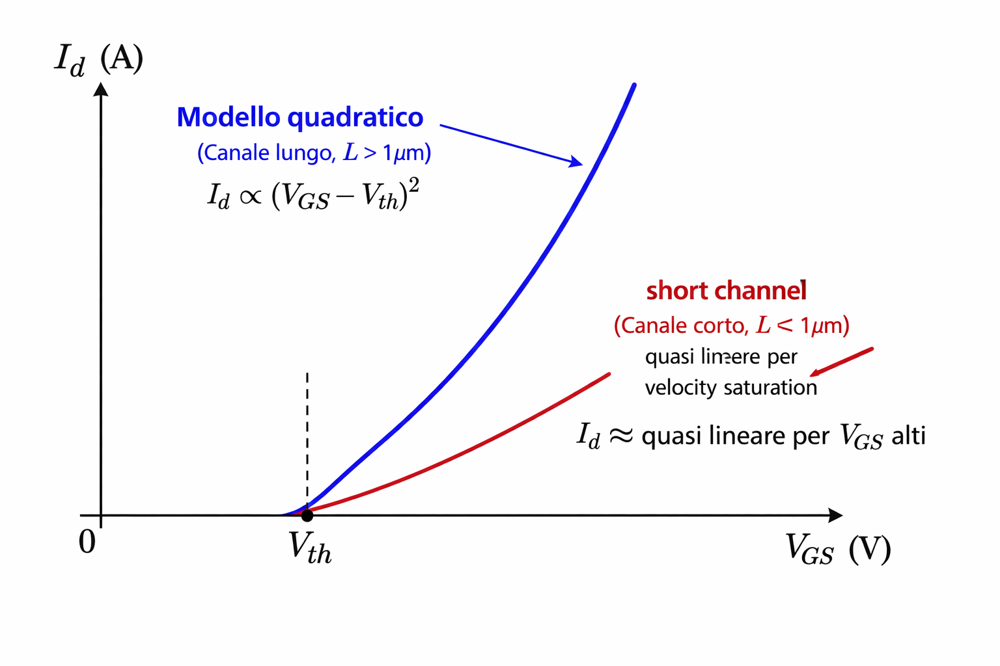
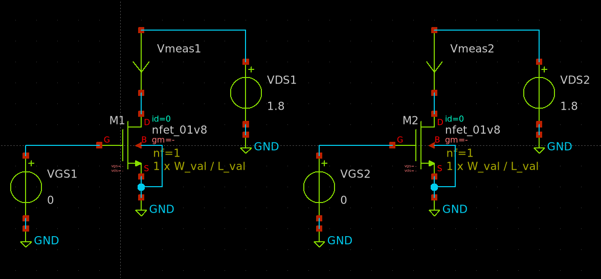
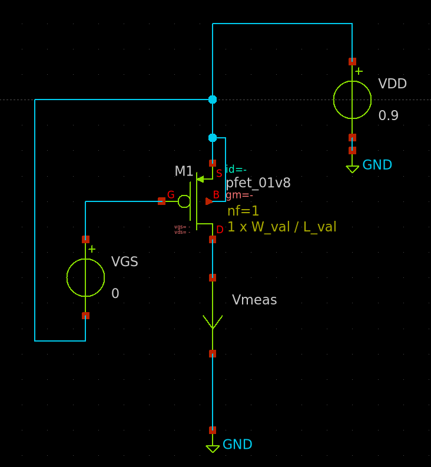
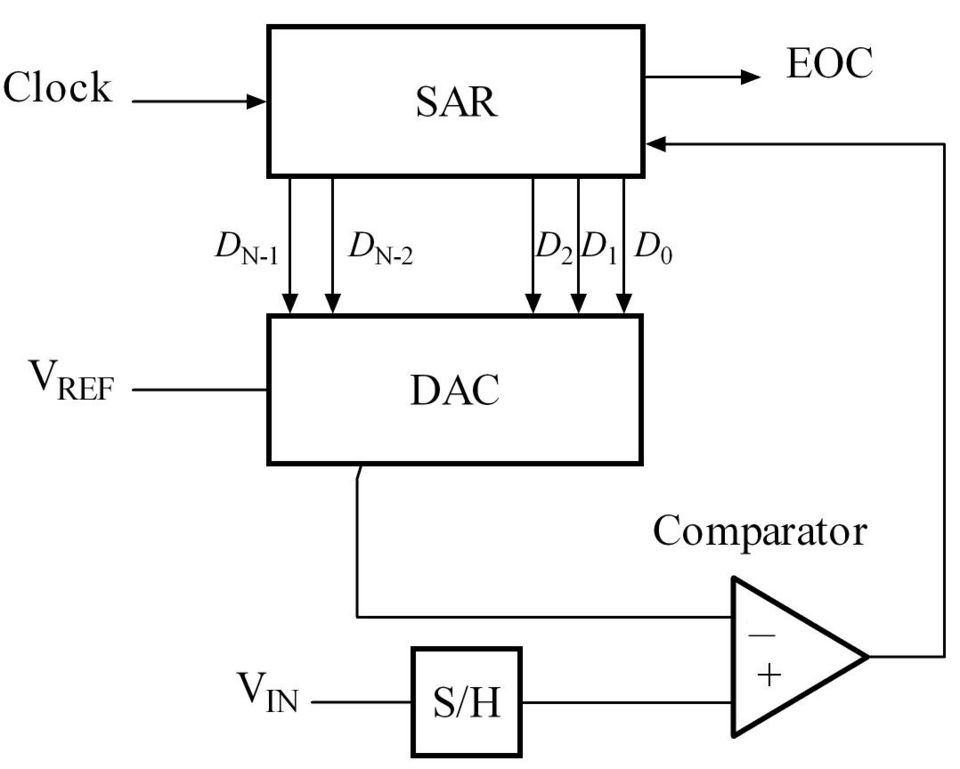
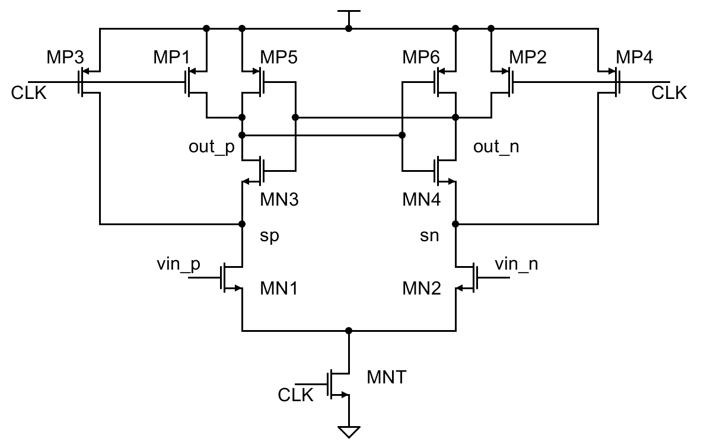

# Lab 2 — Caratterizzazione del MOSFET SKY130A e metodo gm/Id

**Tempo stimato:** 2 ore  
**Cartella di lavoro:** `/foss/designs/modulo1/lab02/xschem/`

---

## Obiettivo

Il dimensionamento dei transistor in un circuito analogico integrato non si fa per tentativi — esiste un metodo sistematico basato sul rapporto **gm/Id** che permette di tradurre direttamente le specifiche del circuito in dimensioni fisiche del transistor.

In questo lab:
1. Capiremo perché il modello quadratico del MOSFET non è più sufficiente nei nodi tecnologici moderni
2. Costruiremo un testbench di caratterizzazione per il MOSFET SKY130A
3. Genereremo le curve $g_m/I_D$, $g_{ds}/I_D$, $f_T$ e $g_m/g_{ds}$ e le useremo per dimensionare il comparatore Strong-ARM nella Parte 2 di questo lab — dimensionamento che verrà poi realizzato e simulato in Lab 3

---

## Teoria: perché il modello quadratico non basta

Il modello MOSFET di livello 1 (quello che avete studiato nel corso di microelettronica) descrive la corrente di drain in saturazione come:

$$I_D = \frac{\mu_n C_{ox}}{2} \cdot \frac{W}{L} \cdot (V_{GS} - V_{th})^2$$

Da questa equazione si ricava la transconduttanza:

$$g_m = \frac{\partial I_D}{\partial V_{GS}} = \mu_n C_{ox} \cdot \frac{W}{L} \cdot (V_{GS} - V_{th})$$

e il rapporto:

$$\frac{g_m}{I_D} = \frac{2}{V_{GS} - V_{th}}$$

Il problema è che questo modello è accurato solo per transistor con canali lunghi (L >> 1µm) operanti in forte inversione. Nei processi moderni — e già a 130nm come SKY130A — entrano in gioco effetti fisici che lo rendono inaccurato:

**Velocity saturation:** a campi elettrici elevati lungo il canale (dovuti a L corta), la velocità dei portatori non cresce linearmente con il campo ma satura a un valore massimo $V_{sat}$. Il risultato è che la corrente diventa quasi **lineare** in VGS invece che quadratica, e gm risulta sovrastimata dal modello quadratico.

**Mobility degradation:** il campo elettrico verticale (perpendicolare al canale, generato da VGS) degrada la mobilità effettiva dei portatori. Anche questo riduce gm rispetto al valore teorico.

**Corrente di sottosoglia:** per $V_{GS} < V_{th}$ il modello quadratico prevede $I_D = 0$, ma nella realtà esiste una corrente esponenziale significativa. In questa regione il rapporto $g_m/I_D$ raggiunge il suo massimo teorico di $q/(n k T) \approx 25\text{–}30\ \text{V}^{-1}$ — molto più alto di quello in forte inversione.

Il confronto tra modello e realtà è evidente nella figura seguente (schematica):



**La conseguenza pratica:** se usi le equazioni quadratiche per dimensionare un transistor a canale corto (la tecnologia SKY130A si può già considerare short-channel), otterrai dimensioni errate — tipicamente W troppo piccola e corrente di bias sbagliata.

### La soluzione: il metodo gm/Id

Il metodo gm/Id aggira completamente questo problema. Invece di usare formule analitiche, **misura direttamente** il comportamento del transistor reale tramite simulazione con i modelli SPICE della fonderia, che sono calibrati su migliaia di misure sperimentali dei dispositivi reali.

Il rapporto $g_m/I_D$ cattura in modo compatto tutta la fisica del MOSFET:

| Regime | $g_m/I_D$ tipico | Efficienza di transconduttanza | $f_T$ |
|--------|-----------------|-------------------------------|-------|
| Sottosoglia (weak inversion) | 25–30 V⁻¹ | Massima | Bassa |
| Moderata inversione | 10–20 V⁻¹ | Buon compromesso | Media |
| Forte inversione (strong inversion) | 3–8 V⁻¹ | Bassa | Alta |

**Efficienza di transconduttanza** è il termine che descrive quanta $g_m$ si ottiene per unità di corrente consumata. Un $g_m/I_D$ alto significa che il transistor produce molta transconduttanza (e quindi guadagno) spendendo poca corrente — è un indice di efficienza energetica del dispositivo. Nei circuiti a basso consumo (wearable, IoT, biomedica) si lavora intenzionalmente in sottosoglia proprio per questo motivo.

**Frequenza di transizione $f_T$** è la frequenza alla quale il guadagno di corrente del transistor scende a 1 — ovvero il limite di velocità intrinseco del dispositivo:

$$f_T = \frac{g_m}{2\pi (C_{gs} + C_{gd})}$$

In sottosoglia $g_m$ è bassa (nonostante $g_m/I_D$ sia alto, $I_D$ è piccolissima) e le capacità di gate dominano → $f_T$ bassa. In forte inversione $g_m$ è alta e le capacità sono relativamente meno penalizzanti → $f_T$ alta. Il compromesso tra efficienza energetica e velocità è uno dei trade-off fondamentali del design analogico.

**La corrente di sottosoglia** non è zero come prevede il modello quadratico, ma segue una legge esponenziale analoga a quella del BJT:

$$I_D = I_{D0} \cdot \frac{W}{L} \cdot e^{\frac{V_{GS}}{n V_T}} \cdot \left(1 - e^{-\frac{V_{DS}}{V_T}}\right)$$

dove $V_T = kT/q \approx 26\ \text{mV}$ a temperatura ambiente e $n$ è il fattore di idealità (tipicamente 1.2–1.5 per SKY130A). Derivando rispetto a $V_{GS}$:

$$g_m = \frac{I_D}{n V_T} \quad \Rightarrow \quad \frac{g_m}{I_D} = \frac{1}{n V_T} \approx \frac{1}{1.3 \times 26\ \text{mV}} \approx 30\ \text{V}^{-1}$$

Questo è il massimo teorico del rapporto $g_m/I_D$ per un MOSFET — ed è strettamente analogo alla transconduttanza normalizzata del BJT, dove $g_m/I_C = 1/V_T \approx 38.5\ \text{V}^{-1}$ (con $n=1$). Il MOSFET in sottosoglia si comporta come un BJT: la corrente è esponenziale in $V_{GS}$, l'efficienza di transconduttanza è massima, ma la velocità è limitata. Questo parallelismo non è casuale — in entrambi i casi la fisica sottostante è la **diffusione** dei portatori, non il drift come in forte inversione.

La curva gm/Id vs densità di corrente (Id/W) è **universale**: è indipendente dalla larghezza W del transistor, dipende solo dal processo e dalla lunghezza L. Questo la rende uno strumento potente: si genera una volta per il PDK, e si usa per qualsiasi dimensionamento.

Il flusso di dimensionamento con gm/Id è:

```
Specifiche circuitali (Av, BW, Id_max, ...)
          ↓
  Calcolo di gm richiesta
          ↓
  Scelta di gm/Id  ← compromesso velocità / consumo
          ↓
  Id = gm / (gm/Id)      ← corrente di bias necessaria
          ↓
  Lettura di Id/W dalla curva  ← per il gm/Id scelto
          ↓
  W = Id / (Id/W)        ← larghezza del transistor
          ↓
  Lettura di VGS dalla curva Id-VGS  ← tensione di polarizzazione
```

---

## Parte 1 — Testbench di caratterizzazione NMOS

```bash
mkdir -p /foss/designs/modulo1/lab02/xschem
cd /foss/designs/modulo1/lab02/xschem

cat > xschemrc << 'EOF'
source /foss/pdks/sky130A/libs.tech/xschem/xschemrc
set netlist_dir [file normalize [file dirname [info script]]/simulation]
append XSCHEM_LIBRARY_PATH :[file dirname [info script]]
EOF

xschem &
```

### 1.1 Il circuito di caratterizzazione

Usiamo due transistor separati sullo stesso schematico, ciascuno con il proprio circuito di misura:

- **MN1** — misura la caratteristica di trasferimento $I_D$-$V_{GS}$: $V_{DS}$ fisso a 1.8V, sweep di $V_{GS}$
- **MN2** — misura la famiglia di curve $I_D$-$V_{DS}$: $V_{GS}$ parametrico (sweep esterno), sweep di $V_{DS}$ e misura di corrente di drain $I_{d}$ tramite ammeter

Entrambi usano `W=W_val` e `L=L_val` — xschem sostituisce i parametri quando genera la netlist, senza virgolette né parentesi graffe. Per cambiare W si aggiorna `.param W_val`, per cambiare L il loop `foreach` lo varia automaticamente nella sezione 1.3.



Usiamo `W_val=10µm` per avere correnti misurabili con precisione. Le curve di $g_m/I_D$ e $I_D/W$ vengono poi normalizzate a W_val=1µm nella sezione 1.3.

### 1.2 Costruire il testbench

Apri un nuovo Tab, quindi crea `nmos_char.sch` (**File → New Schematic**, salva subito con `Ctrl+S`).

**Transistor MN1 — caratteristica Id-VGS:**
- `sky130_fd_pr -> nfet_01v8` → imposta `W=W_val`, `L=L_val`
- `devices -> vsource` nome `VGS1`, `value="0"` — tra gate e GND
- `devices -> vsource` nome `VDS1`, `value="0.9"` — tra drain e GND. 
  - Usiamo VDD/2 = 0.9V invece di 1.8V perché è il punto di lavoro realistico per un transistor analogico in circuito; con VDS = 1.8V il transistor è troppo profondamente in saturazione e gds risulta artificialmente bassa
- `devices -> ammeter` — in serie tra il drain di MN1 e il terminale positivo di VDS1, rinominalo `Vmeas1`
- Source e Bulk → `gnd`

**Transistor MN2 — famiglia Id-VDS:**
- `sky130_fd_pr -> nfet_01v8` → imposta `W=W_val`, `L=L_val`
- `devies -> vsource` nome `VGS2`, `value="0"` — tra gate e GND
- `devices -> vsource` nome `VDS2`, `value="0.9"` — tra drain e GND **tramite ammeter**
- `devices -> ammeter` — in serie tra il drain di MN2 e il terminale positivo di VDS2, rinominalo `Vmeas2`
- Source e Bulk → `gnd`

> 💡 **Sintassi parametri in xschem per SKY130A:** nel campo `W` e `L` del componente scrivi semplicemente `W=W_val` e `L=L_val` — senza virgolette né parentesi graffe. xschem riconosce i nomi dei parametri definiti nel blocco `.param` e li sostituisce correttamente quando genera la netlist.

**Blocco modelli PDK:** copia `TT_MODELS` da `top.sch`.

**Blocco di simulazione:**

```
value=".options savecurrents
.param W_val=10 L_val=0.15
.save all

.control
  * curva Id-VGS su MN1
  dc VGS1 0 1.8 0.005
  remzerovec
  plot i(vmeas1)
  write nmos_vgs.raw

  * famiglia Id-VDS su MN2
  dc VDS2 0 1.8 0.005 VGS2 0 1.8 0.2
  remzerovec
  plot all.vmeas2#branch
  write nmos_vds.raw

.endc"
```

In xschem configura i due grafici embedded puntando a file diversi — fai doppio click su ciascun grafico per aprire il **graphdialog**:
- Grafico Id-VGS → campo **Raw file**: `$netlist_dir/nmos_vgs.raw`, tipo simulazione: `dc`, spunta **Auto load**
- Grafico Id-VDS → campo **Raw file**: `$netlist_dir/nmos_vds.raw`, tipo simulazione: `dc`, spunta **Auto load**

> ⚠️ La casella **Auto load** è fondamentale — senza di essa il grafico non carica automaticamente il file specificato.

I due sweep usano sorgenti diverse e scrivono su file `.raw` separati — questo evita che il vettore di MN1 (che vale 0 durante il secondo sweep) venga incluso nel file di MN2 e viceversa. In xschem configura ciascun grafico embedded puntando al file corrispondente.

Salva con `Ctrl+S`, poi clicca **Netlist** → **Simulate**.

Osserva i due grafici:

- **Curva $I_D$-$V_{GS}$:** quasi zero fino a $V_{th} \approx 0.4\ \text{V}$, poi crescita rapida e più lineare che quadratica — effetto della velocity saturation a L = 0.15µm
- **Famiglia $I_D$-$V_{DS}$:** dieci curve sovrapposte per $V_{GS}$ da 0 a 1.8V con passo 0.2V. Si vedono la zona lineare, il ginocchio, e la saturazione. La pendenza non nulla in saturazione è il channel length modulation — più marcata a L corta, come vedremo nella sezione 1.3.

> ⚠️ Salva sempre con `Ctrl+S` prima di cliccare Netlist o Simulate.

### 1.3 Generare le curve di caratterizzazione per più valori di L

Ora generiamo le curve $g_m/I_D$, $g_{ds}/I_D$ e $f_T$ per cinque valori di L. Partiamo da `nmos_char.sch` già aperto:

1. Seleziona e cancella il secondo circuito (MN2, VGS2, VDS2, Vmeas2) — non serve per questo sweep
2. **File → Save as** → salva come `nmos_gmid.sch`
3. Aggiorna il blocco di simulazione con il loop `foreach` qui sotto

In questo modo riusi i componenti già posizionati (MN1, VGS1, VDS1, Vmeas1, TT_MODELS) senza ripartire da zero.

**Il parametro `L_val` è già definito** nel blocco `.param` e impostato come `L=L_val` in MN1. Basta aggiornare il blocco di simulazione aggiungendo il loop `foreach`:

```
value=".options savecurrents
.param W_val=10 L_val=0.15
.save all

.control
  foreach L_iter 0.15 0.18 0.25 0.5 1.0
    alterparam L_val=$L_iter
    reset

    echo =========================================
    echo Simulating L = $L_iter um
    echo =========================================

    save @m.xm1.msky130_fd_pr__nfet_01v8[gm]
    save @m.xm1.msky130_fd_pr__nfet_01v8[gds]
    save @m.xm1.msky130_fd_pr__nfet_01v8[cgg]
    save @m.xm1.msky130_fd_pr__nfet_01v8[vdsat]

    dc VGS1 0 1.8 0.005
    remzerovec

    let Id = -i(VDS1)
    let gm = @m.xm1.msky130_fd_pr__nfet_01v8[gm]
    let IdW = Id / 10e-6
    let gmid = gm / Id
    let gds = @m.xm1.msky130_fd_pr__nfet_01v8[gds]
    let gds_norm = gds / Id
    let fT_GHz = @m.xm1.msky130_fd_pr__nfet_01v8[gm] / (2 * 3.14159265 * @m.xm1.msky130_fd_pr__nfet_01v8[cgg]) / 1e9
    let Vdsat = @m.xm1.msky130_fd_pr__nfet_01v8[vdsat]

    let L_nm = $L_iter * 1000
    set fname = "nmos_gmid_L{$&L_nm}nm.txt"
    wrdata $fname IdW gmid gds_norm fT_GHz Vdsat

  end
.endc"
```

> 💡 `L_nm` converte L in nanometri (es. 0.15 → 150). La sintassi `{$&L_nm}` usa le parentesi graffe per delimitare il nome della variabile e `&` per la concatenazione con il testo circostante — così ngspice non interpreta `.txt` come parte del nome della variabile. I file prodotti saranno: `nmos_gmid_l150nm.txt`, `nmos_gmid_l180nm.txt`, ecc.

> 💡 **Perché VDS1 = 0.9V:** In questo modulo consideriamo una VDS = VDD/2 come punto di lavoro di riferimento per la caratterizzazione, perché è una condizione mediamente rappresentativa di un transistor in un circuito analogico reale. Con VDS = 1.8V il transistor è troppo profondamente in saturazione rispetto alla realtà operativa, $g_{ds}$ risulta artificialmente bassa e il guadagno intrinseco $g_m/g_{ds}$ artificialmente alto — utile per vedere i limiti del device ma non per il dimensionamento pratico. 

> 💡 **VGS sweeppato fino a 1.8V pur con VDS = 0.9V:** quando VGS > VDS + Vth ≈ 0.9 + 0.4 = 1.3V il transistor esce dalla saturazione ed entra in triodo. Lo sweep continua comunque fino a 1.8V perché è istruttivo vedere il cambiamento di comportamento — $g_{ds}$ sale bruscamente e $g_m/I_D$ scende. Nella zona di triodo il transistor non è utilizzabile come amplificatore, ma lo riconosceremo chiaramente dal grafico.

### 1.3.1 Visualizzare le curve con Python e matplotlib

Usiamo uno script Python che legge i file ASCII prodotti dal loop e genera tre grafici aggregati — uno per $g_m/I_D$, uno per $g_{ds}/I_D$, uno per $f_T$ — con una curva per ogni valore di L e legenda.

**Verifica dipendenze (dal terminale del container):**

Le librerie usate dallo script python dovrebbero già essere incluse nel container IIC-OSIC-TOOLS. In ogni caso, per verificarlo si può lanciare il seguente script dal terminale Ubuntu del container:

```bash
python3 -c "import matplotlib, numpy; print('tutte presenti')"
```


**Copia lo script `plot_gmid.py` dalla cartella [`utils/`](../utils/) nella cartella `xschem/` del lab**, poi lancialo con uno dei seguenti comandi:

```bash
cd /foss/designs/modulo1/lab02/xschem

python3 plot_gmid.py        # solo NMOS (default)
python3 plot_gmid.py pmos   # solo PMOS
python3 plot_gmid.py all    # NMOS + PMOS in griglia 2×3
```

Il grafico viene salvato in `simulation/gmid_curves_nmos.png`, `gmid_curves_pmos.png` o `gmid_curves_all.png` a seconda della modalità.

> 💡 **Asse x logaritmico:** con $I_D/W$ in scala log le tre zone di inversione sono chiaramente separate. Le curve per L diverse si sovrappongono in sottosoglia (il limite $1/nV_T$ è indipendente da L) e si separano in forte inversione per via della velocity saturation.

> 💡 **`foreach` in ngspice vs `.step` in LTSpice:** il costrutto `foreach` è l'equivalente del `.step param` di LTSpice. `alterparam` aggiorna il valore di `L_val`, `reset` ricarica il circuito con il nuovo valore, poi la simulazione riparte da zero. I `plot` dentro il loop sovrappongono automaticamente le curve sullo stesso grafico — una curva per ogni valore di L.

> ⚠️ **Nome del device:** il nome gerarchico dipende dal campo `name` nell'istanza xschem. Se hai chiamato il transistor `M1` (default), il nome è `m.xm1.msky130_fd_pr__nfet_01v8`. Se lo hai chiamato `MN1`, diventa `m.xmn1...`. In caso di errore "no such device", usa `show all` nel prompt ngspice dopo una `.op` per vedere il nome esatto (vedi Lab 1, sezione 5.3).

> 💡 **Perché `@m.xm1...[gm]` invece di `deriv(Id)`:** il parametro `[gm]` è calcolato internamente dal modello BSIM4 ed è più preciso della derivata numerica `deriv(Id)`, che introduce rumore specialmente in sottosoglia. Per la stessa ragione si usano direttamente `[gds]` e `[cgg]` — quest'ultimo è la capacità gate totale $C_{gg} = C_{gs} + C_{gd}$ già calcolata dal modello, più accurata della somma manuale.

Salva con `Ctrl+S` → **Netlist** → **Simulate**.

**Cosa osservare sui grafici — Vista 1 ($I_D/W$ come asse x):**

Curva $g_m/I_D$ vs $I_D/W$: in sottosoglia le curve mostrano un comportamento non del tutto coerente con la teoria — L = 0.15 µm ha il valore più alto (~30 V⁻¹) invece del più basso, e le curve non sono ordinate monotonicamente con L. Questo è un artefatto dei modelli SPICE di SKY130A: i parametri BSIM4 sono stati estratti con dati limitati e la calibrazione in sottosoglia è la parte meno accurata. Da L = 0.25–0.5 µm in su il comportamento è più coerente. In forte inversione le curve si separano nettamente: le L lunghe (0.5 e 1 µm) hanno $g_m/I_D$ più basso perché si comportano come canale lungo ($I_D \propto (V_{GS}-V_{th})^2$, $g_m/I_D$ cala rapidamente); le L corte (0.15–0.25 µm) mantengono $g_m/I_D$ più alto grazie alla velocity saturation.

Curva $g_{ds}/I_D$ vs $I_D/W$: mostra un andamento a **U** alle alte correnti — scende nella zona di saturazione, poi risale bruscamente. Questo **non è un artefatto**: è un effetto fisico diretto della scelta VDS = 0.9V. Quando VGS supera circa VDS + Vth ≈ 0.9 + 0.4 = 1.3V, il transistor esce dalla saturazione ed entra in triodo: $g_{ds}$ aumenta bruscamente perché il transistor si comporta come una resistenza, non più come una sorgente di corrente. Il minimo della curva indica il punto di massima idealità della sorgente di corrente — è la zona dove conviene operare per la coppia differenziale e il tail switch. In sottosoglia la curva dovrebbe essere piatta (fisicamente $g_{ds} \propto I_D$, quindi il rapporto è costante), ma i modelli SKY130A mostrano $g_{ds}/I_D$ crescente verso le basse correnti — anomalia del modello già discussa.

Curva $f_T$ vs $I_D/W$: ha un picco in moderata-forte inversione, poi cala verso le basse correnti. La caduta brusca alle alte correnti corrisponde all'ingresso in triodo — in quella zona il transistor non funziona come amplificatore e $f_T$ perde significato. L più corta raggiunge $f_T$ più alta (minore capacità di gate) e il picco si sposta verso densità di corrente più alte.

**Cosa osservare sui grafici — Vista 2 ($g_m/I_D$ come asse x):**

Curva $f_T$ vs $g_m/I_D$: mostra direttamente il trade-off **velocità vs efficienza**. Aumentare $g_m/I_D$ (spostarsi verso sinistra, zona di sottosoglia) fa scendere $f_T$ — il transistor è più efficiente ma più lento. Il punto di lavoro ottimale si trova dove $f_T$ è ancora sufficientemente alta ma $g_m/I_D$ è abbastanza elevato da non sprecare corrente.

Curva $g_m/g_{ds}$ vs $g_m/I_D$: il guadagno intrinseco aumenta spostandosi verso la moderata inversione (verso destra), poi ha un picco e poi può calare o mostrare un andamento irregolare. Il picco corrisponde al minimo di $g_{ds}/I_D$ — cioè al punto di massima idealità della sorgente di corrente. Per L lunghe il guadagno intrinseco può raggiungere 150–200 V/V, rendendo queste L ideali per stadi ad alto guadagno. **Nota:** l'andamento non monotono per L grandi è fisico e riflette direttamente l'andamento a U di $g_{ds}/I_D$ visto in Vista 1 — quando il transistor si avvicina al triodo, $g_{ds}$ sale e $g_m/g_{ds}$ scende.

Curva $I_D/W$ vs $g_m/I_D$: **questo è il grafico chiave per il dimensionamento** — dato un $g_m/I_D$ target, si legge direttamente la densità di corrente $I_D/W$ e si ricava W = $I_D$ / ($I_D/W$). Le curve per L diverse si sovrappongono quasi perfettamente in sottosoglia (la corrente normalizzata è quasi indipendente da L in WI) e si separano in forte inversione, dove L corta permette densità di corrente più alte.

Curva $V_{DS,sat}$ vs $g_m/I_D$: indica la tensione minima di drain necessaria per mantenere il transistor in saturazione. Diminuisce aumentando $g_m/I_D$ — in sottosoglia bastano poche decine di mV, mentre in forte inversione servono 0.3–0.8V. Questo è un vincolo di headroom critico per i transistor con tensione di drain limitata — in particolare MNT e MN1/MN2 che operano con tensione disponibile ridotta durante la fase di valutazione.

> ⚠️ **Nota sulla qualità dei modelli SKY130A:** SKY130A è un PDK open-source straordinario per accessibilità, ma i modelli BSIM4 presentano incoerenze in sottosoglia e moderata inversione. Per il design analogico è consigliabile lavorare con **L ≥ 0.25 µm** e in moderata-forte inversione, dove i modelli sono più accurati. L minima si usa quasi esclusivamente nei circuiti digitali — in analogico si preferisce sempre L più lunga per migliore matching, $g_{ds}$ più basso e modelli più affidabili.

### 1.4 Curve di caratterizzazione PMOS

Crea `pmos_gmid.sch` (**File → New Schematic**, salva subito con `Ctrl+S`).

**Differenze rispetto all'NMOS — configurazione del testbench PMOS:**

Per un PMOS in saturazione le tensioni devono rispettare $V_{SG} > |V_{th}|$ e $V_{SD} > V_{SG} - |V_{th}|$. La convenzione più pratica è collegare il source a VDD e il drain a GND tramite l'ammeter — così $V_{DS} = 0 - 1.8 = -1.8\ \text{V}$ fisso. La sorgente VGS va collegata tra gate (terminale +) e il nodo VDD (terminale −), in modo che misuri direttamente $V_{GS} = V_{gate} - V_{source}$.



```

  VDD: value="0.9"   →  porta il nodo VDD a 0.9V = VDD/2 rispetto a GND
                         → VDS = 0 - 0.9 = -0.9V (punto di lavoro realistico)
  VGS:  value="0"     →  gate allo stesso potenziale del source (VGS=0)
                         sweep: dc VGS 0 -1.8 -0.005
                         → VGS scende da 0 a −1.8V (mostra intera caratteristica
                           inclusa la zona di triodo per VGS < VDS ≈ -0.9V)
```

**Componenti da inserire:**

- `sky130_fd_pr -> pfet_01v8` → imposta `W=W_val`, `L=L_val`
- `devices -> vsource` nome `VDD`, `value="0.9"` — terminale **+** al nodo VDD (source e bulk del PMOS), terminale **−** a `gnd`. Usiamo VDD/2 = 0.9V per avere $V_{DS} = -0.9\ \text{V}$, punto di lavoro realistico per circuiti analogici
- `devices -> vsource` nome `VGS`, `value="0"` — terminale **+** al gate, terminale **−** al nodo VDD. Così VGS misura esattamente $V_{gate} - V_{source}$
- `devices -> ammeter` rinominato `Vmeas` — tra drain e `gnd`

> 💡 Il terminale negativo di VGS va al nodo VDD (source), non a GND. Se lo collegassi a GND, il gate sarebbe a 0V assoluti invece che a 0V rispetto al source — il transistor si troverebbe con $V_{GS} = 0 - 1.8 = -1.8\ \text{V}$ già all'inizio dello sweep, cioè in forte conduzione, e lo sweep non partirebbe da transistor spento.

**Blocco di simulazione:**

```
value=".options savecurrents
.param W_val=10 L_val=0.15
.save all

.control
  foreach L_iter 0.15 0.18 0.25 0.5 1.0
    alterparam L_val=$L_iter
    reset

    echo =========================================
    echo Simulating PMOS L = $L_iter um
    echo =========================================

    save @m.xm1.msky130_fd_pr__pfet_01v8[gm]
    save @m.xm1.msky130_fd_pr__pfet_01v8[gds]
    save @m.xm1.msky130_fd_pr__pfet_01v8[cgg]
    save @m.xm1.msky130_fd_pr__pfet_01v8[vdsat]

    dc VGS 0 -1.8 -0.005
    remzerovec

    let Id = -i(vmeas)
    let gm = @m.xm1.msky130_fd_pr__pfet_01v8[gm]
    let IdW = Id / 10e-6
    let gmid = gm / Id
    let gds = @m.xm1.msky130_fd_pr__pfet_01v8[gds]
    let gds_norm = gds / Id
    let fT_GHz = @m.xm1.msky130_fd_pr__pfet_01v8[gm] / (2 * 3.14159265 * @m.xm1.msky130_fd_pr__pfet_01v8[cgg]) / 1e9
    let Vdsat = @m.xm1.msky130_fd_pr__pfet_01v8[vdsat]

    let L_nm = $L_iter * 1000
    set fname = "pmos_gmid_L{$&L_nm}nm.txt"
    wrdata $fname IdW gmid gds_norm fT_GHz Vdsat

  end
.endc"
```

> ⚠️ **Nome del device PMOS:** il nome gerarchico dipende dal nome assegnato all'istanza in xschem. Se hai chiamato il transistor `M1`, il nome è `m.xm1.msky130_fd_pr__pfet_01v8`. Usa `show all` dopo una `.op` per verificarlo.

Per visualizzare le curve lancia lo script python con l'argomento `pmos`:

```bash
python3 plot_gmid.py pmos    # solo PMOS
python3 plot_gmid.py all     # NMOS + PMOS a confronto in griglia 2×3
```

> 💡 Il PMOS in SKY130A ha una mobilità circa 2–2.5x inferiore all'NMOS. A parità di $g_m/I_D$ e L, il PMOS ha una $I_D/W$ più bassa e una $f_T$ più bassa — richiede W maggiore per la stessa $g_m$ e risponde più lentamente.

**Cosa osservare sui grafici PMOS:**

Curva $g_m/I_D$: presenta un **bump** (rigonfiamento) in moderata inversione, più pronunciato per le L corte (L=150–250nm) e quasi assente per L≥500nm. Non è un comportamento fisico reale — è un artefatto del modello BSIM4 di SKY130A.

Curva $g_{ds}/I_D$: mostra lo stesso artefatto del bump per le L corte, coerentemente con quanto visto in $g_m/I_D$.

Curva $f_T$: il picco è circa 2–2.5× inferiore rispetto all'NMOS — L=150nm raggiunge ~32 GHz contro ~86 GHz dell'NMOS. Questo è fisicamente corretto: la mobilità delle lacune è circa 2.5× inferiore a quella degli elettroni.

> ⚠️ **Artefatto nella Vista 2 del PMOS:** la Vista 2 usa $g_m/I_D$ come asse x, il che presuppone che $g_m/I_D$ sia una funzione **monotona** di $I_D/W$. Per l'NMOS questa condizione è rispettata. Per il PMOS SKY130A invece il bump in $g_m/I_D$ rende la curva non monotona — esiste un intervallo di $g_m/I_D$ per cui ci sono **due valori distinti di $I_D/W$** che producono lo stesso $g_m/I_D$. Quando la Vista 2 traccia $f_T$, $g_m/g_{ds}$ e $I_D/W$ in funzione di $g_m/I_D$, le curve si "piegano" su se stesse e diventano bi-valutate. Una verifica numerica conferma che il bump è identico sia usando il parametro `[gm]` del modello BSIM4 che calcolando $g_m$ come derivata numerica di $I_D$ — e peggiora al crescere di L invece di migliorare. Questo esclude qualsiasi spiegazione fisica (velocity saturation, DIBL) e conferma che l'origine è esclusivamente nel fitting dei parametri del modello SPICE per il PMOS SKY130A. Per il PMOS la Vista 2 è affidabile solo per L ≥ 0.5 µm nella zona di forte inversione ($g_m/I_D$ < 5 V⁻¹).

> ⚠️ Per le stesse ragioni, per il design analogico con dispositivi PMOS SKY130A è preferibile usare **L ≥ 0.5 µm**, dove i modelli sono più accurati e il bump scompare.

---

## Parte 2 — Applicare il metodo gm/Id al comparatore Strong-ARM

### Convertitore ADC SAR (Successive-Approximation)
Come riferimento per l’utilizzo dei tool open-source nel design di ASIC all’interno di questo corso, considereremo un [ADC SAR (Successive Approximation Register)](https://en.wikipedia.org/wiki/Successive-approximation_ADC). I convertitori analogico-digitale (ADC) e digitale-analogico (DAC) rappresentano infatti un esempio particolarmente efficace di progettazione mixed-signal, in quanto integrano componenti analogiche e digitali all’interno dello stesso sistema.

Di seguito è riportato lo schema a blocchi di un ADC SAR.



### Architettura del comparatore Strong-ARM

Il comparatore, ed in particolare l'architettura del comparatore Strong-ARM latch è un blocco fondamentale di un SAR ADC. Per un approfondimento sull'architettura e le sue varianti, si veda: B. Razavi, "[The StrongARM Latch](https://www.seas.ucla.edu/brweb/papers/Journals/BR_Magzine4.pdf)", *IEEE Solid-State Circuits Magazine*, 2015.



In questo lab realizziamo la versione a **11 transistor**, che comprende un latch PMOS (MP5/MP6) per garantire che entrambe le uscite vadano a rail in ogni condizione di processo.

Opera in due fasi comandate dal clock:

**Fase di reset (CLK=0):** MNT è spento. MP1/MP2 portano `out_p`/`out_n` a VDD; MP3/MP4 portano i nodi intermedi `sp`/`sn` a VDD (precarica completa di tutti i nodi interni).

**Fase di valutazione (CLK=1):** MNT si accende; MP1–MP4 si spengono. La coppia differenziale MN1/MN2 scarica asimmetricamente `sp`/`sn` e quindi `out_p`/`out_n`. Il latch NMOS MN3/MN4 rigenera esponenzialmente la differenza. Il latch PMOS MP5/MP6 (gate cross-coupled: gate di MP5 → `out_n`, gate di MP6 → `out_p`) fornisce un percorso attivo verso VDD per l'uscita vincente — senza di esso l'uscita "high" resterebbe a un valore intermedio sotto VDD nelle condizioni di processo peggiori.


La velocità di decisione dipende da due contributi in serie:
1. **Integrazione:** la coppia differenziale crea una differenza di tensione iniziale $\Delta V_0$ proporzionale a $g_m \cdot V_{in,diff} \cdot t_{int} / C_L$
2. **Rigenerazione:** il doppio latch (NMOS MN3/MN4 + PMOS MP5/MP6) amplifica $\Delta V_0$ esponenzialmente con costante di tempo ridotta rispetto al solo latch NMOS

$$t_{decision} \approx t_{int} + \tau_{regen} \cdot \ln\!\left(\frac{V_{DD}/2}{\Delta V_0}\right)$$

---

### Specifiche di progetto del SAR ADC

| Parametro | Specifica | Note |
|-----------|-----------|------|
| $V_{DD}$ | 1.8 V | Power Supply tipica per transistor low-voltage della tecnologia SKY130A|
| Frequenza campionamento SAR | 2 MS/s | 8 bit → $f_{clk}$ ≈ 20 MHz |
| Ingresso differenziale minimo | 1 mV | worst case 1 LSB con $V_{FS}$ = 256 mV |
| Tensione di modo comune ingresso | 0.9 V | $V_{DD}/2$ |
| Tempo di decisione | < 10 ns | margine su $T_{clk}$ = 50 ns |
| Offset (1σ, senza layout matching) | < 10 mV | verrà verificato con Monte Carlo in Lab 3 |
| Consumo medio | < 50 µW @ 2 MS/s | budget SAR completo |
| Carico latch $C_L$ | 10–20 fF | capacità di ingresso del latch SR a valle |

---

### Scelta di L per ciascun transistor

Prima di scegliere il punto di lavoro $g_m/I_D$, occorre decidere la lunghezza di canale L per ciascun transistor. I criteri sono diversi a seconda del ruolo:

| Transistor | L scelta | Motivazione |
|-----------|----------|-------------|
| MN1, MN2 (coppia diff.) | 0.25 µm | $g_{ds}/I_D$ = 0.158 V⁻¹ a $g_m/I_D$=12 vs 0.478 per L=0.15µm — migliore idealità come sorgente di corrente e migliore matching (σ$V_T \propto 1/\sqrt{WL}$) |
| MN3, MN4 (latch NMOS) | 0.15 µm | $f_T$ massima (~86 GHz al picco) — la velocità di rigenerazione è il requisito critico |
| MP5, MP6 (latch PMOS) | 0.15 µm | $f_T$ massima per il PMOS — simmetrico a MN3/MN4, formano insieme il latch CMOS |
| MNT (coda) | 0.5 µm | compromesso ottimale spiegato sotto |
| MP1, MP2 (precarica `out`) | 0.15 µm | minima resistenza di canale, accensione rapida in fase di reset |
| MP3, MP4 (precarica `sp`/`sn`) | 0.15 µm | stesso ruolo di MP1/MP2 sui nodi intermedi — stessa logica di scelta |

**Perché MNT usa L=0.5µm e non L=1µm o più lungo?**

La scelta è un compromesso tra tre fattori contrapposti:

- **A favore di L più lunga:** $g_{ds}/I_D$ ulteriormente ridotto → sorgente di corrente più ideale. Con L=1µm si otterrebbe $g_{ds}/I_D$ ≈ 0.03 V⁻¹, un ulteriore 2× rispetto a L=0.5µm.

- **Contro L più lunga — velocità di accensione:** MNT si accende ad ogni ciclo di clock. La costante di tempo di accensione è $\tau_{on} \approx 1/(2\pi f_T)$. Con L=1µm, $f_T$ ≈ 1.2 GHz → $\tau_{on}$ ≈ 130 ps. All'inizio della fase di valutazione MNT non è ancora completamente acceso — la corrente di coda raggiunge il regime solo dopo qualche $\tau_{on}$, riducendo il tempo utile di integrazione. Con L=0.5µm, $f_T$ ≈ 4.5 GHz → $\tau_{on}$ ≈ 35 ps, trascurabile rispetto ai 10 ns disponibili.

- **Contro L più lunga — headroom:** il nodo di source comune di MN1/MN2 si trova a circa $V_{CM} - V_{GS,MN1} \approx 0.9 - 0.7 = 0.2\ \text{V}$. Questo è già il minimo necessario per tenere MNT in saturazione ($V_{DS,sat}$ ≈ 0.2–0.3 V). Passare a L=1µm con la stessa corrente richiede W più grande per la stessa $I_D/W$, aumentando le capacità parassite sul nodo di source comune senza migliorare l'headroom.

**Conclusione:** L=0.5µm offre $g_{ds}/I_D$ già 7.5× migliore di L=0.15µm, velocità di accensione adeguata e headroom gestibile. Il miglioramento marginale di L=1µm non giustifica i compromessi su velocità e area.

---

### Scelta dei punti di lavoro gm/Id

| Transistor | Ruolo | $g_m/I_D$ target | L scelta | Motivazione |
|-----------|-------|-----------------|----------|-------------|
| MN1, MN2 (coppia diff.) | Integrazione input | 12 V⁻¹ | 0.25 µm | Matching offset + $g_{ds}$ basso |
| MN3, MN4 (latch NMOS) | Rigenerazione NMOS | 7 V⁻¹ | 0.15 µm | Massima $f_T$ = 80.7 GHz |
| MP5, MP6 (latch PMOS) | Rigenerazione PMOS | 7 V⁻¹ | 0.15 µm | Massima $f_T$ del PMOS — simmetrico a MN3/MN4 per bilancio del latch |
| MNT (coda) | Switch di corrente | 9 V⁻¹ | 0.5 µm | $g_{ds}/I_D$ = 0.064 V⁻¹ (sorgente di corrente) |
| MP1, MP2 (precarica `out`) | Reset uscite | 10–12 V⁻¹ | 0.15 µm | Precarica rapida, resistenza minima |
| MP3, MP4 (precarica `sp`/`sn`) | Reset nodi intermedi | 10–12 V⁻¹ | 0.15 µm | Stessa logica di MP1/MP2 — precarica i nodi sorgente del latch NMOS |

---

### Step 1 — Budget di corrente e potenza

Il comparatore è un circuito dinamico (gestito da un clock): consuma corrente **solo durante la fase di valutazione**. Con $f_{clk}$ = 20 MHz e $t_{eval}$ < 10 ns, il duty cycle di valutazione è:

$$DC_{eval} = \frac{t_{eval}}{T_{clk}} = \frac{10\ \text{ns}}{50\ \text{ns}} = 20\%$$

La corrente di coda massima compatibile con il budget di potenza:

$$I_{tail} = \frac{P_{max}}{V_{DD} \cdot DC_{eval}} = \frac{50\ \mu\text{W}}{1.8\ \text{V} \cdot 0.2} = 139\ \mu\text{A}$$

Scegliamo $I_{tail}$ = **100 µA** per avere margine. Ogni transistor della coppia differenziale porta:

$$I_{D,pair} = \frac{I_{tail}}{2} = 50\ \mu\text{A}$$

> 💡 Il latch PMOS MP5/MP6 preleva corrente direttamente da VDD durante la fase di valutazione — un contributo aggiuntivo rispetto a I_tail. In prima approssimazione questo contributo è trascurabile nel calcolo del consumo medio: la rigenerazione è un transitorio brevissimo (< 5 ns) e la corrente di MP5/MP6 diminuisce rapidamente man mano che le uscite si separano. Per un'analisi rigorosa del consumo occorrerebbe integrare la corrente istantanea sull'intero transitorio — fuori dallo scopo di questo lab.

---

### Step 2 — Dimensionamento della coppia differenziale (MN1, MN2)

Con $g_m/I_D$ = 12 V⁻¹, L = 0.25 µm e $I_D$ = 50 µA, calcola la transconduttanza della coppia:

$$g_{m,pair} = \frac{g_m}{I_D} \cdot I_D$$

Apri `plot_gmid.py` e posiziona il cursore sulla curva NMOS a $g_m/I_D$ = 12 V⁻¹ con L = 0.25 µm. Leggi il valore di $I_D/W$ dal pannello info, poi calcola:

$$W_{pair} = \frac{I_D}{(I_D/W)_{grafico}}$$

**Vincolo di matching — la legge di Pelgrom**

L'offset sistematico di un comparatore può essere azzerato con tecniche di calibrazione, ma l'**offset random** — causato da variazioni statistiche nella soglia $V_{th}$ tra MN1 e MN2 — è intrinseco al processo. La deviazione standard dell'offset della coppia è:

$$\sigma_{offset} = \sqrt{2} \cdot \frac{A_{VT}}{\sqrt{W \cdot L}}$$

dove $A_{VT} \approx 3.5\ \text{mV}{\cdot}\text{µm}$ è il coefficiente di Pelgrom per SKY130A (vedi sezione teoria). Imponendo $\sigma_{offset} < 10\ \text{mV}$, ricava il vincolo minimo su $W \cdot L$ e verifica che il W ottenuto dalla curva lo soddisfi.

> 💡 La legge di Pelgrom ha implicazioni importanti: raddoppiare $W$ o $L$ riduce $\sigma_{offset}$ di $\sqrt{2}$. Per dimezzare l'offset bisogna quadruplicare l'area.

**Riferimenti:**
- M. J. M. Pelgrom et al., *"Matching Properties of MOS Transistors"*, IEEE JSSC 1989 — [articolo originale](https://ieeexplore.ieee.org/document/572707)
- M. J. M. Pelgrom, *"A Designer's View on Mismatch"*, tutorial IDESA — [sintesi con dati per 130nm](https://everynanocounts.com/2012/03/02/an-interesting-tutorial-given-by-mr-matching/)
- P. Kinget, *"Device Mismatch and Tradeoffs"*, IEEE JSSC 2005 — [articolo](https://ieeexplore.ieee.org/document/1438516)

---

### Step 3 — Dimensionamento del latch CMOS rigenerativo (MN3/MN4 + MP5/MP6)

#### Il latch come coppia di inverter CMOS back-to-back

MN3 e MP5 hanno entrambi il gate su `out_n` e il drain su `out_p`: formano un **inverter CMOS completo**. Analogamente MN4 e MP6 formano il secondo inverter (gate su `out_p`, drain su `out_n`). Due inverter CMOS con ingressi e uscite incrociati costituiscono un **latch CMOS standard** — la stessa struttura usata in ogni flip-flop e SRAM.

La transconduttanza effettiva di ciascun inverter è la somma dei due contributi:

$$g_{m,inv} = g_{m,MN3} + g_{m,MP5}$$

e la costante di tempo di rigenerazione diventa:

$$\tau_{regen} = \frac{C_L}{g_{m,inv}} = \frac{C_L}{g_{m,MN3} + g_{m,MP5}}$$

Rispetto all'architettura a soli NMOS: a parità di corrente, aggiungere MP5/MP6 aumenta $g_{m,inv}$ e riduce $\tau_{regen}$ — il comparatore decide più velocemente. Rispetto a un latch NMOS puro, il latch CMOS garantisce anche che l'uscita vincente raggiunga effettivamente VDD, perché il PMOS fornisce un percorso attivo verso l'alimentazione.

#### Calcolo di $\Delta V_0$ e $g_{m,latch,min}$

La differenza di tensione iniziale $\Delta V_0 = V_{OUT+} - V_{OUT-}$ al termine della fase di integrazione è:

$$\Delta V_0 \approx \frac{g_{m,pair} \cdot V_{in,diff}}{2 \cdot C_L} \cdot t_{int}$$

dove $t_{int}$ = 5 ns è il tempo allocato all'integrazione (metà di $t_{decision}$). Usando il $g_{m,pair}$ calcolato nello Step 2, calcola $\Delta V_0$.

> 💡 All'inizio della fase di valutazione `out_p` e `out_n` sono ancora entrambe a VDD (appena precaricate) — i gate di MP5/MP6 sono a VDD, quindi MP5/MP6 sono spenti. L'integrazione iniziale è quindi guidata esclusivamente dalla coppia differenziale MN1/MN2, e la formula di $\Delta V_0$ sopra è valida.

La costante di tempo $\tau_{regen}$ richiesta per completare la rigenerazione da $\Delta V_0$ a $V_{DD}/2$ in un tempo $t_{regen}$ = 5 ns è:

$$\tau_{regen} = \frac{t_{regen}}{\ln(V_{DD}/2\ /\ \Delta V_0)}$$

Da $\tau_{regen}$ ricava la $g_{m,inv}$ minima richiesta per l'inverter latch:

$$g_{m,inv,min} = \frac{C_L}{\tau_{regen}}$$

#### Dimensionamento di MN3/MN4 (NMOS)

Con $g_m/I_D$ = 7 V⁻¹ e L = 0.15 µm (massima $f_T$ NMOS ≈ 86 GHz), calcola:

$$g_{m,MN3} = \frac{g_m}{I_D} \cdot I_D = 7 \cdot 50\ \mu\text{A} = 350\ \mu\text{A/V}$$

Poi leggi $I_D/W$ dal grafico NMOS a $g_m/I_D$ = 7 V⁻¹, L = 0.15 µm e calcola:

$$W_{MN3} = \frac{I_D}{(I_D/W)_{NMOS\ @\ gm/Id=7}}$$

> 💡 Se il W risultante è inferiore al minimo di layout (~1 µm), usa W = 1 µm.

#### Dimensionamento di MP5/MP6 (PMOS)

Con $g_m/I_D$ = 7 V⁻¹ e L = 0.15 µm (massima $f_T$ del PMOS), leggi $I_D/W$ dal grafico PMOS (usa `python3 plot_gmid.py pmos`) e calcola:

$$g_{m,MP5} = \frac{g_m}{I_D} \cdot I_D = 7 \cdot 50\ \mu\text{A} = 350\ \mu\text{A/V}$$

$$W_{MP5} = \frac{I_D}{(I_D/W)_{PMOS\ @\ gm/Id=7}}$$

> ⚠️ **Artefatto BSIM4 PMOS:** per L = 0.15 µm usa la **Vista 1** dello script (asse x = $I_D/W$), non la Vista 2. Posiziona il cursore sulla curva L = 0.15 µm e individua il punto in cui $g_m/I_D$ = 7 V⁻¹ (leggilo dal pannello info), poi leggi $I_D/W$ a quel punto.

> 💡 Con mobilità PMOS ≈ 2.5× inferiore all'NMOS, a parità di $g_m/I_D$ e corrente il PMOS richiede W ≈ 2–3× maggiore dell'NMOS per produrre la stessa $g_m$. Il W risultante sarà quindi circa 2–3 µm contro 1 µm di MN3 — questo è fisicamente atteso.

#### Verifica della transconduttanza totale

Con i valori calcolati, verifica che il latch CMOS soddisfi il requisito:

$$g_{m,inv} = g_{m,MN3} + g_{m,MP5} \gg g_{m,inv,min}$$

> 💡 Poiché entrambi i contributi valgono ~350 µA/V, la transconduttanza totale è circa **700 µA/V** — il doppio rispetto a un latch solo NMOS. Questo riduce $\tau_{regen}$ di un fattore 2 e migliora il margine temporale in modo significativo.

---

### Step 4 — Dimensionamento del transistor di coda (MNT)

MNT deve erogare $I_{tail}$ = 100 µA con ottimo comportamento da sorgente di corrente. Con $g_m/I_D$ = 9 V⁻¹ e L = 0.5 µm, leggi $I_D/W$ dal grafico e calcola:

$$W_{tail} = \frac{I_{tail}}{(I_D/W)_{grafico}}$$

Verifica sul grafico $g_{ds}/I_D$ vs $I_D/W$ quanto è migliorato il comportamento da sorgente di corrente rispetto a L = 0.15 µm allo stesso punto di lavoro.

---

### Step 5 — Dimensionamento dei transistor di precarica uscite PMOS (MP1, MP2)

MP1/MP2 devono ricaricare le uscite `out_p`/`out_n` a VDD entro la fase di reset. Con $g_m/I_D$ = 10 V⁻¹ per il PMOS, leggi $I_D/W$ dal grafico PMOS (usa `python3 plot_gmid.py pmos`) e calcola:

$$W_{prech} = \frac{I_{D,prech}}{(I_D/W)_{PMOS\ @\ gm/Id=10}}$$

Scegli $I_{D,prech}$ = 50 µA come valore iniziale — la precarica in genere non è il collo di bottiglia con $C_L$ = 20 fF.

---

### Step 5b — Dimensionamento dei transistor di precarica nodi interni PMOS (MP3, MP4)

MP3/MP4 hanno lo stesso ruolo di MP1/MP2, ma sui nodi intermedi `sp`/`sn` anziché sulle uscite. I nodi `sp`/`sn` hanno capacità simile o leggermente inferiore a `out_p`/`out_n` (non hanno il carico del gate del latch SR a valle), ma il dimensionamento segue la stessa logica.

Usa le stesse curve PMOS con $g_m/I_D$ = 10–12 V⁻¹, L = 0.15 µm, $I_{D,prech}$ = 50 µA:

$$W_{MP3,MP4} = \frac{I_{D,prech}}{(I_D/W)_{PMOS\ @\ gm/Id=10}}$$

> 💡 In prima approssimazione puoi usare W uguale a MP1/MP2. La differenza nasce se vuoi ottimizzare la velocità di precarica di `sp`/`sn` separatamente — per questo lab i due valori possono coincidere.

---

### Step 6 — Verifica della costante di tempo di rigenerazione

Con tutti i valori determinati, calcola la costante di tempo del latch CMOS usando la transconduttanza totale dell'inverter:

$$\tau_{regen} = \frac{C_L}{g_{m,MN3} + g_{m,MP5}}$$

poi verifica il tempo di decisione complessivo:

$$t_{decision} \approx t_{int} + \tau_{regen} \cdot \ln\!\left(\frac{V_{DD}/2}{\Delta V_0}\right) < 10\ \text{ns}\ \checkmark$$

> 💡 Ricalcola anche il caso ipotetico con solo MN3/MN4 (τ_regen = C_L / g_m,MN3) per confronto: la riduzione di $\tau_{regen}$ grazie a MP5/MP6 si traduce direttamente in un margine temporale migliore. Questo quantifica il beneficio dell'architettura a 11 transistor rispetto alla versione base a 7.

---

### Riepilogo del dimensionamento

Completa la tabella con i valori letti dai grafici:

| Transistor | $g_m/I_D$ | $I_D/W$ (da grafico) | $I_D$ | $W$ | $L$ |
|-----------|-----------|---------------------|-------|-----|-----|
| MN1, MN2 (coppia diff.) | 12 V⁻¹ | ? µA/µm | 50 µA | ? µm | 0.25 µm |
| MN3, MN4 (latch NMOS) | 7 V⁻¹ | ? µA/µm | 50 µA | ? µm | 0.15 µm |
| MP5, MP6 (latch PMOS) | 7 V⁻¹ | ? µA/µm | 50 µA | ? µm | 0.15 µm |
| MNT (coda) | 9 V⁻¹ | ? µA/µm | 100 µA | ? µm | 0.5 µm |
| MP1, MP2 (precarica `out`) | 10–12 V⁻¹ | ? µA/µm | 50 µA | ? µm | 0.15 µm |
| MP3, MP4 (precarica `sp`/`sn`) | 10–12 V⁻¹ | ? µA/µm | 50 µA | ? µm | 0.15 µm |

---

## Domande di riflessione

1. Perché la curva $g_m/I_D$ vs $I_D/W$ è indipendente dalla larghezza W? Dimostralo partendo dalle espressioni di $g_m$ e $I_D$.
2. Dai grafici misurati: a $g_m/I_D$ = 12 V⁻¹, il $g_{ds}/I_D$ di L=0.25µm è 0.158 V⁻¹ contro 0.433 V⁻¹ di L=0.15µm. Come si traduce questa differenza nel guadagno intrinseco $A_0 = g_m/g_{ds}$ della coppia differenziale?
3. Il picco di $f_T$ per l'NMOS a L=0.15µm si trova attorno a $I_D/W$ = 70 µA/µm (circa 86 GHz). Perché il latch viene dimensionato a $g_m/I_D$ = 7 V⁻¹ ($I_D/W$ = 57 µA/µm) e non direttamente al picco di $f_T$? Il criterio vale allo stesso modo per il PMOS MP5/MP6 — oppure, dato che il PMOS ha una $f_T$ massima molto più bassa (~32 GHz), il vincolo critico sulla velocità del latch CMOS è sempre imposto dall'NMOS?
4. Se volessimo ridurre l'offset a σ < 5 mV mantenendo L = 0.25 µm, quale W minimo servirebbe? Quali sono le conseguenze su consumo e area?

---

## Soluzione

Il file di soluzione completo è disponibile in [`soluzioni/lab02/`](./soluzioni/lab02/).
