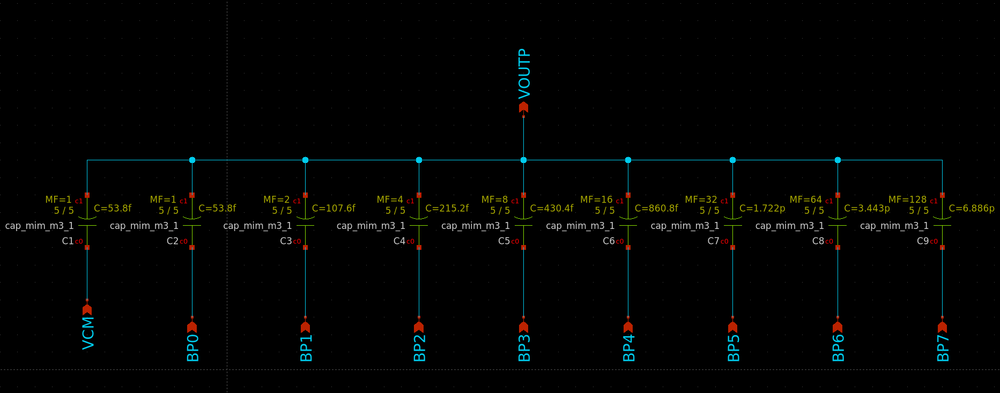
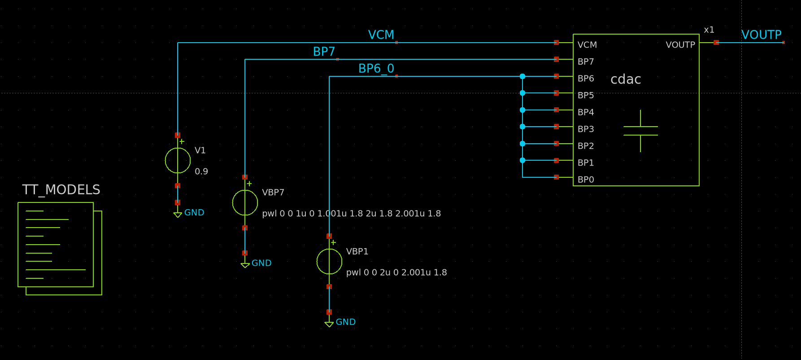
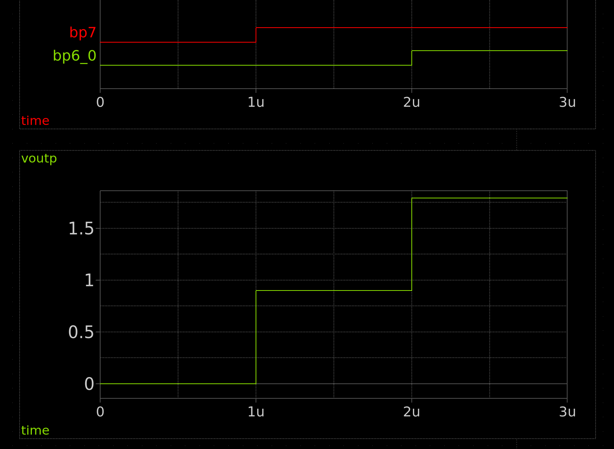
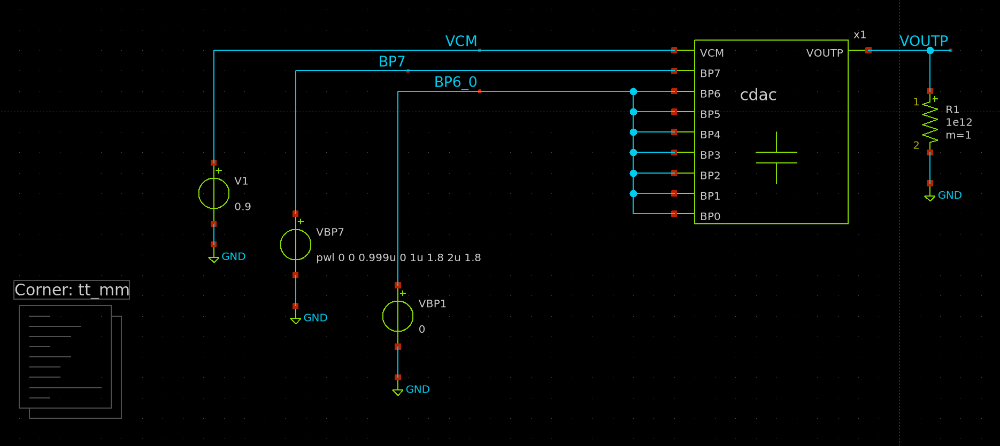
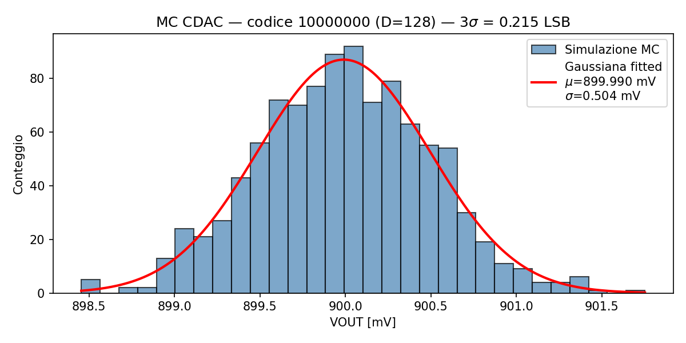

# Lab — Design e simulazione del CDAC a 8 bit

**Tempo stimato:** 105 minuti  
**Cartella di lavoro:** `/foss/designs/modulo2/lab_cdac/xschem/`

---

## Obiettivo

In questo lab progetteremo e simuleremo il **CDAC (Capacitive DAC) a 8 bit** del SAR ADC — il blocco che campiona il segnale di ingresso e genera la tensione di riferimento per il comparatore durante la conversione.

Al termine saprai:
- Spiegare il principio di funzionamento di un CDAC a ridistribuzione di carica e il ruolo degli switch nelle tre fasi operative
- Dimensionare la capacità unitaria $C_u$ in funzione dei vincoli di rumore $kT/C$ e di matching (legge di Pelgrom per le capacità MiM)
- Costruire l'array capacitivo a pesi binari in xschem usando `sky130_fd_pr__cap_mim_m3_1`
- Simulare la fase di conversione con ngspice e verificare la scala del DAC
- Eseguire una simulazione Monte Carlo per verificare il matching tra le capacità MiM e confrontarlo con la previsione di Pelgrom

---

## Struttura delle cartelle

```bash
mkdir -p /foss/designs/modulo2/lab_cdac/xschem
cd /foss/designs/modulo2/lab_cdac/xschem

cat > xschemrc << 'EOF'
source /foss/pdks/sky130A/libs.tech/xschem/xschemrc
set netlist_dir [file normalize [file dirname [info script]]/simulation]
append XSCHEM_LIBRARY_PATH :[file dirname [info script]]
EOF

xschem &
```

La struttura finale del lab:

```
/foss/designs/modulo2/lab_cdac/
└── xschem/
    ├── xschemrc
    ├── cdac.sch             ← schematico del CDAC (array capacitivo + switch ideali)
    ├── cdac.sym             ← simbolo generato automaticamente
    ├── tb_convert.sch       ← testbench: verifica della scala DAC
    ├── tb_mc.sch            ← testbench: Monte Carlo sul mismatch delle MiM
    └── simulation/
```

---

## Parte 0 — Il CDAC reale: switch e fasi operative

Prima di costruire il circuito semplificato del lab, è importante capire come funziona il CDAC completo con gli switch reali. Questo aiuta a comprendere perché le semplificazioni adottate nel lab sono valide e cosa dovremo aggiungere nel Modulo 5.

### Il circuito completo con switch

Nel SAR ADC reale il CDAC è governato da tre tipi di switch, ciascuno pilotato da un segnale di controllo generato dal controller digitale:

```
                           SW_smp (campionamento)
VIN ──────────────────────────/────────────────── VOUTP
                                                    │
         BP7        BP6              BP0           top plate (floating in conversione)
          │          │                │             │
       [SW_B7]    [SW_B6]  ...    [SW_B0]        [SW_rst]
          │          │                │             │
        VDD/        VDD/            VDD/           VCM
        GND         GND             GND
          │          │                │
        [XC7]      [XC6]  ...     [XC0]  [XCTERM]
          └──────────┴────── ... ──┴──────┘
                             │
                           VOUTP
```

Le tre fasi operative sono:

**Fase 1 — Campionamento** (`SW_smp` chiuso, `SW_rst` chiusi, `SW_Bk` tutti a $V_{CM}$):
- La top plate è connessa a $V_{IN}$ tramite `SW_smp`
- Tutte le bottom plate sono a $V_{CM}$
- Il nodo `VOUTP` si porta a $V_{IN}$, caricando $C_{tot}$ alla differenza $V_{IN} - V_{CM}$

**Fase 2 — Hold** (`SW_smp` aperto, tutti gli altri invariati):
- `SW_smp` si apre: la top plate diventa floating
- La carica $Q = C_{tot} \cdot (V_{IN} - V_{CM})$ rimane intrappolata
- Il nodo `VOUTP` vale ora $V_{IN} - V_{CM}$ rispetto alla condizione di bottom plate a $V_{CM}$

**Fase 3 — Conversione** (bottom plate commutate da `SW_Bk` secondo il codice $B$):
- Il controller SAR pilota `SW_Bk` verso $V_{DD}$ (bit = 1) o GND (bit = 0)
- La ridistribuzione di carica sposta `VOUTP` in funzione del codice

### Switch reali in SKY130A

In SKY130A con $V_{DD} = 1.8\ \text{V}$ e $V_{CM} = 0.9\ \text{V}$, gli switch delle bottom plate possono essere NMOS singoli: per tensioni di commutazione tra 0 e 1.8 V, un `nfet_01v8` pilotato da $V_{DD}$ ha $V_{GS}$ sufficiente a condurre. Lo switch di campionamento `SW_smp` è più delicato: deve trasmettere $V_{IN}$ vicino a $V_{CM}$ con bassa distorsione, quindi in un progetto reale si usa un **passgate** (NMOS + PMOS in parallelo) per coprire l'intera escursione.

> 💡 In questo lab gli switch vengono modellati con **sorgenti di tensione PWL ideali** — ON resistance = 0, OFF resistance = ∞. Questo semplifica enormemente lo schematico e ci permette di concentrarci sul dimensionamento e sul comportamento dell'array capacitivo. Il Modulo 5 sostituirà questi switch ideali con transistor SKY130A reali e analizzerà l'impatto di $R_{on}$, $C_{off}$ e del carico di gate sul settling del CDAC.

---

## Teoria: il CDAC a ridistribuzione di carica

### Il principio di funzionamento

Un SAR ADC a 8 bit deve eseguire 8 confronti successivi, ciascuno dei quali richiede un segnale di riferimento analogico diverso. Il CDAC genera questo segnale sfruttando la **ridistribuzione di carica** tra condensatori binariamente pesati — e al tempo stesso funge da circuito di campionamento (Sample & Hold): ogni condensatore è un'unità di memoria che trattiene la carica campionata durante la fase di conversione.

L'architettura è la seguente:

```
               top plate (floating durante conversione)
                         │
    ┌────────┬────────┬──┴───┬────────┬─────────────────┐
    │        │        │      │        │                 │
  128Cu    64Cu     32Cu    2Cu      Cu              Cu_term
    │        │        │      │        │                 │
   B7       B6       B5    B1       B0              VCM (fisso)
  (MSB)                            (LSB)
```

Ogni condensatore ha la **top plate** (terminale `c1`, in basso nel simbolo xschem) collegata in comune al nodo `VOUTP`, che è anche l'ingresso del comparatore. Le **bottom plate** sono individualmente controllabili: durante la conversione, il controller SAR le porta a $V_{DD}$ (bit = 1) o a GND (bit = 0). Un condensatore aggiuntivo $C_u$ con bottom plate a $V_{CM}$ serve da terminazione per completare la potenza di 2.

### La fase di campionamento (S&H integrato)

Durante la fase di campionamento, il CDAC si comporta come un circuito Sample & Hold:

1. Lo switch di campionamento si chiude: `VOUTP` viene connesso a $V_{IN}$
2. Tutte le bottom plate vengono portate a $V_{CM} = V_{DD}/2 = 0.9\ \text{V}$
3. Il condensatore totale $C_{tot} = 256\,C_u$ si carica alla differenza $V_{IN} - V_{CM}$
4. Lo switch si apre: la carica $Q = C_{tot} \cdot (V_{IN} - V_{CM})$ è conservata sul nodo `VOUTP`

> 💡 La natura distribuita del CDAC è il punto chiave: non è un condensatore singolo che campiona, ma 256 condensatori unitari in parallelo. La carica si trova distribuita su tutti i condensatori dell'array, e la conversione successiva avviene ridistribuendola selettivamente tra le bottom plate.

### La fase di conversione

Una volta conservata la carica, il controller SAR inizia la ricerca per bisezione. Ad ogni ciclo di clock, una bottom plate viene spostata da $V_{CM}$ a $V_{DD}$ o a GND, ridistribuendo la carica:

$$\text{Applicando il codice digitale } B = \sum_{k=0}^{7} b_k \cdot 2^k$$

Per la conservazione della carica:

$$V_{OUT} = (V_{IN} - V_{CM}) + \frac{B}{256} \cdot V_{DD}$$

Il comparatore decide il bit confrontando $V_{OUT}$ con $V_{CM}$. La conversione converge quando $V_{OUT} \approx V_{CM}$, ovvero quando:

$$B_{eq} = 256 \cdot \frac{V_{CM} - V_{IN} + V_{CM}}{V_{DD}} = 256 \cdot \frac{2V_{CM} - V_{IN}}{V_{DD}}$$

### Struttura differenziale

Il SAR ADC usa un CDAC **differenziale**: un array positivo (INP) e uno negativo (INN) con le bottom plate pilotate da codici complementari $B$ e $\overline{B}$. La tensione differenziale all'ingresso del comparatore è:

$$V_{OUTP} - V_{OUTN} = 2(V_{IN} - V_{CM}) + \left(\frac{B}{256} - \frac{255-B}{256}\right) \cdot V_{DD}$$

Questo schema aumenta l'escursione differenziale di un fattore 2 e azzera il common mode offset. In questo lab simuleremo la metà positiva dell'array; la struttura differenziale completa sarà integrata nel Modulo 5.

---

## Parte 1 — Dimensionamento di $C_u$

Il valore della capacità unitaria $C_u$ è vincolato da due requisiti indipendenti: il **rumore termico di campionamento** ($kT/C$) e il **matching** tra le capacità (legge di Pelgrom). Il valore finale è il maggiore dei due minimi.

### 1.1 Vincolo kT/C — rumore di campionamento

Quando lo switch di campionamento si apre, la carica trasferita al CDAC è affetta da rumore termico. La varianza della tensione di rumore campionata è:

$$\sigma_V^2 = \frac{kT}{C_{tot}} = \frac{kT}{256\,C_u}$$

Per non degradare le prestazioni dell'ADC a 8 bit, la deviazione standard del rumore deve essere inferiore a $\frac{1}{4}$ LSB $= 0.25\ \text{mV}$ (criterio conservativo):

$$\sigma_V < \frac{1}{4}\,\text{LSB} = 0.25\ \text{mV}$$

$$\frac{kT}{256\,C_u} < (0.25 \times 10^{-3})^2$$

A temperatura ambiente ($T = 300\ \text{K}$, $kT = 4.14 \times 10^{-21}\ \text{J}$):

$$C_u > \frac{kT}{256 \cdot (0.25 \times 10^{-3})^2} = \texttt{?}\ \text{fF}$$

### 1.2 Vincolo di matching — legge di Pelgrom per le MiM cap

Per un ADC a 8 bit, la non-linearità del CDAC deve essere inferiore a 0.5 LSB. Il caso peggiore è la commutazione del bit MSB ($128\,C_u$) che deve eguagliare la somma di tutti i condensatori inferiori ($128\,C_u$ = $127\,C_u + C_{term}$). Il mismatch relativo tra questi due gruppi deve soddisfare (a $3\sigma$):

$$3\sigma\!\left(\frac{\Delta C}{C_u}\right) < \frac{1}{2^{N+1}} = \frac{1}{512} \approx 0.2\%$$

Per le capacità MiM, il coefficiente di Pelgrom $A_C$ (in \%·µm) lega il mismatch relativo all'area del condensatore unitario $A_u = W \cdot L$:

$$\sigma\!\left(\frac{\Delta C}{C_u}\right) = \frac{A_C}{\sqrt{W \cdot L}}$$

> 💡 Il coefficiente di Pelgrom $A_C$ per le capacità MiM di SKY130A non è pubblicato nella documentazione open-source del PDK. Il valore tipico per processi 130 nm con dielettrico simile è $A_C \approx 0.3\ \%\cdot\mu\text{m}$ — ovvero: $\sigma(\Delta C/C)[\%] = 0.3 / \sqrt{W \cdot L\ [\mu\text{m}^2]}$. Nel calcolo che segue, usa $A_C = 0.003$ come valore adimensionale (frazione, non percento) per applicarlo direttamente alla formula.

$$A_C = \texttt{?}\ \%\cdot\mu\text{m}$$

Imponendo il vincolo di matching ($3\sigma < 1/512$):

$$3 \cdot \frac{A_C}{\sqrt{W \cdot L}} < \frac{1}{512}$$

$$W \cdot L > \left(3 \cdot 512 \cdot A_C\right)^2$$

Calcola l'area minima:

$$W \cdot L > \texttt{?}\ \mu\text{m}^2$$

Per confrontare questo vincolo con quello kT/C, converti l'area minima in capacità minima usando la densità $C_{area}$ di `cap_mim_m3_1` letta dal file SPICE in `pdk_structure.md` (sezione 7.2):

$$C_{u,min}^{matching} = C_{area} \cdot (W \cdot L)_{min} = \texttt{?}\ \text{fF/µm}^2 \cdot \texttt{?}\ \mu\text{m}^2 = \texttt{?}\ \text{fF}$$

### 1.3 Scelta finale di $C_u$

Ora i due vincoli sono entrambi espressi in fF e sono confrontabili direttamente:

| Vincolo | $C_{u,min}$ |
|---------|------------|
| Rumore kT/C | `?` fF |
| Matching Pelgrom | `?` fF |

Il vincolo dominante è:

$$C_{u,min} = \max\left(C_{u,min}^{kT/C},\ C_{u,min}^{matching}\right) = \texttt{?}\ \text{fF} \quad \leftarrow \text{(kT/C o matching?)}$$

Le dimensioni del condensatore unitario si ricavano invertendo la relazione $C_u = C_{area} \cdot W \cdot L$:

$$W \cdot L = \frac{C_{u,min}}{C_{area}} = \texttt{?}\ \mu\text{m}^2$$

Scegli dimensioni intere e simmetriche, ad esempio $W = \texttt{?}\ \mu\text{m}$, $L = \texttt{?}\ \mu\text{m}$.

La capacità totale dell'array CDAC a 8 bit (un ramo):

$$C_{tot} = 256 \cdot C_u = \texttt{?}\ \text{pF}$$

> ⚠️ Verifica che le dimensioni scelte rispettino il vincolo DRC minimo di `cap_mim_m3_1` (dimensione minima circa 4×4 µm). Valori inferiori sono rifiutati in fase di DRC nel Modulo 3.

---

## Parte 2 — Schematico xschem: `cdac.sch`

### 2.1 Struttura del CDAC

Il CDAC a 8 bit è composto da **9 istanze** di `cap_mim_m3_1`: una per ciascun bit (con `m` uguale al peso binario) più la capacità di terminazione.

| Istanza | Bit | Peso binario | Parametro `MF` | $C$ |
|---------|-----|-------------|---------------|-----|
| `XC7` | MSB (B7) | 128 | `MF=128` | $128\,C_u$ |
| `XC6` | B6 | 64 | `MF=64` | $64\,C_u$ |
| `XC5` | B5 | 32 | `MF=32` | $32\,C_u$ |
| `XC4` | B4 | 16 | `MF=16` | $16\,C_u$ |
| `XC3` | B3 | 8 | `MF=8` | $8\,C_u$ |
| `XC2` | B2 | 4 | `MF=4` | $4\,C_u$ |
| `XC1` | B1 | 2 | `MF=2` | $2\,C_u$ |
| `XC0` | LSB (B0) | 1 | `MF=1` | $C_u$ |
| `XCTERM` | — | 1 | `MF=1` | $C_u$ |

Tutte le **top plate** (terminale `c1`) sono collegate alla stessa net: `VOUTP`. Ogni **bottom plate** (terminale `c0`) ha la propria net: `BP7`, `BP6`, ..., `BP0`, e `VCM` per la terminazione.

> 💡 **`MF` nella netlist:** in xschem si imposta solo `MF`. Nella netlist SPICE generata appariranno sia `MF=N` che `m=N` con lo stesso valore — xschem li sincronizza automaticamente. Non è necessario (né corretto) modificare `m` manualmente.

### 2.2 Costruire il CDAC

Crea `cdac.sch` (**File → New Schematic**, salva con `Ctrl+S`).

**Istanziare una capacità MiM:** `Shift+I` → naviga in `sky130_fd_pr` → seleziona `cap_mim_m3_1`. Fai doppio click sulla capacità per aprire le proprietà e imposta:

```
W = <valore scelto in Parte 1>
L = <valore scelto in Parte 1>
MF = 1
MF = 128    ← per XC7 (MSB)
```

Ripeti per tutte le 9 istanze, modificando solo `m` per ciascuna.

> 💡 Il modo più rapido: copia (`Ctrl+C`) e incolla (`Ctrl+V`) la prima istanza già configurata e modifica solo il parametro `MF`. Questo garantisce che W e L siano identici per tutte le capacità — condizione necessaria per un matching corretto.

**Connessioni da disegnare:**

Per ogni condensatore, il terminale **`c1`** (top plate, CAPM — appare in **basso** nel simbolo xschem) va connesso a `VOUTP`. Il terminale **`c0`** (bottom plate, Metal3 — appare in **alto** nel simbolo) va connesso all'etichetta `lab_wire` del bit corrispondente (`BP7`, `BP6`, ..., `BP0`). Per `XCTERM`, la bottom plate va connessa all'etichetta `VCM`.

> 💡 Poiché `c1` è in basso nel simbolo, il filo verso VOUTP scende dal bus superiore. In alternativa, specchia verticalmente il simbolo con il tasto `F` in xschem per avere `c1` in alto — questo rende il layout dello schematico più leggibile.



**Aggiungi le porte di ingresso/uscita** con `Shift+I` → `devices` → `ipin` e `opin`:
- `VOUTP` — uscita (top plate, nodo di uscita verso il comparatore)
- `BP7`, `BP6`, ..., `BP0` — ingressi (bottom plate dei bit, pilotate dal controller)
- `VCM` — ingresso (tensione di modo comune per la terminazione)

Al termine, genera il simbolo: **Symbol → Make symbol from schematic**. xschem crea automaticamente `cdac.sym`.

> ⚠️ Le due plate non sono simmetriche: **`c0`** (Metal3, bottom plate, appare in alto nel simbolo) ha una capacità parassita verso il substrato maggiore di **`c1`** (CAPM, top plate, appare in basso nel simbolo). Collegare `c1` a `VOUTP` minimizza l'impatto dei parassiti sul nodo sensibile.

---

## Parte 3 — Testbench e simulazione: `tb_convert.sch`

### 3.1 Struttura del testbench

Il testbench simula direttamente la **fase di conversione**, partendo da uno stato iniziale che rappresenta il risultato del campionamento di $V_{IN} = V_{CM}$.

La condizione iniziale (`.ic`) impone $V_{VOUTP} = 0\ \text{V}$ all'istante $t=0$, equivalente ad avere campionato $V_{IN} = V_{CM}$ (tensione di ingresso nulla rispetto al modo comune). In questa condizione, il codice di equilibrio è $B = 10000000$ (D=128), e la tensione di uscita dopo la conversione deve valere $V_{CM} = 0.9\ \text{V}$.

```bash
cd /foss/designs/modulo2/lab_cdac/xschem
```

Crea `tb_convert.sch`.

### 3.2 Componenti del testbench

**Istanza del CDAC:** `Shift+I` → seleziona `cdac.sym` dalla cartella locale.

**Sorgenti PWL per le bottom plate:**

Ciascun bit è pilotato da una sorgente di tensione PWL che rappresenta la sequenza di commutazione del controller SAR. Per verificare la scala del DAC, usiamo tre codici sequenziali nel tempo:

| Intervallo di tempo | Codice | D | $V_{OUT}$ attesa |
|--------------------|--------|---|-----------------|
| $0 < t < 1\ \mu\text{s}$ | `00000000` | 0 | 0 V |
| $1 < t < 2\ \mu\text{s}$ | `10000000` | 128 | 0.9 V |
| $2 < t < 3\ \mu\text{s}$ | `11111111` | 255 | $\approx 1.793$ V |

Definisci in xschem le 8 sorgenti PWL una per bit. Esempio per B7 (MSB):

```spice
* B7 — MSB: 0 per t<1µs, VDD per 1µs<t<2µs, VDD per t>2µs
value = "pwl 0 0 1u 0 1.001u 1.8 2u 1.8 2.001u 1.8"
```

Per B6...B0 il codice `10000000` richiede B7=1.8V e B6...B0=0V; il codice `11111111` richiede tutti a 1.8V. Costruisci le 8 sorgenti coerentemente.

**Sorgente per VCM:** una sorgente DC da 0.9 V.

**Blocco modelli PDK:** copia `TT_MODELS` da `top.sch`.



**Blocco di simulazione:**

```
value=".option savecurrents
.ic v(VOUTP)=0

.control
    save all
    tran 10n 3u
    remzerovec
    write tb_convert.raw

    * Misura VOUTP nel mezzo di ogni fase (evita transitori iniziali)
    meas tran VOUT_code0   avg v(VOUTP) from=0.4u  to=0.9u
    meas tran VOUT_code128 avg v(VOUTP) from=1.4u  to=1.9u
    meas tran VOUT_code255 avg v(VOUTP) from=2.4u  to=2.9u

    echo
    echo ============================================
    echo  CDAC 8 bit — verifica scala DAC
    echo  VIN = VCM (condizione iniziale VOUTP = 0V)
    echo ============================================
    echo  Codice 00000000 (D=0):
    echo    VOUT misurata  = $&VOUT_code0 V
    echo    VOUT attesa    = 0.000 V
    echo  Codice 10000000 (D=128):
    echo    VOUT misurata  = $&VOUT_code128 V
    echo    VOUT attesa    = 0.900 V
    echo  Codice 11111111 (D=255):
    echo    VOUT misurata  = $&VOUT_code255 V
    echo    VOUT attesa    = 1.793 V
    echo ============================================
.endc"
```

> 💡 `.ic v(VOUTP)=0` impone la condizione iniziale sul nodo `VOUTP`, simulando il risultato del campionamento di $V_{IN} = V_{CM}$. È il modo standard in ngspice per inizializzare la carica su un condensatore senza dover simulare esplicitamente la fase di campionamento.

> ⚠️ Come in Lab01 e Lab03: salva sempre con `Ctrl+S` prima di cliccare **Netlist** e poi **Simulate**. Se modifichi lo schematico senza rigenerare la netlist, ngspice simula la versione precedente.

### 3.3 Eseguire la simulazione

**Netlist → Simulate.**

Osserva la forma d'onda di `v(VOUTP)` in GTKWave o nei grafici embedded di xschem. Dovresti vedere tre livelli distinti corrispondenti ai tre codici.



**Analisi dei risultati:**

Confronta i valori misurati con le previsioni teoriche $V_{OUT} = D \cdot V_{DD}/256$:

$$V_{OUT}^{teorica} = \frac{B}{256} \cdot 1.8\ \text{V}$$

| Codice | D | $V_{OUT}^{teorica}$ | $V_{OUT}^{misurata}$ | Errore |
|--------|---|--------------------|--------------------|--------|
| `00000000` | 0 | 0.000 V | ≈ 0 V (−7.8×10⁻¹⁸ V) | < 10⁻¹⁷ V |
| `10000000` | 128 | 0.900 V | 0.900 V | 0 V |
| `11111111` | 255 | 1.793 V | 1.793 V | < 0.03 mV |

> 💡 Il valore per D=0 viene stampato da ngspice come `−7.8e−18` — è lo zero numerico del simulatore (residuo dell'aritmetica floating point), non una tensione reale. Qualsiasi valore nell'intervallo $\pm 10^{-15}\ \text{V}$ è da considerare zero a tutti gli effetti pratici.

> 💡 L'errore di 0.03 mV per D=255 (circa 0.03 LSB) è atteso: il modello SPICE di `cap_mim_m3_1` include la resistenza di contatto e la capacità parassita della bottom plate verso il substrato, che introducono un piccolo carico aggiuntivo sul nodo `VOUTP`. La discrepanza è inferiore a 0.1 LSB e non compromette le prestazioni dell'ADC a 8 bit.


### 3.4 Esercizio — sweep completo dei 256 codici

Finora hai verificato solo tre codici simbolici. Per una caratterizzazione completa del CDAC devi applicare in sequenza tutti i 256 codici da `00000000` (D=0) a `11111111` (D=255) e misurare `v(VOUTP)` per ciascuno.

**Osservazione chiave:** la sequenza dei 256 codici binari in ordine crescente (0, 1, 2, ..., 255) corrisponde esattamente all'uscita di un contatore binario a 8 bit. Ogni bit $B_k$ segue un segnale periodico di tipo **PULSE**: rimane basso per $2^k \cdot T_{step}$, poi alto per $2^k \cdot T_{step}$, con periodo $2^{k+1} \cdot T_{step}$.

Scegliendo $T_{step} = 1\ \mu\text{s}$ per codice (simulazione totale: 256 µs), la frequenza base è quella di B0 — il bit meno significativo, che alterna ogni $T_{step}$:

$$f_{B0} = \frac{1}{2 \cdot T_{step}} = \frac{1}{2\ \mu\text{s}} = 500\ \text{kHz}$$

Ogni bit superiore ha frequenza dimezzata rispetto al precedente. La tabella dei parametri PULSE per ciascun bit è:

| Segnale | Pulse Width (PW) | Period (PER) | Frequenza |
|---------|-----------------|--------------|-----------|
| B0 (LSB) | 1 µs | 2 µs | 500 kHz |
| B1 | 2 µs | 4 µs | 250 kHz |
| B2 | 4 µs | 8 µs | 125 kHz |
| B3 | 8 µs | 16 µs | 62.5 kHz |
| B4 | 16 µs | 32 µs | 31.25 kHz |
| B5 | 32 µs | 64 µs | 15.625 kHz |
| B6 | 64 µs | 128 µs | 7.8 kHz |
| B7 (MSB) | 128 µs | 256 µs | 3.9 kHz |

In xschem, sostituisci le sorgenti PWL di `tb_convert.sch` con sorgenti `vsource` in modalità PULSE. La sintassi nel campo `value` è:

```
PULSE(V1 V2 TD TR TF PW PER)
```

dove `V1=0`, `V2=1.8`, `TD=0`, `TR=1n`, `TF=1n`. Per B0:

```
PULSE(0 1.8 0 1n 1n 1u 2u)
```

> ⚠️ Ricorda: il punto zero del pattern corrisponde al codice D=0 con tutte le bottom plate a 0 V. Con `.ic v(VOUTP)=0` e tutte le sorgenti che partono da 0 V, la condizione iniziale è coerente.

**Calcola e inserisci i valori per B1...B7:**

| Segnale | `value` in xschem |
|---------|-------------------|
| B0 | `PULSE(0 1.8 0 1n 1n 1u 2u)` |
| B1 | `PULSE(0 1.8 0 1n 1n` `?u` `?u)` |
| B2 | `PULSE(0 1.8 0 1n 1n` `?u` `?u)` |
| B3 | `PULSE(0 1.8 0 1n 1n` `?u` `?u)` |
| B4 | `PULSE(0 1.8 0 1n 1n` `?u` `?u)` |
| B5 | `PULSE(0 1.8 0 1n 1n` `?u` `?u)` |
| B6 | `PULSE(0 1.8 0 1n 1n` `?u` `?u)` |
| B7 | `PULSE(0 1.8 0 1n 1n` `?u` `?u)` |

**Blocco di simulazione:**

```
value=".control
    save all
    tran 10n 256u
    remzerovec
    write tb_convert_256.raw
.endc"
```

I valori di `v(VOUTP)` per tutti i 256 codici si trovano nel file `tb_convert_256.raw` e possono essere letti con Python (libreria `numpy` + lettura binaria come in Lab02) o esportati con il comando ngspice `wrdata tb_convert_256.dat v(VOUTP)` per un'analisi in foglio di calcolo.


---

## Parte 4 — Monte Carlo: verifica del matching MiM

### 4.1 Obiettivo

In Parte 1 hai dimensionato $C_u$ per garantire (a $3\sigma$) una non-linearità inferiore a 0.5 LSB. In questa parte verifichi sperimentalmente quella previsione con una simulazione Monte Carlo: se il dimensionamento è corretto, la distribuzione della tensione di uscita per un codice fisso deve essere compatibile con le specifiche.

### 4.2 Principio della misura

Fissiamo il codice `10000000` (D=128, MSB unico): questo è il caso di worst-case matching per il CDAC, perché `XC7` ($128\,C_u$) deve eguagliare esattamente la somma di tutti gli altri condensatori ($127\,C_u + C_{term}$). Qualsiasi mismatch tra le capacità produce uno spostamento di `VOUTP` rispetto al valore nominale di 0.9 V.

La relazione tra mismatch delle capacità e errore di tensione è:

$$\sigma_{V_{OUT}}|_{D=128} \approx \frac{V_{DD}}{256} \cdot \frac{\sigma_{\Delta C}}{C_u} \cdot \sqrt{128} \approx \frac{V_{DD}}{256} \cdot \frac{A_C}{\sqrt{W \cdot L}} \cdot \sqrt{128}$$

Confrontando $\sigma_{V_{OUT}}$ simulata con questa formula, puoi verificare se il dimensionamento di $C_u$ era corretto.

**Perché replicare il transitorio della Parte 3 e non usare una condizione iniziale?**

Il modello SPICE di `cap_mim_m3_1` applica il mismatch modificando il valore di `czero` (la capacità) all'atto della valutazione del circuito — ogni `reset` campiona nuovi valori statistici. Tuttavia, se inizializzi `VOUTP` direttamente al valore di equilibrio con `.ic`, il simulatore non esegue alcuna ridistribuzione di carica: il nodo è già "arrivato" e il mismatch tra condensatori non ha effetto visibile sull'uscita.

Per osservare l'effetto del mismatch bisogna che avvenga una **ridistribuzione di carica reale**: si parte da uno stato di carica nulla (tutte le BP a 0V, VOUTP=0) e si fa commutare BP7 a 1.8V con una sorgente PWL — esattamente come nella Parte 3. La tensione finale di VOUTP dipende dal rapporto $C_7 / C_{tot}$, che varia da run a run per effetto del mismatch.

### 4.3 Testbench `tb_mc.sch`

Il circuito è quasi identico a `tb_convert.sch` nella configurazione del codice D=128 (da t=1µs in poi), con due modifiche:

**Modifica 1 — Resistenza di bias:** aggiungi un resistore da 1 GΩ tra `VOUTP` e GND. Senza di esso, `VOUTP` è floating in DC (connesso solo a condensatori) e ngspice può avere difficoltà di convergenza. Con τ = 1 GΩ × $C_{tot}$ = 6.4 ms, l'impatto sulla misura entro 300 ns è trascurabile (errore < 0.005%).

**Modifica 2 — Blocco CORNER:** cambia l'attributo del blocco `CORNER` da `corner=tt` a `corner=tt_mm`. Questo imposta `MC_MM_SWITCH=1` nei modelli SKY130A, abilitando la variazione statistica `AGAUSS` nel parametro `czero` di ogni istanza `cap_mim_m3_1`. Ogni `reset` nel loop Monte Carlo campiona nuovi valori indipendenti per tutti i condensatori dell'array.

> 💡 Puoi verificare che `MC_MM_SWITCH` sia attivo leggendo il file del modello: il parametro `czero` contiene il termine `MC_MM_SWITCH*AGAUSS(0,1.0,1)*0.01*2.8*(carea+cperim)/sqrt(wc*lc*mf)`. Con `tt_mm` questo termine è diverso da zero; con `tt` vale zero e tutti i condensatori sono identici.



**Blocco di simulazione:**

```
value=".option savecurrents
.ic v(VOUTP) = 0

.control
    save v(VOUTP)
    let mc_runs = 300
    let run = 0
    let vout_sum  = 0
    let vout_sum2 = 0

    * Crea il file CSV e scrive l'intestazione (sovrascrive eventuali file precedenti)
    set outfile = $netlist_dir/vout_mc.txt
    echo run vout_V > $outfile

    dowhile run < mc_runs
        reset
        * Stessa sequenza di tb_convert per D=128:
        * da t=0 a t=1us: tutte le BP a 0V (carica nulla, VOUTP=0)
        * da t=1us in poi: BP7 a 1.8V, BP6..0 restano a 0V
        * La ridistribuzione porta VOUTP a ~0.9V con variazione da mismatch
        tran 10n 2u
        meas tran vout_val AVG v(VOUTP) from=1.5u to=1.9u
        let vout_sum  = vout_sum  + $&vout_val
        let vout_sum2 = vout_sum2 + $&vout_val * $&vout_val
        echo Run $&run : Vout = $&vout_val V
        * Salva riga CSV: numero di run e tensione misurata
        echo $&run $&vout_val >> $outfile
        remzerovec
        write tb_mc.raw
        set appendwrite
        let run = run + 1
    end

    let vout_mean  = vout_sum  / mc_runs
    let vout_var   = vout_sum2 / mc_runs - vout_mean * vout_mean
    let vout_sigma = sqrt(vout_var)
    let vout_3s    = 3 * vout_sigma
    let lsb        = 1.8 / 256
    let vout_3s_lsb = vout_3s / lsb

    echo
    echo ============================================
    echo  Monte Carlo CDAC — codice 10000000 (D=128)
    echo  Run: $&mc_runs  |  VOUT nominale atteso: 0.900 V
    echo  ----------------------------------------
    echo  Media VOUT   = $&vout_mean V
    echo  sigma VOUT   = $&vout_sigma V
    echo  3sigma VOUT  = $&vout_3s V
    echo  3sigma [LSB] = $&vout_3s_lsb LSB
    echo ============================================
.endc"
```

> 💡 **Sorgenti delle bottom plate:**
>
> | Segnale | `value` nella sorgente xschem |
> |---------|-------------------------------|
> | BP7 (MSB) | `pwl 0 0 0.999u 0 1u 1.8 2u 1.8` |
> | BP6..BP0 | `dc 0` |
> | VCM (terminazione) | `dc 0.9` |
>
> La PWL di BP7 mantiene 0 V fino a t=999 ns, poi sale a 1.8 V a t=1 µs con fronte di 1 ns — identica alla sequenza di `tb_convert.sch` per il codice D=128. Puoi copiare le sorgenti direttamente da lì.


### 4.3.1 Analisi del file TXT con Python

Al termine della simulazione, il file `simulation/vout_mc.txt` contiene i valori di `VOUTP` per tutte le run MC. Aprilo con Python per calcolare le statistiche e visualizzare l'istogramma:

```python
import numpy as np
import matplotlib.pyplot as plt
from scipy.stats import norm

# Leggi il file TXT prodotto da ngspice
data = np.loadtxt("simulation/vout_mc.txt", skiprows=1, usecols=1)
data_mV = data * 1000  # converti in mV

mean_mV = data_mV.mean()
sigma_mV = data_mV.std()
lsb_mV  = 1.8 / 256 * 1000  # mV per LSB (singolo ramo)

print(f"N       = {len(data_mV)} run")
print(f"Media   = {mean_mV:.4f} mV")
print(f"Sigma   = {sigma_mV:.4f} mV")
print(f"3sigma  = {3*sigma_mV:.4f} mV")
print(f"3sigma  = {3*sigma_mV/lsb_mV:.4f} LSB")

fig, ax = plt.subplots(figsize=(8, 4))

# Istogramma con valori assoluti in mV sull'asse X
n, bins, _ = ax.hist(data_mV, bins=30, edgecolor="black", color="steelblue",
                     alpha=0.7, label="Simulazione MC")

# Gaussiana sovrapposta (scalata alla stessa area dell'istogramma)
x = np.linspace(data_mV.min(), data_mV.max(), 300)
bin_width = bins[1] - bins[0]
gauss = norm.pdf(x, mean_mV, sigma_mV) * len(data_mV) * bin_width
ax.plot(x, gauss, "r-", linewidth=2, label=f"Gaussiana fitted\n$\mu$={mean_mV:.3f} mV\n$\sigma$={sigma_mV:.3f} mV")

ax.set_xlabel("VOUT [mV]")
ax.set_ylabel("Conteggio")
ax.set_title(f"MC CDAC — codice 10000000 (D=128) — 3$\sigma$ = {3*sigma_mV/lsb_mV:.3f} LSB")
ax.legend()
fig.tight_layout()
fig.savefig("simulation/vout_mc_hist.png", dpi=150)
plt.show()
```

Salva lo script come `plot_mc.py` nella cartella `xschem/` ed eseguilo con:

```bash
python3 plot_mc.py
```
Al termine dell'esecuzione, lo script produrrà un'immagine con i risultati dell'analisi, simile a questa:



### 4.4 Analisi dei risultati

Calcola $\sigma_{V_{OUT}}$ dalla distribuzione simulata e confronta:

| | Valore |
|--|--|
| $V_{OUT}$ nominale (D=128) | 0.900 V |
| $\sigma_{V_{OUT}}$ simulata | `?` mV |
| $\sigma_{V_{OUT}}$ prevista da Pelgrom (Parte 1) | `?` mV |
| $3\sigma$ simulata in LSB | `?` LSB |
| Spec: $3\sigma < 0.5$ LSB | `?` ✓/✗ |

> 💡 Se la $\sigma$ simulata risultasse sistematicamente più alta della previsione Pelgrom, potrebbe indicare che il coefficiente $A_C$ usato in Parte 1 era sottostimato per questo PDK — in quel caso la capacità unitaria $C_u$ andrebbe aumentata. Oppure, semplicemente c'è un errore di battitura nelal definizione dei parametri delel capacità, o di collegamento nello schematico. Questo tipo di verifica loop chiuso (dimensionamento → simulazione → correzione) è il flusso reale di un progetto analogico professionale.

---

## Soluzione

Il file di soluzione completo è disponibile in [`soluzioni/lab_cdac/`](./soluzioni/lab_cdac/).

---

## Domande di riflessione

**D1.** La formula $V_{OUT} = (V_{IN} - V_{CM}) + D \cdot V_{DD}/256$ mostra che l'uscita del CDAC dipende linearmente dal codice $D$. Se la capacità unitaria $C_u$ avesse un errore sistematico del +5% rispetto al valore nominale, come cambierebbe la formula? Ci sarebbe un errore di guadagno (gain error), un errore di offset, o entrambi?

**D2.** Calcola la frequenza massima del segnale di ingresso che può essere campionato correttamente con il CDAC a 2 MS/s senza aliasing:

$$f_{max} = \frac{f_s}{2} = \texttt{?}\ \text{MHz}$$

Cosa succederebbe se il segnale di ingresso avesse frequenza superiore a questo limite?

**D3.** Il CDAC differenziale completo usa due array da 256 $C_u$ ciascuno. Qual è la capacità totale di ingresso $C_{in}$ vista dalla sorgente del segnale durante la fase di campionamento? Come influenza questo valore il dimensionamento del driver di ingresso?

$$C_{in} = 2 \cdot C_{tot} = 2 \cdot 256 \cdot C_u = \texttt{?}\ \text{pF}$$

**D4.** *(opzionale)* Usando il testbench dell'Esercizio 3.4 (sweep completo a 256 codici), misura $V_{OUT}$ per ciascun codice D e calcola i seguenti indici di non-linearità:

- **DNL (Differential Non-Linearity):** errore del singolo passo, espresso in LSB. Misura quanto ogni transizione tra codici consecutivi si discosta dal valore ideale di 1 LSB:

$$\text{DNL}(D) = \frac{V_{OUT}(D) - V_{OUT}(D-1)}{V_{DD}/256} - 1 \quad [\text{LSB}]$$

- **INL (Integral Non-Linearity):** errore cumulativo rispetto alla retta ideale (end-point method), espresso in LSB. Misura quanto ogni livello si discosta dalla retta che congiunge il punto D=0 e il punto D=255:

$$\text{INL}(D) = \frac{V_{OUT}(D) - V_{OUT,ideale}(D)}{V_{DD}/256} \quad [\text{LSB}]$$

dove $V_{OUT,ideale}(D) = V_{OUT}(0) + D \cdot [V_{OUT}(255) - V_{OUT}(0)] / 255$.

I valori misurati di DNL e INL sono compatibili con le specifiche di un ADC a 8 bit (|DNL| < 0.5 LSB, |INL| < 0.5 LSB)?

*(Suggerimento: leggi i dati dal file `.raw` con Python o esportali con `wrdata tb_convert_256.dat v(VOUTP)` da ngspice, poi analizzali in un foglio di calcolo.)*
