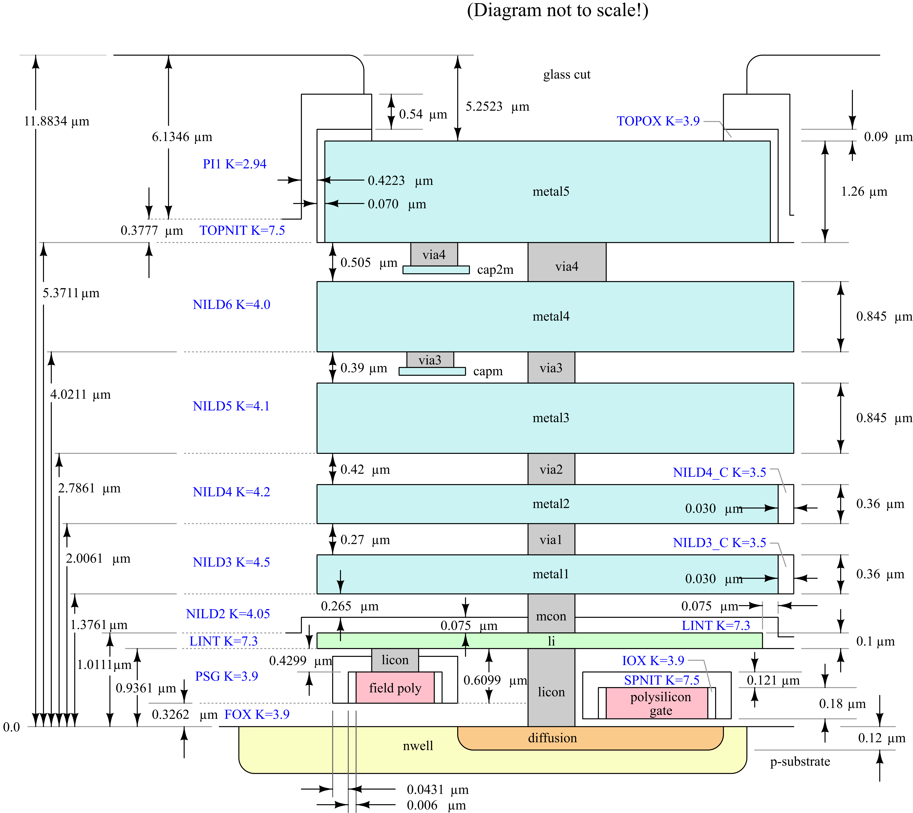
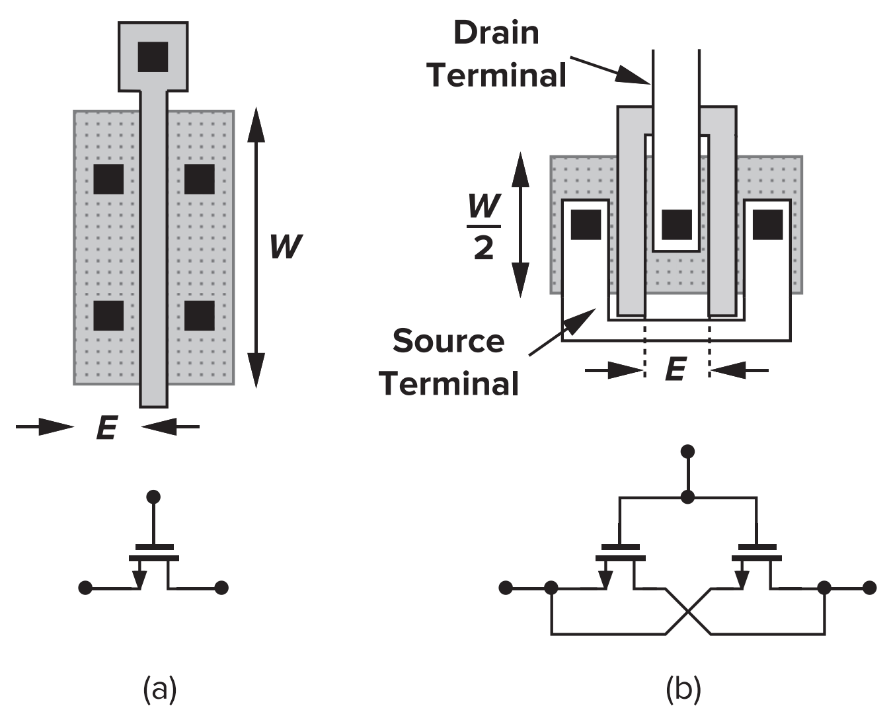
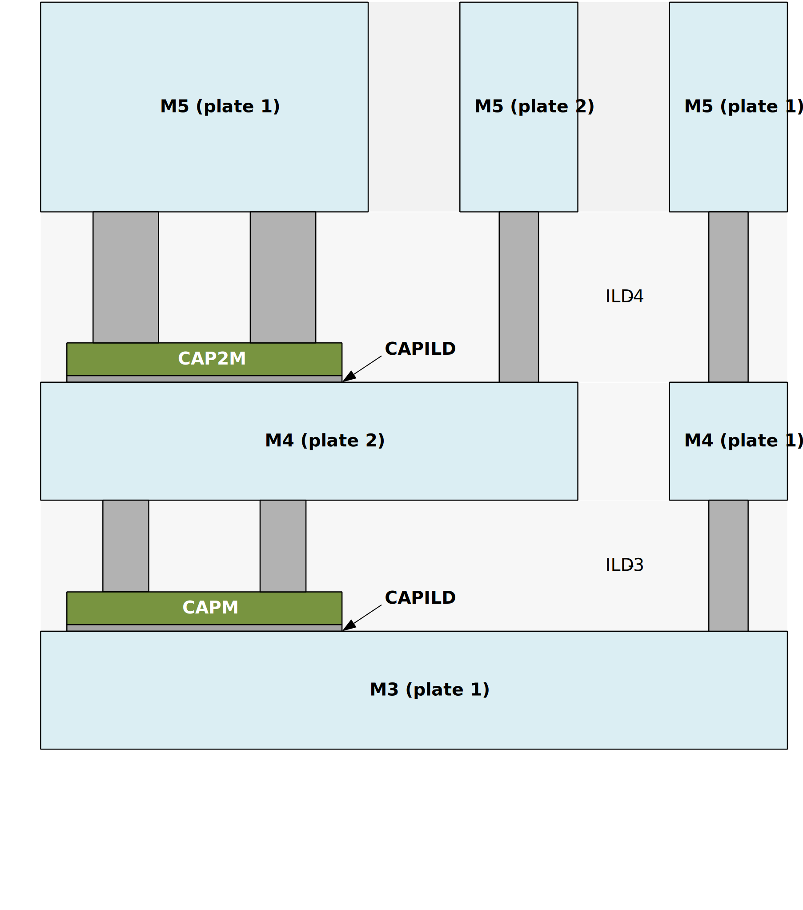

# Struttura del PDK SKY130A

**Tempo stimato:** 25 minuti  
**Cartella di riferimento:** `$PDK_ROOT/$PDK/`

---

## Obiettivo

Prima di usare un componente del PDK — un transistor, una capacità, un resistore — è utile capire dove si trova, come si chiama e cosa contiene il file che lo descrive. Questo documento ti dà una mappa del PDK SKY130A e ti fa esplorare direttamente le librerie dal terminale del container.

---

## 1. Cos'è un PDK

Un **Process Design Kit (PDK)** è il pacchetto di file che un foundry mette a disposizione dei progettisti per descrivere il proprio processo di fabbricazione. Contiene tutto ciò che serve per passare da un'idea circuitale a una geometria di layout pronta per la produzione:



| Componente del PDK | Contenuto | Usato da |
|-------------------|-----------|----------|
| Modelli SPICE | Equazioni e parametri dei dispositivi (BSIM4, ecc.) | ngspice |
| Regole DRC | Vincoli geometrici minimi e massimi del layout | Magic VLSI, KLayout |
| Regole LVS | Come confrontare layout e schematico | Netgen |
| Librerie di simboli | Simboli xschem dei dispositivi primitivi | xschem |
| Celle standard | Libreria di gate digitali pronti (inverter, NAND, flip-flop, ...) | LibreLane |
| File GDS/LEF | Geometrie di layout delle celle | KLayout, LibreLane |
| File Liberty | Timing e potenza delle celle standard per la sintesi | LibreLane |

SKY130A è il PDK del processo SkyWater a 130 nm. È il primo PDK analogico/digitale completamente open-source: nessun NDA, tutte le regole e i modelli sono pubblici. Nel container IIC-OSIC-TOOLS è accessibile tramite le variabili d'ambiente `$PDK_ROOT` (percorso base) e `$PDK` (nome del PDK, es. `sky130A`). Il path completo è `$PDK_ROOT/$PDK/`.

---

## 2. Mappa delle cartelle

```
$PDK_ROOT/$PDK/
├── libs.ref/                  ← librerie di riferimento (dispositivi, celle)
│   ├── sky130_fd_pr/          ← primitivi analogici (transistor, MiM, resistori, ...)
│   ├── sky130_fd_sc_hd/       ← celle standard digitali (high-density)
│   ├── sky130_fd_sc_lp/       ← celle standard low-power
│   ├── sky130_fd_sc_hvl/      ← celle standard high-voltage
│   └── sky130_fd_io/          ← pad I/O
│
└── libs.tech/                 ← configurazione per i tool EDA
    ├── ngspice/               ← sky130.lib.spice, modelli corner
    ├── xschem/                ← simboli .sym, xschemrc, esempi
    ├── magic/                 ← regole DRC (.tech), script
    ├── netgen/                ← regole LVS
    └── klayout/               ← layer properties, DRC scripts
```

Ogni libreria in `libs.ref/` è organizzata internamente in sottocartelle per tipo di file:

```
sky130_fd_pr/
├── spice/     ← modelli SPICE (.spice) → usati da ngspice
├── gds/       ← layout (.gds) → usato da Magic, KLayout
├── lef/       ← descrizione astratta per place & route
└── cdl/       ← netlist in formato CDL per LVS
```

---

## 3. Convenzione di naming

Tutti i componenti SKY130A seguono uno schema di naming strutturato:

```
sky130_fd_pr__nfet_01v8
│      │   │  │    │
│      │   │  │    └── variante: tensione (01v8 = 1.8V), opzioni (lvt, hvt, ...)
│      │   │  └─────── nome del dispositivo
│      │   └────────── dominio: pr = primitive, sc = standard cell, io = I/O pad
│      └────────────── autore: fd = foundry (SkyWater), ef = efabless, ...
└───────────────────── fonderia: sky130
```

Il **doppio underscore** `__` separa il prefisso `sky130_fd_pr` dal nome del dispositivo — è una convenzione di naming del PDK, non un errore tipografico.

Esempi che hai già visto nel Modulo 1:

| Nome completo | Dispositivo |
|--------------|-------------|
| `sky130_fd_pr__nfet_01v8` | NMOS 1.8V (tensione nominale) |
| `sky130_fd_pr__pfet_01v8` | PMOS 1.8V |
| `sky130_fd_pr__nfet_01v8_lvt` | NMOS 1.8V low-threshold |

Esempi che useremo nel Modulo 2:

| Nome completo | Dispositivo |
|--------------|-------------|
| `sky130_fd_pr__cap_mim_m3_1` | Capacità MiM (Metal-Insulator-Metal) su Metal3 |
| `sky130_fd_pr__res_xhrpoly_0p35` | Resistore poly ad alta resistenza, W=0.35µm |

---

## 4. I transistor SKY130A: `nf`, `mult` e la geometria a finger

📖 **Documentazione ufficiale:** [skywater-pdk.readthedocs.io — MOSFETs](https://skywater-pdk.readthedocs.io/en/main/rules/device-details.html#mosfets)

> 💡 **Esempio interattivo:** l'esempio `test_nmos` in `top.sch` (tasto `E` sul blocco corrispondente) esegue uno sweep DC delle curve I-V su tutte le varianti di NMOS del PDK — da `nfet_01v8` a `nfet_g5v0d16v0` — consentendo di confrontare visivamente il comportamento a diverse tensioni di alimentazione. L'analogo `test_pmos` fa lo stesso per i PMOS.

Quando in Lab01 hai istanziato un transistor in xschem, hai impostato i parametri `W`, `L` e probabilmente hai lasciato `nf=1` e `mult=1` ai valori di default. È il momento di capire cosa significano questi due parametri e perché sono importanti nel design analogico.

### 4.1 Il parametro `nf` — numero di finger

Un transistor MOSFET di larghezza $W$ può essere realizzato fisicamente in due modi:



Con `nf=2`, il transistor viene diviso in due metà da $W/2$ ciascuna, con le regioni di source e drain condivise (interdigitate). La larghezza totale rimane $W$, ma la struttura fisica è compatta e — soprattutto — la **resistenza di gate si riduce drasticamente**.

**Perché la resistenza di gate è importante?**

Il gate in poly-silicio è un conduttore resistivo. Per un transistor con un solo finger di larghezza $W$, la resistenza di gate è:

$$R_G \approx R_{sh} \cdot \frac{W}{L}$$

dove $R_{sh}$ è la resistenza di foglio del poly (tipicamente 30–50 Ω/□ in SKY130A). Con $N$ finger, ogni finger ha larghezza $W/N$ e resistenza $R_{sh}/(3) \cdot (W/N)/L$. Poiché i finger sono in parallelo:

$$R_{G,tot} = \frac{R_{sh}}{N} \cdot \frac{W/N}{L} = \frac{R_{sh}}{N^2} \cdot \frac{W}{L} $$

La resistenza di gate si riduce di un fattore $N^2$ con il numero di finger. Per un transistor largo con un solo finger, $R_G$ può essere dell'ordine di centinaia di ohm e introdurre rumore termico significativo — in applicazioni RF e a basso rumore si richiede tipicamente $R_G < (1/5) \cdot (1/g_m)$.

> 💡 **Regola pratica:** per un transistor con larghezza totale $W$, usa tanti finger quanti ne servono a mantenere la larghezza di ogni finger sotto 1–2 µm. Ad esempio, se $W = 6\ \mu\text{m}$, usa `nf=4` (finger da 1.5 µm) oppure `nf=6` (finger da 1 µm).

**Trade-off: finger e capacità parassite di drain**

Aumentare il numero di finger riduce $R_G$ ma ha un effetto non monotono sulla capacità parassita di drain. La capacità totale ha due contributi:

$$C_{drain} = C_j \cdot A_{drain} + C_{jsw} \cdot P_{drain}$$

dove $C_j$ è la capacità per unità di area e $C_{jsw}$ quella per unità di perimetro (bordi laterali della giunzione), ed $E \approx 0.29\ \mu\text{m}$ in SKY130A è la lunghezza della regione di source/drain (fissata dal DRC). I due termini si comportano in modo opposto all'aumentare di $N$ a parità di $W$ totale:

- **Termine d'area** $A_{drain}$: diminuisce con più finger, perché le regioni di drain adiacenti vengono condivise tra finger contigui. Il guadagno massimo è un fattore ~2 (asintoto per $N \to \infty$).
- **Termine di perimetro** $P_{drain}$: aumenta con più finger, perché ogni finger aggiunto introduce nuovi bordi laterali di lunghezza $E$.

Il risultato netto dipende da quale termine domina nel layout specifico. Per finger stretti ($W/N \ll E$) il perimetro domina e aggiungere finger **aumenta** la capacità di drain. In SKY130A conviene non scendere sotto $W/N \approx 0.5\ \mu\text{m}$ per finger per evitare che il perimetro degradi le prestazioni.

> ⚠️ Per i transistor switch del CDAC (Modulo 5), la capacità parassita di drain si somma direttamente alla capacità delle bottom plate e degrada il settling durante la commutazione. La scelta di $W$ e $N$ per gli switch dovrà tenere conto di questo trade-off.

In xschem, il parametro `nf` appare nella finestra di proprietà del transistor e modifica le espressioni automatiche per `ad`, `as`, `pd`, `ps` (aree e perimetri di drain/source):

```spice
* Netlist generata da xschem con nf=2, W=4, L=0.15:
XMN1 d g s b sky130_fd_pr__nfet_01v8 L=0.15 W=4 nf=2
+ ad='int((nf+1)/2) * W/nf * 0.29'
+ as='int((nf+2)/2) * W/nf * 0.29'
+ pd='2*int((nf+1)/2) * (W/nf + 0.29)'
+ ps='2*int((nf+2)/2) * (W/nf + 0.29)'
```

Queste espressioni parametriche calcolano automaticamente le aree e i perimetri in funzione di `nf` e `W` — non modificarle manualmente.

### 4.2 Il parametro `mult` — molteplicità

Il parametro `mult` (o `m` nella netlist SPICE) è un moltiplicatore SPICE che istanzia $M$ copie identiche del transistor in parallelo senza modificare la geometria del singolo dispositivo:

```spice
* mult=4: equivalente a 4 transistor identici in parallelo
XMN1 d g s b sky130_fd_pr__nfet_01v8 L=0.15 W=1 nf=1 mult=4
```

**Differenza fondamentale tra `nf` e `mult`:**

| | `nf` | `mult` |
|--|------|--------|
| Modifica la geometria fisica | ✅ Sì | ❌ No |
| Riduce $R_G$ | ✅ Sì (∝ $1/N^2$) | ❌ No |
| Scala correnti e capacità | ✅ Sì | ✅ Sì |
| Comportamento in Monte Carlo | dipende dal PDK | dipende dal PDK |

**`mult` e le simulazioni Monte Carlo**

`mult=M` applica il mismatch campionando i parametri statistici **una sola volta** sulla geometria base del subcircuito, poi scala elettricamente il risultato. Usare $M$ istanze separate campiona invece **$M$ variazioni indipendenti**, una per ciascun device fisico.

I due approcci non sono equivalenti in Monte Carlo, e la scelta dipende da cosa si vuole modellare:

- **`mult=M` è appropriato** quando il transistor rappresenta un singolo device fisico scalato elettricamente — ad esempio nei mirror di corrente con rapporto intero, dove si vuole la dispersione del device base
- **$M$ istanze separate sono appropriate** quando il circuito contiene $M$ transistor fisicamente distinti con variazioni indipendenti — ad esempio una coppia differenziale, un array di switch in un CDAC, o i transistor del latch nel comparatore Strong-ARM

> 💡 Il PDK SKY130A include un esempio dedicato a questo confronto: lo schematico `sky130_mismatch`, accessibile dalla pagina iniziale di xschem (tasto `E` sul blocco corrispondente in `top.sch`). Vale la pena esplorarlo per osservare direttamente la differenza tra i due approcci sul comportamento statistico del VGS.

**Quando usare `mult`:**
- Mirror di corrente con rapporto intero: se vuoi $I_{out} = 4 \cdot I_{ref}$, metti `mult=4` sul transistor di uscita con la stessa geometria del transistor di riferimento
- Riduzione del numero di componenti nello schematico mantenendo la simmetria
- **Layout common-centroid:** per una coppia differenziale con buon matching, in layout si dispongono le unità dei due transistor in un pattern interdigitato (ad esempio ABBA o ABABABAB) per compensare i gradienti di processo. Per ottenere questo in Magic a partire dallo schematico xschem, ogni transistor della coppia va istanziato con `mult=M` (dove $M$ è il numero di unità in cui lo si vuole suddividere). Netgen-LVS riconoscerà le $M$ istanze fisiche nel layout come equivalenti al transistor con `mult=M` nello schematico.

**Collegamento con il matching (Pelgrom):**  
Ricorda la legge di Pelgrom per i transistor (Lab02):

$$\sigma_{V_{th}} = \frac{A_{VT}}{\sqrt{W \cdot L}}$$

Un transistor con `nf=4` e $W=4\ \mu\text{m}$ ha la stessa $\sigma_{V_{th}}$ di un transistor con `nf=1` e $W=4\ \mu\text{m}$: è il prodotto $W \cdot L$ che conta, non come viene suddivisa la larghezza. I finger migliorano le prestazioni RF, non il matching.

---

## 5. Le capacità MiM: `cap_mim_m3_1`

📖 **Documentazione ufficiale:** [skywater-pdk.readthedocs.io — MiM Capacitors](https://skywater-pdk.readthedocs.io/en/main/rules/device-details.html#mim-capacitors)

> 💡 **Esempio interattivo:** l'esempio `test_mim_cap` in `top.sch` confronta una `cap_mim_m3_2` (W=10, L=10, MF=2, m=2) con una capacità ideale da 0.41 pF, entrambe caricate con un impulso di corrente da 100 nA per 10 ns. Il rapporto tra la variazione di tensione sulle due capacità rivela direttamente la densità di capacità per unità di area del componente MiM reale. La bottom plate è polarizzata a −2 V rispetto alla top plate per testare il device nelle condizioni più severe di tensione.

### 5.1 Struttura fisica

La capacità **MiM (Metal-Insulator-Metal)** in SKY130A è costruita utilizzando uno strato dielettrico sottile depositato sopra Metal3, seguito da un sottile strato conduttore superiore (lo strato CAPM — CAPacitor Metal). La struttura è:



> 💡 Il modello SPICE `cap_mim_m3_1` è un **subcircuit**, non un semplice componente C: include la resistenza di contatto parassita e la capacità parassita dalla bottom plate verso il substrato. Questo è il motivo per cui nei grafici di ngspice vedrai nodi interni aggiuntivi.

Il terminale **c0** corrisponde alla **bottom plate** (Metal3), il terminale **c1** alla **top plate** (CAPM, raggiunta attraverso via3 da Metal4).

> 💡 **Posizione nel simbolo xschem:** `c0` (bottom plate, Metal3) appare in **alto** nel simbolo; `c1` (top plate, CAPM) appare in **basso**. La posizione nel simbolo è una convenzione grafica — non corrisponde alla posizione fisica nel processo. In xschem la combinazione `Shift + F` specchia il simbolo verticalmente per orientarlo come preferisci nel canvas.

> ⚠️ In un CDAC analogico la polarità delle plate è rilevante per la capacità parassita: la bottom plate (Metal3, terminale `c0`) ha una capacità parassita verso il substrato maggiore della top plate (CAPM, terminale `c1`). Per minimizzare l'impatto dei parassiti sul nodo analogico sensibile `VOUTP`, si collega **`c1` a VOUTP**. Poiché `c1` appare in basso nel simbolo xschem, può essere necessario specchiare il simbolo verticalmente (`Shift + F`) per avere `c1` orientato verso il bus orizzontale di VOUTP.

### 5.2 Parametri in xschem

La capacità MiM si istanzia in xschem con tre parametri geometrici:

| Parametro | Significato | Unità | Note |
|-----------|-------------|-------|------|
| `w` | Larghezza della capacità | µm | Valore minimo imposto dal DRC |
| `l` | Lunghezza della capacità | µm | Valore minimo imposto dal DRC |
| `MF` | Molteplicità — numero di istanze in parallelo | — | **Unico parametro di molteplicità in xschem.** Nella netlist generata appaiono sia `MF=N` che `m=N` con lo stesso valore — xschem li sincronizza automaticamente |

La capacità totale è:

$$C_{tot} = C_{area} \cdot w \cdot l \cdot \text{MF}$$

dove $C_{area}$ è la densità di capacità per unità di area — un parametro del processo che leggerai direttamente dal file SPICE nel prossimo esercizio.

> 💡 A differenza dei transistor, la MiM cap non ha un parametro `nf`: la geometria è un rettangolo singolo. Per ottenere capacità maggiori si usa `MF` (più istanze in parallelo) oppure si aumentano `w` e `l`.

### 5.3 Variante `cap_mim_m3_2`

SKY130A offre anche `cap_mim_m3_2`, che utilizza un secondo strato CAPM per realizzare una capacità MiM sul Metal4, ed è possibile impilare due capacità MiM nella stessa area verticale (dual-layer MiM). La densità di capacità per unità di area resta la stessa rispetto a `cap_mim_m3_1`: dall'esempio `test_mim_cap` si misura una densità di circa **1.93 fF/µm²** per `cap_mim_m3_2` — valore che verificherai direttamente leggendo il file SPICE nella sezione 7.2. Il routing sopra la struttura dual-layer non è disponibile. Per il CDAC del corso usiamo `cap_mim_m3_1` — più semplice e sufficiente per le specifiche di progetto.

### 5.4 Le capacità VPP (Vertical Parallel Plate)

SKY130A include anche una famiglia di capacità VPP (dette anche MOM — Metal-Oxide-Metal o "fringe capacitors"), realizzate sfruttando la capacità **laterale** tra dita di metallo interdigitate su layer adiacenti, invece della capacità verticale tra plate sovrapposte come nelle MiM.

```
M1:  ──A──  ──B──  ──A──  ──B──
M2:  ──B──  ──A──  ──B──  ──A──
M3:  ──A──  ──B──  ──A──  ──B──
         ↕ fringe cap laterale ↕
```

A differenza delle MiM, le VPP sono **dispositivi a geometria fissa**: non hanno parametri `w` e `l` — esistono solo nei modelli predefiniti dal PDK, ciascuno con dimensioni e combinazione di layer specifici. Il nome ne descrive la struttura, ad esempio:

```
cap_vpp_11p5x11p7_l1m1m2m3m4_shieldm5
           │            │           │
           │            │           └── Metal5 come schermo superiore
           │            └────────────── layer usati: LI + M1 + M2 + M3 + M4
           └─────────────────────────── dimensioni: 11.5 × 11.7 µm (fisse)
```

Per ottenere valori maggiori si usano più istanze in parallelo con `m=N`.

Il confronto con le MiM chiarisce quando conviene usare le une o le altre:

| | MiM `cap_mim_m3_1` | VPP `cap_vpp_*` |
|--|--|--|
| Densità | ~2 fF/µm² | ~0.1–0.3 fF/µm² |
| Geometria | parametrica (W, L liberi) | fissa (solo modelli predefiniti) |
| Linearità in tensione | buona | **eccellente** (quasi zero) |
| Flessibilità di routing | buona | limitata dallo shield |

Per il CDAC del corso usiamo le MiM: densità maggiore e geometria parametrica sono essenziali per dimensionare l'array con precisione. Le VPP trovano impiego in condensatori di compensazione e decoupling locali, dove la linearità in tensione è prioritaria rispetto alla densità.

📖 **Documentazione ufficiale:** [skywater-pdk.readthedocs.io — VPP Capacitors](https://skywater-pdk.readthedocs.io/en/main/rules/device-details.html#vpp-capacitors)

---

## 6. I resistori di SKY130A

SKY130A offre molte tipologie di resistori — più di quanto ci si aspetterebbe. Capire perché è utile anche se non li usi subito, perché la scelta del tipo sbagliato in un progetto analogico può compromettere la precisione del circuito.

📖 **Documentazione ufficiale:** [skywater-pdk.readthedocs.io — Resistors](https://skywater-pdk.readthedocs.io/en/main/rules/device-details.html#resistors)

### 6.1 Perché così tanti tipi?

I resistori differiscono su tre assi principali: **resistenza per quadro** (Ω/□), **coefficiente di temperatura (TCR)** e **rumore**. Un progettista analogico sceglie il tipo in base a questi tre parametri, non solo al valore target.

Le categorie principali in SKY130A sono:

| Tipo | Nome PDK | R/□ tipica | TCR tipico | Uso |
|------|----------|-----------|-----------|-----|
| Poly generico | `res_generic_po` | ~15 Ω/□ | +900 ppm/°C | Solo digitale, non per precision analog |
| N+ diffusione | `res_generic_nd` | ~120 Ω/□ | +1400 ppm/°C | Da evitare in analogico |
| P+ diffusione | `res_generic_pd` | ~200 Ω/□ | +1400 ppm/°C | Da evitare in analogico |
| P-well isolato | `res_iso_pw` | ~1 kΩ/□ | molto alto | Applicazioni speciali |
| Poly alta R | `res_xhrpoly_Xp_YZ` | ~300–2000 Ω/□ | +200–400 ppm/°C | **Resistori di precisione analogici** |

Il suffisso numerico di `res_xhrpoly` indica la **larghezza in µm** del resistore (0p35 = 0.35 µm, 0p69 = 0.69 µm, ecc.). Larghezze diverse consentono di coprire un range di valori molto ampio: un resistore `xhrpoly_0p35` più stretto ha maggiore resistenza per unità di lunghezza ma anche maggiore rumore e spread di processo; uno più largo è più stabile e preciso.

### 6.2 Comportamento in temperatura — dati simulati

L'esempio `test_res` in `top.sch` (accessibile da xschem) simula tutti i tipi di resistori con uno sweep da −40°C a +140°C, applicando una tensione di 1.8 V e misurando la corrente. Ecco i risultati estratti:

| Tipo | R a −40°C | R a 27°C | R a 125°C | TCR |
|------|-----------|----------|-----------|-----|
| `res_generic_po` | 48 Ω | 51 Ω | 56 Ω | +918 ppm/°C |
| `res_generic_nd` (N+ diff.) | 107 Ω | 118 Ω | 135 Ω | +1442 ppm/°C |
| `res_xhrpoly_0p35` | 693 Ω | 705 Ω | 729 Ω | +314 ppm/°C |
| `res_xhrpoly_0p69` | 1.29 kΩ | 1.31 kΩ | 1.35 kΩ | +247 ppm/°C |
| `res_xhrpoly_1p41` | 838 Ω | 851 Ω | 878 Ω | +283 ppm/°C |
| `res_xhrpoly_2p85` | 592 Ω | 603 Ω | 626 Ω | +345 ppm/°C |

Dall'esempio `test_res` si può anche osservare che una configurazione serie-parallelo di segmenti `xhrpoly_0p35` produce un TCR risultante di circa **−86 ppm/°C** — quasi nullo. Questa è una tecnica di compensazione del TCR utilizzata nei circuiti di riferimento di precisione: combinando segmenti con TCR positivo in configurazioni geometriche diverse si può abbattere la dipendenza termica complessiva.

> 💡 **Come esplorare:** in xschem, entra nel blocco `test_res` di `top.sch` con il tasto `E`. Simula e osserva come le curve di resistenza vs temperatura divergono tra i diversi tipi. Confronta visivamente il TCR del poly generico con quello degli `xhrpoly`.

> ⚠️ I resistori a diffusione (`res_generic_nd`, `res_generic_pd`) e il poly generico non sono raccomandati per applicazioni analogiche di precisione: il TCR elevato (+900–1400 ppm/°C) li rende troppo dipendenti dalla temperatura. Usa sempre `res_xhrpoly_*` nei circuiti analogici.

Non utilizziamo i resistori nel Modulo 2, ma li ritroverai nel Modulo 5 per la polarizzazione del comparatore in integrazione mixed-signal.

---

## 7. Esplorazione guidata nel container

I comandi seguenti ti permettono di esplorare direttamente le librerie del PDK dal terminale. Eseguili in sequenza e annota le risposte nelle domande di riflessione.

> 💡 Tutti i comandi usano le variabili d'ambiente `$PDK_ROOT` e `$PDK` invece di path assoluti — così funzionano indipendentemente da come il PDK è installato nel container. Verifica che siano attive con `echo $PDK_ROOT` e `echo $PDK` (atteso: `sky130A`).

### 7.1 Mappa delle librerie

```bash
# Verifica le variabili d'ambiente
echo $PDK_ROOT   # percorso base del PDK
echo $PDK        # nome del PDK (sky130A)

# Elenca tutte le librerie disponibili in libs.ref
ls $PDK_ROOT/$PDK/libs.ref/

# Entra nella libreria dei primitivi analogici
ls $PDK_ROOT/$PDK/libs.ref/sky130_fd_pr/

# Elenca i file SPICE disponibili
ls $PDK_ROOT/$PDK/libs.ref/sky130_fd_pr/spice/ | head -30
```

### 7.2 Il modello SPICE della capacità MiM

```bash
# Visualizza le prime 80 righe del file del subcircuito MiM
head -80 $PDK_ROOT/$PDK/libs.ref/sky130_fd_pr/spice/sky130_fd_pr__cap_mim_m3_1.model.spice
```

> ⚠️ Il file si chiama `cap_mim_m3_1.model.spice` (con `.model.` nel nome), non `cap_mim_m3_1.spice`. Se il comando non trova il file, usa `find` per localizzarlo:
> ```bash
> find $PDK_ROOT -name "*cap_mim_m3_1*" 2>/dev/null
> ```

Nel file troverai il subcircuito con questa struttura:

```spice
.subckt sky130_fd_pr__cap_mim_m3_1 c0 c1 w=1 l=1 mf=1
.param carea = 'camimc*(wc)*(lc)'
.param cperim = 'cpmimc*((wc)+(lc))*2'
.param czero = 'carea + cperim + ...'
```

La capacità totale è `czero = carea + cperim`, dove:
- `carea = camimc × wc × lc` — contributo d'area (dominante per capacità grandi)
- `cperim = cpmimc × 2(wc + lc)` — contributo di perimetro (bordi della giunzione)

Il parametro `camimc` (capacità per unità di area) è definito nei file dei corner del PDK, non nel subcircuito. Per ricavare $C_{area}$ sperimentalmente, usa l'esempio `test_mim_cap` accessibile da `top.sch` (tasto `E` sul blocco corrispondente): esegue una misura transitoria su una capacità MiM con dimensioni note e permette di calcolare:

$$C_{area} = \frac{C_{misurata}}{W \times L}$$

Annota il valore ottenuto: lo userai nel dimensionamento di $C_u$ nel `lab_cdac.md`.

> 💡 Il contributo di perimetro `cperim` è presente nel modello ma per capacità con W=L≥5µm è dell'ordine del 2–4% della capacità totale — trascurabile ai fini del dimensionamento.

### 7.3 Il simbolo xschem della MiM cap

```bash
# Trova il simbolo xschem della MiM cap
ls $PDK_ROOT/$PDK/libs.tech/xschem/sky130_fd_pr/ | grep mim
```

> 💡 Il file `.sym` è il simbolo xschem del componente. Puoi aprirlo con `xschem <nome>.sym` per vedere come è definito graficamente — ma non modificarlo, è un file del PDK di sola lettura.

### 7.4 Il modello SPICE di un transistor NMOS

```bash
# Confronta la struttura del modello NMOS con quella della MiM cap
head -40 $PDK_ROOT/$PDK/libs.ref/sky130_fd_pr/spice/sky130_fd_pr__nfet_01v8.model.spice
```

Osserva come il subcircuito dichiara i parametri `l`, `w`, `nf`, `mult` nell'intestazione (`.subckt`). Nota che `nf` appare prima delle espressioni che lo usano — questa è una caratteristica importante del parsing di ngspice (se `nf` venisse dopo, le espressioni per `ad`, `as`, ecc. non potrebbero valutarlo).

---

## 8. Domande di riflessione

Completa le seguenti domande leggendo i file SPICE esplorati nella sezione precedente.

**8.1** Qual è la densità di capacità per unità di area di `cap_mim_m3_1`?

$$C_{area} = \texttt{?}\ \text{fF/µm}^2$$

**8.2** Considerando il comparatore Strong-ARM dimensionato in Lab02, il transistor MN1 ha $W = \texttt{?}\ \mu\text{m}$ e `nf=1`. Con quanti finger la resistenza di gate si ridurrebbe di un fattore 4? Di un fattore 16?

$$N \text{ per riduzione} \times 4: \texttt{?} \qquad N \text{ per riduzione} \times 16: \texttt{?}$$


**8.3** Perché nel CDAC differenziale è preferibile collegare la **top plate** (terminale c1) al nodo di sommazione (top plate dell'array) e non al nodo commutato (bottom plate)?

*(Suggerimento: pensa alla capacità parassita verso il substrato delle due plate.)*

---

## Riepilogo

| Concetto | Elemento chiave |
|----------|----------------|
| PDK SKY130A | `$PDK_ROOT/$PDK/` — `libs.ref/` + `libs.tech/` |
| Naming | `sky130_[autore]_[dominio]__[nome]_[variante]` |
| Transistor NMOS/PMOS | `nfet_01v8` / `pfet_01v8` — parametri `w`, `l`, `nf`, `mult` |
| `nf` (finger) | Divide W in N finger → $R_G \propto 1/N^2$, utile per RF e basso rumore |
| `mult` | Replica SPICE in parallelo → scala correnti/cap, non modifica geometria |
| MiM cap | `cap_mim_m3_1` — parametri `w`, `l`, `mults` — densità ≈ da leggere dal PDK |
| Resistori | `res_xhrpoly_*` per precision analog (TCR +200–400 ppm/°C); evitare `res_generic_*` in analogico |

---

## Prossimo passo

Continua con [`standard_cells.md`](./standard_cells.md) — le celle standard `sky130_fd_sc_hd`.
