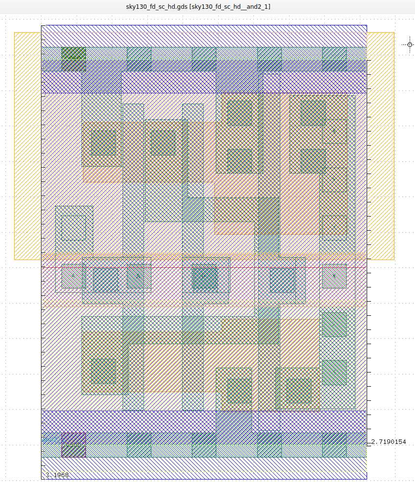
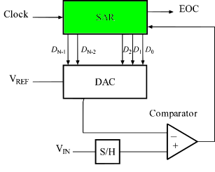

# Celle standard SKY130A — `sky130_fd_sc_hd`

**Tempo stimato:** 15 minuti  
**Cartella di riferimento:** `/foss/pdks/sky130A/libs.ref/sky130_fd_sc_hd/`

---

## Obiettivo

Le celle standard sono i mattoni fondamentali del design digitale integrato. Questo documento le introduce con il giusto livello di dettaglio per il punto in cui siamo nel corso: abbastanza per capire cosa contiene il PDK oltre ai primitivi analogici, e abbastanza per prepararsi al Modulo 4, dove useremo queste celle per sintetizzare il controller SAR digitale con LibreLane.

📖 **Documentazione ufficiale:** [skywater-pdk.readthedocs.io — Standard Cells](https://skywater-pdk.readthedocs.io/en/main/contents/libraries/foundry-provided.html)

---

## 1. Cos'è una standard cell library

Una **standard cell library** è una raccolta di gate digitali pre-progettati e pre-verificati, pronti per essere assemblati automaticamente dagli strumenti di sintesi. Ogni cella implementa una funzione logica elementare — un inverter, un NAND, un flip-flop — ed è disponibile in diverse versioni con diversa forza di pilotaggio (drive strength).

Quello che rende le celle "standard" è il rispetto di un insieme di vincoli geometrici rigidi che permettono ai tool di place & route di posizionarle automaticamente a formare un chip funzionante:



- **Altezza fissa:** tutte le celle `sky130_fd_sc_hd` hanno altezza 2.72 µm
- **Pin VDD/VSS** sempre sullo stesso layer (metal1) e alla stessa posizione verticale — questo permette di allineare le celle in righe senza routing aggiuntivo per l'alimentazione
- **Pin di segnale** su metal1, con posizione orizzontale variabile
- **Nessun vincolo sulla larghezza** — ogni cella è larga quanto serve per implementare la funzione

In SKY130A esistono più famiglie di celle standard, ciascuna con un diverso compromesso tra velocità, consumo e area:

| Libreria | Sigla | Caratteristica |
|----------|-------|----------------|
| `sky130_fd_sc_hd` | High Density | **Quella che usiamo** — bilanciata, la più comune |
| `sky130_fd_sc_lp` | Low Power | Ottimizzata per consumo |
| `sky130_fd_sc_hvl` | High Voltage | Celle per logica a 5V |
| `sky130_fd_sc_hs` | High Speed | Ottimizzata per velocità |

---

## 2. Naming delle celle `hd`

Il naming segue uno schema coerente:

```
sky130_fd_sc_hd__inv_1
│      │   │   │  │  │
│      │   │   │  │  └── drive strength (1x, 2x, 4x, ...)
│      │   │   │  └───── nome della funzione logica
│      │   │   └──────── famiglia: hd = high density
│      │   └──────────── dominio: sc = standard cell
│      └──────────────── autore: fd = foundry
└─────────────────────── fonderia: sky130
```

Il **drive strength** indica la capacità di pilotaggio della cella: una `inv_2` pilota il doppio della corrente rispetto a una `inv_1`, a parità di funzione logica. I tool di sintesi scelgono automaticamente la drive strength appropriata in funzione del fan-out e dei vincoli di timing.

Esempi di celle disponibili:

| Nome cella | Funzione | Note |
|-----------|----------|------|
| `sky130_fd_sc_hd__inv_1` | Inverter | Cella base, drive 1x |
| `sky130_fd_sc_hd__nand2_1` | NAND a 2 ingressi | Universale — anche NOT, AND, OR |
| `sky130_fd_sc_hd__nor2_1` | NOR a 2 ingressi | |
| `sky130_fd_sc_hd__xor2_1` | XOR a 2 ingressi | Usato nel controller SAR |
| `sky130_fd_sc_hd__dfrtp_1` | Flip-flop D con reset | Registro di approssimazione SAR |
| `sky130_fd_sc_hd__mux2_1` | Multiplexer 2:1 | |
| `sky130_fd_sc_hd__fill_1` | Filler cell | Non ha funzione logica — riempie le righe |
| `sky130_fd_sc_hd__tapvpwrvgnd_1` | Tap cell | Connette il substrato a VDD/GND |

---

## 3. Cosa contiene la libreria nel PDK

Ogni cella è descritta in più formati, ciascuno usato da un tool diverso:

```
/foss/pdks/sky130A/libs.ref/sky130_fd_sc_hd/
├── spice/          ← modelli SPICE → usati da ngspice per simulare
├── gds/            ← layout fisico → usato da KLayout e Magic
├── lef/            ← geometria astratta → usata da LibreLane per place & route
├── lib/            ← timing e potenza (Liberty) → usata da Yosys/OpenROAD per sintesi
├── verilog/        ← modello funzionale → usato per simulazione RTL
└── cdl/            ← netlist CDL → usata da Netgen per LVS
```

Nel Modulo 4 LibreLane userà automaticamente tutti questi file per tradurre il tuo codice VHDL in layout fisico pronto per la produzione. Per ora ci interessa capire la struttura e saper leggere i file SPICE e GDS.

---

## 4. Esplorazione con KLayout — visualizzare il layout delle celle

Il GDS della libreria `hd` contiene il layout fisico di tutte le celle. Con KLayout puoi visualizzarle e capire come sono costruite internamente.

```bash
# Apri il GDS di tutte le celle standard hd in KLayout
klayout /foss/pdks/sky130A/libs.ref/sky130_fd_sc_hd/gds/sky130_fd_sc_hd.gds &
```

KLayout apre il file con tutte le celle nella gerarchia a sinistra. Per visualizzare una singola cella: nel pannello a sinistra scorro l'elenco, seleziono la cella desiderata (ad esempio `sky130_fd_sc_hd__inv_1`), tasto destro → **"Show as new top"**.

> 💡 Il LibreLane Summary tool (`summary.py`) che abbiamo installato nel Modulo 0 è progettato per ispezionare i risultati di un flusso RTL→GDS completo — lo useremo estensivamente nel Modulo 4. Per aprire GDS arbitrari come quello della libreria standard, si usa direttamente `klayout`.

> 💡 I colori dei layer in KLayout corrispondono agli strati fisici del processo: verde = diffusione attiva, rosso = poly (gate), blu = metal1, ecc. Questo è il modo in cui il foundry "vede" il chip — ogni colore è uno strato della fotolitografia.

**Cosa osservare nell'inverter `inv_1`:**

Una volta visualizzata la cella, prova a identificare:
- Le due regioni di diffusione (NMOS in basso, PMOS in alto)
- Il gate in poly che attraversa entrambe le diffusioni
- I pin di ingresso (A) e uscita (Y) su metal1
- Le strisce di VDD e VSS ai bordi superiore e inferiore

> 💡 Confronta quello che vedi con l'inverter CMOS che hai disegnato in Lab01. È lo stesso circuito — due transistor, gate condiviso — ma qui il layout rispetta vincoli geometrici precisi che permettono l'assemblaggio automatico.

**Domanda di riflessione:**

Quanti transistor vedi nell'inverter `inv_1`? Qual è il rapporto $W_P/W_N$ approssimativo tra PMOS e NMOS? Come si confronta con l'inverter che hai disegnato manualmente in Lab01?

$$W_P/W_N \approx \texttt{?}$$

---

## 5. Esplorazione con `grep` — il file SPICE delle celle

Il file SPICE della libreria contiene le netlist di tutte le celle. Puoi cercarne una specifica con `grep`:

```bash
# Quante celle contiene la libreria?
grep "^.subckt" \
  /foss/pdks/sky130A/libs.ref/sky130_fd_sc_hd/spice/sky130_fd_sc_hd.spice \
  | wc -l

# Trova la netlist dell'inverter
grep -A 20 "^.subckt sky130_fd_sc_hd__inv_1 " \
  /foss/pdks/sky130A/libs.ref/sky130_fd_sc_hd/spice/sky130_fd_sc_hd.spice

# Trova tutte le celle con "xor" nel nome
grep "^.subckt.*xor" \
  /foss/pdks/sky130A/libs.ref/sky130_fd_sc_hd/spice/sky130_fd_sc_hd.spice
```

Osserva la netlist dell'inverter. Noterai che ogni subcircuito ha sei terminali: `A` (ingresso), `Y` (uscita), `VPWR` (VDD), `VGND` (GND), `VNB` (N-well body) e `VPB` (P-well body). I terminali di substrato (`VNB`, `VPB`) sono necessari perché le celle standard gestiscono internamente il collegamento del bulk dei transistor e devono essere connessi esplicitamente quando si simula una cella isolata.

> ⚠️ Quando si simula una cella standard fuori dal contesto del flow automatico, `VNB` va connesso a `VGND` e `VPB` va connesso a `VPWR` — altrimenti la simulazione produce risultati errati o il simulatore segnala errori di nodo flottante.

> 💡 **Perché W e L hanno valori apparentemente enormi?** Osservando la netlist, vedrai dimensioni come `w=650000u l=150000u`. Non è un errore: il file SPICE delle celle standard è stato generato con un sistema di unità che fa affidamento sull'opzione `.option SCALE=1e-6` attiva nel simulatore. Con questa opzione, ngspice applica un fattore di scala aggiuntivo di $10^{-6}$ a tutte le dimensioni geometriche, quindi `650000u` viene interpretato come $650000 	imes 10^{-6}\ \mu\text{m} = 0.65\ \mu\text{m}$. Questa opzione è già attiva nel container tramite `set skywaterpdk` nel `.spiceinit` — configurato automaticamente dal `.designinit` del Modulo 0 — perciò le simulazioni funzionano correttamente senza intervento manuale.

---

## 6. Collegamento al convertitore SAR

Il **controller SAR digitale** che realizzeremo nel Modulo 4 è composto interamente da celle standard `sky130_fd_sc_hd`. La sua funzione è semplice ma precisa: ricevere il bit di uscita del comparatore (`CMP_OUT`) ad ogni ciclo di clock, aggiornare il registro di approssimazione e generare i segnali di controllo `B[7:0]` per le bottom plate del CDAC.



Le celle standard che il tool di sintesi userà più frequentemente per questo blocco sono: flip-flop D (`dfrtp`) per il registro di approssimazione, XOR (`xor2`) per la logica di decisione, e multiplexer (`mux2`) per la selezione dei bit. Puoi visualizzarne il layout in KLayout già ora, prima ancora di scrivere una riga di VHDL.

---

## Prossimo passo

Passa al lab principale del modulo: [`lab_cdac.md`](./lab_cdac.md) — design e simulazione del CDAC a 8 bit con capacità MiM SKY130A.
