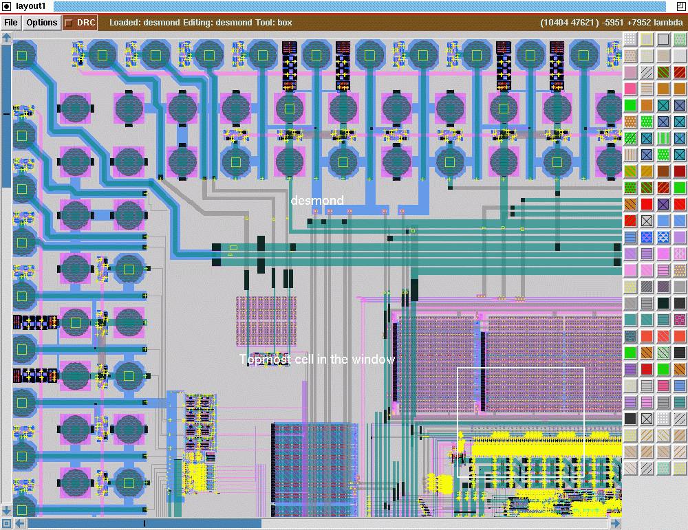

# Modulo 3 — Layout con Magic VLSI, DRC/LVS e PEX

## Obiettivi

Al termine di questo modulo lo studente sarà in grado di:

- Avviare Magic VLSI nel container IIC-OSIC-TOOLS e navigarne l'interfaccia (layer panel, command window Tcl, wiring tool)
- Riconoscere e istanziare le parametric cell (pcell) fondamentali del PDK SKY130A: transistor NMOS/PMOS, resistori polisilicio, capacità MiM
- Importare una netlist SPICE in Magic tramite `readspice` per avviare un layout in modalità schematic-driven
- Disegnare connessioni su layer `li`, `met1`, `met2` con via automatici, gestire guard ring e connessioni di body/well
- Applicare la progettazione gerarchica in Magic: creare celle autonome con pin definiti e assemblarle in un top-level
- Raggiungere DRC clean con il checker integrato di Magic e con il menu **Efabless sky130** di KLayout
- Estrarre la netlist dal layout per LVS (senza parassitici) e per PEX (con resistenze e capacità parassite)
- Confrontare layout e schematico con Netgen, leggere e interpretare il report LVS
- Aggiungere la netlist post-layout in un testbench xschem e confrontare le prestazioni pre/post-layout
- Completare il layout del comparatore Strong-ARM Latch a 11 transistor ottenendo DRC clean e LVS clean

---

## Il layout nel convertitore SAR

Questo modulo trasforma i due blocchi analogici progettati nei moduli precedenti — il comparatore Strong-ARM (Modulo 1) e il CDAC a 8 bit (Modulo 2) — da schematici xschem a geometrie fisiche realizzabili in silicio. Il layout è il ponte tra il mondo della simulazione e il mondo della fabbricazione: ogni scelta geometrica (larghezza dei fili, posizione delle celle, routing dei segnali critici) ha un impatto diretto sulle prestazioni del circuito attraverso i parassitici resistivi e capacitivi.

```
VIN ──► [ CDAC 8 bit + S&H ]──► [ Comparatore Strong-ARM ]──► [ Controller SAR ]
              ▲ Modulo 2              ▲ Modulo 1                   ▲ Modulo 4
              │                       │
              └── Layout Modulo 3 ────┘
                  (DRC clean + LVS clean + PEX)
```

**Specifiche di riferimento:** 8 bit · $V_{DD} = 1.8\ \text{V}$ · $V_{FS,diff} = 256\ \text{mV}$ · 1 LSB = 1 mV · $V_{CM} = 0.9\ \text{V}$ · $f_s = 2\ \text{MS/s}$

---

## Prerequisiti

- Ambiente Docker IIC-OSIC-TOOLS configurato e funzionante → [Modulo 0](../00_setup/)
- Modulo 1 completato: familiarità con xschem e ngspice; schematico e netlist del comparatore Strong-ARM disponibili in `/foss/designs/modulo1/lab03/xschem/`
- Modulo 2 completato: conoscenza della struttura del PDK SKY130A e delle MiM cap; utile ma non strettamente necessario per i Lab 1 e 2

---

## Struttura del modulo

| File | Argomento | Tempo stimato |
|------|-----------|---------------|
| [`lab01_magic_pcell.md`](./lab01_magic_pcell.md) | Introduzione a Magic VLSI — interfaccia, pcell SKY130A, `readspice`, source comune, DRC, KLayout | ~1.5h |
| [`lab02_layout_gerarchico.md`](./lab02_layout_gerarchico.md) | Layout gerarchico — inverter CMOS come cella autonoma, buffer a due stadi, DRC, GDS | ~2.5h |
| [`lab03_lvs_pex.md`](./lab03_lvs_pex.md) | LVS con Netgen, PEX, simulazione post-layout, layout del comparatore Strong-ARM | ~3h |

---

## Convenzione delle cartelle

Ogni lab segue la stessa struttura gerarchica adottata in tutto il corso:

```
/foss/designs/modulo3/labXX/
├── mag/                    ← cartella di lavoro Magic
│   ├── *.mag               ← file di layout Magic
│   ├── *.gds               ← GDS esportati
│   ├── *.spice             ← Netlist esortate per LVS o PEX
│   ├── Makefile            ← esecutore di script (lab03)
│   └── scripts/            ← script Tcl per estrazione batch (lab03)
└── xschem/                 ← cartella schematici (stessa convenzione Modulo 1/2)
    ├── *.sch               ← schematici xschem
    └── simulation/
        └── *.spice         ← netlist generate da xschem (input per readspice e Netgen)
```

Magic viene **sempre avviato dalla cartella `mag/`**: in questo modo il `.magicrc` viene trovato automaticamente, i file `.mag` e `.gds` vengono salvati nella posizione corretta, e i path relativi verso le netlist (`../xschem/simulation/nome.spice`) rimangono coerenti in tutti i lab.

---

## Come lavorare

Ogni lab è diviso in parti numerate con tre elementi ricorrenti:

1. **Teoria e motivazione** — il perché di ogni scelta tecnica, con riferimenti alla letteratura e al PDK
2. **Procedura guidata** — comandi esatti da eseguire in sequenza nella command window Tcl di Magic o da terminale
3. **Domande di riflessione** — valori da misurare sul layout o da calcolare; i risultati attesi sono indicati con `?`

> 💡 Magic ha una curva di apprendimento ripida. La prima ora è la più difficile: l'interfaccia è diversa da qualsiasi altro tool grafico che hai usato. Persevera — dopo aver capito i tre meccanismi fondamentali (box tool, wiring tool, command window Tcl), il flusso diventa rapido ed efficiente.

---

## Avviare l'ambiente

Prima di iniziare, verifica che il container sia in esecuzione e il PDK sia configurato:

```bash
# Verifica variabili d'ambiente
echo $PDK          # atteso: sky130A
echo $PDK_ROOT     # atteso: /foss/pdks
```

---

## Riferimenti utili

- [Magic VLSI — manuale completo](http://opencircuitdesign.com/magic/magic_docs.html)
- [Harald Pretl — Magic cheatsheet SKY130](https://github.com/iic-jku/osic-multitool/blob/main/magic-cheatsheet/magic_cheatsheet.pdf)
- [Efabless — Analog design flow con Magic](http://opencircuitdesign.com/analog_flow/index.html)
- [Netgen — documentazione ufficiale](http://opencircuitdesign.com/netgen/)
- [SKY130A PDK — device details](https://skywater-pdk.readthedocs.io/en/main/rules/device-details.html)
- [SKY130A PDK — design rules](https://skywater-pdk.readthedocs.io/en/main/rules/periphery.html)
- [KLayout — klayout-sky130-inverter (Leo Moser)](https://codeberg.org/mole99/klayout-sky130-inverter)
- [Magic cheatsheet PSEI](../utils/magic_cheatsheet.md) — riferimento completo tasti, mouse, workflow, comandi Tcl, errori comuni
