# Lab 1 — Introduzione a Magic VLSI e pcell SKY130A

**Tempo stimato:** 1.5 ore  
**Cartella di lavoro:** `/foss/designs/modulo3/lab01/mag/`

---

## Obiettivo

In questo lab imparerai a usare Magic VLSI realizzando il layout di un amplificatore a source comune con carico resistivo e capacità di uscita. L'esercizio copre l'intero workflow di base: istanziare le pcell dal menu Devices, fare il floorplan, collegare i componenti con il wiring tool, raggiungere DRC clean ed esportare il GDS.

Al termine saprai:
- Navigare l'interfaccia di Magic: box tool, wiring tool, command window Tcl
- Capire il sistema di layer e coordinate di SKY130A (lambda, grid)
- Esplorare le pcell principali SKY130A dal menu **Devices 1** e **Devices 2**: `nfet_01v8`, `pfet_01v8`, `res_xhigh_po`, `cap_mim_m3_1`
- Modificare i parametri di una pcell con `i` + `q`
- Istanziare le pcell necessarie per il circuito di riferimento e fare il floorplan
- Collegare componenti su `li`, `met1` con via automatici usando il wiring tool
- Aggiungere pin label (port) necessari per il LVS
- Leggere il DRC checker in tempo reale e correggere gli errori più comuni
- Esportare un GDS e aprirlo in KLayout con il menu **Efabless sky130**

---

## Struttura delle cartelle

```bash
mkdir -p /foss/designs/modulo3/lab01/mag
```

La struttura finale del lab:

```
/foss/designs/modulo3/lab01/
└── mag/
    ├── cs_amp.mag       ← layout dell'amplificatore a source comune
    └── cs_amp.gds       ← GDS esportato
```

---

## Teoria: Magic VLSI e le parametric cell

### Magic nel flusso analogico

Magic è il tool di layout di riferimento per il flusso open-source SKY130A. Integra in un unico ambiente il disegno geometrico, il DRC in tempo reale, l'estrazione della netlist per LVS e la PEX. Tutti questi passi avvengono tramite comandi Tcl nella command window, oppure tramite script in batch.

Il file di lavoro nativo di Magic è il formato `.mag`. Per la fabbricazione si esporta in GDS-II tramite il comando `gds write`.

### Il sistema di coordinate: lambda e grid

Magic lavora internamente con una griglia intera (unità: **lambda**). Per SKY130A, **1 lambda = 0.005 µm** (5 nm). Le dimensioni che imposti nelle pcell (W, L in µm) vengono convertite internamente in lambda. La barra di stato in basso mostra sempre le coordinate in entrambe le unità.

### Pcell vs geometria manuale

Una **parametric cell (pcell)** è generata da script Tcl del PDK a partire da parametri come Width, Length, Fingers. Quando modifichi questi parametri, la pcell rigenera automaticamente tutte le geometrie: gate, contatti, guard ring, NWELL. Disegnare un transistor a mano produrrebbe decine di DRC errors — le pcell garantiscono per costruzione il rispetto delle design rule.

### Il layer stack di SKY130A

| Layer Magic | Nome fisico | Uso tipico | Sheet resistance |
|---|---|---|---|
| `poly` (xhigh) | Poly alta resistività | Resistori analogici | 2000 Ω/□ |
| `li` | Local Interconnect | Connessioni corte, source/drain → met1 | 12.2 Ω/□ |
| `met1` | Metal 1 | Routing principale, alimentazione locale | 125 mΩ/□ |
| `met2` | Metal 2 | Routing inter-cella, incroci | 125 mΩ/□ |
| `met3` | Metal 3 | Bottom plate delle MiM cap | 47 mΩ/□ |
| `capm` | Cap Metal | Top plate delle MiM cap | — |

I valori di sheet resistance sono quelli riportati nel menu **Devices 2** di Magic con PDK SKY130A.

I via tra layer adiacenti si chiamano `viali` (li→met1), `via1` (met1→met2), `via2` (met2→met3). Il wiring tool crea i via automaticamente.

---

## Parte 1 — Avvio di Magic

Nel container IIC-OSIC-TOOLS v2025.07, **non è necessario creare un file `.magicrc` locale**. La configurazione globale carica sky130A automaticamente.

> ⚠️ Non creare un `.magicrc` locale: causerebbe l'errore `can't rename to "closewrapperonly": command already exists`.

```bash
cd /foss/designs/modulo3/lab01/mag
magic -d XR &
```

All'avvio vedrai tre elementi principali:

- **Finestra di layout** (grande, al centro): qui disegni le geometrie
- **Pannello layer** (destra): lista dei layer disponibili
- **Command window Tcl** (in basso o separata): qui digiti i comandi

> ⚠️ La command window **non supporta incolla** con `Ctrl+V`. Per i comandi più lunghi usa il tasto `:` nella finestra di layout per saltare direttamente alla command window, oppure scrivi il comando con attenzione.

### Navigazione e comandi di base

Le tabelle seguenti raccolgono i tasti più utili. Per il riferimento completo consulta il cheatsheet del corso:

→ [`utils/magic_cheatsheet.md`](../../utils/magic_cheatsheet.md) — tasti, mouse, workflow, comandi Tcl, errori comuni

Fonte originale: [magic_cheatsheet.pdf di Harald Pretl (JKU)](https://github.com/iic-jku/osic-multitool/blob/main/magic-cheatsheet/magic_cheatsheet.pdf).

**Visualizzazione e navigazione**

| Azione | Tasto |
|--------|-------|
| Zoom in | `z` |
| Zoom out | `Shift + z` |
| Zoom to fit | `v` oppure `f` |
| Zoom sulla box corrente | `Ctrl+Z` |
| Pan | Tasti **freccia** |
| Attiva/disattiva griglia | `g` |
| Mostra solo li | `0` |
| Mostra solo met1 | `!` |
| Mostra solo met2 | `@` |
| Mostra solo met3 | `#` |
| Mostra tutti i layer | `9` |

**Selezione e editing**

| Azione | Tasto |
|--------|-------|
| Seleziona oggetti sotto il cursore | `s` |
| Seleziona istanza sotto il cursore | `i` |
| Seleziona tutto nella box corrente | `a` |
| Deseleziona tutto | `,` |
| Apri pannello parametri pcell | `q` |
| Sposta la selezione al cursore | `m` |
| Copia | `c` |
| Elimina | `d` |
| Ruota 90° | `r` |
| Flip orizzontale | `Ctrl+F` |
| Undo | `u` |

**DRC**

| Azione | Tasto |
|--------|-------|
| Spiega DRC errors nella box | `y` |
| Trova e zooma sul prossimo DRC error | `=` |

**Cambio tool**

| Azione | Tasto |
|--------|-------|
| Cambia tool (box → wiring → ...) | `Spazio` |
| Torna al box tool | `Shift+Spazio` |

> 💡 In Magic il click sinistro e il click destro definiscono i due angoli opposti di una **box di selezione** — non si trascina.

---

## Parte 2 — Tour delle pcell SKY130A

Prima di realizzare un layout vero, dedica 15-20 minuti a esplorare le pcell principali del PDK. Crea una cella temporanea, istanzia le pcell una alla volta, osserva la geometria e modifica i parametri — poi chiudi senza salvare. Questo è il modo più rapido per familiarizzare con i device che userai in tutto il modulo.

### 2.1 Crea la cella esplorativa

**Cell → New...** → digita `pcell_tour` → OK.

> 💡 Non salverai questa cella: è solo per esplorazione. Alla fine usa **File → Flush changes** per annullare le modifiche non salvate, oppure carica direttamente la prossima cella con **Cell → New...**

### 2.2 NMOS: `nfet_01v8`

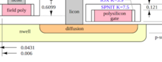
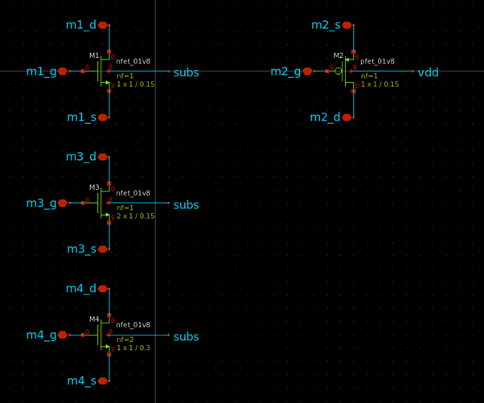
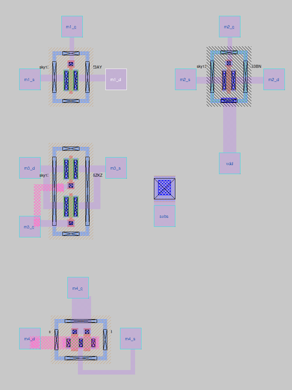

**Devices 1 → nmos (MOSFET)** — si apre il pannello **params**. I campi principali:

| Campo nel pannello | Descrizione | Valore per il tour |
|---|---|---|
| **Width (um)** | Larghezza di canale per finger | `1` |
| **Length (um)** | Lunghezza di canale | `0.15` |
| **Fingers** | Numero di finger | `1` |
| **M** | Molteplicità (istanze parallele) | `1` |
| **Device type** | Tipo di device SKY130A | `sky130_fd_pr__nfet_01v8` |

Nella parte inferiore del pannello ci sono opzioni avanzate per la copertura dei contatti e del guard ring — lascia tutti i valori di default per ora.

Clicca **Create and close**: la pcell viene posizionata automaticamente sul canvas. Spostala con `m`.

Osserva la geometria:
- **Canale** (`nmos` layer, verde scuro): regione attiva N al centro
- **Gate** (`poly`): striscia verticale che attraversa il canale
- **Contatti source e drain** (`ndc`): quadratini ai lati del gate
- **Guard ring** (`psubstratepdiff`): anello esterno — va collegato a GND

Seleziona la pcell con `i` e premi `q` per riaprire il pannello. Prova `Fingers=2`: viene aggiunto un secondo finger, ma `Width` rimane per finger — la W totale raddoppia. Rimetti `Fingers=1`.

Premi `b` per stampare le dimensioni della bounding box. Annota l'area: `?` µm².

### 2.3 PMOS: `pfet_01v8`

**Devices 1 → pmos (MOSFET)** — stesso pannello **params**. Imposta `Width=1`, `Length=0.15`, `Fingers=1`. Verifica che **Device type** sia `sky130_fd_pr__pfet_01v8`. Clicca **Create** e sposta con `m`.

Confronta con l'NMOS e individua le differenze:
- Il canale è `pmos` layer (pdiff — colore diverso)
- Il guard ring esterno è un **NWELL tap** (`nsubstratendiff`): connette l'NWELL al body PMOS — va collegato a VDD
- L'NWELL è il grande rettangolo che racchiude transistor e tap

> ⚠️ Nei PMOS il body (B) è l'NWELL → va a VDD. Nei NMOS il body (B) è il substrato P → va a GND. Body floating = errori DRC e degrado delle prestazioni.

### 2.4 Resistore: `res_xhigh_po`

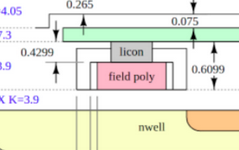
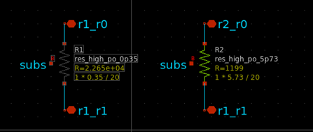
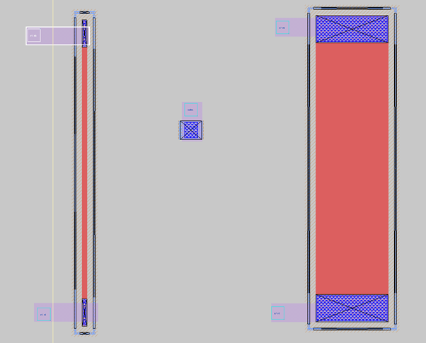
**Devices 2 → poly resistor - 2000 Ohm/sq** — si apre il pannello **params**. I campi principali:

| Campo | Descrizione |
|---|---|
| **Value (ohms)** | Resistenza calcolata automaticamente (include effetti dei contatti) |
| **Total length (um)** | Lunghezza fisica totale inclusi X/Y Repeat |
| **Length (um)** | Lunghezza unitaria — il parametro da modificare |
| **Width (um)** | Larghezza fissa: 0.350 µm (non editabile) |
| **X Repeat / Y Repeat** | Ripetizioni per creare array; Total length = Length × X Repeat |
| **Use snake geometry** | Geometria serpentina per resistori lunghi in spazio compatto |

Imposta `Length=5`, clicca **Create and close** e sposta con `m`.

Il campo **Value (ohms)** mostra il valore reale inclusa la resistenza dei contatti — leggermente superiore a $R_{sh} \cdot L/W$.

Osserva: due terminali (in alto e in basso) e un guard ring con substrate tap laterale che va collegato a GND.

Prova `i` + `q` e modifica `Length`: osserva come cambiano simultaneamente la lunghezza fisica e il valore in **Value**.

### 2.5 Capacità MiM: `cap_mim_m3_1`

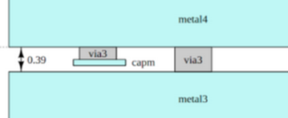
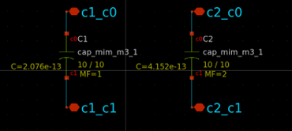
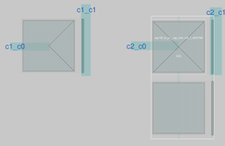

**Devices 2 → MiM cap - 2fF/um^2 (metal3)** — si apre il pannello **params**. I campi principali:

| Campo | Descrizione |
|---|---|
| **Value (fF)** | Capacità per singola cella, calcolata automaticamente |
| **Total capacitance (pF)** | Capacità totale includendo X/Y Repeat |
| **Length (um)** | Lunghezza della singola cella |
| **Width (um)** | Larghezza della singola cella |
| **X Repeat / Y Repeat** | Numero di celle in array (equivalente a `MF` in xschem) |
| **Square capacitor** | Forza automaticamente L=W |
| **Connect bottom/top plates in array** | Connette le plate tra le celle dell'array |

Imposta `Length=2`, `Width=2`, `X Repeat=1`: il campo **Value** mostra **8 fF** ($2\ \text{fF/µm}^2 \times 2 \times 2$). Clicca **Create** e sposta con `m`.

Prova `i` + `q` e imposta `X Repeat=4`: il campo **Total capacitance** mostra 0.032 pF (32 fF) e l'array si estende orizzontalmente.

Osserva nel layout (zooma con `z`): entrambi i contatti accessibili della MiM cap sono su `met4`. Il rettangolo più grande corrisponde alla bottom plate (terminale `c0`), quello più piccolo alla top plate (terminale `c1`). I layer `met3` e `capm` sono interni alla pcell e non direttamente accessibili per il routing.

> 💡 In xschem il parametro equivalente a X Repeat si chiama `MF` (molteplicità). Con **File → Import SPICE** (Lab02) Magic converte automaticamente `MF` in X Repeat. Questa stessa pcell è stata usata nel CDAC del Modulo 2.

### 2.6 Chiudi il tour

Il tour è completo. Usa **File → Flush changes** per annullare le modifiche non salvate, poi vai alla Parte 3.

---

## Parte 3 — Layout dell'amplificatore a source comune

### 3.1 Il circuito di riferimento

Il circuito che realizzerai è un **amplificatore a source comune** con carico resistivo e capacità di uscita:

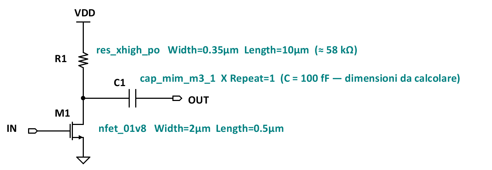

I parametri sono già scelti — non devi dimensionarli. Il tuo obiettivo è tradurre questo schema in un layout fisico DRC clean.

### 3.2 Crea la cella `cs_amp`

**Cell → New...** → digita `cs_amp` → OK. Salva subito:

```tcl
save cs_amp
```

> 💡 Se riapri Magic in una sessione successiva e vedi il messaggio `"cs_amp" has a zero timestamp`, non è un errore: esegui `save cs_amp` e il messaggio scomparirà.

Le pcell SKY130A si istanziano **esclusivamente** dal menu **Devices 1** o **Devices 2** — il comando `getcell` non funziona per le pcell PDK perché queste non esistono come file `.mag` ma vengono generate dinamicamente.

### 3.3 Istanzia l'NMOS: `nfet_01v8`

**Devices 1 → nmos (MOSFET)** — imposta nel pannello **params**:

| Campo | Valore |
|---|---|
| **Width (um)** | `2` |
| **Length (um)** | `0.5` |
| **Fingers** | `1` |
| **M** | `1` |
| **Device type** | `sky130_fd_pr__nfet_01v8` |

Clicca **Create and close**: la pcell viene posizionata automaticamente sul canvas. Selezionala con `i`, quindi spostala con `m`.

> ⚠️ **Fingers e Width in Magic vs xschem:** `Width` nel pannello params è la larghezza per finger. Se istanziassi con `Fingers=2` e `Width=2µm`, la W totale sarebbe 4µm. In xschem invece `W` è la larghezza totale. Questa differenza si applica solo all'istanziazione manuale; con **File → Import SPICE** (Lab02) la conversione avviene automaticamente.

### 3.4 Istanzia il resistore: `res_xhigh_po`

**Devices 2 → poly resistor - 2000 Ohm/sq** — imposta nel pannello **params**:

| Campo | Valore |
|---|---|
| **Length (um)** | `10` |
| **Width (um)** | `0.350` (fissa, non editabile) |
| **X Repeat** | `1` |

Il campo **Value (ohms)** mostra automaticamente la resistenza risultante. Con Length=10 il valore è ≈ 58 kΩ (la formula semplificata darebbe $R_{sh} \cdot L/W = 2000 \cdot 10/0.35 \approx 57.1\ \text{k}\Omega$; la differenza è dovuta alla resistenza dei contatti). Clicca **Create and close**.

Il resistore ha due terminali (in alto e in basso) e un guard ring con substrate tap laterale che va collegato a GND.

### 3.5 Istanzia la capacità MiM: `cap_mim_m3_1`

**Devices 2 → MiM cap - 2fF/um^2 (metal3)** — prima di aprire il pannello, calcola le dimensioni necessarie.

La capacità target per il circuito è **100 fF**. La densità areale della MiM cap in SKY130A è $C_{area} = 2\ \text{fF/µm}^2$ (leggibile dal nome nel menu). Con `X Repeat=1`:

$$C = C_{area} \cdot W \cdot L \quad \Rightarrow \quad W \cdot L =  ?\ \text{µm}^2$$

Scegli liberamente W e L purché il loro prodotto soddisfi il vincolo. Una cap quadrata ($W = L$) minimizza il perimetro e semplifica il routing; una cap rettangolare può adattarsi meglio allo spazio disponibile.

Apri il pannello **params** e imposta:

| Campo | Valore |
|---|---|
| **Length (um)** | `?` (da calcolare) |
| **Width (um)** | `?` (da calcolare) |
| **X Repeat** | `1` |

Verifica nel campo **Value (fF)** che il valore mostrato sia **100 fF**. Clicca **Create and close**. Nel layout i contatti sono entrambi su `met4`: il rettangolo più grande è la bottom plate (terminale `c0`), quello più piccolo è la top plate (terminale `c1`).

> 💡 Per modificare i parametri di una pcell già posizionata: `i` per selezionarla, `q` per riaprire il pannello. Per eliminarla e ripartire: `i` poi `d`, poi reistanzia dal menu.

### 3.6 Salva prima del floorplan

Dopo aver istanziato i tre componenti, salva con **File → Save...**

Magic mostra un dialogo per ogni cella modificata (incluse le pcell figlie):

```
sky130_fd_pr__cap_mim_m3_1_... : write, autowrite, flush, skip, or abort command?
```

Clicca sempre **autowrite**: salva automaticamente tutte le celle modificate senza chiedere per ciascuna. È la scelta raccomandata in tutti i flussi di lavoro con Magic.

In alternativa, dalla command window:

```tcl
writeall
```

che ha lo stesso effetto di `autowrite` su tutte le celle.

### 3.7 Floorplan

Disponi le tre pcell in questa configurazione. Seleziona ogni pcell con `i` e spostala con `m`:

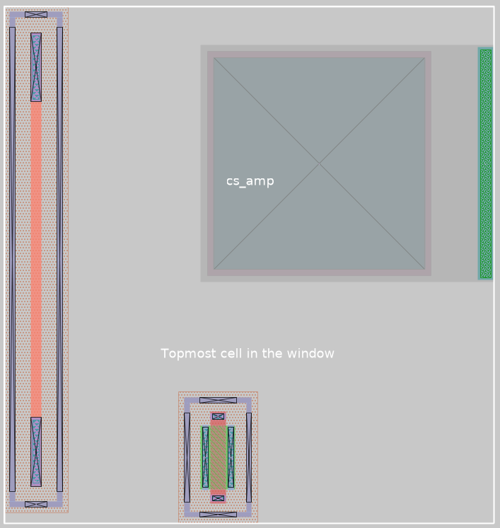

> 💡 Usa `g` per attivare la griglia, oppure vai su **Window -> grid on/grid off**. Per un floorplan iniziale, può essere utile per il posizionamento settare un passo di griglia più grossolano (`set grid 0.50 μm`, `set grid 1.00 μm`) ed abilitare la funzione `snap-to-grid`. Un altro strumento utile per gli allineamenti è abilitare l'opzione `crosshair` per il cursore da **Options -> crosshair**. Tieni almeno 2-3 µm di spazio tra le pcell per il routing.

---

## Parte 4 — Routing con il wiring tool

Di default, l'area di disegno in Magic appare con il cursore 'box' attivo. per passare alla modalità routing, attiva il wiring tool con `Spazio`. In modalità wiring:

| Azione | Mouse |
|--------|-------|
| Seleziona materiale e larghezza | `LEFT click` su un layer esistente |
| Posa il filo | `MIDDLE click` |
| Cancella il filo | `RIGHT click` |
| Sale di un layer + via automatico | `Shift+LEFT click` |
| Scende di un layer + via automatico | `Shift+RIGHT click` |

Un altro modo molto utile in Magic per disegnare contatti o linee di metal è creare un riquadro (left-click + right-click), quindi digitare `paint <nome_layer>` nella command window, oppure nella barra laterale premere sul layer di interesse con il tasto centrale del mouse (rotellina) dopo aver creato la box di selezione.

> 💡Spesso, il modo migliore per fare routing in Magic è proprio disegnare un riquadro di metal della larghezza desiderata, da usare come seed, quindi usare il wiring tool per proseguire il disegno della pista.

### 4.1 Source MN1 → GND

Connettiamo il source dell'NMOS a GND. Per farlo, creiamo una selezione con il cursore box in modo che si sovrapponga al contatto del terminale di source e che esca fuori dal guard ring del ransistor, quindi digitiamo nella command window
```
paint metal1
```
oppure click con il tasto centrale del mouse nella barra laterale dei layer su `metal1`.

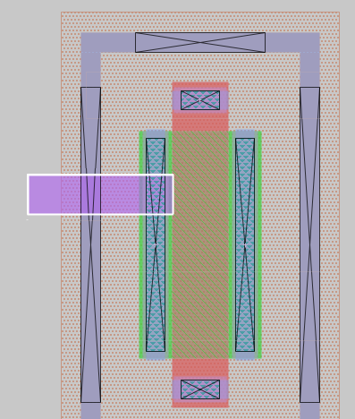

 Con il wiring tool:
1. `LEFT click` sulla estremità della linea di metal1 appena creata
2. Trascina verso sinistra
3. `MIDDLE click` per posare il filo
4. `Shift+left click` per piazzare un `via1` e salire sul metal2
5. trascinare verso il basso per creare una linea verticale di metal2

> 💡Per convenzione, si tende a disegnare le linee di `metal1` in orizzontale --, quelle di `metal2` in verticale | e così via (convenzione [Manhattan](https://en.wikipedia.org/wiki/Manhattan_wiring)). Questo serve anche a facilitare il routing, oltre che ridurre le superfici affacciate e minimizzare i parassiti capacitivi.

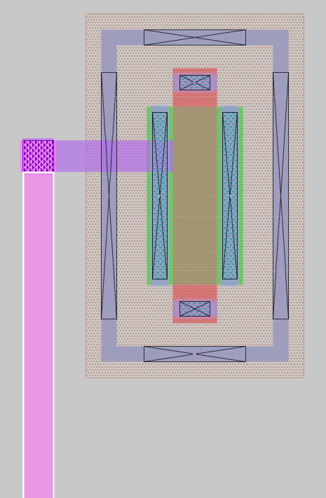

Il guard ring del NMOS (`psubdiff`) va anch'esso collegato a GND: crea una box di selezione intorno al contatto inferiore del guard ring, quindi digita:

```
paint viali
```
oppure click con il tasto centrale del mouse nella barra laterale dei layer su `viali`. Questo serve a creare un via di interconnessione tra il layer `locali` (local interconnect) e il layer `metal1`.
A questo punto disegna una linea di `metal1` che racchida il via appena creato. 

Per rimanere coerenti con la convenzione di routing, è necessario salire di livello, per tracciare una linea verticale di `metal2`. Per farlo, possiamo creare una box di selezione, quindi andare su **Devices -> via1**. In questo modo magic creerà dinamicamente tutte le strutture necessarie per istanziare il via1 nella box desiderata. 
Infine, disegna una linea di metal2 vero il basso.

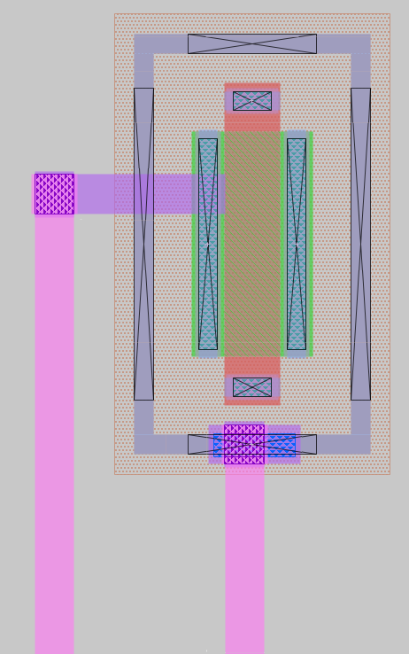

### 4.2 Drain MN1 → terminale inferiore di R1 → contatto condensatore MiM

Drain del NMOS e terminale inferiore del resistore si connettono al nodo di uscita, verso il condensatore. Sia il drain del MOSFET, che il terminale della resistenza R1 sono già provvisti di contatto `viali`:
1. Con il box tool, disegna un tratto di linea di `metal1` sul contatto inferiore della resistenza
2. Usa il wiring tool per raggiungere il terminale di Drain del MOSFET, rispettando la convenzione di routing

La capacità MiM ha i contatti della bottom plate su `metal4`. Per collegare il Drain del MOSFET al `metal4` della cap:
- Parti dal routing appena creato conil tool wiring, quindi `Shift+LEFT click` per salire: `metal1` → `metal2` → `metal3` → `metal4`
- Il wiring tool inserisce i via `via1`, `via2`, `via3` automaticamente
- raggiungi il piatto del condensatore MiM conuna linea di `metal4`. 

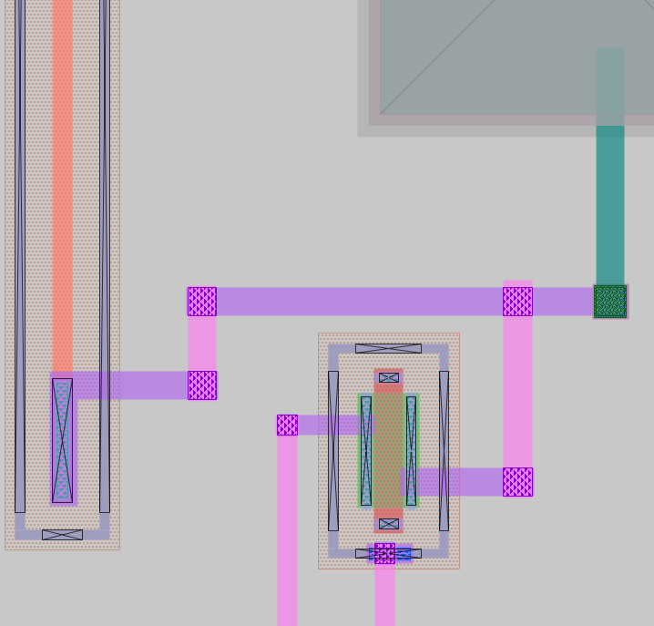

### 4.3 Terminale superiore di R1 → VDD

Connetti il terminale superiore del resistore a un rail `metal1` orizzontale in alto. Questo sarà il rail di alimentazione Vdd dl circuito.

### 4.4 Substrate tap del resistore → GND

Il resistore ha dei substrate tap sul proprio guard ring, che vanno collegati a GND. Come fatto per l'NMOS, procedere creando un contatto `viali`, quindi raggiungere `metal2` trascinando il routing verso il basso.
Al termine, creare anche qui un rail di `metal1`, che useremo come GND del circuito.

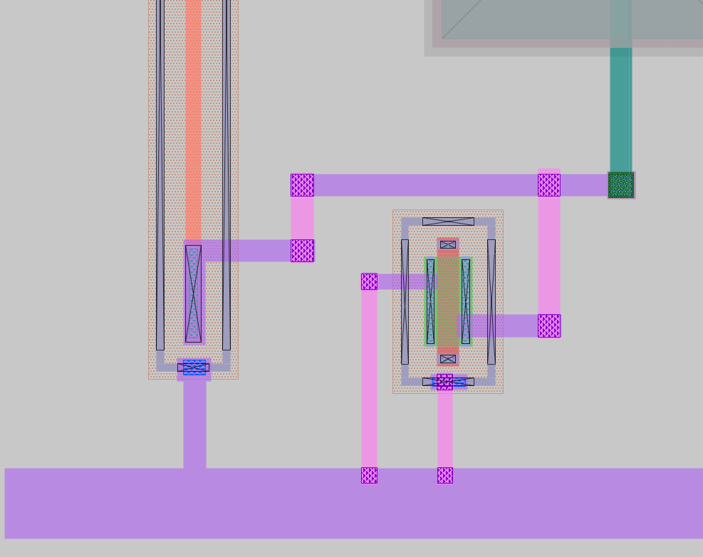

### 4.5 Top plate della cap MiM (terminale `c1`) → Vout

Il terminale `c1` (top plate, su `capm`) va collegato al nodo Vout. Connetti con un filo dal contatto `metal4` scendendo verso `metal1`. Questo sarà il pin di contatto del nodo Vout del circuito.

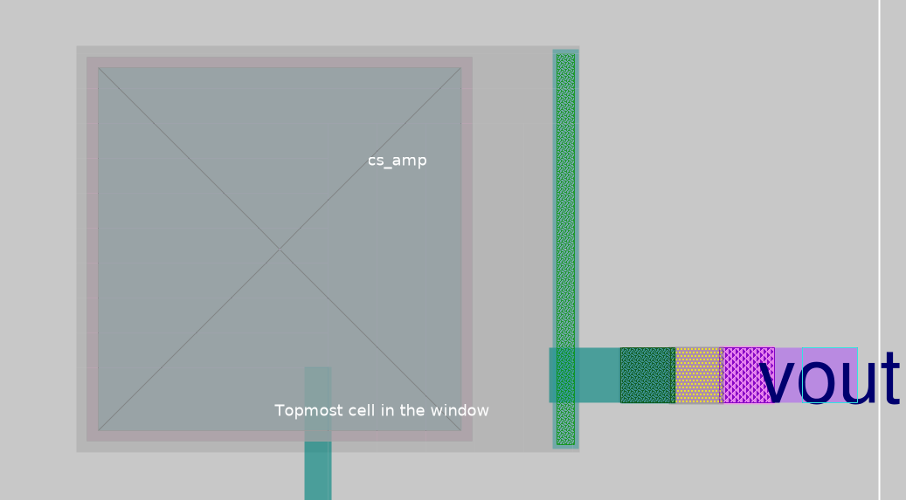

### 4.6 Gate dell'NMOS → Vin

Infine, collega il contatto di Gate dell'NMOS verso il nodo Vin. 
Il gate è realizzato sul layer `poly` ed è già provvisto di due contatti `polycont` verso `metal1`, uno per lato. Selezionando il MOSFET con il tasto `i`, quindi aprendo il pannello delle proprietà della pcell con il tasto `q`, è possibile abilitare o disabilitare ciascuno dei due contatti, se la geometria del device lo consente.
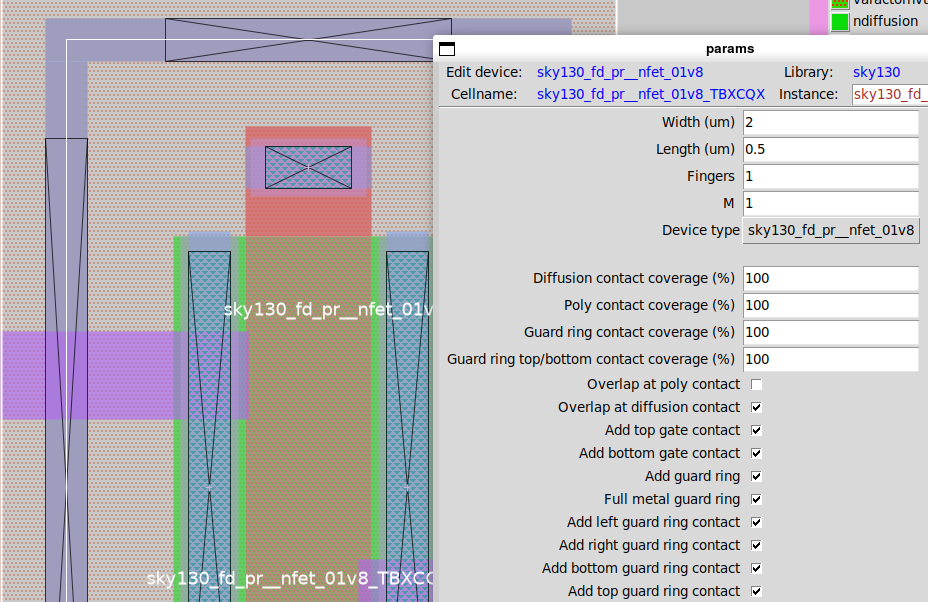

1. Disegnare una linea di `metal1` sul contatto di gate superiore
2. trascinare verso destra per raggiungere il nodo Vout.

---

## Parte 5 — Pin label e Port per LVS

> ⚠️ Un semplice testo in Magic è visibile graficamente ma **non genera un pin** nella netlist estratta. Per il LVS servono i **port**: la differenza è il checkbox **Port: enable** nel dialogo di creazione della label. Senza spuntarlo, la label è solo decorativa.

Per aggiungere un port label:

1. Con il **box tool**, disegna una piccola box sul layer di interesse, nel punto esatto dove vuoi il pin (es. sul filo di alimentazione VDD, sul nodo VOUT, ecc.) oppure seleziona la linea di metal a cui vuoi associare il ruolo di porta
2. Vai su **Edit → Text...**
3. Si apre il dialogo **texthelper**:
   - **Text string**: digita il nome del pin (`vin`, `vout`, `vdd`, oppure `gnd`)
   - **Attach to layer**: lascia `default` (usa il layer della box corrente, cioè `met1`)
   - **Port: enable** → **spunta questa casella** — è ciò che crea il port per il LVS
4. Clicca **Okay**

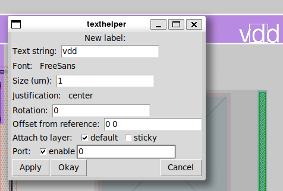

Ripeti per tutti e quattro i pin del circuito:

| Pin | Port class | Nodo nel layout |
|---|---|---|
| `vin` | input | gate di MN1 |
| `vout` | output | bottom plate C1 |
| `vdd` | inout | terminale superiore R1 |
| `gnd` | inout | source MN1, guard ring, substrate tap R1 |

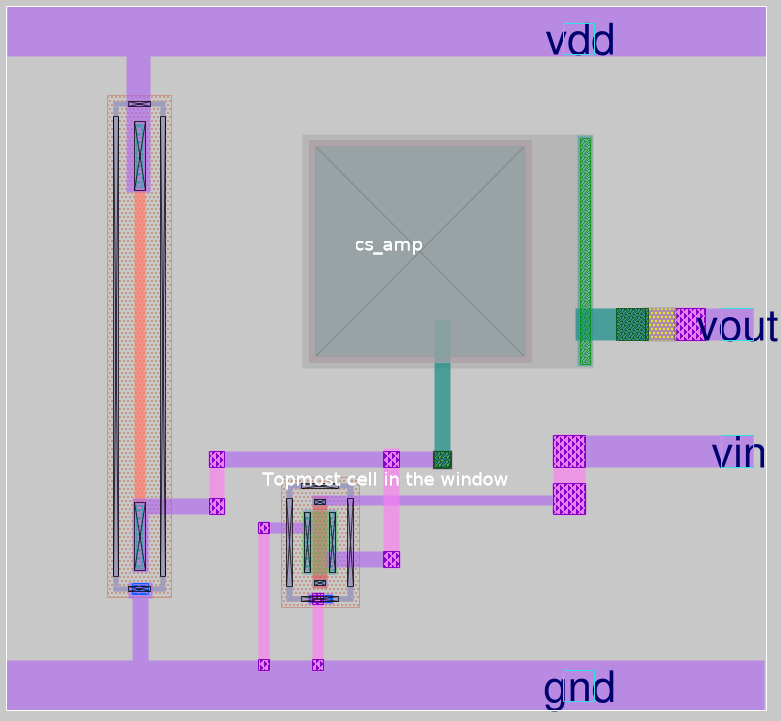

> 💡 La voce **Port class** (input/output/inout) non è presente nel dialogo grafico — si imposta opzionalmente dalla command window dopo aver creato il port:
> ```tcl
> port class input
> ```
> Per il LVS con Netgen questa informazione non è strettamente necessaria, ma è buona pratica includerla.

Per verificare se le porte sono state create correttamente, ci sono alcuni comandi utili dalla command window:

| comando | Azione | 
|---|---|
| `port first` | stampa il numero progressivo della prima porta istanziata |
| `port last` | stampa il numero progressivo dell'ultima porta istanziata |
| `port <numero> name` | stampa il nome (label) della porta con il progressivo <numero> |


I primi due comandi, eseguiti in sequenza, sono utili a capire quante porte ci sono nel layout e qual'è il range di nueri progressivi, mentre il comando `port <numero> name` ci aiuta a capire se ad ogni numero progressivo è associata la giusta label. In caso di errori, o qualora la porta non fosse stata creata correttamente, è possibile selezionare il riquadro di `metal1` (o del layer interessato) e clcicare su `d` per cancellare e ripetere il processo di creazioen delal porta.

---

## Parte 6 — DRC

Come avrai notato, sulla barra dei menù, in alto, è presente un DRC ckecker, che mostra se ci sono errori di DRC nel layout in real-time.

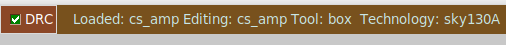

Se sono presenti errori DRC, la spunta passa da verde a rossa e comparira il numemro di errori totali presenti. La violazione viene anche segnalata nel layout graficamente, con un layer a puntini bianchi.

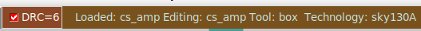
Nell'esempio mostrato di seguito, sono presenti errori DRC intorno ai contatti di gate del MOSFET:

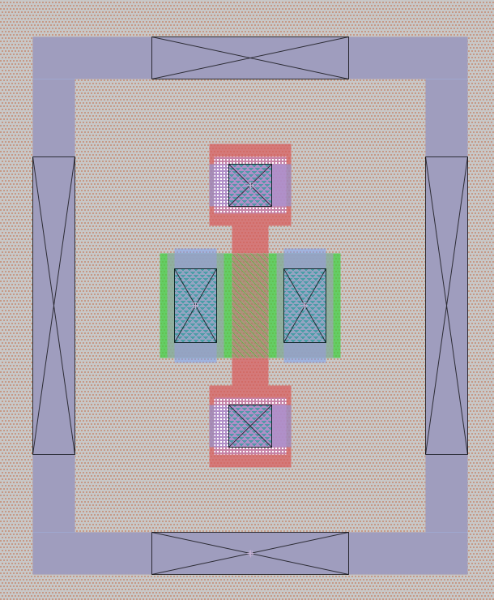

Per identificare l'errore DRC seleziona l'area, poi usa `y` (con il cursore sulla zona di errore) o `=` per trovare e zoomare sul prossimo errore.
Puoi anche digitare nella command window il comando

```
drc why
```

| Tipo di errore | Causa tipica | Soluzione |
|---|---|---|
| `Metal1 spacing` | Due fili in met1 troppo vicini | Aumenta la distanza (min: 0.14 µm) |
| `li spacing` | Due fili in li troppo vicini | Aumenta la distanza (min: 0.17 µm) |
| `Via not on grid` | Via fuori griglia | Usa il wiring tool automatico |
| `Substrate tap missing` | Area attiva senza tap nelle vicinanze | Collega il guard ring a GND |

Obiettivo: **DRC count = 0** prima di procedere all'export.

---

## Parte 7 — Export GDS e verifica in KLayout

Per salvare il deisgn, andare su **File → Save... → autowrite.** L'export dei file GDSII, ovvero il formato richiesto dalla fodneria per la produzione del design, andare su **File → Write GDS.**
In alternativa, è possibile usare i seguenti comandi nella comamndo window:
```tcl
save cs_amp
gds write cs_amp.gds
```

### 7.1 Apri il GDS in KLayout

```bash
cd /foss/designs/modulo3/lab01/mag
klayout cs_amp.gds &
```

Nel container IIC-OSIC-TOOLS v2025.07 la tecnologia SKY130A è già caricata automaticamente — lo conferma la presenza del menu **Efabless sky130** nella barra dei menu.

### 7.2 DRC con KLayout

**Efabless sky130 → Run DRC (Full)**

**Efabless sky130 → Run DRC (BEOL)** — verifica solo i layer metallici: utile per diagnosticare rapidamente problemi di routing.

### 7.3 Discrepanze tra Magic DRC e KLayout DRC

Se KLayout segnala un errore del tipo:

```
urpm.1a [sky130_fd_pr__res_xhigh_po_0p35_...] : min. rpm width : 1.27 um
```

questo è un **falso positivo noto**. L'errore è all'interno della pcell del resistore generata da Magic — una discrepanza tra come il DRC di Magic e quello di KLayout interpretano la regola `urpm.1a` sul layer del resistore polisilicio ad alta resistività. Non puoi correggerlo perché si trova dentro una cella del PDK.

> ⚠️ **Magic è il riferimento DRC ufficiale** per SKY130A nel flusso open-source. Se Magic riporta 0 errori e KLayout segnala un singolo errore all'interno di una pcell PDK, si accetta il risultato di Magic. Questo tipo di discrepanza è atteso e documentato dalla community SKY130A.

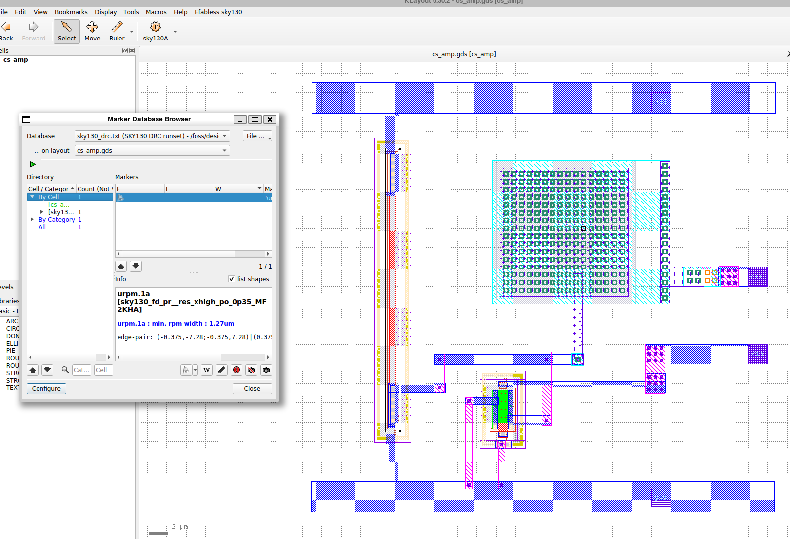
---

Il file di soluzione completo è disponibile in [`soluzioni/lab01/`](./soluzioni/lab01/).

## Domande di riflessione

1. La pcell `nfet_01v8` con `Width=2µm`, `Length=0.5µm`, `Fingers=1` occupa un'area di `?` µm² (misura dal layout con `i` + `b`). Se impostassi `Fingers=2` mantenendo la stessa W totale (quindi `Width=1µm` per finger), l'area totale della pcell cambierebbe? Cosa cambia nella forma?

2. Il layer `li` ha una sheet resistance di 12.2 Ω/□. Un filo di `li` lungo 10 µm e largo 0.17 µm (larghezza minima) ha una resistenza di `?` Ω. Confrontalo con un filo di `met1` della stessa geometria (125 mΩ/□): qual è il rapporto?


3. Il substrate tap del resistore `res_xhigh_po` deve essere collegato a GND. Se lo lasciassi floating, quale fenomeno fisico potrebbe causare problemi nel funzionamento del circuito?

4. Dopo aver raggiunto DRC clean in Magic, hai eseguito il DRC anche in KLayout. I risultati coincidono? Se ci sono differenze, a cosa sono dovute?
