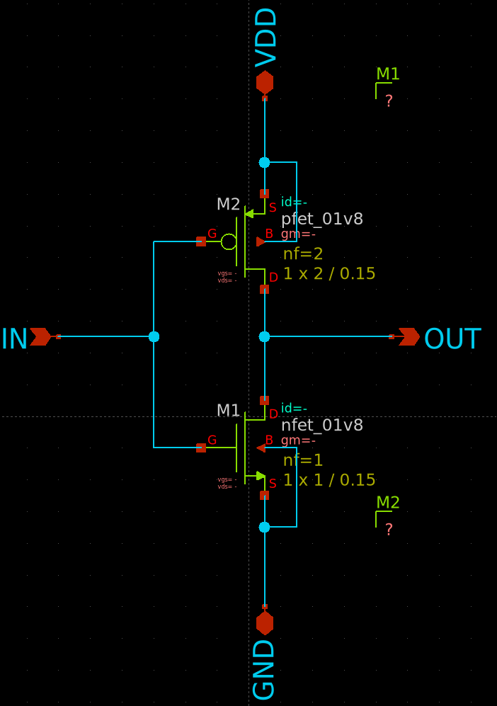
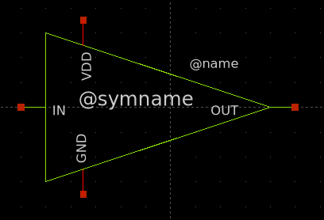
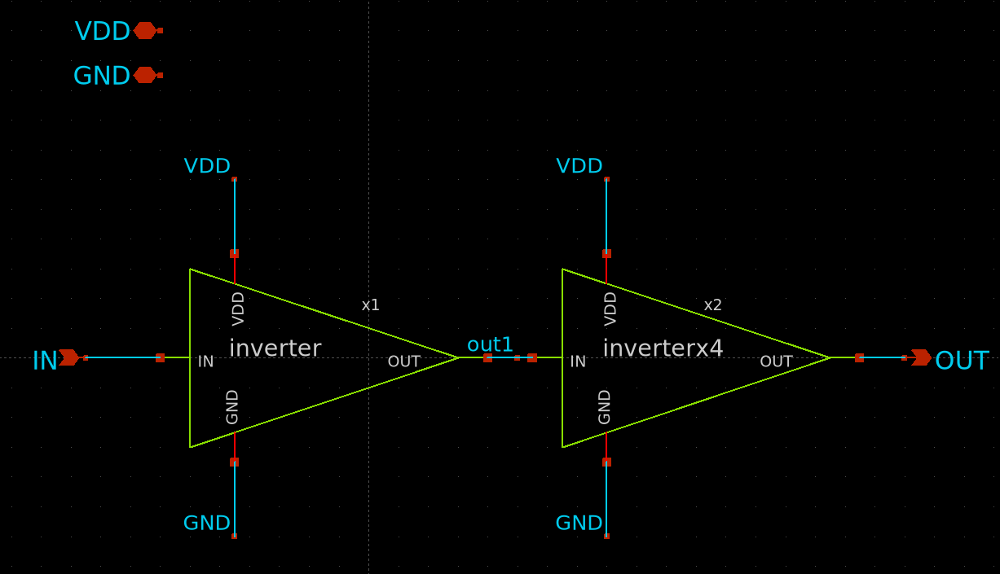
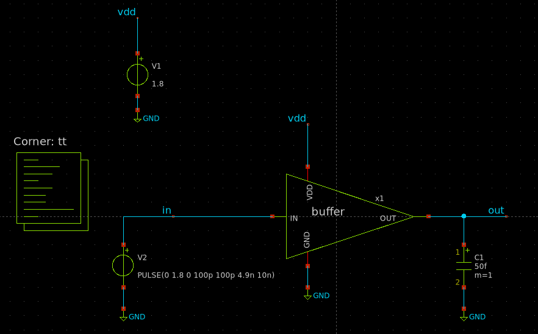
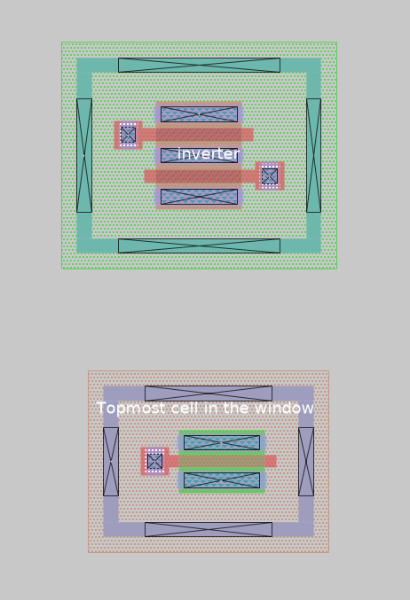
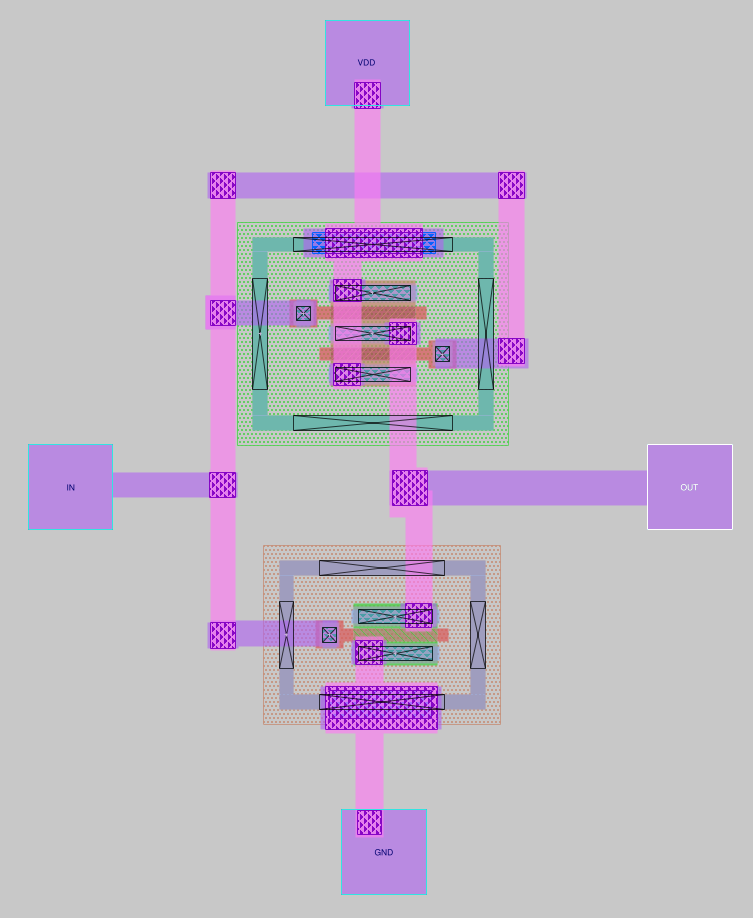
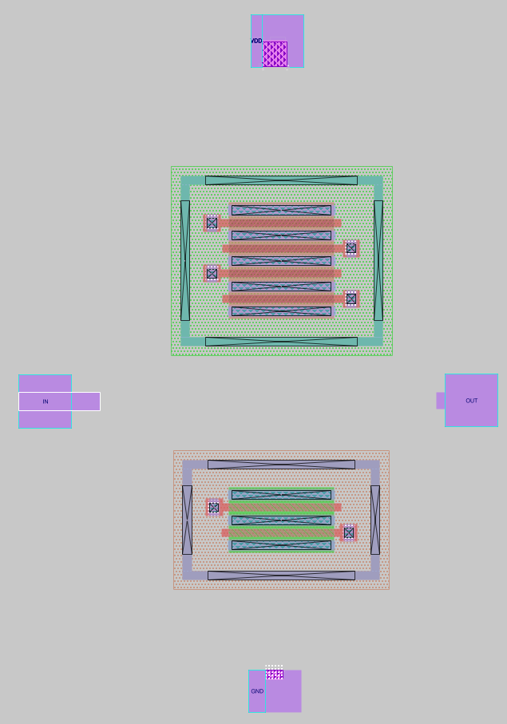
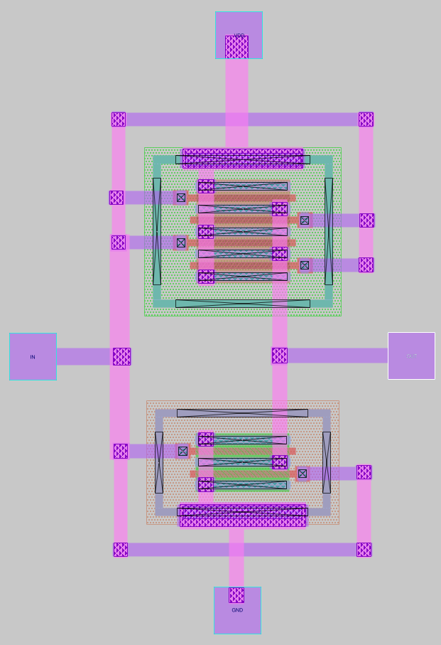
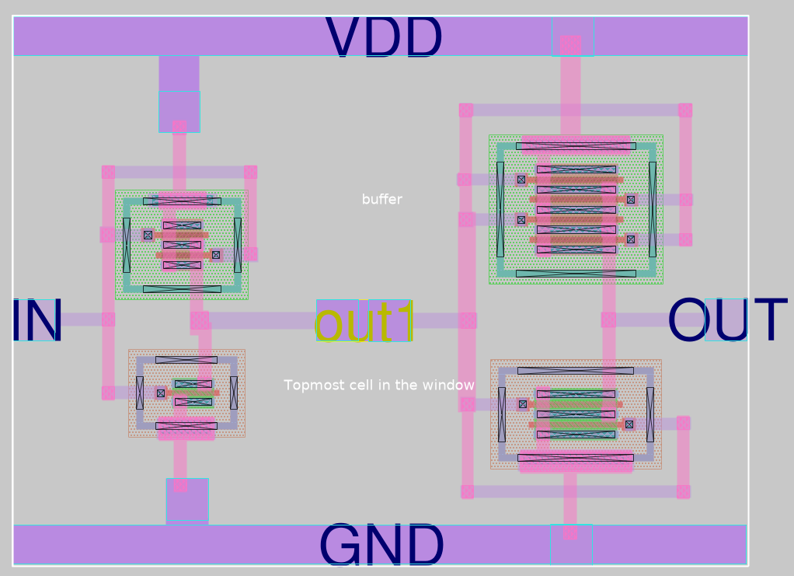
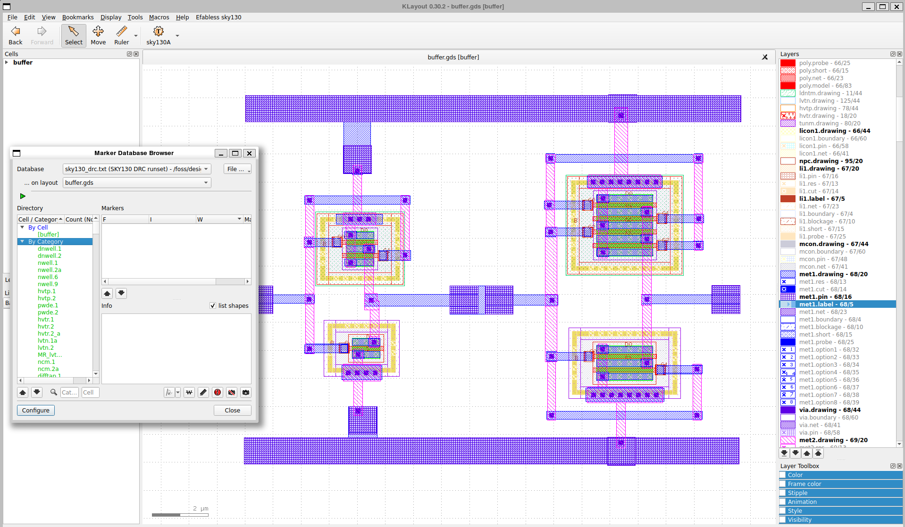

# Lab 2 — Layout gerarchico: inverter e buffer a due stadi

**Tempo stimato:** 3 ore  
**Cartella di lavoro:** `/foss/designs/modulo3/lab02/mag/`

---

## Obiettivo

In questo lab realizzerai un layout gerarchico su tre livelli: due varianti dell'inverter CMOS come celle autonome, e un buffer che le istanzia in cascata. Rispetto al Lab01, il routing è leggermente più complesso (transistor multi-finger) e la gerarchia è reale (due celle diverse nel top-level). Questo è il pattern che userai anche per il SAR ADC nel Modulo 6.

Al termine saprai:
- Modificare uno schematico xschem esistente e generare il simbolo `.sym`
- Creare un nuovo schematico xschem con device SKY130A multi-finger
- Costruire uno schematico gerarchico `buffer.sch` istanziando simboli di celle esistenti
- Simulare il buffer con un testbench xschem e misurare $t_{pd,LH}$ e $t_{pd,HL}$ pre-layout
- Generare le netlist LVS dei tre schematici circuitali
- Importare netlist SPICE in Magic con **File → Import SPICE** e verificare i port auto-creati
- Realizzare il layout di un inverter con transistor multi-finger
- Costruire un buffer gerarchico in Magic istanziando due celle diverse
- Raggiungere DRC clean su un design gerarchico con celle di dimensioni diverse

---

## Struttura delle cartelle

```bash
mkdir -p /foss/designs/modulo3/lab02/mag
mkdir -p /foss/designs/modulo3/lab02/xschem/simulation
```

La struttura finale:

```
/foss/designs/modulo3/lab02/
├── mag/
│   ├── inverter.mag       ← inverter con PMOS a 2 finger
│   ├── inverterx4.mag     ← inverter con transistor 4× più larghi
│   ├── buffer.mag         ← top-level: inverter + inverterx4 in cascata
│   └── buffer.gds         ← GDS esportato
└── xschem/
    ├── inverter.sch        ← modificato dal Modulo 1
    ├── inverter.sym        ← simbolo generato automaticamente
    ├── inverterx4.sch      ← nuovo schematico
    ├── inverterx4.sym      ← simbolo generato automaticamente
    ├── buffer.sch          ← istanzia inverter + inverterx4
    ├── tb_buffer.sch       ← testbench con sorgente e carico CL
    └── simulation/
        ├── inverter.spice  ← netlist LVS
        ├── inverterx4.spice ← netlist LVS
        └── buffer.spice    ← netlist LVS (con net interna 'mid')
```

---

## Teoria: gerarchia in Magic

### Celle e istanze

In Magic ogni cella è un file `.mag` indipendente. Una cella può contenere geometrie primitive e **istanze** di altre celle. Quando istanzi una cella all'interno di un'altra, Magic mostra il bounding box della cella figlia. Le geometrie interne sono nascoste per default — si rendono visibili con `x` (expand).

| Azione | Menu | Tasto | Command window |
|---|---|---|---|
| Crea nuova cella | **Cell → New...** | — | `cellname create nome; load nome` |
| Istanzia una cella utente (file `.mag`) | **Cell → Place Instance** | — | `getcell nomecel` |
| Modifica cella figlia in-place (Loaded = padre, Editing = figlia) | **Cell → Edit** | `e` | — |
| Scendi completamente nella figlia (Loaded = Editing = figlia) | — | `>` | — |
| Risali alla cella superiore | **Cell → Up hierarchy** | `<` | — |
| Espandi celle nella box | **Cell → Expand** | `x` | `expand` |
| Comprimi celle nella box | **Cell → Unexpand** | `Shift + x` | `unexpand` |

> 💡 Il comando `getcell` funziona solo per celle salvate come file `.mag` (celle utente). Le pcell SKY130A del PDK non sono file `.mag` — si istanziano esclusivamente tramite il menu **Devices 1** o **Devices 2**.

---

## Parte 1 — Schematici e simulazione in xschem

In questa parte realizzerai tutti gli schematici necessari — `inverter`, `inverterx4`, `buffer` e il relativo testbench — prima di passare a Magic. Resterai in ambiente xschem per l'intera durata della Parte 1.

```bash
cd /foss/designs/modulo3/lab02/xschem
xschem &
```

### 1.1 `inverter.sch` — copia e modifica

Copia lo schematico dell'inverter dal Modulo 1 nella cartella xschem del lab:

```bash
cp /foss/designs/modulo1/lab01/xschem/inverter.sch    /foss/designs/modulo3/lab02/xschem/
```

Aprilo: **File → Open** → `inverter.sch`.

Lo schematico originale ha NMOS W=1µm nf=1 e PMOS W=2µm nf=1. Modifica il PMOS per usare 2 finger: doppio click sul transistor PMOS e imposta `nf=2` lasciando `W=2µm` (in xschem W è la larghezza totale, quindi ogni finger vale W/nf = 1µm).

| Transistor | W | L | nf | W per finger |
|---|---|---|---|---|
| NMOS | 1µm | 0.15µm | 1 | 1µm |
| PMOS | 2µm | 0.15µm | 2 | 1µm |

Salva: **File → Save**.



### 1.2 Genera il simbolo di `inverter`

Per poter istanziare `inverter` come blocco in `buffer.sch`, xschem ha bisogno del suo file simbolo `.sym`. Generalo con:

**Symbol → Make symbol from schematic**

xschem crea automaticamente `inverter.sym` nella stessa cartella. Il simbolo avrà i pin `IN`, `OUT`, `VDD`, `GND` derivati dai port dello schematico.



### 1.3 `inverterx4.sch` — nuovo schematico

**File → New** → salva come `inverterx4.sch`.

Inserisci un NMOS e un PMOS dalla libreria `sky130_fd_pr` (`Shift+I`), connettili con fili, aggiungi i pin `IN`, `OUT`, `VDD`, `GND` (dalla libreria `devices`: `ipin`, `opin`, `iopin`) e imposta i parametri:

| Transistor | W | L | nf | W per finger |
|---|---|---|---|---|
| NMOS | 4µm | 0.15µm | 2 | 2µm |
| PMOS | 8µm | 0.15µm | 4 | 2µm |

Salva: **File → Save**.

Genera il simbolo anche per `inverterx4`:

**Symbol → Make symbol from schematic** → `inverterx4.sym`

### 1.4 `buffer.sch` — istanzia i due inverter

Su Xschem, vai su **File → New** → salva come `buffer.sch`.

Inserisci le due istanze con `Shift+I` → naviga alla cartella `xschem/` del lab e seleziona:
- `inverter.sym` → posiziona a sinistra
- `inverterx4.sym` → posiziona a destra

Connetti con fili:
- Pin `IN` del buffer → pin `IN` di `inverter`
- Pin `OUT` di `inverter` → pin `IN` di `inverterx4` (net interna — aggiungile una label `mid` con `Shift+I → devices → lab_wire`)
- Pin `OUT` di `inverterx4` → pin `OUT` del buffer
- Pin `VDD` di entrambe le istanze → pin `VDD` del buffer
- Pin `GND` di entrambe le istanze → pin `GND` del buffer

Aggiungi i pin del top-level (`ipin` per `IN`, `opin` per `OUT`, `iopin` per `VDD` e `GND`).

Salva: **File → Save**.



### 1.5 `tb_buffer.sch` — testbench e simulazione pre-layout

**File → New** → salva come `tb_buffer.sch`.

Il testbench segue la struttura standard del corso (come nei Moduli 1 e 2):

**Componenti da inserire con `Shift+I`:**
- `buffer.sym` dalla cartella locale — l'istanza del buffer
- `sky130_fd_pr → corner.sym` — imposta il corner di processo; doppio click e imposta `corner=tt`
- `devices → vsource` × 2 — alimentazione VDD e sorgente di ingresso
- `devices → code_shown` — blocco di simulazione ngspice

**Parametri delle sorgenti:**

`VVDD` (alimentazione): `DC 1.8`

`VIN` (ingresso): `PULSE(0 1.8 0 100p 100p 4.9n 10n)` — onda quadra 0→1.8V, periodo 10ns

**Carico di uscita:** aggiungi un condensatore da `devices → capa.sym` tra il pin `OUT` del buffer e GND con valore `50f` — simula il carico di un gate successivo.



**Blocco `code_shown`** (campo `value`):

```spice
.options savecurrents
.control
  save all
  tran 10p 40n
  * tpLH: ritardo da IN che sale (50%) a OUT che sale (50%) — buffer non invertente
  meas tran tpLH TRIG v(IN) VAL=0.9 RISE=1 TARG v(OUT) VAL=0.9 RISE=1
  * tpHL: ritardo da IN che scende (50%) a OUT che scende (50%)
  meas tran tpHL TRIG v(IN) VAL=0.9 FALL=1 TARG v(OUT) VAL=0.9 FALL=1
  write tb_buffer.raw
.endc
```

> 💡 Il buffer è **non-invertente** (due inversioni in cascata): quando `IN` sale, anche `OUT` sale. Le misure usano quindi RISE→RISE per `tpLH` e FALL→FALL per `tpHL`. Un singolo inverter userebbe RISE→FALL e FALL→RISE — fare attenzione a non confondere le due convenzioni.

Esegui la simulazione: **Simulation → Simulate**. Apri GTKWave e visualizza `v(IN)` e `v(OUT)`: verifica che `OUT` commuti nella stessa direzione di `IN` con un ritardo visibile. Annota i valori misurati:

| Parametro | Valore pre-layout |
|---|---|
| $t_{pd,LH}$ (ns) | `?` |
| $t_{pd,HL}$ (ns) | `?` |

> 💡 Questi valori sono il **riferimento pre-layout**. Nel Lab03, dopo l'estrazione PEX, simulerai lo stesso testbench con la netlist post-layout e confronterai i risultati per quantificare la degradazione introdotta dai parassitici di routing.

### 1.6 Genera le netlist LVS

Genera le netlist LVS per i tre schematici circuitali (non il testbench):

Per ciascuno di `inverter.sch`, `inverterx4.sch`, `buffer.sch`:

1. Apri lo schematico
2. **Simulation → LVS netlist: Top level is a `.subckt`** (deve comparire il segno di spunta)
3. **Simulation → Netlist** (`Ctrl+Shift+N`)

Verifica i tre file generati:

```bash
grep '\.subckt' /foss/designs/modulo3/lab02/xschem/simulation/inverter.spice
grep '\.subckt' /foss/designs/modulo3/lab02/xschem/simulation/inverterx4.spice
grep '\.subckt' /foss/designs/modulo3/lab02/xschem/simulation/buffer.spice
```

Dovresti vedere:
```
.subckt inverter IN OUT VDD GND
.subckt inverterx4 IN OUT VDD GND
.subckt buffer IN OUT VDD GND
```

Il file `buffer.spice` conterrà le due istanze `Xinverter` e `Xinverterx4` con la net interna `mid` — questa è la netlist di riferimento che Netgen userà nel Lab03 per il LVS del buffer.

---

## Parte 2 — Layout di `inverter.mag`

### 2.1 Avvia Magic e importa la netlist

```bash
cd /foss/designs/modulo3/lab02/mag
magic -d XR &
```
Dal menù **Cell → New...** inserire il nome **inverter** nel campo `cellname`, quindi premere su **okay** e chiudere la finestra di dialogo. 

In alternativa, nella command window:

```tcl
cellname create inverter
load inverter
```
Salvare subito andando su **File → Save...** ed inserire il nome `inverter.mag`.

**File → Import SPICE** → seleziona `../xschem/simulation/inverter.spice`

Magic istanzia le due pcell (NMOS con 1 finger, PMOS con 2 finger) e crea automaticamente i port `IN`, `OUT`, `VDD`, `GND`. Verifica:

```tcl
port first
port last
port <numero> name
```

Dovresti ottenere `port first=0` e `port last=3` (4 port, da 0 a 3).


### 2.1.1 Rinomina le istanze dei device

Seleziona ogni transistor con `i` e rinominalo dalla command window in modo coerente con lo schematico xschem:

```tcl
identify XM1   # NMOS (corrisponde a M1 in xschem → XM1 nella netlist)
identify XM2   # PMOS (corrisponde a M2 in xschem → XM2 nella netlist)
```

Se modifichi i parametri di una pcell (ad esempio disabiliti un contatto con `q`), Magic le assegna automaticamente un nome con hash come `sky130_fd_pr__nfet_01v8_5HRLDF_0`. Il comando `identify` ripristina un nome leggibile. Non è obbligatorio per il LVS, ma rende il report molto più interpretabile in caso di mismatch.

### 2.2 Floorplan

Disponi NMOS e PMOS con il floorplan standard (PMOS sopra, NMOS sotto), asse di simmetria verticale:



>Il PMOS con `nf=2` ha due finger affiancati: si noti che, data la geometria del PMOS in questione (lunghezza di canale in particolare) e dati i vincoli tecnologici (DRC) i contatti di gate sono alternati tra top e bottom sui finger. In fase di routing, tutti i contatti di gate andranno poi connessi in parallelo, così come tutti i contatti di drain e di source. 

>Nel caso invece del transistor NMOS, essendoci solo un finger, i contatti di gate sono entrambi visibili. Per semplificare il routing, possiamo scegliere di disabilitarne uno:
1. selezionare l'NMOS premendo `i` con i cursore sopra il device
2. premere il tasto `q` per aprire la finestra dei parametri
3. togliere la spunta su `add top gate contact` oppure `add bottom gate contact`, in base a come è stato ruotato il device e alla strategia di routing 

### 2.3 Routing

Procedere al routing dell'inverter seguendo le indicazioni e le metodologie acquisite nel [`lab01`](/03_magic_layout/lab01_magic_pcell.md) per completatre il layout dell'inverter. Come indicazione si può cercare di ottenere un layout simile a questo:



### 2.4 DRC clean e salvataggio

Tenere traccia del numero di errori di DRC nella barra dei menù durante il routing, con l'obiettivo di ottenere 0 errori, ovvero **DRC clean.** In alternativa, da command window:

```tcl
drc catchup
drc count
```

Quando DRC count = 0:

**File → Save...**, oppure, da command window:
```tcl
writeall
```

Clicca **autowrite** nel dialogo che appare.

---

## Parte 3 — Layout di `inverterx4.mag`

### 3.1 Avvia Magic e importa la netlist

Dal menù **Cell → New...** inserire il nome **inverterx4** nel campo `cellname`, quindi premere su **okay** e chiudere la finestra di dialogo. In alternativa, nella command window:

```tcl
cellname create inverterx4
load inverterx4
```
Salvare subito andando su **File → Save...** ed inserire il nome `inverterx4.mag`.

**File → Import SPICE** → seleziona `../xschem/simulation/inverterx4.spice`

Verifica i 4 port auto-creati, come nella parte 2:

```tcl
port first
port last
port <numero> name
```

### 3.1.1 Rinomina le istanze dei device

Dopo l'import, Magic potrebbe assegnare alle istanze delle pcell nomi con hash come `sky130_fd_pr__nfet_01v8_5HRLDF_0`. Se modifichi i parametri di un device (ad esempio disabiliti un contatto), il nome cambia nuovamente. Per mantenere la coerenza con i nomi dello schematico xschem (dove i transistor si chiamano `M1`, `M2` ecc. e nella netlist diventano `XM1`, `XM2`) è buona pratica rinominare le istanze.

Seleziona ogni istanza con `i`, poi nella command window:

```tcl
identify XM1   # per il primo transistor
identify XM2   # per il secondo
```

Questo non è strettamente necessario per il LVS (Netgen confronta topologia e parametri, non i nomi), ma rende il report LVS molto più leggibile: quando Netgen segnala un mismatch mostra i nomi delle istanze dei due circuiti — se layout e schematico usano gli stessi nomi (`XM1` su entrambi i lati) il problema si individua immediatamente.

### 3.2 Floorplan

`inverterx4` ha NMOS con 2 finger (2µm ciascuno) e PMOS con 4 finger (2µm ciascuno). La cella sarà significativamente più larga di `inverter`.



### 3.3 Routing

Con più finger la sfida principale è connettere tutti i drain e tutti i gate in modo pulito:



> 💡 Con molti finger il routing si fa più affollato. Rispetta la convenzione Manhattan: `met1` orizzontale, `met2` verticale. Quando due fili sullo stesso layer si avvicinano troppo, sali di un layer per incrociare.

### 3.4 DRC clean e salvataggio

Tenere traccia del numero di errori di DRC nella barra dei menù durante il routing, con l'obiettivo di ottenere 0 errori, ovvero **DRC clean.** In alternativa, da command window:

```tcl
drc catchup
drc count
```

Quando DRC count = 0:

**File → Save...**, oppure, da command window:
```tcl
writeall
```

Clicca **autowrite** nel dialogo che appare.

---

## Parte 4 — Creazione del buffer gerarchico (`buffer.mag`)

### 4.1 Crea la cella top-level

Dal menù **Cell → New...** inserire il nome **buffer** nel campo `cellname`, quindi premere su **okay** e chiudere la finestra di dialogo. In alternativa, nella command window:

```tcl
cellname create buffer
load buffer
```
Salvare subito andando su **File → Save...** ed inserire il nome `buffer.mag`.

### 4.2 Istanzia le due celle

Dal menù **Cell → Place Instance** e selezionare i layout precedentemente creati e salvati con i nomi di  `inverter.mag` e `inverterx4.mag`.
In alternativa, da command window:
```tcl
# Prima istanza: inverter (primo stadio)
getcell inverter

# Seconda istanza: inverterx4 (secondo stadio, driver più robusto)
getcell inverterx4
```

Posiziona `inverter` a sinistra e `inverterx4` a destra. Espandi le istanze per visualizzare le geometrie interne selezionando l'intera cella buffer, posizionando il cursore in un punto vuoto del canvas, quindi premere `s` e poi `x`, oppure da command window:

```tcl
expand
```

### 4.3 Spacing inter-cella

Avvicina le due istanze e osserva il contatore DRC. La distanza minima dipende dalla regola `nwell.13` (spacing tra NWELL e ndiff esterno: ≥ 1.27 µm). Trova sperimentalmente la distanza minima che azzera il DRC inter-cella.

> 💡 `inverterx4` è più largo di `inverter`: i rail VDD/GND delle due celle potrebbero non essere perfettamente allineati in altezza. Regola le posizioni verticali delle istanze per allineare i rail prima di procedere al routing.

### 4.4 Routing inter-cella: OUT di inverter → IN di inverterx4

Il pin `OUT` dell'inverter deve collegarsi al pin `IN` di inverterx4. Con il wiring tool:

1. Parti dal port `OUT` dell'inverter su `met1` (orizzontale)
2. Se i due port non sono alla stessa altezza, sali su `met2` verticale con `Shift+LEFT click`
3. Raggiungi il port `IN` di inverterx4 e scendi su `met1` con `Shift+RIGHT click`

### 4.5 Power rail condiviso

Disegna nel top-level due rettangoli `met1` che coprono la larghezza totale delle due istanze:
- Rail VDD in alto (allineato ai rail VDD delle due celle)
- Rail GND in basso (allineato ai rail GND delle due celle)

Aggiungi i port del buffer con **Edit → Text...** + **Port: enable**:

| Port | Tipo | Nodo |
|---|---|---|
| `IN` | input | pin `IN` di inverter |
| `OUT` | output | pin `OUT` di inverterx4 |
| `VDD` | inout | rail VDD condiviso |
| `GND` | inout | rail GND condiviso |

> ⚠️ **I port devono essere creati su geometrie del top-level `buffer.mag`**, non su geometrie appartenenti alle celle figlie. Quando usi `expand` per vedere il layout interno di `inverter` e `inverterx4`, le geometrie che vedi appartengono a quelle celle — se crei una label su di esse, Magic la salva nella cella figlia e non diventa un port di `buffer`. Il metodo corretto è disegnare un piccolo rettangolo di `met1` nel top-level (sovrapposto al nodo IN o OUT) e creare il port su quella geometria. Per VDD e GND il problema non si pone perché i rail `met1` vengono già disegnati nel top-level al passo precedente.

> 💡 I port del buffer top-level devono essere creati manualmente con **Edit → Text...** perché `buffer.mag` non è stato importato da una netlist SPICE — è stato costruito a mano. Solo per le celle create da **File → Import SPICE** i port vengono generati automaticamente.

Il risultato finale dovrebbe essere simile a questo:



### 4.6 DRC clean del buffer

```tcl
drc catchup
drc count
```

>Gli errori tipici al livello top-level:

- **Spacing inter-cella `nwell.13`**: aumenta la distanza tra le istanze
- **Rail VDD/GND non connessi fisicamente**: verifica che i rettangoli `met1` del top-level tocchino effettivamente i rail delle istanze

Quando DRC count = 0:

**File → Save... → autowrite**, e a seguire **File → Write GDS**.
In aternativa, da command widow:
```tcl
writeall
save buffer
gds write buffer.gds
```

---

## Parte 5 — Verifica in KLayout

```bash
cd /foss/designs/modulo3/lab02/mag
klayout buffer.gds &
```

Nel pannello a sinistra la gerarchia appare come:

```
buffer
├── inverter
│   ├── sky130_fd_pr__nfet_01v8  (nf=1)
│   └── sky130_fd_pr__pfet_01v8  (nf=2)
└── inverterx4
    ├── sky130_fd_pr__nfet_01v8  (nf=2)
    └── sky130_fd_pr__pfet_01v8  (nf=4)
```

**Efabless sky130 → Run DRC (Full)** → DRC count = 0.

> 💡 Il LVS del buffer (confronto layout vs schematico di `buffer.sch`) verrà fatto nel Lab03, dove creerai lo schematico `buffer.sch` in xschem istanziando i simboli dei due inverter.



Il file di soluzione completo è disponibile in [`soluzioni/lab02/`](./soluzioni/lab02/).

---

## Domande di riflessione

1. Il PMOS di `inverter` ha `nf=2` in xschem (W totale = 2µm) e viene importato in Magic con `Width=1µm per finger`. Il PMOS di `inverterx4` ha `nf=4` (W totale = 8µm) → `Width=2µm per finger`. Verifica questi valori nel pannello params (`i` + `q`) dopo l'import: corrispondono?

2. Nel layout di `inverterx4`, i 4 finger del PMOS hanno i drain che devono confluire sul nodo `OUT`. Quanti fili `met1` orizzontali hai usato per raccoglierli? Avresti potuto farlo con un unico filo continuo?

3. Nel buffer top-level, i rail VDD e GND delle due istanze hanno la stessa altezza? Se no, come hai gestito il disallineamento nel routing?

4. Stima l'area di `inverter.mag` e di `inverterx4.mag` (usa `i` + `b`). Il rapporto tra le due aree è circa 4× come ci si aspetterebbe dalla scala W/L? Perché potrebbe non essere esattamente 4×?

5. Il buffer ha i port `IN`, `OUT`, `VDD`, `GND` creati manualmente nel top-level. Nel Lab03 creerai `buffer.sch` in xschem istanziando i due inverter. Prima di farlo: quali net interne al buffer (non visibili dall'esterno) dovrà contenere `buffer.sch` per descrivere correttamente la connessione tra i due stadi?
