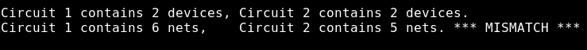
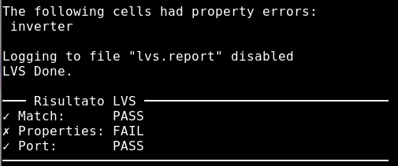
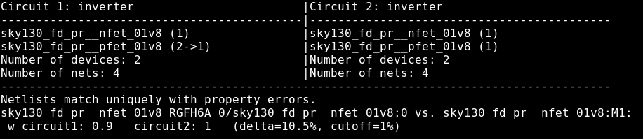
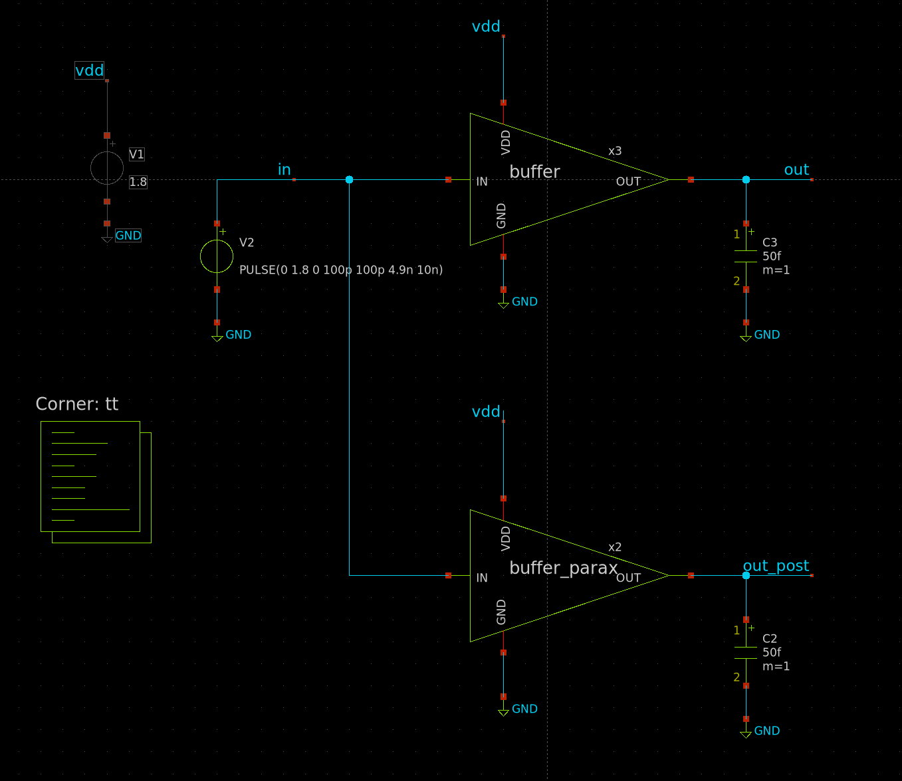
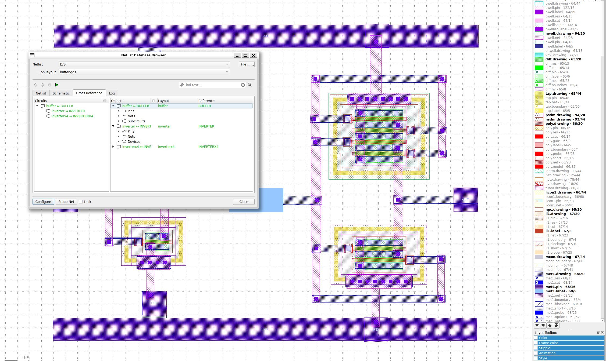

# Lab 3 — LVS, PEX e layout del comparatore Strong-ARM

**Tempo stimato:** 3 ore  
**Cartella di lavoro:** `/foss/designs/modulo3/lab03/mag/`

---

## Obiettivo

In questo lab chiudi il ciclo di verifica fisica: estrai la netlist dal layout, la confronti con lo schematico tramite Netgen (LVS), estrai i parassitici (PEX) e simuli il comportamento post-layout in xschem confrontandolo con la simulazione pre-layout del Lab02. Nella parte finale realizzi il layout del comparatore Strong-ARM a 11 transistor usando **File → Import SPICE** come punto di partenza.

Al termine saprai:
- Usare il Makefile del corso per automatizzare estrazione LVS, PEX e DRC in batch
- Leggere e interpretare il report di Netgen: Match, Properties, Port
- Correggere i tre tipi di errore LVS più comuni (net mancante, dimensioni errate, porta assente)
- Eseguire LVS gerarchico su una cella che contiene subcelle
- Estrarre una netlist con parassitici R+C (resistenze distribuite via `extresist`) e simularne l'impatto
- Confrontare pre-layout e post-layout sullo stesso testbench
- Realizzare il layout del comparatore Strong-ARM a 11 transistor, raggiungendo DRC clean e LVS clean

---

## Struttura delle cartelle

```bash
mkdir -p /foss/designs/modulo3/lab03/mag
mkdir -p /foss/designs/modulo3/lab03/xschem/simulation

# Copia Makefile e script Tcl dalla cartella utils/ del repository del corso
cp -r /<percorso_repo>/utils/mag_scripts/* /foss/designs/modulo3/lab03/mag/
```

La struttura finale:

```
/foss/designs/modulo3/lab03/
├── mag/
│   ├── Makefile                      ← da utils/mag_scripts/
│   ├── tcl/
│   │   ├── extract_for_lvs.tcl
│   │   ├── extract_for_sim.tcl
│   │   ├── lvs_netgen.tcl
│   │   ├── drc.tcl
│   │   ├── antenna.tcl
│   │   ├── update_gds_lef.tcl
│   │   └── tt_analog_setup.tcl
│   ├── inverter.mag                  ← copiato da lab02/mag/
│   ├── inverterx4.mag                ← copiato da lab02/mag/
│   ├── buffer.mag                    ← copiato da lab02/mag/
│   ├── strongarm.mag                 ← layout del comparatore (esercizio finale)
│   ├── buffer.lvs.spice              ← generato da make lvs
│   ├── buffer.sim.spice              ← generato da make pex
│   ├── buffer.gds
│   ├── strongarm.gds
│   └── lvs.report
└── xschem/
    ├── buffer.sch                    ← copiato da lab02/xschem/
    ├── inverter.sym                  ← copiato da lab02/xschem/
    ├── inverterx4.sym                ← copiato da lab02/xschem/
    ├── tb_postlayout.sch             ← derivato da tb_buffer.sch (Parte 3)
    ├── strongarm.sch                 ← copiato da Modulo 1 Lab03
    └── simulation/
        ├── inverter.spice            ← copiato da lab02/xschem/simulation/
        ├── inverterx4.spice          ← copiato da lab02/xschem/simulation/
        ├── buffer.spice              ← copiato da lab02/xschem/simulation/
        └── strongarm.spice           ← generato nella Parte 5
```

---

## Copia dei file e preparazione

### File dal Lab02

```bash
# Copia TUTTI i file .mag dalla cartella lab02.
# Oltre a inverter.mag, inverterx4.mag e buffer.mag troverai file con nomi come
# sky130_fd_pr__nfet_01v8_5H57NF.mag — sono le varianti delle pcell salvate
# localmente da Magic con i parametri W/L specifici usati nel progetto.
# Magic le cerca prima nella cartella corrente: se mancano, la gerarchia
# non si apre correttamente.
cp /foss/designs/modulo3/lab02/mag/*.mag /foss/designs/modulo3/lab03/mag/

# Schematici, simboli e netlist LVS — copia l'intera cartella xschem dal lab02
cp -r /foss/designs/modulo3/lab02/xschem /foss/designs/modulo3/lab03/
```

---

## Teoria: LVS, PEX e il loro ruolo nel flusso analogico

### Layout vs. Schematic (LVS)

Il LVS confronta la netlist **estratta dal layout** con la netlist **dello schematico**. Se corrispondono — stessi device, stesse connessioni, stesse dimensioni, stesse porte — il design è corretto.

```
Layout (.mag)
    │
    ▼ Magic batch (extract_for_lvs.tcl)
Netlist estratta (.lvs.spice)
    │
    ├──── Netgen (lvs_netgen.tcl) ───► Report LVS (Match / Properties / Port)
    │
Netlist schematico (.spice da xschem/simulation/)
```

### Parasitic Extraction (PEX)

La PEX estrae anche resistenze parassite dei fili metallici e capacità parassite tra fili adiacenti. Il risultato è una netlist più grande del `.lvs.spice`, con elementi R e C aggiuntivi. 
>Simulare questa netlist dà la risposta **post-layout** del circuito, confrontabile con la simulazione pre-layout del Lab02.

---

## Parte 1 — Il Makefile e gli script di estrazione

Il flusso di estrazione, LVS e PEX è gestito tramite il **Makefile** del corso, che richiama script Tcl nella cartella `tcl/`. Ogni operazione diventa un semplice `make target` — niente comandi lunghi da ricordare o riscrivere.

Gli script in `utils/mag_scripts/tcl/` sono stati adattati dall'approccio di [Matt Venn](https://github.com/mattvenn) per i suoi design analogici su TinyTapeout — in particolare il progetto [ttsky25b-analog-relax-oscillator](https://github.com/mattvenn/ttsky25b-analog-relax-oscillator). I file originali sono rilasciati sotto licenza Apache-2.0. Lo stesso Makefile, già completo, include anche i target per le fasi successive: verifica antenna rules, export GDS/LEF e inizializzazione del tile TinyTapeout — li userai nel Modulo 6.

### Configurazione del Makefile

Prima di usare qualsiasi target, imposta `PROJECT_NAME` nel Makefile:

```bash
nano /foss/designs/modulo3/lab03/mag/Makefile
```

```makefile
PROJECT_NAME ?= buffer
```

Non è necessario modificare `SCHEMATIC_SPICE`: il suo valore di default è già `../xschem/simulation/$(PROJECT_NAME).spice`, quindi segue automaticamente `PROJECT_NAME`.

Da questo momento `make lvs`, `make pex`, `make drc` opereranno su `buffer.mag` senza dover specificare nulla ogni volta. Per operare su una cella diversa senza modificare il file — utile ad esempio per il comparatore nella Parte 5 — passa `PROJECT_NAME` da riga di comando:

```bash
make lvs PROJECT_NAME=strongarm
```

### Target disponibili

| Comando | Azione | Usato in |
|---|---|---|
| `make magic` | Apre Magic con la cella del progetto | Mod. 3, 5, 6 |
| `make drc` | DRC completo in batch | Mod. 3, 5, 6 |
| `make lvs` | Estrazione LVS + confronto Netgen | Mod. 3, 5, 6 |
| `make pex` | Estrazione post-layout con parassitici R+C | Mod. 3, 5, 6 |
| `make antenna` | Verifica antenna rule violations | Mod. 6 |
| `make update_gds` | Esporta GDS e LEF per il tapeout | Mod. 6 |
| `make start` | Inizializza tile TinyTapeout | Mod. 6 |
| `make clean` | Rimuove file intermedi e generati | Mod. 3, 5, 6 |

### 1.1 Script LVS: `tcl/extract_for_lvs.tcl`

Lo script riceve il nome della cella come argomento — non è hardcoded, è riutilizzabile per qualsiasi cella.

```tcl
set cell_name [lindex $argv $argc-1]

box 0 0 0 0
load $cell_name.mag

# Scrive i .ext nella cartella corrente invece che accanto ai .mag
extract do local

# Rende unici i nomi di net in gerarchia, escludendo i port del top-level
# (evita collisioni tra celle figlie diverse con le stesse label interne)
extract unique notopports

# Estrae la cella e tutte le figlie — "all" bypassa l'incrementale
extract all

# Modalità LVS: nessuna capacità, solo topologia e connessioni
# "short resistor": i cortocircuiti sono modellati come resistori
# "-d": elimina device non connessi; "-o": output diretto senza rinomina
ext2spice lvs
ext2spice cthresh infinite
ext2spice short resistor
ext2spice -d -o $cell_name.lvs.spice

feedback save $cell_name.fb.txt
puts "Estrazione LVS completata: $cell_name.lvs.spice"
quit -noprompt
```

### 1.2 Script Netgen: `tcl/lvs_netgen.tcl`

Il pattern chiave è `readnet spice /dev/null` come inizializzazione del database source — permette di caricare più netlist in sequenza prima del confronto, supportando tutti i casi d'uso dal design analogico standalone al TinyTapeout mixed signal.

```tcl
set layout [readnet spice $project.lvs.spice]
set source [readnet spice /dev/null]

# SCENARIO 1 — Analogico standalone (Moduli 3 e 5): una sola netlist
# xschem include automaticamente le subcelle nella netlist del top-level
readnet spice $schematic $source

# SCENARIO 2 — Multi-blocco: subcelle con netlist separate (non incluse nel top-level)
# readnet spice ../xschem/simulation/blocco1.spice $source
# readnet spice ../xschem/simulation/blocco2.spice $source
# readnet spice $schematic $source

# SCENARIO 3 — TinyTapeout analogico (Modulo 6)
# project.v è sempre obbligatorio su TT — anche per progetti puramente analogici.
# È uno stub Verilog che definisce l'interfaccia TT e istanzia i blocchi analogici.
# Le SPICE dei blocchi vanno caricate separatamente perché Verilog non descrive
# la loro topologia interna.
# readnet spice ../xschem/simulation/mio_blocco.spice $source
# readnet verilog ../src/project.v $source

# SCENARIO 4 — TinyTapeout mixed signal (Modulo 6)
# Come scenario 3, ma project.v usa anche celle digitali standard sky130_fd_sc_hd
# readnet spice $::env(PDK_ROOT)/sky130A/libs.ref/sky130_fd_sc_hd/spice/sky130_fd_sc_hd.spice $source
# readnet spice ../xschem/simulation/blocco_analogico.spice $source
# readnet verilog ../src/project.v $source

lvs "$layout $project" \
    "$source $project" \
    $::env(PDK_ROOT)/sky130A/libs.tech/netgen/sky130A_setup.tcl \
    lvs.report \
    -blackbox
```

> 💡 Il flag `-blackbox` evita errori per celle non caricate esplicitamente — Netgen le tratta come scatole nere anziché fallire.

### 1.3 Script PEX: `tcl/extract_for_sim.tcl`

Usa il flusso completo con `extresist` per **resistenze distribuite** — più accurato delle resistenze lumped (un singolo R per nodo) per simulazione analogica SPICE.

```tcl
set cell_name [lindex $argv $argc-1]

# Flatten obbligatorio: extresist non calcola R attraverso confini gerarchici
load $cell_name.mag
flatten ${cell_name}_flat
load ${cell_name}_flat
select top cell
cellname delete $cell_name

# Rinomina con _parax — segnala la presenza di parassitici nella netlist
cellname rename ${cell_name}_flat ${cell_name}_parax

extract all

# Flusso extresist in tre passi:
# 1) ext2sim genera la netlist intermedia necessaria per extresist
# 2) extresist calcola le R distribuite per ogni net
# 3) ext2spice incorpora i risultati con extresist on
ext2sim labels on
ext2sim
extresist tolerance 10
extresist

ext2spice lvs
ext2spice cthresh 0         ;# tutte le capacità parassite
ext2spice extresist on      ;# R distribuite da extresist
ext2spice -o $cell_name.sim.spice

puts "Estrazione PEX completata: $cell_name.sim.spice"
quit -noprompt
```

> 💡 **Differenza chiave LVS vs PEX:** `cthresh infinite` (nessuna C) e nessuna R nel LVS; `cthresh 0` (tutte le C) e R distribuite via `extresist` nel PEX.

---

## Parte 2 — LVS del buffer

### 2.1 Esecuzione

```bash
cd /foss/designs/modulo3/lab03/mag
make lvs
```

Il Makefile richiama `extract_for_lvs.tcl` e poi `lvs_netgen.tcl`, confronta `buffer.lvs.spice` con `buffer.spice` e stampa il riepilogo:

```
✓ Match:      PASS
✓ Properties: PASS
✓ Port:       PASS
Report completo: lvs.report
```

Verifica il file estratto:

```bash
head -40 buffer.lvs.spice
```

### 2.2 Lettura del report LVS

```bash
cat lvs.report
```

**Circuit 1 e Circuit 2 — chi è chi:**

Nel report Netgen usa "Circuit 1" e "Circuit 2" senza spiegare a cosa corrispondono. La convenzione è:

- **Circuit 1** = prima netlist passata al comando = `buffer.lvs.spice` = **layout** (estratto da Magic)
- **Circuit 2** = seconda netlist passata al comando = `buffer.spice` = **schematico** (da xschem)

La convenzione standard è sempre **layout a sinistra, schematico a destra** — rispettata dal nostro `lvs_netgen.tcl`.

**I tre campi del risultato finale:**

| Campo | PASS | FAIL |
|---|---|---|
| **Match** | Topologia identica | Net aperta, cortocircuito, device in più o in meno |
| **Properties** | W/L uguali | W/L estratto ≠ W/L schematico |
| **Port** | Pin identici per nome e numero | Pin mancante o nome diverso (case-sensitive) |

> 💡 Il report va letto dall'alto verso il basso: prima le subcelle (`inverter`, `inverterx4`), poi la top-cell (`buffer`). Un errore in una subcella si propaga al top-level. Se nel report vedi `(no pin, node is inverterx4_0/OUT)` di fianco a `OUT`, significa che quel nodo esiste nel layout ma non è dichiarato come port — la label è stata creata senza spuntare **Port: enable**.

### 2.3 Errori deliberati e correzione

**Errore 1 — net disconnessa:**

```bash
magic -d XR buffer.mag &
```

Espandi la vista (`expand`), individua il filo che connette `OUT` di `inverter` a `IN` di `inverterx4` (net interna `mid`), cancellalo con `Delete`. Salva:

```tcl
save buffer
```

Riesegui:

```bash
make lvs
```

Osserva come il report segnala la net `mid` spezzata in due (numero di net nel layout maggiore dello schematico). 



Ripristina il filo, riesegui e verifica Match=1.

**Errore 2 — Properties mismatch:**

Apri `inverter.mag`, seleziona l'NMOS con `i`, premi `q` → cambia `Width` da `1` a `0.9` µm. Salva, esegui `make lvs`. Il report mostrerà `Properties: FAIL` con `W estratto = 0.9 µm vs W schematico = 1 µm`. Con W=0.9 µm il DRC rimane pulito e il routing è ancora valido — l'unico problema è il mismatch nei parametri. 



Apri il report lvs completo con

```bash
cat lvs.report
```
e individua il problema relativo al mismatch tra le proprietà dei devices:



Rimetti `Width=1` e verifica Properties=PASS.

### 2.4 LVS gerarchico

Netgen verifica prima le subcelle, poi la top-cell:

```
Comparing circuit1: inverter    to circuit2: inverter    ...
Comparing circuit1: inverterx4  to circuit2: inverterx4  ...
Comparing circuit1: buffer      to circuit2: buffer      ...
```

Se `inverterx4` non fa match, l'errore si propaga al top-level `buffer`. Correggi sempre partendo dalla subcella più interna.

---

## Parte 3 — PEX e simulazione post-layout

### 3.1 Estrazione PEX

```bash
cd /foss/designs/modulo3/lab03/mag
make pex
```

> 💡 Se Magic è ancora aperto in un'altra finestra, vedrai messaggi `File is already locked by pid ...  Opening read-only` — non è un errore. Lo script apre i file in sola lettura e procede normalmente.

Confronta le dimensioni dei due file:

```bash
wc -l buffer.lvs.spice buffer.sim.spice
```

A titolo di riferimento, su un buffer con routing semplice:

```
  47 buffer.lvs.spice
 259 buffer.sim.spice
```

Il `.sim.spice` è circa 5× più grande. Esamina il contenuto per identificare i tre tipi di elementi:

```bash
head -60 buffer.sim.spice    # transistor e resistenze parassite
head -240 buffer.sim.spice   # include anche le prime capacità parassite
```

- Righe `M...` — transistor (uguali alla netlist LVS)
- Righe `R...` — resistenze parassite dei fili metallici (aggiunte da `extresist`)
- Righe `C...` — capacità parassite tra fili adiacenti e verso substrato (appaiono nella parte finale del file)

> 💡 L'output di `make pex` riporta anche una riga come `Adding mid; Tnew=0.04ns, Told=0.00ns`: `extresist` ha trovato che il filo della net interna `mid` tra i due inverter aggiunge circa 0.04 ns di ritardo parassita rispetto al caso ideale. Questo valore sarà visibile nella simulazione post-layout.

### 3.2 Testbench post-layout in xschem

Il testbench `tb_buffer.sch` creato nel Lab02 è già pronto con sorgente, carico $C_L = 50\ \text{fF}$ e misure `tpLH`/`tpHL`. Usalo come punto di partenza:

```bash
cp /foss/designs/modulo3/lab02/xschem/tb_buffer.sch \
   /foss/designs/modulo3/lab03/xschem/tb_postlayout.sch

cd /foss/designs/modulo3/lab03/xschem
xschem tb_postlayout.sch &
```

Aggiungi una **seconda istanza del buffer** affiancata alla prima. Questa istanza deve puntare alla netlist post-layout: fai doppio click e imposta nel pannello parametri:

```
schematic=buffer_parax
spice_sym_def="tcleval(.include [file normalize ../mag/buffer.sim.spice])"
```

> 💡 Il nome `buffer_parax` corrisponde al nome del `.subckt` nella netlist PEX — lo script `extract_for_sim.tcl` rinomina la cella flat con il suffisso `_parax` proprio per questa distinzione.

> ⚠️ **Verifica sempre l'ordine dei pin prima di costruire il testbench.** L'istanza `x2` nel testbench connette i nodi ai pin del `.subckt buffer_parax` in base all'ordine posizionale — se l'ordine nel file PEX non coincide con quello del simbolo `buffer.sym`, le connessioni sono sbagliate senza che xschem segnali nessun errore.
>
> Prima di simulare, verifica:
> ```bash
> grep '\.subckt' /foss/designs/modulo3/lab03/mag/buffer.sim.spice
> ```
> e confronta con l'ordine dei pin del simbolo (visibile nell'istanza pre-layout).
>
> Se l'ordine **non** coincide hai due opzioni:
>
> **Opzione A — wrapper nel testbench:** senza modificare il layout, aggiungi un piccolo adattatore nel blocco `code_shown` del testbench:
> ```spice
> .subckt buffer_parax_wrapped VDD GND IN OUT
> xbuf VDD GND OUT IN buffer_parax
> .ends
> ```
> e usa `buffer_parax_wrapped` come `schematic=` nell'istanza `x2`. Non modifica `buffer.sym` e non richiede di rigenerare la PEX.
> 
>**Opzione B - crea un simbolo wrapper:** apri una nuova tab e salva come `buffer_parax.sch`, quindi istanzia il simbolo del buffer, fai doppio click e aggiungi le righe indicate sopra per puntare alla netlist estratta. Aggiungi poi i pin di porta `IN`, `OUT`, `VDD`, e `GND` e collegali al simbolo del buffer in modo da adattare l'ordine dei pin del .subckt estratto rispeto ad esso. Premi `A` e crea un nuovo simbolo, quindi salva come buffer_parax.sym.

Collega il pin `IN` della seconda istanza allo stesso nodo di ingresso `IN`, e il pin `OUT` a un nodo separato `out_post`. 



Aggiorna il blocco `.control`:

```spice
.options savecurrents
.control
  save all
  tran 10p 40n
  meas tran tpLH_pre  TRIG v(IN) VAL=0.9 RISE=1 TARG v(OUT)      VAL=0.9 RISE=1
  meas tran tpHL_pre  TRIG v(IN) VAL=0.9 FALL=1 TARG v(OUT)      VAL=0.9 FALL=1
  meas tran tpLH_post TRIG v(IN) VAL=0.9 RISE=1 TARG v(out_post) VAL=0.9 RISE=1
  meas tran tpHL_post TRIG v(IN) VAL=0.9 FALL=1 TARG v(out_post) VAL=0.9 FALL=1
  write tb_postlayout.raw
.endc
```

### 3.3 Confronto pre-layout vs post-layout

| Parametro | Pre-layout (Lab02) | Post-layout | Variazione |
|---|---|---|---|
| $t_{pd,LH}$ (ns) | `?` | `?` | `?` ps (`?`%) |
| $t_{pd,HL}$ (ns) | `?` | `?` | `?` ps (`?`%) |

Visualizza `v(OUT)` e `v(out_post)` su GTKWave. La parassitia dominante è capacitiva (rallenta la commutazione, fronti più lenti) o resistiva (abbassa il livello logico alto)?

---

## Parte 4 — DRC e LVS con KLayout

```bash
cd /foss/designs/modulo3/lab03/mag
klayout buffer.gds &
```

**Efabless sky130 → Run DRC (Full)** → verifica DRC count = 0.

**Efabless sky130 → Run LVS** → seleziona `../xschem/simulation/buffer.spice` come netlist di riferimento.



> ⚠️ Il LVS di KLayout e il LVS di Netgen usano algoritmi diversi. Per il tapeout, Netgen è il riferimento ufficiale per SKY130A.

---

## Parte 5 — Esercizio guidato: layout del comparatore Strong-ARM

Questa è la parte più impegnativa del modulo. Realizzerai il layout del comparatore dimensionato nel Modulo 1 Lab02 e simulato nel Modulo 1 Lab03, usando **File → Import SPICE** come punto di partenza.

> ⚠️ **Simmetria è correttezza.** Il comparatore è un circuito differenziale: qualsiasi asimmetria geometrica tra il percorso `vin_p` e `vin_n` si traduce in un offset sistematico. Rispetta rigorosamente la simmetria speculare attorno all'asse verticale centrale.

### 5.0 Genera la netlist LVS del comparatore

Prima di aprire Magic, genera la netlist LVS di `strongarm.sch` in xschem. La netlist LVS ha un formato diverso dalla netlist di simulazione del Modulo 1 — deve essere racchiusa in un blocco `.subckt` invece di contenere sorgenti e blocchi `.control`.

```bash
cd /foss/designs/modulo3/lab03/xschem
xschem strongarm.sch &
```

**Simulation → LVS netlist: Top level is a `.subckt`** (deve comparire il segno di spunta)  
**Simulation → Netlist** (`Ctrl+Shift+N`)

Verifica:

```bash
grep '\.subckt' /foss/designs/modulo3/lab03/xschem/simulation/strongarm.spice
```

Dovresti vedere:

```
.subckt strongarm vin_p vin_n clk out_p out_n vdd gnd
```

> ⚠️ Se `strongarm.sch` è il testbench (contiene sorgenti, corner, blocco `.control`), stai aprendo il file sbagliato — apri direttamente lo schematico del comparatore, non il testbench.

### 5.1 Crea la cella e importa la netlist

```bash
cd /foss/designs/modulo3/lab03/mag
magic -d XR &
```

Nella command window:

```tcl
cellname create strongarm
load strongarm
```

**File → Import SPICE** → seleziona `../xschem/simulation/strongarm.spice`.

Magic istanzia le 11 pcell con i parametri W/L del dimensionamento del Modulo 1 e crea automaticamente i 7 port label.

```tcl
save strongarm
```

Rinomina le istanze per coerenza con la netlist (seleziona con `i`, poi `identify XM1` ecc.).

> ⚠️ **File → Import SPICE è one-shot.** Una volta iniziato il routing, non reimportare — si perderebbero tutti i progressi. Modifiche ai parametri: `i` + `q` sulla pcell.

### 5.2 Verifica dei port label

```tcl
port first
port next
```

Dovresti trovare 7 port (da 0 a 6):

| Port | Tipo | Nodo |
|---|---|---|
| `vin_p` | input | gate MN1 |
| `vin_n` | input | gate MN2 |
| `clk` | input | gate MNT, MP1–MP4 |
| `out_p` | output | drain MN3, MP1, MP5 |
| `out_n` | output | drain MN4, MP2, MP6 |
| `vdd` | inout | source tutti i PMOS |
| `gnd` | inout | source MNT, body tutti gli NMOS |

### 5.3 Floorplan consigliato

```
 ┌────────────────────────────────────────────────────┐
 │  VDD rail (met1)                                   │
 │        NWELL continuo per tutti i PMOS             │
 │  ┌─────────────┐              ┌─────────────┐      │
 │  │ MP1  │  MP3 │  MP5   MP6   │ MP4  │  MP2 │      │
 │  │(precarica)  │ (latch PMOS) │ (precarica) │      │
 │  └─────────────┘              └─────────────┘      │
 │  ── nodo sp ──────────────────────── nodo sn ──    │
 │  ┌──────────────────────────────────────────────┐  │
 │  │  MN3 (latch NMOS)    │    MN4 (latch NMOS)   │  │
 │  └──────────────────────────────────────────────┘  │
 │  ── nodo out_p ───────────────── nodo out_n ───    │
 │  ┌─────────┐                       ┌─────────┐     │
 │  │   MN1   │                       │   MN2   │     │
 │  └─────────┘                       └─────────┘     │
 │               ┌─────────┐                          │
 │               │   MNT   │  (coda)                  │
 │               └─────────┘                          │
 │  GND rail (met1)              asse di simmetria ↕  │
 └────────────────────────────────────────────────────┘
```

Per garantire la simmetria usa `copy` + `move` per i transistor speculari:

```tcl
# Seleziona MN1 con il box tool, poi:
copy
move right 200
# (adatta il valore alla geometria del tuo layout)
```

### 5.4 Connessioni critiche

**Nodo `tail`** (Source MN1, Source MN2, Drain MNT): connetti i source di MN1 e MN2 verso il basso su `li`, poi collegali al drain di MNT con un filo orizzontale su `li`/`met1`.

**Nodi `sp` e `sn`** (Drain MN1/Source MN3 e simmetrico): usa `li` per i tratti corti dentro le pcell, `met1` per raggiungere i PMOS in cima.

**Nodi `out_p` e `out_n`** — i nodi più connessi:
- `out_p`: drain MN3 · drain MP1 · drain MP5 · gate MN4 · gate MP6
- `out_n`: drain MN4 · drain MP2 · drain MP6 · gate MN3 · gate MP5

> ⚠️ **Cross-coupling: attenzione alla direzione.** Gate di MN3 → `out_n` (non `out_p`). Un'inversione produce un latch che non rigenera mai. Verifica ogni collegamento con la tabella del Modulo 1 Lab03 prima di tracciare il filo.

Usa layer diversi per evitare cortocircuiti nei punti di incrocio:
```
out_p  →  met1
out_n  →  met2 (dove incrocia out_p)
```

**Nodo `clk`**: percorre tutta l'altezza della cella. Usa `met2` verticale: entra da un pin laterale su `met1`, sale con `via1`, percorre verticalmente, scende a `met1` per raggiungere ogni gate.

### 5.5 DRC clean

```tcl
drc catchup
drc count
```

Errori frequenti:
- **NMOS troppo vicini**: spacing tra guard ring di MN1/MN2 e MN3/MN4
- **NWELL non continuo**: deve coprire tutti i PMOS con le relative enclosure
- **Cross-coupling**: `out_p` e `out_n` sullo stesso layer che si toccano → uno dei due deve salire su `met2`
- **Gate floating**: ogni gate deve avere almeno un contatto di metallizzazione

Itera fino a DRC count = 0, poi salva e esporta:

```tcl
save strongarm
gds write strongarm.gds
```

### 5.6 LVS del comparatore

```bash
make lvs PROJECT_NAME=strongarm \
         SCHEMATIC_SPICE=../xschem/simulation/strongarm.spice
```

Obiettivo: **Match=1, Properties=1, Port=1**.

Se il LVS fallisce, cerca nel report le net presenti in un solo circuito (net aperta o cortocircuito) o i device con Properties diverse (W/L estratto ≠ W/L schematico).

### 5.7 Verifica finale con KLayout

```bash
klayout strongarm.gds &
```

**Efabless sky130 → Run DRC (Full)** → DRC count = 0

**Efabless sky130 → Run LVS** → seleziona `../xschem/simulation/strongarm.spice` → Match=1

---

## Domande di riflessione

1. Confronta `buffer.lvs.spice` con `buffer.sim.spice`: quante righe di resistenze parassite `R` e capacità parassite `C` contiene il secondo? Qual è il rapporto tra le dimensioni dei due file?

2. Nella simulazione post-layout del buffer, di quanto cambia $t_{pd,LH}$ e $t_{pd,HL}$ rispetto ai valori pre-layout annotati nel Lab02? Esprimi la variazione in valore assoluto (ps) e in percentuale. La parassitia dominante è capacitiva o resistiva?

3. Nel report LVS del comparatore, `Properties: 0` con `Match: 1` indica topologia corretta ma dimensioni discordanti. Qual è la causa più probabile? Come la individueresti nel layout?

4. Il nodo `clk` nel comparatore Strong-ARM è connesso ai gate di 5 transistor (MNT, MP1, MP2, MP3, MP4). Stima la capacità di gate totale usando i parametri W/L del dimensionamento. Confronta con la capacità parassita di un filo `met1` lungo 10 µm e largo 0.3 µm ($C_{area} \approx 8.5\ \text{aF/µm}^2$, $C_{fringe} \approx 40\ \text{aF/µm}$): quale contributo domina?

5. Stima l'area totale del layout del comparatore Strong-ARM in µm² (usa `box` in Magic dopo `select top cell`). Una porta NAND2 `sky130_fd_sc_hd` occupa circa $29\ \mu\text{m}^2$: quante porte NAND2 potrebbero stare nello stesso spazio? Cosa giustifica il layout custom rispetto alle celle standard per un circuito analogico come il comparatore?
