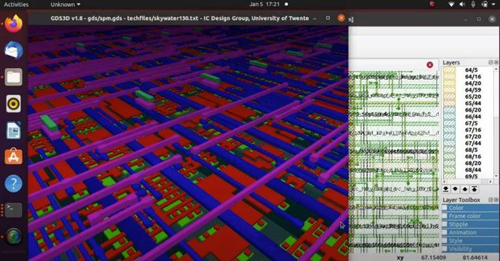
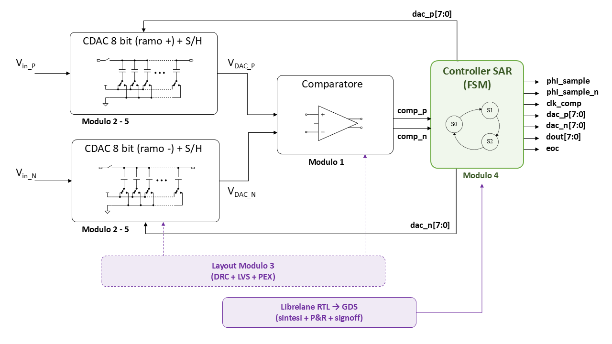

# Modulo 4 — Flusso RTL→GDS con LibreLane e VHDL

## Obiettivi

Al termine di questo modulo lo studente sarà in grado di:

- Descrivere le fasi del flusso di implementazione digitale a standard cell: sintesi logica, floorplan, placement, CTS, routing e signoff
- Scrivere una macchina a stati finiti (FSM) in VHDL e verificarla con simulazione funzionale usando GHDL e GTKWave
- Configurare ed eseguire il flusso `VHDLClassic` di LibreLane su un design reale
- Leggere e interpretare i report di timing (WNS/TNS), area e power prodotti da OpenROAD e OpenSTA
- Navigare la GUI di OpenROAD per analizzare il layout, la congestion map, il clock tree e i percorsi critici
- Visualizzare il GDS finale in KLayout e confrontarlo con il layout manuale del Modulo 3

---

## Il controller SAR nel convertitore

Questo modulo porta il SAR ADC a un nuovo livello di completezza: al CDAC analogico del Modulo 2 e al comparatore Strong-ARM del Modulo 1 — entrambi già dotati di layout fisico dal Modulo 3 — si aggiunge ora il **cervello digitale** del sistema, il controllore FSM che orchestra tutte le fasi di conversione.



Il controller riceve `out_comp_p` e `out_comp_n` dal comparatore Strong-ARM e genera i segnali `phi_sample`, `phi_sample_n`, `dac_p[7:0]`, `dac_n[7:0]`, `dout[7:0]` ed `eoc` — gli stessi segnali che nel Modulo 5 si interfacceranno fisicamente con i blocchi analogici attraverso passgate CMOS.

**Specifiche di riferimento:** 8 bit · $V_{DD} = 1.8\ \text{V}$ · $V_{FS,diff} = 256\ \text{mV}$ · 1 LSB = 1 mV · $V_{CM} = 0.9\ \text{V}$ · $f_s = 2\ \text{MS/s}$ · $f_{CLK,SAR} \approx 20\ \text{MHz}$

---

## Prerequisiti

- Ambiente Docker IIC-OSIC-TOOLS configurato e funzionante → [Modulo 0](../00_setup/)
- Modulo 1 completato: comprensione del comparatore Strong-ARM e dei suoi segnali di interfaccia
- Modulo 2 completato: comprensione dell'architettura CDAC e del principio di charge redistribution
- Modulo 3 completato: familiarità con il flusso DRC/LVS e con il concetto di signoff fisico
- Conoscenza di base di VHDL (tipi, processi, macchine a stati) — anche solo da corso teorico

---

## Struttura del modulo

| File | Argomento | Tempo stimato |
|------|-----------|---------------|
| [`lab01_sar_controller_vhdl.md`](./lab01_sar_controller_vhdl.md) | Flusso a standard cell, FSM VHDL del SAR controller, simulazione GHDL, visualizzazione GTKWave | ~1.75h |
| [`lab02_rtl_to_gds.md`](./lab02_rtl_to_gds.md) | Flusso LibreLane completo, analisi report, GUI OpenROAD, visualizzazione GDS | ~2.5h |

---

## Come lavorare

Ogni lab è diviso in parti numerate con tre elementi ricorrenti:

1. **Teoria e motivazione** — il perché di ogni scelta tecnica, con riferimenti ai moduli precedenti
2. **Procedura guidata** — comandi esatti da eseguire in sequenza nel container
3. **Domande di riflessione** — valori da leggere dai report o da calcolare; i risultati attesi sono indicati con `?`

Il workflow VHDL in questo modulo segue una separazione netta tra due ambienti:

```
VS Code (sistema host)          Container Docker
~/asic/modulo4/                 /foss/designs/modulo4/
  src/sar_controller.vhd   ──►    ghdl -a src/sar_controller.vhd
  src/sar_controller_tb.vhd       ghdl -e sar_controller_tb
  config.json              ──►    librelane --flow VHDLClassic config.json
```

Scrivi e modifica i file VHDL con le estensioni **VHDL LS** e **TerosHDL** di VS Code per il linting in tempo reale; compila, simula e sintetizza nel container.

---

## Avviare l'ambiente

```bash
# Verifica variabili d'ambiente
echo $PDK          # atteso: sky130A
echo $PDK_ROOT     # atteso: /foss/pdks

# Crea le cartelle di lavoro
mkdir -p /foss/designs/modulo4/lab01/src
mkdir -p /foss/designs/modulo4/lab01/sim
mkdir -p /foss/designs/modulo4/lab02/src
```

---

## Riferimenti utili

- [LibreLane — documentazione ufficiale](https://librelane.readthedocs.io/en/stable/)
- [LibreLane — built-in flows (VHDLClassic)](https://librelane.readthedocs.io/en/stable/reference/flows.html)
- [LibreLane — configuration variables](https://librelane.readthedocs.io/en/stable/reference/step_config_vars.html)
- [OpenROAD — GUI guide](https://openroad.readthedocs.io/en/latest/user/GettingStarted.html)
- [GHDL — documentazione ufficiale](https://ghdl.github.io/ghdl/)
- [GTKWave — manuale](http://gtkwave.sourceforge.net/gtkwave.pdf)
- [SKY130A standard cell library — sky130_fd_sc_hd](https://skywater-pdk.readthedocs.io/en/main/contents/libraries/sky130_fd_sc_hd/README.html)
