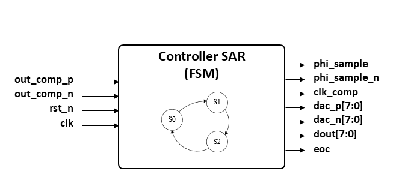
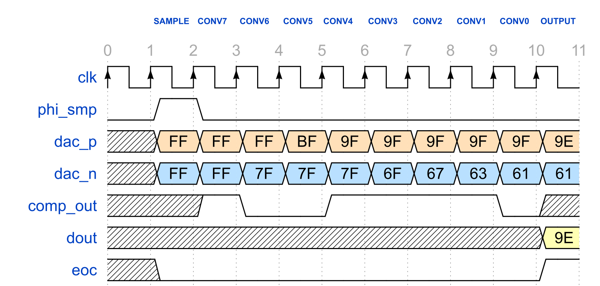
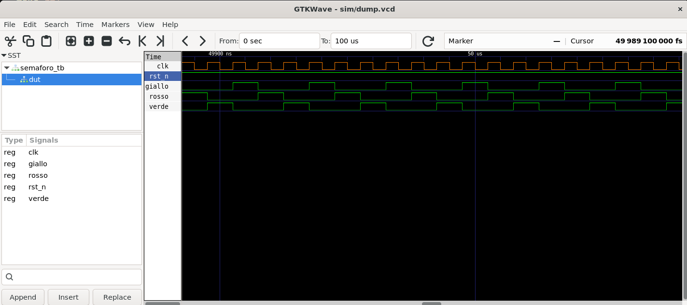
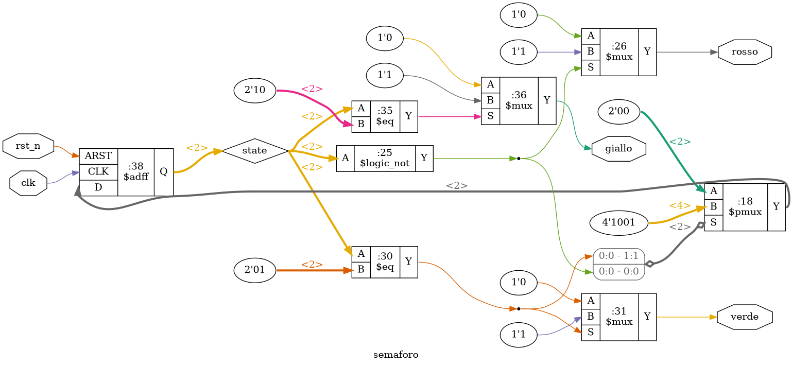
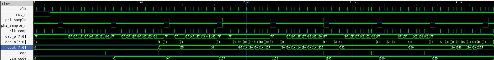
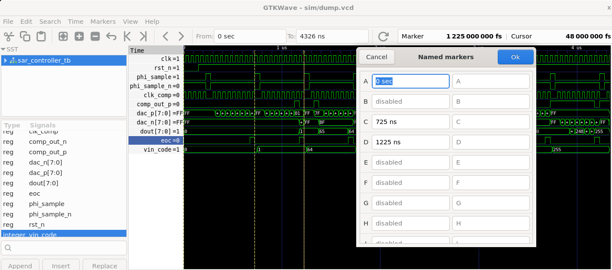

# Lab 1 — SAR Controller in VHDL: dalla FSM alla simulazione

**Tempo stimato:** 2 ore  
**Cartella di lavoro:** `/foss/designs/modulo4/lab01/`

---

## Obiettivo

In questo lab progetteremo il **controllore digitale del SAR ADC**: la FSM (Finite State Machine) che orchestra tutte le fasi di conversione — campionamento, iterazione bit a bit, lettura del risultato. Prima di scrivere codice, introdurremo il flusso di implementazione digitale a standard cell e ragioneremo insieme sull'architettura del controller attraverso uno schema a blocchi. Per familiarizzare con il flusso di lavoro (Makefile, GHDL, GTKWave, Yosys) useremo prima un esempio semplice — un semaforo a tre stati — poi passeremo al design del SAR controller.

Al termine saprai:
- Descrivere le sei fasi del flusso RTL→GDS e il ruolo di ciascuno strumento
- Usare il Makefile per compilare, simulare e visualizzare schemi di un design VHDL
- Disegnare e giustificare l'interfaccia di un modulo digitale a partire dalle specifiche del sistema
- Scrivere una FSM in VHDL con tipo enumerato, processo sincrono e uscita combinatoria
- Configurare GTKWave per visualizzare segnali in formato esadecimale e analizzare il timing della conversione

---

## Struttura delle cartelle

```bash
mkdir -p /foss/designs/modulo4/lab01/src
mkdir -p /foss/designs/modulo4/lab01/esempi/semaforo/src

cd /foss/designs/modulo4/lab01
```

```
/foss/designs/modulo4/lab01/
├── Makefile                        ← copiato da utils/GHDL_Digital_sim/
├── src/
│   ├── sar_controller.vhd          ← design under test (da completare)
│   └── sar_controller_tb.vhd      ← testbench
├── sim/
│   └── dump.vcd                    ← forme d'onda (generato da GHDL)
├── build/                          ← file intermedi (generato da make)
└── esempi/
    └── semaforo/
        ├── Makefile                ← copiato da utils/GHDL_Digital_sim/
        └── src/
            ├── semaforo.vhd
            └── semaforo_tb.vhd
```

---

## Parte 0 — Il flusso digitale a standard cell

Prima di entrare nel design del controller, è utile capire il contesto in cui questo blocco verrà implementato. Il flusso a standard cell è la metodologia di riferimento per la sintesi di logica digitale in un processo CMOS — ed è esattamente quello che LibreLane eseguirà automaticamente nel Lab 2 a partire dal VHDL che scriviamo oggi.

### 0.1 Cosa sono le standard cell — collegamento al Modulo 2

Nel Modulo 2 hai esplorato la struttura del PDK SKY130A e visualizzato in KLayout il layout di alcune celle della libreria `sky130_fd_sc_hd`: un inverter (`inv_1`), un flip-flop D (`dff_1`), un gate NAND. Ricordi le caratteristiche geometriche che le distinguevano dalle celle analogiche?

- **Altezza fissa:** tutte le celle della libreria `sky130_fd_sc_hd` hanno la stessa altezza di 2.72 µm, definita dal pitch delle righe di celle
- **Power rail in met1:** i rail `VDD` e `GND` corrono in orizzontale al bordo superiore e inferiore di ogni cella, e si connettono automaticamente quando le celle sono affiancate
- **Larghezza variabile:** varia a passi discreti (multipli del pitch di 0.46 µm) in funzione della complessità logica della cella
- **Pin di segnale su li/met1:** gli ingressi e le uscite di segnale sono accessibili sul layer `li1` (local interconnect) o `met1`

Quella libreria di celle — inverter, buffer, NAND, NOR, flip-flop, multiplexer, gate complessi — è il vocabolario con cui lo strumento di sintesi **Yosys** descriverà qualsiasi funzione logica specificata in VHDL o Verilog. Il tuo compito come progettista è scrivere il comportamento desiderato (RTL); Yosys sceglie autonomamente quali celle usare e in che quantità.

### 0.2 La catena RTL→GDS in sei fasi

Il percorso dal codice VHDL al file GDS pronto per la fonderia passa attraverso sei fasi. Nel Lab 2 le eseguiremo tutte con un singolo comando di LibreLane; qui ne capiamo il contenuto.

```
[RTL VHDL]
    │
    │  1. SINTESI LOGICA  ──  Yosys + plugin GHDL
    │     Il codice VHDL viene analizzato (GHDL), ottimizzato e mappato
    │     sulle standard cell SKY130A. Output: netlist di gate (.v)
    ▼
[Netlist gate-level — standard cell SKY130A]
    │
    │  2. FLOORPLAN  ──  OpenROAD
    │     Si definiscono: dimensioni del die, posizione dei pin di I/O,
    │     power delivery network (ring di alimentazione + power rail).
    ▼
[Die area + power ring + pin placement]
    │
    │  3. PLACEMENT  ──  OpenROAD
    │     Le celle vengono posizionate all'interno del die minimizzando
    │     la lunghezza dei fili stimata. Output: DEF con coordinate celle.
    ▼
[Celle posizionate nel die]
    │
    │  4. CLOCK TREE SYNTHESIS (CTS)  ──  OpenROAD
    │     Viene costruito un albero bilanciato di buffer per distribuire
    │     il clock a tutti i flip-flop con skew minimo.
    ▼
[Clock distribuito — skew controllato]
    │
    │  5. ROUTING  ──  OpenROAD
    │     I fili di segnale vengono tracciati sui layer metallici
    │     rispettando le design rule del PDK. Output: DEF rutato + GDS.
    ▼
[Layout completo — DEF + GDS]
    │
    │  6. SIGNOFF  ──  Magic + Netgen + OpenSTA + KLayout
    │     DRC: verifica design rule · LVS: netlist vs layout
    │     Timing: setup/hold su tutti i path · IR drop: caduta di tensione
    ▼
[GDS verificato — pronto per la fonderia]
```

> 💡 Questo è lo stesso flusso che nel Modulo 3 hai eseguito **manualmente** con Magic, Netgen e il Makefile — ma applicato a un blocco analogico. LibreLane automatizza l'intero percorso per i blocchi digitali, con la stessa filosofia ma senza intervento manuale tra le fasi.

### 0.3 Cosa fa LibreLane — e il flow VHDLClassic

LibreLane orchestra la catena RTL→GDS con un unico comando e un file di configurazione `config.json`. Il flow predefinito (`Classic`) accetta Verilog; il flow `VHDLClassic` aggiunge GHDL come frontend: il codice VHDL viene analizzato e pre-sintetizzato da GHDL prima di essere passato a Yosys per la mappatura sulle celle SKY130A.

```bash
# Flow per design Verilog (Lab 2, a titolo comparativo):
librelane --flow Classic config.json

# Flow per design VHDL — quello che useremo:
librelane --flow VHDLClassic config.json
```

### 0.4 Perché il controller SAR è un buon primo design

Il SAR controller è un circuito ideale per introdurre il flusso a standard cell per due ragioni:

- **Dimensione contenuta:** la FSM ha 11 stati e 8 bit di uscita DAC — dopo sintesi produce circa 40–60 flip-flop equivalenti e qualche centinaio di gate combinatori. Il flusso completo si conclude in pochi minuti.
- **Interfaccia diretta con i blocchi analogici già progettati:** i pin `out_comp_p`, `out_comp_n`, `phi_sample`, `dac_p`, `dac_n` corrispondono esattamente ai segnali del comparatore (Modulo 1) e del CDAC (Modulo 2). Nel Modulo 5 questi pin verranno connessi fisicamente.

---

## Parte 1 — Architettura del SAR controller: ragionamento a schema a blocchi

Prima di scrivere una riga di VHDL, costruiamo insieme l'interfaccia del controller ragionando dalle specifiche del sistema verso il modulo digitale.

### 1.1 Dai requisiti di sistema all'interfaccia

Riprendiamo le specifiche del SAR ADC:

- **Architettura:** charge redistribution differenziale, 8 bit
- **Clock SAR:** $f_{CLK} \approx 20\ \text{MHz}$, periodo $T_{CLK} = 50\ \text{ns}$
- **Conversione:** 10 cicli di clock (1 sample + 8 convert + 1 output)
- **Frequenza di campionamento:** $f_s = 2\ \text{MS/s}$

Ragiona su queste domande prima di guardare la soluzione:

**D1.** Il controller deve sapere se il valore analogico convertito è maggiore o minore della tensione di prova generata dal DAC. Chi produce questa informazione? Quanti bit ha?

**D2.** Il CDAC del Modulo 2 ha un ramo Vinp e un ramo Vinn, ciascuno con 8 condensatori. Ogni condensatore può avere la piastra inferiore connessa a VDD o a GND. Quanti segnali di controllo deve produrre il controller per pilotare un singolo ramo? E per entrambi?

**D3.** Come il sistema esterno (ad esempio un microcontrollore che usa l'ADC) può sapere che la conversione è terminata e che il risultato è valido?

**D4.** Durante la fase di campionamento il passgate di ingresso deve essere chiuso. Chi controlla il passgate? Quanti bit ha questo segnale di controllo?

**D5.** Qual è la relazione tra `dac_p[7:0]` e `dac_n[7:0]` nella procedura di switching monotonica? Sono sempre complementari bit per bit?

> ⚠️ Rifletti su D5 con attenzione: con la **procedura di switching monotonica** adottata nel progetto, `dac_p` e `dac_n` NON sono sempre complementari bit a bit. Durante ST_SAMPLE entrambi valgono `11111111`: tutte le piastre inferiori sono connesse a Vref. Durante la conversione, ad ogni ciclo viene abbassata **una sola piastra di uno solo dei due rami** — il ramo la cui tensione di top plate è più alta. Se VOUTP > VOUTN (out_comp_p=`'1'`): si abbassa una piastra del ramo positivo, `dac_p` e `dac_n` per quel bit diventano rispettivamente `'1'` e `'0'`. Se VOUTP < VOUTN (out_comp_p=`'0'`): si abbassa una piastra del ramo negativo, `'0'` e `'1'`. Alla fine della conversione, `dac_p` + `dac_n` (come interi) = 255 (ogni bit è andato a uno dei due rami), ma non necessariamente `dac_n = NOT dac_p`.

### 1.2 Schema a blocchi dell'interfaccia

Mettendo insieme le risposte, l'interfaccia del controller è:



```

  Ingressi:                        Uscite:
  clk         — clock SAR (20 MHz) phi_sample   — '1'=sample, '0'=conversione
  rst_n       — reset asincrono,   phi_sample_n — complemento di phi_sample
                attivo basso       clk_comp     — NOT(clk) AND phi_sample_n:
  out_comp_p  — uscita positiva                   clock del comparatore Strong-ARM
                comparatore        dac_p[7:0]   — piastre inferiori CDAC ramo Vinp
                ('1' = Vinp>Vinn)  dac_n[7:0]   — piastre inferiori CDAC ramo Vinn
  out_comp_n  — uscita negativa    dout[7:0]    — risultato conversione (8 bit)
                comparatore        eoc          — end-of-conversion (impulso 1 ciclo)
```

### 1.3 Le fasi operative e la FSM

Il controller attraversa tre fasi per ogni conversione:

**SAMPLE** (1 ciclo):
- `phi_sample = '1'` → passgate chiuso, Vin campionato sulla top plate del CDAC
- `dac_p = 11111111`, `dac_n = 11111111`: **tutte le piastre inferiori di entrambi i rami connesse a Vref**
- Questo è il requisito della procedura monotonica: il campionamento avviene sulla top plate mentre le bottom plate sono a Vref

**CONVERT7 — comparazione gratuita** (1 ciclo, ST_CONV7):
- `phi_sample = '0'` → passgate aperto, top plate floating (carica conservata)
- **Nessuna commutazione del CDAC**: `dac_p` e `dac_n` rimangono `11111111`
- Il comparatore Strong-ARM valuta direttamente VOUTP vs VOUTN: questa è la **comparazione gratuita**, che non richiede commutazione e non consuma energia nel CDAC
- Il risultato sarà letto nel ciclo successivo

**CONVERT** (7 cicli, da ST_CONV6 a ST_CONV0):
- `phi_sample = '0'`, conversione bit per bit dall'MSB all'LSB
- Per ogni bit $i$ (da 7 a 1), letto il risultato `out_comp_p` della comparazione precedente:
  - Se `out_comp_p = '1'` (VOUTP > VOUTN): **bit $i$ = 1**, abbassa la piastra $i$ del ramo negativo: `dac_p(i)` resta `'1'`, `dac_n(i)` diventa `'0'`
  - Se `out_comp_p = '0'` (VOUTP < VOUTN): **bit $i$ = 0**, abbassa la piastra $i$ del ramo positivo: `dac_p(i)` diventa `'0'`, `dac_n(i)` resta `'1'`
- Ad ogni ciclo si abbassa **una sola piastra di uno solo dei due rami** — la procedura è monotonica: le piastre scendono da Vref a GND, mai il contrario

**OUTPUT** (1 ciclo):
- Si decide il bit 0 (LSB) dalla comparazione precedente con la stessa regola
- `dout(k) = out_comp_p` per ogni bit: `'1'` quando il ramo positivo era più alto
- `eoc = '1'` per un ciclo: il risultato `dout[7:0]` è valido
- Si torna a SAMPLE per la conversione successiva

La FSM ha **11 stati**: ST_RESET → ST_SAMPLE → ST_CONV7 → ST_CONV6 → ... → ST_CONV0 → ST_OUTPUT → ST_SAMPLE → ...

### 1.4 La pipeline delle decisioni — perché ST_CONV7 è "cieco"

Questo è il punto più sottile della FSM. Osserva la sequenza temporale:

```
Ciclo:         1               2               3               4         ...         9               10
Stato:        SAMPLE         CONV7           CONV6           CONV5       ...       CONV0           OUTPUT
              ───────────────────────────────────────────────────────────────────────────────────────────
phi_sample:     1              0               0               0         ...         0               0
CDAC switch: (nessuno)     (nessuno)      bit7 deciso       bit6 dec.             bit1 dec.       bit0 dec.
out_comp_p:  (invalido)      letto!          letto!          letto!      ...       letto!          letto!
                         (comp. gratuita)  (per bit7)      (per bit6)            (per bit1)      (per bit0)
                          
```

In ST_CONV7 il CDAC **non commuta**: le piastre inferiori rimangono tutte a Vref come durante ST_SAMPLE. Il comparatore valuta direttamente VOUTP vs VOUTN — questa è la **comparazione gratuita** che non richiede energia nel CDAC. Il risultato viene letto nel ciclo successivo (ST_CONV6), che decide il bit 7 e commuta la piastra corrispondente.

Ogni ciclo da CONV6 a OUTPUT legge il risultato del ciclo precedente, decide il bit corrispondente e abbassa una piastra di uno dei due rami. Questo produce esattamente 10 cicli per conversione, coerente con $f_s = f_{CLK}/10 = 2\ \text{MS/s}$.

### 1.5 Diagramma di timing per una conversione di esempio

Per $V_{IN+} = 0.930\ \text{V}$, $V_{IN-} = 0.870\ \text{V}$: il segnale differenziale iniziale è $V_{diff,0} = +60\ \text{mV}$.

Con la procedura monotonica il codice atteso è:

$$D = \frac{V_{diff,0}}{2\ \text{mV}} + 127.5 \approx 158 \quad \Rightarrow \quad \texttt{dout = 0x9E = 10011110}$$

Il confronto si basa sulla quantità effettiva $V_{diff,eff} = (2 \cdot D_{target} - 255) - (D_p - D_n)$ in unità di LSB, dove $D_p$ e $D_n$ sono i valori interi di `dac_p` e `dac_n`. Il comparatore restituisce `out_comp_p='1'` quando $V_{diff,eff} > 0$ (VOUTP > VOUTN).



> 💡 **Lettura della tabella:** la colonna `comp.out` mostra il valore di `out_comp_p` valutato nella seconda metà del ciclo (quando `clk_comp=1`). Il valore viene registrato e letto nello stato **successivo** per decidere il bit. Esempio: in CONV7 il comparatore valuta VOUTP vs VOUTN con le piastre ancora tutte a Vref (`dac_p=FF, dac_n=FF`). Risultato `'1'` (VOUTP>VOUTN). Questo viene letto in CONV6, che decide bit7=1 e abbassa `dac_n(7)`: `dac_n` passa da `FF` a `7F`. Poi il comparatore rivaluta con la nuova configurazione.

> 💡 Nota sulla procedura monotonica: `dac_p` e `dac_n` evolvono in modo asimmetrico — ad ogni ciclo **solo un bit di uno solo dei due registri** cambia. A fine conversione `dac_p = 0x9E = 158` e `dac_n = 0x61 = 97`, con `158 + 97 = 255` ✓ (ogni bit è andato a uno dei due rami).

Questo è esattamente il diagramma che vedrai su GTKWave al termine della Parte 4.

---

## Parte 2 — Esempio introduttivo: il semaforo

Prima di affrontare il SAR controller, familiarizziamo con l'intero flusso di lavoro — Makefile, GHDL, GTKWave e Yosys — su un esempio semplice e autocontenuto: un **semaforo a tre stati**. Il design è piccolo abbastanza da produrre schemi leggibili e abbastanza strutturato da mostrare tutti i livelli di astrazione.

### 2.1 Struttura del progetto semaforo

```bash
cp /foss/designs/utils/GHDL_Digital_sim/Makefile \
   /foss/designs/modulo4/lab01/esempi/semaforo/Makefile

cd /foss/designs/modulo4/lab01/esempi/semaforo
make info
```

### 2.2 Il file `semaforo.vhd`

Crea il file `esempi/semaforo/src/semaforo.vhd` in VS Code:

```vhdl
library IEEE;
use IEEE.STD_LOGIC_1164.ALL;

-- =============================================================================
-- Semaforo -- FSM Moore a 3 stati (senza contatore)
-- =============================================================================
-- Ogni stato dura esattamente 1 ciclo di clock.
-- La transizione avviene ad ogni fronte di salita del clock.
-- Design intenzionalmente semplice per mostrare make rtl / make fsm.
--
-- Nota ASIC: nessuna inizializzazione sui segnali.
-- Lo stato iniziale e' imposto esclusivamente dal reset asincrono (rst_n).
-- =============================================================================

entity semaforo is
    port (
        clk    : in  std_logic;
        rst_n  : in  std_logic;
        rosso  : out std_logic;
        verde  : out std_logic;
        giallo : out std_logic
    );
end entity semaforo;

architecture rtl of semaforo is

    type state_t is (ST_ROSSO, ST_VERDE, ST_GIALLO);
    signal state : state_t;

begin

    process(clk, rst_n)
    begin
        if rst_n = '0' then
            state <= ST_ROSSO;
        elsif rising_edge(clk) then
            case state is
                when ST_ROSSO  => state <= ST_VERDE;
                when ST_VERDE  => state <= ST_GIALLO;
                when ST_GIALLO => state <= ST_ROSSO;
                when others    => state <= ST_ROSSO;
            end case;
        end if;
    end process;

    -- Uscite Moore: dipendono solo dallo stato
    rosso  <= '1' when state = ST_ROSSO  else '0';
    verde  <= '1' when state = ST_VERDE  else '0';
    giallo <= '1' when state = ST_GIALLO else '0';

end architecture rtl;
```


### 2.3 Il file `semaforo_tb.vhd`

Crea il file `esempi/semaforo/src/semaforo_tb.vhd` in VS Code:

```vhdl
library IEEE;
use IEEE.STD_LOGIC_1164.ALL;

entity semaforo_tb is
end entity semaforo_tb;

architecture sim of semaforo_tb is

    constant CLK_PERIOD : time := 10 ns;

    signal clk    : std_logic := '0';
    signal rst_n  : std_logic := '0';
    signal rosso  : std_logic;
    signal verde  : std_logic;
    signal giallo : std_logic;

begin

    DUT: entity work.semaforo
        port map (
            clk    => clk,
            rst_n  => rst_n,
            rosso  => rosso,
            verde  => verde,
            giallo => giallo
        );

    clk <= not clk after CLK_PERIOD / 2;

    stimoli: process
    begin
        rst_n <= '0';
        wait for CLK_PERIOD * 3;
        rst_n <= '1';
        -- 3 cicli completi: ROSSO->VERDE->GIALLO->ROSSO->...
        wait for CLK_PERIOD * 10;
        report "Simulazione completata." severity NOTE;
        wait;
    end process;

end architecture sim;
```
> 💡Il Makefile copiato precedentemente nella cartella `esempi/semaforo` riconosce automaticamente il testbench, a patto che il nome del file abbia lo stesso nome del top module, seguito dal suffisso `_tb.vhd`.

### 2.4 Simulazione e visualizzazione forme d'onda

```bash
cd /foss/designs/modulo4/lab01/esempi/semaforo

make        # compila e simula → sim/dump.vcd
make wave   # apre GTKWave
```
Dovresti avere un otuptu sul terminale simile a questo:
```bash
/foss/designs/modulo4/lab01/esempi/semaforo > make sim
--> Analisi sorgenti VHDL (ordine: DUT prima, TB dopo)...
    ghdl -a --std=08: src/semaforo.vhd
    ghdl -a --std=08: src/semaforo_tb.vhd
--> Elaborazione top-level: semaforo_tb...
ghdl -e --std=08 --workdir=build -o build/semaforo_tb semaforo_tb
--> Simulazione (stop: 100us)...
build/semaforo_tb --vcd=sim/dump.vcd --stop-time=100us
src/semaforo_tb.vhd:37:9:@130ns:(report note): Simulazione completata.
build/semaforo_tb:info: simulation stopped by --stop-time @100us
--> VCD generato: sim/dump.vcd
```


In GTKWave aggiungi i segnali `clk`, `rst_n`, `rosso`, `verde`, `giallo` e verifica che la sequenza degli stati sia corretta: dopo il reset si parte da `rosso='1'`, poi 3 cicli dopo `verde='1'`, poi 2 cicli dopo `giallo='1'`, poi si riparte.



### 2.5 Visualizzazione degli schemi con Yosys

Il Makefile include tre target per generare schemi grafici del design. Eseguili in sequenza e osserva le differenze:

```bash
make rtl        # schema RTL comportamentale → build/rtl_semaforo.dot + .pdf
make fsm        # schema con estrazione esplicita FSM → build/fsm_semaforo.dot + .pdf
make synth_view # schema post-sintesi celle generiche → build/synth_semaforo.dot + .pdf
```

Per navigare xdot: **rotella del mouse** per zoom, **click sinistro + drag** per pan.

> ⚠️ Questi target richiedono Yosys con il plugin GHDL — disponibile **nel container IIC-OSIC-TOOLS**, non sul sistema host Windows.

**`make rtl`** — mostra il design come descritto nel VHDL: il registro di stato (`state` come `$adff`), il mux di selezione delle transizioni (`$pmux`) e i tre mux di uscita (`$mux`) per `rosso`, `verde` e `giallo`. Per il semaforo, lo schema è già piccolo e leggibile — è il target più utile per questo design.

**`make fsm`** — in teoria dovrebbe rappresentare il registro di stato come un nodo FSM compatto. In pratica produce lo stesso schema di `make rtl` perché Yosys `fsm_detect` non riconosce i flip-flop con **reset asincrono** (`$adff`) come registri di stato FSM. Poiché il reset asincrono è la scelta corretta per ASIC, questo è un limite strutturale nel nostro contesto. Il target rimane nel Makefile per design futuri dove potrebbe comportarsi diversamente.

**`make synth_view`** — Yosys ottimizza il design e lo mappa su AND, OR, NOT e DFF elementari. Lo schema è più complesso di `make rtl` ma rappresenta più fedelmente la logica che verrà implementata in silicio.

Di seguito un esempio di cosa restituisce il target `make rtl`.



> 💡 **Nota ASIC vs FPGA — inizializzazione dei segnali**
>
> Osserva che nel `semaforo.vhd` il segnale di stato è dichiarato **senza** valore iniziale:
> ```vhdl
> signal state : state_t;   -- corretto per ASIC
> ```
> Su FPGA è comune scrivere `signal state : state_t := ST_ROSSO` per definire il valore di power-on. Su ASIC i flip-flop non hanno un valore di power-on garantito: lo stato iniziale deve essere imposto esclusivamente dal reset (`if rst_n = '0'`). Ricordatelo quando scriverai il SAR controller nella Parte 3.


## Parte 3 — Scrittura del VHDL

### 2.1 Il file `sar_controller.vhd`

Apri VS Code sul sistema host e crea il file `sar_controller.vhd` nella cartella `modulo4/lab01/src/`. Il file è immediatamente visibile nel container come `/foss/designs/modulo4/lab01/src/sar_controller.vhd`.

Sulla base dello schema a blocchi (§1.2), delle fasi operative (§1.3) e del diagramma di timing (§1.5) analizzati nella Parte 1, completa i quattro blocchi TODO del template seguente.
> 💡 Prima di scrivere il codice, **disegna su carta** il diagramma degli stati con le transizioni e le azioni associate a ciascuno stato. La traduzione VHDL è meccanica una volta che lo schema è chiaro. Puoi anche aiutarti con un [tool online](https://madebyevan.com/fsm/) di disegno del diagramma stato-transizione, molto utile ed interessante!

```vhdl
library IEEE;
use IEEE.STD_LOGIC_1164.ALL;

-- =============================================================================
-- SAR ADC Controller — Template
-- =============================================================================
-- Completa l'architettura RTL sulla base dello schema a blocchi e del
-- diagramma di timing analizzati nella Parte 1 del lab.
--
-- Procedura di switching monotonica (Liu et al., JSSC 2010):
--   Campionamento sulla top plate. Bottom plate inizializzate a Vref ('1').
--   Ad ogni bit, una sola piastra di uno solo dei due rami viene abbassata
--   da Vref ('1') a GND ('0') — mai il contrario.
--
-- Polarita' del comparatore:
--   out_comp_p='1' → VOUTP > VOUTN → bit=1 → abbassa ramo negativo (dac_n)
--   out_comp_p='0' → VOUTP < VOUTN → bit=0 → abbassa ramo positivo (dac_p)
--   In entrambi i casi: dac_p_r(k)=out_comp_p, dac_n_r(k)=NOT out_comp_p,
--                        dout_r(k)=out_comp_p
--
-- Interfaccia (non modificare):
--   clk          : clock SAR, ~20 MHz, periodo 50 ns
--   rst_n        : reset asincrono attivo basso
--   out_comp_p   : uscita positiva comparatore ('1' = VOUTP > VOUTN)
--   out_comp_n   : uscita negativa comparatore (per completezza interfaccia)
--   phi_sample   : '1' = campionamento, '0' = conversione
--   phi_sample_n : complemento di phi_sample
--   clk_comp     : clock gated per il comparatore Strong-ARM
--                  = NOT(clk) AND NOT(phi_sample)
--                  '0' durante phi_sample='1' (nessuna valutazione in campionamento)
--                  alterna 0/1 durante la conversione (valutazione sul fronte di salita)
--   dac_p        : bottom plate CDAC ramo Vinp ('1'=Vref, '0'=GND)
--   dac_n        : bottom plate CDAC ramo Vinn ('1'=Vref, '0'=GND)
--   dout         : risultato conversione 8 bit (valido quando eoc='1')
--   eoc          : end-of-conversion, impulso di 1 ciclo di clock
-- =============================================================================

entity sar_controller is
    port (
        clk          : in  std_logic;
        rst_n        : in  std_logic;
        out_comp_p   : in  std_logic;
        out_comp_n   : in  std_logic;
        phi_sample   : out std_logic;
        phi_sample_n : out std_logic;
        clk_comp     : out std_logic;
        dac_p        : out std_logic_vector(7 downto 0);
        dac_n        : out std_logic_vector(7 downto 0);
        dout         : out std_logic_vector(7 downto 0);
        eoc          : out std_logic
    );
end entity sar_controller;

architecture rtl of sar_controller is

    -- -------------------------------------------------------------------------
    -- TODO 1: Tipo enumerato per gli stati e segnali di stato
    --
    -- Definisci il tipo enumerato con tutti gli 11 stati della FSM:
    --   ST_RESET, ST_SAMPLE, ST_CONV7, ST_CONV6 .. ST_CONV0, ST_OUTPUT
    --
    -- Dichiara due segnali di tipo state_t:
    --   - lo stato corrente (aggiornato dal processo sequenziale)
    --   - lo stato prossimo (calcolato dal processo combinatorio)
    --
    -- ⚠️ ASIC vs FPGA: non assegnare un valore iniziale ai segnali di stato.
    -- Lo stato al power-on e' indefinito su ASIC: deve essere imposto
    -- esclusivamente dal segnale di reset asincrono nel processo sequenziale.
    -- -------------------------------------------------------------------------
    -- type state_t is ( ... );
    -- signal state      : state_t;
    -- signal next_state : state_t;

    -- -------------------------------------------------------------------------
    -- TODO 2: Segnali interni per le uscite registrate
    --
    -- Le uscite verso il CDAC e il comparatore devono essere stabili per
    -- tutto il ciclo di clock: usa registri interni aggiornati solo sul
    -- fronte di salita del clock, collegati alle porte di uscita tramite
    -- assegnazioni concorrenti (vedi TODO 3).
    --
    -- Hai bisogno di un registro interno anche per phi_sample, perche' il
    -- segnale clk_comp e' derivato da esso in modo combinatorio (TODO 3).
    --
    -- Per i controlli del CDAC: entrambi i registri partono dal valore
    -- corrispondente a "tutte le piastre inferiori a Vref" al reset —
    -- questo e' il requisito della procedura di switching monotonica.
    -- -------------------------------------------------------------------------
    -- signal phi_sample_r : std_logic;
    -- signal dac_p_r      : std_logic_vector(7 downto 0);
    -- signal dac_n_r      : std_logic_vector(7 downto 0);
    -- signal dout_r       : std_logic_vector(7 downto 0);

begin

    -- -------------------------------------------------------------------------
    -- TODO 3: Assegnazioni concorrenti verso le porte di uscita
    --
    -- Collega ogni registro interno alla porta di uscita corrispondente.
    --
    -- phi_sample_n e' il complemento logico di phi_sample: si ricava
    -- direttamente dal registro interno phi_sample_r.
    --
    -- clk_comp e' un segnale combinatorio (non registrato): deve essere
    -- alto solo quando il clock e' basso E il campionamento non e' attivo.
    -- In questo modo il comparatore Strong-ARM viene triggerato nella seconda
    -- meta' di ogni ciclo di clock, dopo che il CDAC si e' assestato.
    --
    -- Il risultato di conversione dout e' registrato: viene aggiornato
    -- bit per bit durante gli stati di conversione e rimane stabile a EOC.
    -- -------------------------------------------------------------------------


    -- =========================================================================
    -- TODO 4: Processi della FSM
    --
    -- Implementa la macchina a stati con lo stile a due o tre processi.
    --
    -- --- PROCESSO A: registro di stato (sequenziale) -----------------------
    -- Aggiorna lo stato corrente al fronte di salita del clock.
    -- Al reset asincrono (rst_n='0') porta lo stato a ST_RESET.
    -- Altrimenti, a ogni fronte di salita: stato_corrente <= stato_prossimo.
    --
    -- --- PROCESSO B: logica di stato prossimo (combinatorio) ---------------
    -- Calcola il valore di stato_prossimo in funzione dello stato corrente.
    -- Assegna sempre un valore di default (stato_prossimo <= stato_corrente)
    -- prima del case, poi sovrascrivilo nei rami che cambiano stato.
    -- La sequenza degli stati e':
    --
    --   ST_RESET  → ST_SAMPLE (transizione immediata)
    --   ST_SAMPLE → ST_CONV7
    --   ST_CONV7  → ST_CONV6
    --   ST_CONV6  → ST_CONV5
    --   ...
    --   ST_CONV0  → ST_OUTPUT
    --   ST_OUTPUT → ST_SAMPLE (riparte la conversione successiva)
    --   altri     → ST_RESET  (sicurezza: stato non previsto)
    --
    -- --- PROCESSO C: aggiornamento dei registri di uscita (sequenziale) ----
    -- Aggiorna phi_sample_r, dac_p_r, dac_n_r, dout_r e eoc al fronte di
    -- salita del clock, in base allo stato CORRENTE e all'ingresso out_comp_p.
    -- Al reset asincrono: campionamento disattivato, CDAC a Vref, EOC basso.
    -- Per ogni ciclo attivo, eoc vale '0' per default e viene alzato a '1'
    -- solo in ST_OUTPUT.
    --
    -- Comportamento atteso in ogni stato:
    --
    --   ST_RESET
    --     Inizializzazione: tutti i controlli del CDAC al valore di Vref,
    --     campionamento disattivato, risultato azzerato.
    --
    --   ST_SAMPLE
    --     Abilita il campionamento: il passgate si chiude, la top plate
    --     segue il segnale analogico di ingresso. Riporta i controlli del
    --     CDAC al valore iniziale (Vref) in preparazione al switching
    --     monotonico. Azzera il registro del risultato.
    --
    --   ST_CONV7
    --     Disattiva il campionamento: il passgate si apre, la top plate
    --     mantiene la carica campionata. Il CDAC non commuta in questo stato:
    --     e' la comparazione gratuita, in cui il comparatore valuta il
    --     differenziale iniziale tra i due rami senza aver consumato energia.
    --     Il risultato di questa comparazione sara' letto nello stato successivo.
    --
    --   ST_CONV6 .. ST_CONV0
    --     Ogni stato legge il risultato della comparazione avvenuta nello
    --     stato precedente. Se il comparatore indica VOUTP > VOUTN: bit=1,
    --     abbassa la piastra del ramo negativo per il bit appena deciso,
    --     ramo positivo invariato. Se VOUTP < VOUTN: bit=0, abbassa la
    --     piastra del ramo positivo, ramo negativo invariato. Il bit viene
    --     anche registrato nel risultato parziale. La stessa regola si
    --     applica identicamente in tutti e sette gli stati di conversione.
    --
    --   ST_OUTPUT
    --     Legge il risultato dell'ultima comparazione (bit 0) con la stessa
    --     regola. Asserisce EOC per un solo ciclo per segnalare che il
    --     risultato in dout e' valido. Al ciclo successivo si torna a
    --     ST_SAMPLE per avviare la conversione successiva.
    -- =========================================================================


end architecture rtl;
```


> ⚠️ L'istruzione `when others => state <= ST_RESET;` non è opzionale: senza di essa alcuni tool di sintesi generano latch non voluti per gli stati non enumerati esplicitamente.

---

## Parte 4 — Testbench e simulazione GHDL

### 4.1 Il file `sar_controller_tb.vhd`

Il testbench simula una tensione differenziale di ingresso e un **modello comportamentale del comparatore** che risponde dinamicamente allo stato del CDAC a ogni ciclo di conversione. In questo modo è possibile verificare che `dout` converga al codice atteso per ogni ingresso.

**Modello del comparatore per la procedura monotonica:**

Con la procedura monotonica, entrambi i rami del CDAC partono da `11111111` (Vref) e si abbassano unilateralmente a ogni bit. Il differenziale effettivo tra le due top plate evolve come:

$$V_{diff,eff} = (2 \cdot D_{target} - 255) - (\mathtt{dac\_p} - \mathtt{dac\_n})$$

dove $D_{target}$ è il codice digitale corrispondente alla tensione di ingresso analogica. Il comparatore restituisce `out_comp_p='1'` quando $V_{diff,eff} > 0$ (VOUTP > VOUTN).

Questo modello è verificabile analiticamente. Per $D_{target} = 200$ ($V_{diff,0} > 0$): inizialmente $V_{diff,eff} = 2 \times 200 - 255 = 145 > 0$, dopo la comparazione gratuita il bit 7 viene deciso come 1 e si abbassa `dac_n[7]`, portando $V_{diff,eff}$ a $145 - 128 = 17 > 0$, e così via fino alla convergenza su `dout = 0xC8 = 200`.

```vhdl
library IEEE;
use IEEE.STD_LOGIC_1164.ALL;
use IEEE.NUMERIC_STD.ALL;

-- =============================================================================
-- Testbench per sar_controller — procedura monotonica — verifica funzionale
-- =============================================================================
-- Il testbench simula un ingresso differenziale analogico tramite un modello
-- comportamentale del comparatore che usa lo stato corrente del CDAC.
--
-- Modello comparatore:
--   out_comp_p='1' se V_diff_eff > 0, dove:
--   V_diff_eff = (2*vin_code - 255) - (to_integer(dac_p) - to_integer(dac_n))
--
--   Inizialmente dac_p=dac_n=255 → V_diff_eff = 2*vin_code - 255.
--   Per vin_code > 127: V_diff_eff > 0 (VOUTP > VOUTN) → out_comp_p='1'.
--   Per vin_code < 128: V_diff_eff < 0 (VOUTP < VOUTN) → out_comp_p='0'.
--   Ad ogni decisione di bit il differenziale converge verso zero.
--
-- Codici di test e risultati attesi:
--   vin_code =   0 → dout = 0x00   (minimo)
--   vin_code =   1 → dout = 0x01   (quasi minimo)
--   vin_code =  64 → dout = 0x40
--   vin_code = 127 → dout = 0x7F   (sotto metascala)
--   vin_code = 128 → dout = 0x80   (sopra metascala)
--   vin_code = 192 → dout = 0xC0
--   vin_code = 200 → dout = 0xC8
--   vin_code = 255 → dout = 0xFF   (massimo)
-- =============================================================================
entity sar_controller_tb is
end entity sar_controller_tb;

architecture sim of sar_controller_tb is

    constant T_CLK : time := 50 ns;   -- 20 MHz

    -- Codici di test: coprono i casi limite e valori tipici
    type input_array_t is array (natural range <>) of integer;
    constant VIN_CODES : input_array_t := (0, 1, 64, 127, 128, 192, 200, 255);

    signal clk          : std_logic := '0';
    signal rst_n        : std_logic := '0';
    signal comp_out_p   : std_logic := '0';
    signal comp_out_n   : std_logic := '1';

    signal phi_sample   : std_logic;
    signal phi_sample_n : std_logic;
    signal clk_comp     : std_logic;
    signal dac_p        : std_logic_vector(7 downto 0);
    signal dac_n        : std_logic_vector(7 downto 0);
    signal dout         : std_logic_vector(7 downto 0);
    signal eoc          : std_logic;

    -- Codice target corrente per il modello di comparatore
    signal vin_code     : integer := 0;

begin

    dut: entity work.sar_controller
        port map (
            clk          => clk,
            rst_n        => rst_n,
            out_comp_p   => comp_out_p,
            out_comp_n   => comp_out_n,
            phi_sample   => phi_sample,
            phi_sample_n => phi_sample_n,
            clk_comp     => clk_comp,
            dac_p        => dac_p,
            dac_n        => dac_n,
            dout         => dout,
            eoc          => eoc
        );

    clk_gen: process
    begin
        clk <= '0'; wait for T_CLK / 2;
        clk <= '1'; wait for T_CLK / 2;
    end process clk_gen;

    rst_gen: process
    begin
        rst_n <= '0';
        wait for 3 * T_CLK;
        rst_n <= '1';
        wait;
    end process rst_gen;

    -- =========================================================================
    -- Modello comportamentale del comparatore — procedura monotonica
    -- =========================================================================
    -- Il processo e' combinatorio: si aggiorna ogni volta che dac_p, dac_n
    -- o vin_code cambiano. Il ritardo di 1 ns modella la latenza di
    -- rigenerazione del comparatore Strong-ARM (trascurabile rispetto a
    -- T_CLK = 50 ns).
    --
    -- Guardia metavalue: prima del reset dac_p e dac_n sono 'U'. Il
    -- controllo sulle prime cifre evita warning da to_integer su valori
    -- indefiniti.
    -- =========================================================================
    comp_model: process(dac_p, dac_n, vin_code)
        variable dp, dn : integer;
    begin
        if (dac_p(0) = '0' or dac_p(0) = '1') and
           (dac_n(0) = '0' or dac_n(0) = '1') then
            dp := to_integer(unsigned(dac_p));
            dn := to_integer(unsigned(dac_n));
            -- out_comp_p = '1' se VOUTP > VOUTN, cioe' V_diff_eff > 0
            if (2*vin_code - 255) > (dp - dn) then
                comp_out_p <= '1' after 1 ns;
                comp_out_n <= '0' after 1 ns;
            else
                comp_out_p <= '0' after 1 ns;
                comp_out_n <= '1' after 1 ns;
            end if;
        end if;
    end process comp_model;

    -- =========================================================================
    -- Sequenza di stimoli e verifica
    -- =========================================================================
    stimoli: process
        variable n_pass, n_fail : integer := 0;
    begin
        -- Attende il rilascio del reset
        wait until rst_n = '1';
        wait for T_CLK;

        -- Ciclo su tutti i codici di test
        for k in VIN_CODES'range loop
            -- Imposta il codice target per il modello di comparatore
            vin_code <= VIN_CODES(k);

            -- Attende la fine della conversione (EOC)
            wait until rising_edge(eoc);
            -- Mezzo ciclo per lasciare stabilizzare dout
            wait for T_CLK / 2;

            -- Verifica: dout deve essere uguale al codice atteso
            if to_integer(unsigned(dout)) = VIN_CODES(k) then
                report "PASS: vin=" & integer'image(VIN_CODES(k)) &
                       " -> dout=0x" & integer'image(to_integer(unsigned(dout)))
                severity note;
                n_pass := n_pass + 1;
            else
                report "FAIL: vin=" & integer'image(VIN_CODES(k)) &
                       " -> dout=0x" & integer'image(to_integer(unsigned(dout))) &
                       " (atteso 0x" & integer'image(VIN_CODES(k)) & ")"
                severity error;
                n_fail := n_fail + 1;
            end if;

            -- Attende un ciclo prima della prossima conversione
            wait for T_CLK;
        end loop;

        -- Riepilogo finale
        report "Simulazione completata: " &
               integer'image(n_pass) & " PASS, " &
               integer'image(n_fail) & " FAIL"
        severity note;

        wait for T_CLK * 2;
        std.env.finish;
    end process stimoli;

end architecture sim;
```

**Analisi RTL**

Dopo aver visto gli schemi del semaforo, prova `make rtl` anche sul SAR controller:

```bash
cd /foss/designs/modulo4/lab01
make rtl
```

Lo schema risultante è molto più grande e difficile da leggere. Perché? Il semaforo ha 3 stati e 2 segnali di uscita a 1 bit. Il SAR controller ha 11 stati e 24 bit di registri di uscita (`dac_p_r`, `dac_n_r`, `dout_r`): Yosys genera un mux separato per ogni bit di ogni registro in ogni stato, producendo centinaia di nodi nel grafo.

> ⚠️ La sintesi effettuata da Yosys della descrizione RTL transita sempre attraverso un tool di parsing (incluso in Yosys) dal VHDL al verilog. Nel porcesso di "traduzione", la struttura originale del codice RTL si può perdere, risultando in una descrizione che a livello funzionale è equivalente a quella originale in VHDL, ma dove i blocchi logici di design sono meno riconoscibili. Questo porta ad uno schematico che può risultare più caotico e difficile da analizzare visivamente. Per risolvere il problema, visognerebbe scrivere descrivere il design nativamente in Verilog.

---

### 4.2 Lancio della simulazione

Copia il Makefile nella cartella del progetto, poi lancia la compilazione e la simulazione:

```bash
cd /foss/designs/modulo4/lab01

cp /foss/designs/utils/GHDL_Digital_sim/Makefile Makefile

make sim
```

GHDL analizza i file nell'ordine corretto (prima `sar_controller.vhd`, poi `sar_controller_tb.vhd`), elabora il top-level e avvia la simulazione. Al termine del ciclo sugli 8 codici di test trovi nel terminale i messaggi di verifica:

```
sar_controller_tb.vhd:XX:@XXXns:(report note): PASS: vin=0 -> dout=0x0
sar_controller_tb.vhd:XX:@XXXns:(report note): PASS: vin=1 -> dout=0x1
...
sar_controller_tb.vhd:XX:@XXXns:(report note): PASS: vin=255 -> dout=0x255
sar_controller_tb.vhd:XX:@XXXns:(report note): Simulazione completata: 8 PASS, 0 FAIL
```

> 💡 **Nota sul formato del log:** i messaggi mostrano `dout=0x127` invece di `dout=0x7F` per `vin=127`. Il prefisso `0x` è aggiunto manualmente dalla stringa nel `report`, ma `integer'image` stampa sempre il valore in decimale — non in esadecimale. La verifica funzionale `to_integer(unsigned(dout)) = VIN_CODES(k)` è corretta indipendentemente dal formato del messaggio. Per ottenere la rappresentazione esadecimale vera, VHDL-2008 mette a disposizione la funzione `to_hstring(dout)` della libreria `STD.TEXTIO`.

Se compare un messaggio `FAIL`, controlla il timing della FSM: la causa più comune è una lettura di `out_comp_p` nello stato sbagliato (ad esempio leggere in ST_CONV7 invece che in ST_CONV6).

> 💡 Il testbench usa `std.env.finish` (VHDL-2008) per terminare la simulazione dopo tutti i test. Questa funzione è supportata da GHDL con `--std=08` — il flag già incluso nel Makefile del corso.

### 4.3 Analisi delle forme d'onda in GTKWave

```bash
make wave
```

GTKWave apre automaticamente il file `sim/dump.vcd`. Aggiungi i segnali rilevanti nell'ordine suggerito:

```
clk
rst_n
phi_sample
phi_sample_n
clk_comp
comp_out_p
dac_p[7:0]    ← visualizza in formato Hex
dac_n[7:0]    ← visualizza in formato Hex
dout[7:0]     ← visualizza in formato Hex
eoc
vin_code      ← valore differenziale di ingresso simulato
```

> 💡 Per visualizzare un bus in un formato specifico: tasto destro sul segnale → **Data Format → scelta del formato (es. HEX, decimal,...)**.



**Cosa osservare — conversione di `vin_code=200` (0xC8 = 11001000):**

Identifica nel waveform la conversione corrispondente a `vin_code=200` e verifica la progressione bit per bit di `dac_p` e `dac_n`. Il processo di bisezione deve convergere al codice `0xC8`:

| Stato | `comp_out_p` | bit deciso | `dac_p` | `dac_n` |
|-------|-------------|------------|---------|---------|
| SAMPLE | — | — | `0xFF` | `0xFF` |
| CONV7 (gratuita) | `1` | — | `0xFF` | `0xFF` |
| CONV6 | `1` | bit7=1 | `0xFF` | `0x7F` |
| CONV5 | `1` | bit6=1 | `0xFF` | `0x3F` |
| CONV4 | `0` | bit5=0 | `0xDF` | `0x3F` |
| CONV3 | `0` | bit4=0 | `0xCF` | `0x3F` |
| CONV2 | `1` | bit3=1 | `0xCF` | `0x37` |
| CONV1 | `0` | bit2=0 | `0xCB` | `0x37` |
| CONV0 | `0` | bit1=0 | `0xC9` | `0x37` |
| OUTPUT | `0` | bit0=0 | `0xC8` | `0x37` |

A EOC: `dout = 0xC8 = 200` ✓. Nota che `dac_p + dac_n = 0xC8 + 0x37 = 0xFF = 255`: ogni peso binario è andato a uno dei due rami, come previsto dalla procedura monotonica.

> 💡 Ingrandisci la zona attorno alla transizione SAMPLE → CONV7: in ST_CONV7 né `dac_p` né `dac_n` cambiano — è la comparazione gratuita. La prima commutazione avviene solo in ST_CONV6.

### 4.4 Verifica della temporizzazione

Misura con i cursori di GTKWave il tempo tra due fronti di salita consecutivi di `eoc` a regime. Deve essere esattamente $10 \times T_{CLK} = 500\ \text{ns}$ (1 SAMPLE + 1 CONV7 + 7 CONV + 1 OUTPUT).



**D4.4** Quanti cicli di clock impiega la prima conversione a partire dal rilascio del reset? È diverso dalla conversione a regime? Perché?

---

## Parte 5 — Domande di riflessione

**5.1** La procedura di switching monotonica abbassa una sola piastra per ciclo, mai il contrario. Qual è il vantaggio energetico rispetto all'architettura convenzionale a 3 vie (VDD/VCM/GND), dove la commutazione di ogni bit potrebbe richiedere di alzare una piastra da GND a VCM?

**5.2** In ST_CONV7 il CDAC non commuta — è la "comparazione gratuita". Cosa succederebbe alla conversione se invece si commutasse già in ST_CONV7 (come in un'architettura convenzionale a 2 vie)?

**5.3** Il segnale `clk_comp = NOT(clk) AND NOT(phi_sample)` viene portato direttamente al comparatore Strong-ARM. Perché si usa `NOT(clk)` invece di `clk` diretto? In quale finestra temporale il comparatore valuta il differenziale del CDAC?

**5.4** Osserva in GTKWave la conversione di `vin_code=128`. Quante commutazioni compie `dac_p` e quante `dac_n`? La loro somma come interi vale sempre 255 a fine conversione? Verifica anche per `vin_code=0` e `vin_code=255`.

**5.5** Il modello di comparatore nel testbench usa la formula $V_{diff,eff} = (2 \cdot D_{target} - 255) - (\text{dac\_p} - \text{dac\_n})$. Deriva questa formula a partire dal principio di conservazione della carica sul nodo di top plate del CDAC differenziale durante la procedura di switching monotonica.

---

## Verso il Lab 2

Il SAR controller che hai scritto e simulato in questo lab è il punto di partenza del prossimo [`LAB02_rtl_to_gds`](./lab02_rtl_to_gds.md), dove LibreLane tradurrà automaticamente il VHDL in layout fisico su SKY130A. Il file `sar_controller.vhd` viene passato direttamente al flow `VHDLClassic` senza modifiche.

Nel Modulo 5 questo stesso controller, uscito dal flusso RTL→GDS come blocco hardened, verrà connesso fisicamente in xschem al CDAC e al comparatore Strong-ARM per simulare l'intero ADC a livello misto analogico-digitale.
