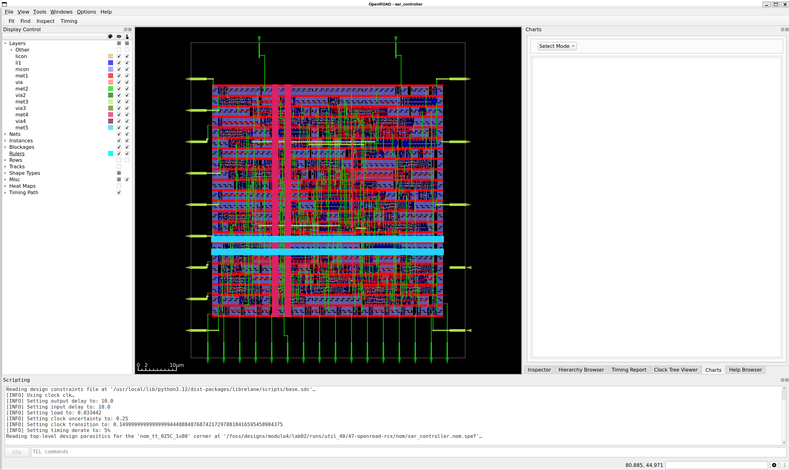
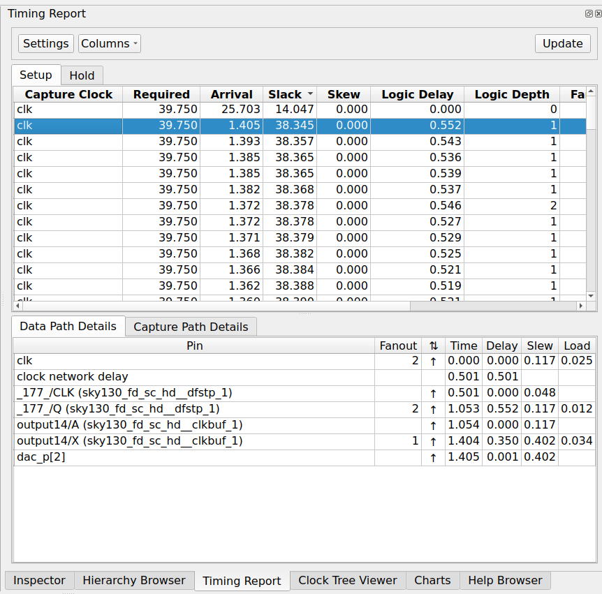
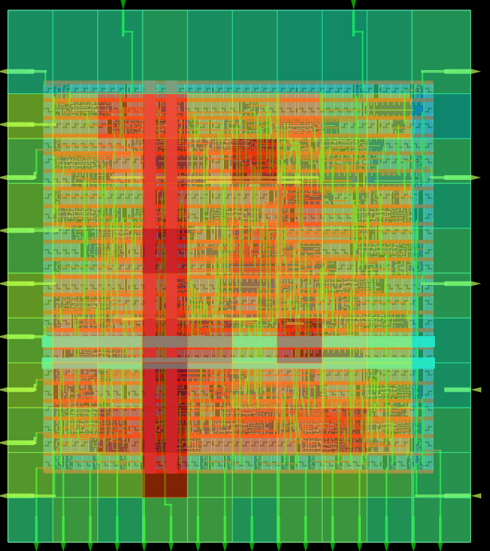
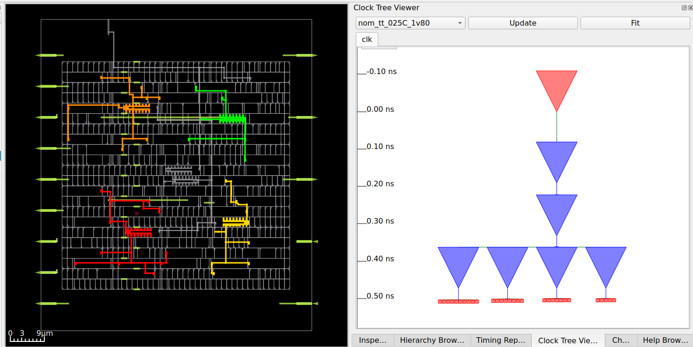
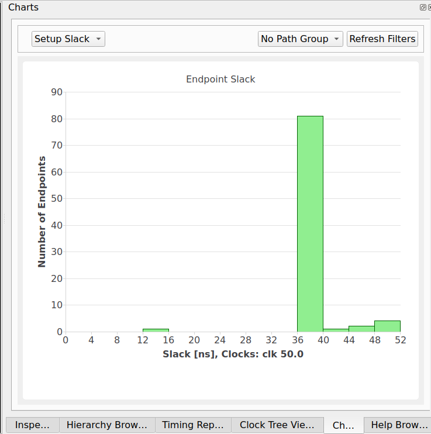
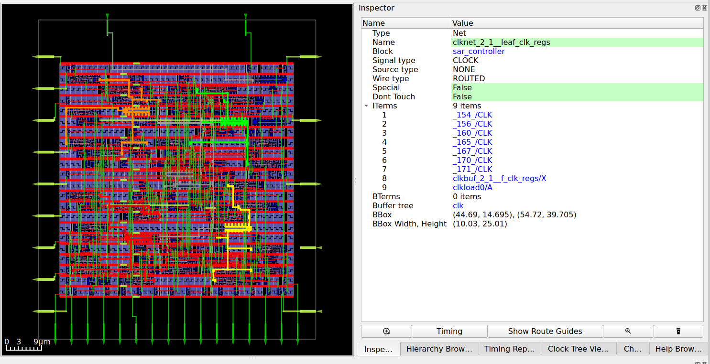
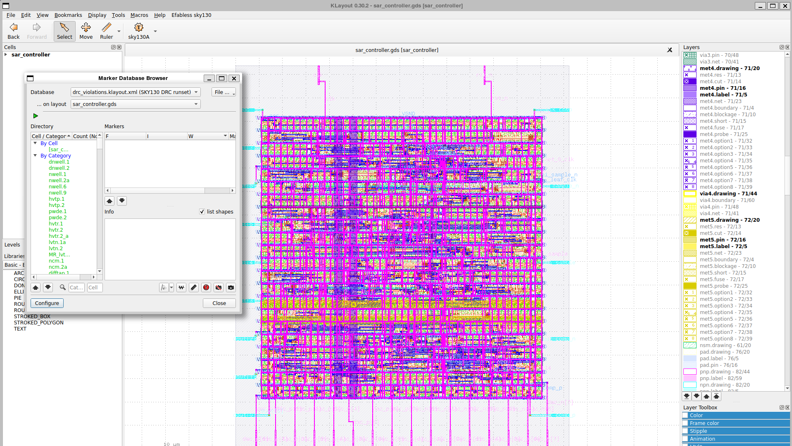
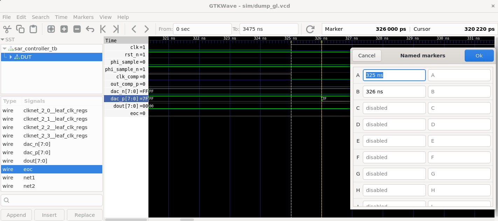

# Lab 2 — Dal VHDL al GDS con LibreLane

**Tempo stimato:** 2.5 ore  
**Cartella di lavoro:** `/foss/designs/modulo4/lab02/`

---

## Obiettivo

In questo lab eseguiremo il flusso RTL→GDS completo sul SAR controller scritto nel Lab 1, usando il flow `VHDLClassic` di LibreLane. Analizzeremo i report di timing, area e power prodotti automaticamente, esploreremo il layout con la GUI di OpenROAD e visualizzeremo il GDS finale in KLayout. Al termine saprai leggere i dati quantitativi che un ingegnere usa ogni giorno per valutare se un design è pronto per la produzione.

Al termine saprai:
- Configurare un progetto LibreLane (`config.json`, `pin_order.cfg`) per un design VHDL
- Eseguire il flow `VHDLClassic` completo e in forma parziale con i flag `--to`/`--from`
- Leggere i report di timing WNS/TNS per corner multipli, area e power
- Navigare la GUI di OpenROAD: layout fisico, timing report, congestion map, clock tree
- Visualizzare e verificare il GDS in KLayout con il Marker Browser per il debug DRC

---

## Struttura delle cartelle

```bash
mkdir -p /foss/designs/modulo4/lab02/src
cd /foss/designs/modulo4/lab02
```

```
/foss/designs/modulo4/lab02/
├── src/
│   └── sar_controller.vhd      ← copiato dal lab01 (vedi sotto)
├── config.json                 ← configurazione LibreLane
├── pin_order.cfg               ← posizionamento pin di I/O
└── runs/                       ← generato da LibreLane
    └── RUN_XXXX/               ← una cartella per ogni run
        ├── XX-StepName/
        │   ├── *.log           ← log del tool
        │   └── *.rpt           ← report (timing, area, power)
        ├── metrics.csv         ← riepilogo di tutte le metriche
        └── final/
            ├── gds/            ← GDS finale
            ├── nl/             ← netlist gate-level
            └── pnl/            ← netlist gate-level con alimentazione
```

Copia il sorgente VHDL dal lab01:

```bash
cp /foss/designs/modulo4/lab01/src/sar_controller.vhd \
   /foss/designs/modulo4/lab02/src/
```

> ⚠️ LibreLane richiede che i file sorgente siano **nella cartella `src/`** del progetto — non symlink, non path assoluti. Copia sempre il file fisicamente.

---

## Parte 1 — Configurazione del progetto LibreLane

### 1.1 Il file `config.json`

Il file `config.json` è l'unico punto di configurazione dell'intero flusso. Crealo direttamente da terminale nel container:

```bash
cd /foss/designs/modulo4/lab02

cat > config.json << 'EOF'
{
    "DESIGN_NAME": "sar_controller",
    "VHDL_FILES": "dir::src/*.vhd",
    "CLOCK_PORT": "clk",
    "CLOCK_PERIOD": 50.0,
    "IO_PIN_ORDER_CFG": "dir::pin_order.cfg",
    "FP_CORE_UTIL": 40,
    "FP_ASPECT_RATIO": 1,
    "PL_TARGET_DENSITY_PCT": 45
}
EOF
```

Esaminiamo i parametri chiave:

| Parametro | Valore | Significato |
|-----------|--------|-------------|
| `DESIGN_NAME` | `sar_controller` | Nome del top-level — deve corrispondere al nome dell'entità VHDL |
| `VHDL_FILES` | `dir::src/*.vhd` | Tutti i file `.vhd` nella cartella `src/`; `dir::` indica un path relativo alla posizione di `config.json` |
| `CLOCK_PORT` | `clk` | Nome del pin di clock nel design — usato da OpenSTA per l'analisi di timing |
| `CLOCK_PERIOD` | `50.0` | Periodo del clock in **nanosecondi** — 50 ns corrisponde a 20 MHz |
| `IO_PIN_ORDER_CFG` | `dir::pin_order.cfg` | File di posizionamento dei pin; obbligatorio per evitare un bug noto al routing globale |
| `FP_CORE_UTIL` | `40` | Utilizzo del core in percentuale — le celle standard occupano il 40% dell'area del die |
| `FP_ASPECT_RATIO` | `1` | Rapporto altezza/larghezza del die — 1 = die quadrato |
| `PL_TARGET_DENSITY_PCT` | `45` | Densità target per il placement (leggermente superiore a `FP_CORE_UTIL` per margine di routing) |

> 💡 `FP_CORE_UTIL = 40` è un buon punto di partenza per una FSM di questa dimensione. Un valore troppo alto (>70%) riduce lo spazio per il routing e può causare violazioni DRC o fallimenti del router. Nella Parte 6 esploreremo l'effetto di modificare questo parametro in modo efficiente, senza rilanciare il flusso completo ogni volta.

> 💡 **Come funziona `FP_CORE_UTIL`:** il flusso conosce l'area totale delle celle sintetizzate $A_{celle}$ dopo la sintesi Yosys. Da questo calcola le dimensioni del die:
> $$A_{die} = \frac{A_{celle}}{FP\_CORE\_UTIL / 100}$$
> Con `FP_CORE_UTIL = 40` il die viene dimensionato in modo che le celle occupino il 40% del core, lasciando il 60% libero per il routing. L'"Utilizzo effettivo" riportato da `summaryVHDL.py` è sempre più alto del valore impostato perché include anche le celle di filler, decap e tap cell inserite da OpenROAD dopo il placement — celle che non fanno parte del design logico ma occupano comunque area nel layout fisico.
>
> `FP_CORE_UTIL` e `PL_TARGET_DENSITY_PCT` sono due parametri distinti e indipendenti: il primo determina le dimensioni del die, il secondo è il target di densità del placement (default 45%). Quando si usa un `FP_CORE_UTIL` alto il die si restringe, e se la densità effettiva supera il target del 45% OpenROAD segnala il warning `[GPL-0302]` e alza automaticamente la densità di placement per completare il flusso.

### 1.2 Il file `pin_order.cfg`

Il file `pin_order.cfg` definisce su quale lato del die si trovano i pin di I/O e in quale ordine. La scelta tiene conto dell'integrazione con i blocchi analogici nel Modulo 5:

- **Lato Nord:** segnali di controllo globali (clock, reset)
- **Lato Est:** interfaccia con il comparatore Strong-ARM — `out_comp_p` e `out_comp_n` in ingresso, `phi_sample` in uscita
- **Lato Sud:** controllo del CDAC — `dac_p` e `dac_n` verso le piastre inferiori dei condensatori
- **Lato Ovest:** dati di uscita verso il sistema digitale — `dout` e `eoc`

```bash
cat > pin_order.cfg << 'EOF'
#N
clk
rst_n

#E
out_comp_p
out_comp_n
phi_sample
phi_sample_n
clk_comp

#S
dac_p.*
dac_n.*

#W
dout.*
eoc
EOF
```

> 💡 La sintassi `dac_p.*` usa espressioni regolari: tutti i pin che iniziano con `dac_p` (cioè `dac_p[0]` ... `dac_p[7]`) vengono posizionati in sequenza sul lato Sud, senza doverli elencare uno per uno.

> 💡 `phi_sample_n` e `clk_comp` sono sul lato Est insieme alle altre porte di interfaccia con il comparatore — `clk_comp` è il clock gated che triggera il comparatore Strong-ARM nella seconda metà di ogni ciclo, e `phi_sample_n` è il suo segnale di abilitazione complementare.

### 1.3 Differenza tra flow Classic e VHDLClassic

I due flow divergono **solo nella fase di sintesi** — il backend OpenROAD (P&R, CTS, routing, signoff) è identico:

```
Classic (Verilog):              VHDLClassic (VHDL):
  Verilog RTL                     VHDL RTL
      │                               │
      │  Yosys (sintesi diretta)      │  GHDL (analisi + pre-sintesi)
      │                               ▼
      │                           Netlist Verilog intermedia
      │                               │
      │                               │  Yosys (mappatura su sky130_fd_sc_hd)
      ▼                               ▼
  Netlist gate-level SKY130A      Netlist gate-level SKY130A
      │                               │
      └──────────────┬────────────────┘
                     │  Da qui il flusso è identico per entrambi
                     ▼
             OpenROAD — Floorplan
                     ▼
             OpenROAD — Placement
                     ▼
             OpenROAD — CTS
                     ▼
             OpenROAD — Routing
                     ▼
             OpenROAD — RCX + STA (timing signoff)
                     ▼
             Magic — DRC  |  Netgen — LVS
                     ▼
             GDS verificato
```

Il flow `VHDLClassic` aggiunge GHDL come frontend prima di Yosys e rimuove lo step di linting Verilog (non applicabile al VHDL). Tutto il resto — placement, routing, verifica — è esattamente lo stesso di `Classic`.

---

## Parte 2 — Lancio del flusso

### 2.1 Esecuzione completa

```bash
cd /foss/designs/modulo4/lab02
librelane --flow VHDLClassic config.json
```

Il flusso esegue oltre 70 step organizzati in fasi logiche, stampando a terminale il progresso in tempo reale. La struttura ad alto livello è:

```
Sintesi
  └─ Yosys.VHDLSynthesis (GHDL + Yosys combinati)

Floorplan e PDN
  └─ OpenROAD.Floorplan → CustomIOPlacement → GeneratePDN

Placement
  └─ OpenROAD.GlobalPlacement → DetailedPlacement → ResizeTimingPreCTS

Clock Tree Synthesis
  └─ OpenROAD.CTS → ResizeTimingPostCTS

Routing
  └─ OpenROAD.GlobalRouting → DetailedRouting → RCX

Timing signoff
  └─ OpenROAD.STAPostPNR (tutti i corner PVT)

Verifica fisica
  └─ Magic.DRC → Netgen.LVS → Checker.SetupViolations → Checker.HoldViolations
     → Misc.ReportManufacturability

GDS export
  └─ Magic.GDSStream → final/
```

L'ultima riga del log riporta l'esito dei tre check di signoff:

```
* Antenna  Passed ✅
* LVS      Passed ✅
* DRC      Passed ✅
Flow complete.
```

> ⚠️ Per il SAR controller il flusso completo impiega **circa 1 minuto** su una macchina moderna. Non interrompere il processo: LibreLane cattura uno snapshot del design dopo ogni step, quindi se il processo viene interrotto occorre ripartire dall'inizio.

### 2.2 Esecuzione parziale — flag `--to`, `--from`, `--run-tag`

LibreLane permette di fermarsi a uno step intermedio e di ripartire da lì in seguito. Questa funzionalità è preziosa per esplorare l'effetto di un parametro senza rifare ogni volta l'intero flusso.

**Fermarsi dopo la sintesi** — utile per leggere subito le statistiche di sintesi senza attendere il P&R:

```bash
librelane --flow VHDLClassic config.json \
    --to Yosys.VHDLSynthesis \
    --run-tag synth_only
```

Il flag `--run-tag` assegna un nome fisso alla cartella del run invece del timestamp automatico: i risultati finiscono in `runs/synth_only/` anziché in `runs/RUN_2025-XX-XX_...`. Questo rende i run confrontabili e facilmente referenziabili.

**Riprendere da un punto intermedio** — utile per sperimentare con parametri di floorplan o placement senza rifare la sintesi:

```bash
librelane --flow VHDLClassic config.json \
    --from Yosys.VHDLSynthesis \
    --with-initial-state runs/synth_only/*/state_out.json \
    --run-tag util_55 \
    -c FP_CORE_UTIL=55
```

Il flag `-c` sovrascrive un parametro di `config.json` dalla riga di comando, senza modificare il file. Questo è il modo corretto per confrontare più run con un solo parametro che varia: il `config.json` rimane il punto di riferimento e ogni run è documentato dal suo `--run-tag`.

> 💡 Nella Parte 6 useremo esattamente questo pattern per l'esperimento su `FP_CORE_UTIL`: si fa la sintesi una volta sola e si riparte da lì per ogni valore di densità, risparmiando la maggior parte del tempo di esecuzione.

### 2.3 Warnings — ignorabili e spunti di approfondimento

Alcuni warnings sono puramente tecnici e non richiedono azione. Altri nascondono concetti interessanti che vale la pena capire.

**Warnings puramente ignorabili:**

| Warning | Spiegazione |
|---------|-------------|
| `library sky130_fd_sc_hd__tt_025C_1v80 already exists` | OpenROAD tenta di caricare lo stesso corner più volte. Ignorabile. |
| `[DRT-0349] LEF58_ENCLOSURE with no CUTCLASS is not supported` | Limitazione del parser LEF con SKY130A. Ignorabile. |
| `Threshold for Threshold-surpassing long wires is not set` | Il controllo sulla lunghezza massima dei fili non ha un default sensato — viene saltato. Ignorabile. |
| `[GPL-0302] Target density 0.4500 is too low for the available free area` | Appare quando si usa un valore alto di `FP_CORE_UTIL` (es. 55%): il die è più piccolo e la densità effettiva delle celle supera il target di placement del 45% (default di `PL_TARGET_DENSITY_PCT`). OpenROAD alza automaticamente la densità e prosegue — il flusso non fallisce. Ignorabile se il run termina con DRC ✅. |
| `Net "net3" has 1 sinks. Skipping... (and 1 similar warnings)` | Il Clock Tree Synthesis salta le reti con un solo sink perché non hanno bisogno di bilanciamento — un albero con un solo ramo non ha skew per definizione. Nel SAR controller le due reti interessate sono probabilmente `clk_comp` e `phi_sample_n`, segnali generati combinatoriamente e distribuiti a un solo punto. Il timing è comunque verificato dal STA. Ignorabile. |
| `Cell 'sar_controller' has (1) input pin(s) without antenna gate information` | La porta `out_comp_n` è dichiarata nella entity VHDL ma non usata internamente — solo `out_comp_p` pilota la logica di decisione. Yosys la elimina durante la sintesi lasciando un pin di ingresso senza gate connesso. OpenROAD lo segnala perché non può verificare la protezione dalle antenne di processo. Ignorabile per un design standalone. |

> ⚠️ **Warnings non ignorabili:** qualsiasi `ERROR` o `CRITICAL`, e warnings che menzionano short circuit, LVS mismatch, o slack negativo. Se il flusso termina con `SUCCESS` ma `metrics.csv` riporta valori non-zero per DRC o LVS, il design non è pronto.

> 💡 **Testbench in `src/`:** è possibile tenere `sar_controller_tb.vhd` nella stessa cartella `src/` senza problemi. Il flow `VHDLClassic` usa GHDL come frontend di Yosys e analizza solo l'unità di design specificata da `DESIGN_NAME` nel `config.json` — il testbench non viene mai letto né sintetizzato.

---

**Approfondimento 1 — Vincoli di timing: PNR_SDC_FILE e SIGNOFF_SDC_FILE**

Il formato **SDC** (Synopsys Design Constraints) è lo standard di settore per i vincoli di timing — l'equivalente del file `.xdc` di Vivado, ma limitato ai soli vincoli temporali (in Vivado l'`.xdc` include anche i vincoli di pin fisici, qui separati nel `pin_order.cfg`).

LibreLane usa due file SDC distinti con ruoli diversi:

- **`PNR_SDC_FILE`**: vincoli usati durante il Place & Route. Guidano l'ottimizzatore di OpenROAD durante il placement e il routing — il tool cerca di soddisfarli fisicamente.
- **`SIGNOFF_SDC_FILE`**: vincoli usati durante il timing signoff finale (OpenSTA). Possono essere più stringenti dei vincoli P&R per garantire un margine aggiuntivo prima del tapeout.

Per il SAR controller, crea il file nella cartella del lab02 (stessa posizione di `config.json`):

```bash
cd /foss/designs/modulo4/lab02

cat > sar_controller.sdc << 'EOF'
# Clock: periodo 50 ns = 20 MHz
create_clock -name clk -period 50.0 [get_ports clk]

# Reset asincrono: nessun path di timing su rst_n
set_false_path -from [get_ports rst_n]

# Input delay: out_comp_p/out_comp_n devono essere stabili entro 5 ns dal fronte
set_input_delay -clock clk -max 5.0 [get_ports out_comp_p]
set_input_delay -clock clk -max 5.0 [get_ports out_comp_n]

# Output delay: DAC e phi_sample devono stabilizzarsi entro 2 ns
set_output_delay -clock clk -max 2.0 \
    [get_ports {dac_p[*] dac_n[*] phi_sample dout[*] eoc}]
EOF
```

Poi aggiungi al `config.json`:

```json
"PNR_SDC_FILE":     "dir::sar_controller.sdc",
"SIGNOFF_SDC_FILE": "dir::sar_controller.sdc"
```

> 💡 Confronto con Vivado/XDC: `create_clock` ha sintassi identica in entrambi gli ambienti. `set_input_delay` e `set_output_delay` corrispondono ai vincoli di timing su porte fisiche che in Vivado si aggiungono dopo i vincoli di pin. `set_false_path` è lo stesso — dice al tool di ignorare quel percorso nell'analisi di timing.

---

**Approfondimento 2 — Configurazione avanzata dei pin**

Il warning `Overriding minimum distance 0.1 with 0.42` indica che LibreLane ha aumentato automaticamente la spaziatura minima tra i pin sul lato Nord per evitare overlap. La spaziatura, il layer metallico e le dimensioni dei pin si configurano nel `config.json`, non nel `pin_order.cfg` (che controlla solo l'ordinamento e il lato):

| Parametro | Default | Significato |
|-----------|---------|-------------|
| `FP_IO_MIN_DISTANCE` | `0.5` | Distanza minima tra pin adiacenti in µm |
| `FP_IO_HMETAL` | `4` | Layer metallico per i pin sui lati N/S (orizzontali) |
| `FP_IO_VMETAL` | `3` | Layer metallico per i pin sui lati E/W (verticali) |
| `FP_IO_HEXTEND` | `0` | Estensione dei pin orizzontali oltre il bordo del die in µm |
| `FP_IO_VEXTEND` | `0` | Estensione dei pin verticali oltre il bordo del die in µm |

Per il SAR controller, il posizionamento orientato al mixed-signal del Modulo 5 potrebbe beneficiare di pin più estesi (più facili da connettere con il routing analogico) e su layer bassi (met2/met3 per connessioni locali):

```json
"FP_IO_HMETAL":      3,
"FP_IO_VMETAL":      2,
"FP_IO_MIN_DISTANCE": 1.0
```

> 💡 In SKY130A il layer met2 è preferibile per i pin di interfaccia con blocchi analogici perché è accessibile sia da Magic (per il routing manuale del Modulo 5) sia da OpenROAD. Il met4 (default per N/S) è usato tipicamente per i power ring e può creare conflitti in layout mixed-signal.

---

**Approfondimento 3 — Analisi IR drop**

Il warning `VSRC_LOC_FILES was not given a value` indica che l'analisi IR drop — la caduta di tensione resistiva lungo la rete di alimentazione — è stata eseguita senza sapere dove si trovano i pad di alimentazione fisici. Per un design standalone (non integrato in un chip completo con padframe) è accettabile.

La mappa IR drop è visualizzabile nella GUI di OpenROAD:

```bash
librelane --last-run --flow OpenInOpenROAD config.json
```

```
Menu: View → Heat Map → IR Drop (Static)
```

La mappa mostra la tensione effettiva su ogni punto della rete di alimentazione: zone rosse indicano cadute di tensione elevate (pericolose per i margini di timing), zone blu indicano tensioni vicine a $V_{DD}$.

Per il SAR controller — un design molto piccolo con pochi flip-flop — la mappa sarà quasi uniformemente blu: la corrente assorbita è trascurabile e la rete di alimentazione non presenta cadute significative. Il valore didattico è capire il concetto e sapere dove trovare l'analisi per design più grandi.

Per abilitare un'analisi più accurata in futuro, il file `VSRC_LOC_FILES` definisce le coordinate dei pad VDD sulla griglia:

```json
"VSRC_LOC_FILES": "dir::vsrc.loc"
```

con `vsrc.loc` che contiene le coordinate dei punti di connessione alla rete di alimentazione esterna — informazione disponibile solo quando il design viene integrato nel chip completo nel Modulo 6.

### 2.4 Troubleshooting — problemi comuni

Se il flusso si interrompe con un errore, le prime righe utili si trovano nelle ultime 20–30 righe del log a terminale. Ecco i casi più frequenti per un design delle dimensioni del SAR controller:

**Design troppo piccolo per la PDN**

Una FSM piccola può generare un die troppo ridotto per poter inserire i power ring di alimentazione. Il sintomo è un errore al passo `OpenROAD.GeneratePDN`. Soluzione: forzare le dimensioni assolute del die:

```json
"FP_SIZING": "absolute",
"DIE_AREA": "0 0 150 150"
```

Questo definisce un die di 150×150 µm. Con `FP_SIZING=absolute` il parametro `FP_CORE_UTIL` viene ignorato.

**Design troppo piccolo per il routing**

Sintomo: errore al passo `OpenROAD.GlobalRouting` con messaggi di congestione. Le celle sono troppo dense per i fili di connessione. Soluzione: ridurre la densità:

```json
"FP_CORE_UTIL": 30,
"PL_TARGET_DENSITY_PCT": 35
```

**Violazioni di hold timing (WNS hold < 0)**

Sintomo: il report di timing post-CTS mostra slack negativo sui path di hold — i dati arrivano al flip-flop troppo presto rispetto al fronte di clock successivo. Accade tipicamente su path combinatori molto corti. Soluzione: aumentare il margine di hold nel resizer:

```json
"PL_RESIZER_HOLD_SLACK_MARGIN": 0.8
```

Il valore di default è 0.1 ns; portarlo a 0.8 ns aggiunge buffer di ritardo sui path corti, aumentando il ritardo minimo e risolvendo le violazioni di hold.

**Il tool non trova il clock**

Sintomo: avviso `Cannot find any clock` durante la CTS. Causa: il nome del pin di clock nel `config.json` non corrisponde al nome del port nell'entità VHDL. Verifica che `"CLOCK_PORT": "clk"` corrisponda esattamente al nome dichiarato nell'entità.

---

## Parte 3 — Analisi dei report

### 3.1 Il tool `summaryVHDL.py`

Il modo più rapido per esplorare i risultati è `summaryVHDL.py`, lo script del corso installato in `$PATH` tramite `.designinit`. È una versione estesa di `summary.py` di Matt Venn, adattata al flow `VHDLClassic` e ai run con tag personalizzato:

```bash
cd /foss/designs/modulo4/lab02

# Metriche chiave: area, timing, power, violazioni
summaryVHDL.py --metrics

# Errori e violazioni soltanto (check rapido post-run)
summaryVHDL.py --summary

# Timing su tutti i corner in forma tabulare
summaryVHDL.py --timing

# Statistiche di sintesi Yosys (celle, area)
summaryVHDL.py --yosys-report

# Apre il GDS finale in KLayout
summaryVHDL.py --gds

# Run specifico con tag
summaryVHDL.py --runs runs/util_30 --metrics

# Confronto tra due run
summaryVHDL.py --compare runs/util_30 runs/util_55
```

Ogni chiamata senza `--runs` agisce sulla cartella di run **modificata più di recente** dentro `runs/` — indipendentemente dal nome. Questo significa che se hai eseguito prima un run con timestamp automatico e poi uno con `--run-tag test`, `summaryVHDL.py` punta a `runs/test` (l'ultimo eseguito), non all'ultimo `RUN_YYYY-...`. Il file `metrics.csv` su cui si basa si trova in `runs/<tag>/final/metrics.csv`.

### 3.2 Report di timing — WNS, TNS e corner

Il modo più rapido per leggere il timing su tutti i corner in una volta è:

```bash
summaryVHDL.py --timing
```

L'output è una tabella con una riga per corner e le colonne principali:

| Colonna | Significato |
|---------|-------------|
| **Hold Worst Slack** | Margine peggiore sui path di hold (min delay). Deve essere ≥ 0. |
| **Reg to Reg Paths** (Hold) | Slack hold sui soli percorsi registro→registro. |
| **Hold TNS** | Somma degli slack negativi su tutti i path di hold violati. Deve essere 0. |
| **Setup Worst Slack** | Margine peggiore sui path di setup (max delay). Deve essere ≥ 0. |
| **Reg to Reg Paths** (Setup) | Slack setup sui soli percorsi registro→registro. |
| **Setup TNS** | Somma degli slack negativi su tutti i path di setup violati. Deve essere 0. |

> ⚠️ **Tutti i valori della tabella sono slack (margine residuo), non ritardi di percorso.** Un valore di 48 ns nella colonna "Reg to Reg Paths" (Setup) non significa che il percorso dura 48 ns — significa che il percorso ha 48 ns di margine rispetto al vincolo. Il ritardo effettivo del percorso è $T_{CLK} - \text{slack} = 50 - 48 \approx 2\ \text{ns}$.

> 💡 **Cosa sono i corner di timing?** Un corner è una combinazione di condizioni operative. Il corner `ss_100C_1v60` (Slow-Slow, 100°C, 1.6V) è il caso peggiore per il setup: transistor lenti, temperatura alta, tensione bassa. Il corner `ff_n40C_1v95` (Fast-Fast, −40°C, 1.95V) è il caso peggiore per l'hold: transistor veloci, temperatura bassa, tensione alta. Un design corretto deve rispettare il timing su tutti i corner.

**Dati del run del SAR controller** (corner nominale `nom_tt_025C_1v80`, run `util_55`):

| Metrica | Valore | Interpretazione |
|---------|--------|-----------------|
| Setup Worst Slack | 14.03 ns | Percorso critico assoluto con ~36 ns di ritardo — percorso da/verso pin I/O, vincolato con margini conservativi dall'SDC di default |
| Setup WS — reg→reg | 47.94 ns | Percorso critico tra flip-flop con ~2 ns di ritardo — la logica di transizione di stato della FSM è molto veloce |
| Hold Worst Slack | 0.345 ns | Margine hold minimo positivo — nessuna violazione |
| Setup TNS | 0 ns | Nessuna violazione di setup |
| Hold TNS | 0 ns | Nessuna violazione di hold |

Il divario tra Setup WS assoluto (14.03 ns) e Setup WS reg→reg (47.94 ns) è spiegato dall'assenza del file SDC: senza `set_input_delay` e `set_output_delay` definiti, LibreLane applica vincoli di I/O molto conservativi che fanno sembrare i percorsi verso i pin più critici dei percorsi interni. Aggiungendo il file `sar_controller.sdc` dell'Approfondimento 1 (§2.3) con i valori appropriati, il Setup WS assoluto si avvicinerebbe al valore reg→reg.

Il corner peggiore per il setup è `max_ss_100C_1v60` (Slow-Slow, 100°C, 1.6V) con Setup WS = 13.47 ns. Il corner peggiore per l'hold è `min_ff_n40C_1v95` (Fast-Fast, −40°C, 1.95V) con Hold WS = 0.117 ns — margine sottile ma positivo. Tutti i 10 corner passano.

Per leggere il report dettagliato del corner nominale post-routing:

```bash
# Individua l'ultimo run con timestamp (se non hai usato --run-tag)
LAST_RUN=$(ls -dt runs/RUN_* 2>/dev/null | head -1)

# Setup (max delay): verifica che i dati arrivino prima del fronte di clock
cat $LAST_RUN/48-openroad-stapostpnr/nom_tt_025C_1v80/max.rpt | head -60

# Hold (min delay): verifica che i dati non arrivino troppo presto
cat $LAST_RUN/48-openroad-stapostpnr/nom_tt_025C_1v80/min.rpt | head -60

# Verifica rapida degli slack (tutti devono essere MET)
grep -i "slack" $LAST_RUN/48-openroad-stapostpnr/nom_tt_025C_1v80/max.rpt | head -10
```

Se hai usato `--run-tag`, sostituisci `$LAST_RUN` con il path del tag:

```bash
cat runs/RUN_2026-04-22_15-25-41/48-openroad-stapostpnr/nom_tt_025C_1v80/max.rpt | head -60
```

Le metriche fondamentali in sintesi:

$$\text{WNS} = \min_{\text{tutti i path}} \left( T_{CLK} - T_{setup} - T_{path} \right) \geq 0 \quad \Rightarrow \quad \text{timing clean}$$

$$\text{TNS} = \sum_{\text{path con slack}<0} \text{slack} = 0 \quad \Rightarrow \quad \text{nessuna violazione}$$

### 3.3 Report di area

Il report di sintesi si trova in:

```bash
summaryVHDL.py --yosys-report
```

> ⚠️ `summary.py --yosys-report` non funziona con il flow `VHDLClassic` perché cerca il pattern `*-yosys-synthesis/` che non esiste — nel flow VHDL lo step si chiama `yosys-vhdlsynthesis`. `summaryVHDL.py` gestisce automaticamente entrambi i casi.

**Dati del run del SAR controller:**

| Metrica | Valore |
|---------|--------|
| Numero totale di celle | 108 |
| di cui flip-flop (`dfrtp_2` + `dfstp_2`) | 30 (14 + 16) |
| di cui celle combinatorie | 78 |
| Area totale delle celle | 1443.88 µm² |
| di cui elementi sequenziali | 788.26 µm² (54.59%) |

Il report elenca anche le singole celle istanziate — vale la pena leggerle perché dicono molto su come Yosys ha implementato la FSM:

- **`dfrtp_2` × 14** — flip-flop D con **reset** asincrono attivo basso (`_r` = reset, `_t` = true polarity, `_p` = positive edge). Usati per i registri che si azzerano al reset: i 4 bit di stato FSM, `dac_p_r[7:0]`, `dout_r[7:0]`, `phi_sample_r`, `eoc` — tutti segnali che al reset vanno a `'0'`.
- **`dfstp_2` × 16** — flip-flop D con **set** asincrono attivo basso (`_s` = set). Usati per `dac_n_r[7:0]` e i bit aggiuntivi che al reset devono andare a `'1'` (Vref nella procedura monotonica). Questa distinzione tra `dfrtp` e `dfstp` è la **firma diretta** dell'architettura di switching monotonica nella netlist sintetizzata: Yosys ha riconosciuto che `dac_n_r` si inizializza a `'1'` al reset e ha scelto automaticamente i flip-flop con set invece di quelli con reset.
- **`mux2_1` × 8** — otto multiplexer usati per la logica di selezione delle uscite dei registri in funzione dello stato FSM.
- **`or2_2` × 11** — porte OR a 2 ingressi, tipiche della logica di decodifica dello stato.
- **`and2_2` × 5, `and2b_2` × 4** — porte AND usate nella logica di transizione tra stati.

**Confronto con il comparatore Strong-ARM del Modulo 3:**

Il comparatore Strong-ARM a 11 transistor aveva un'area di circa 50–80 µm² (dipende dal sizing). Il controller digitale occupa 1444 µm² — circa 20–30 volte di più. Era il risultato atteso? Il confronto è istruttivo: un blocco analogico può svolgere una funzione con una densità di transistor molto più alta rispetto a un blocco digitale a standard cell, perché non è vincolato alla griglia di altezza fissa delle celle.

### 3.4 Report di power

```bash
summaryVHDL.py --power
```

**Dati del run del SAR controller** (corner nominale `nom_tt_025C_1v80`, run `util_55`):

```
Power Report — nom_tt_025C_1v80
────────────────────────────────────────────────────────────────────────
  Gruppo            Internal (µW)  Switching (µW)  Leakage (nW)  Totale (µW)      %
────────────────────────────────────────────────────────────────────────
  Sequential               25.246           0.388         0.318       25.634  32.7%
  Combinational             1.384           3.097         0.340        4.481   5.7%
  Clock                    35.108          13.100         0.498       48.208  61.6%
  Macro                     0.000           0.000         0.000        0.000   0.0%
  Pad                       0.000           0.000         0.000        0.000   0.0%
────────────────────────────────────────────────────────────────────────
  Total                    61.738          16.584         1.157       78.323  100.0%
────────────────────────────────────────────────────────────────────────
```

Tre osservazioni sui dati:

**Il clock consuma il 61.6% del totale** — quasi due terzi del consumo dinamico è dovuto alla distribuzione del clock (buffer tree inserito dal CTS). Questo è tipico dei design digitali sincroni: il clock commuta ad ogni ciclo su tutti i flip-flop simultaneamente, mentre i segnali dati commutano solo quando il valore cambia. La percentuale è più alta rispetto a design con maggiore logica combinatoria perché il SAR controller è molto sequenziale (54.59% dell'area è sequenziale).

**Il sequential consuma più del combinational** — i 30 flip-flop (25.63 µW) assorbono molto più delle 78 celle combinatorie (4.48 µW) perché ogni FF ha capacità interne che vengono caricate/scaricate ad ogni ciclo, mentre le celle combinatorie commutano solo quando il loro ingresso cambia.

**Il leakage è trascurabile** (1.16 nW su 78.32 µW totali ≈ 0.001%) — a 1.8V e 25°C la corrente di sottosoglia è minima. A temperature più alte o tensioni più basse (corner `ss_100C_1v60`) il leakage aumenta ma rimane secondario rispetto al consumo dinamico per un design di questa dimensione.

> 💡 Senza un file di switching activity (`.saif`) proveniente dalla simulazione, OpenROAD usa un'attività di commutazione di default del 20% per tutti i nodi. Il consumo reale del SAR controller varia in funzione dell'ingresso analogico: una conversione di un segnale vicino a metà scala cambia molti bit del DAC, una vicino ai limiti ne cambia pochi.

---

## Parte 4 — Esplorazione con la GUI di OpenROAD

### 4.1 Aprire la GUI

```bash
cd /foss/designs/modulo4/lab02
librelane --last-run --flow OpenInOpenROAD config.json
```

Si apre la finestra principale di OpenROAD. L'interfaccia è divisa in:
- **Pannello centrale:** visualizzazione del layout fisico
- **Pannello sinistro:** albero gerarchico delle celle e dei net
- **Barra dei menu:** accesso alle viste di analisi

Usa la rotella del mouse per zoomare; `Shift+clic` per spostarti.

### 4.2 Vista 1 — Layout fisico



Cosa osservare:

- **Power ring** (strisce orizzontali azzurre/turchesi): le due strisce larghe in met4 al centro del die che portano VDD e GND — la PDN (Power Distribution Network) generata automaticamente da OpenROAD
- **Power rail** (met1): le strisce sottili orizzontali attraverso ogni riga di celle — le stesse viste nel Modulo 2 in KLayout
- **Celle standard:** geometrie regolari, tutte della stessa altezza (2.72 µm per `sky130_fd_sc_hd`)
- **Routing di segnale:** fili in met2 (direzione verticale prevalente) e met3 (orizzontale) — appaiono come una griglia verde/rossa fitta
- **Pin di I/O:** frecce verdi sui bordi del die, nella posizione definita da `pin_order.cfg`
- **Etichette gialle `hold1`..`hold9`, `clkload2`:** OpenROAD evidenzia nel layout i percorsi con slack di hold più basso. Cliccando su una di queste celle nell'Inspector si vede che il tipo è `sky130_fd_sc_hd__dlygate4sd3_1` con descrizione `Timing Repair Buffer` e `Source type: TIMING` — sono celle di ritardo inserite automaticamente dal timing engine per riparare le violazioni di hold. La `dlygate4sd3_1` introduce un ritardo calibrato (~1–2 ns) sul percorso dati aumentando il margine di hold senza modificare il clock tree. Non sono errori — indicano i punti dove il router ha dovuto intervenire per soddisfare i vincoli di hold (margine peggiore: 0.117 ns nel corner `min_ff_n40C`).

```
Menu: View → Layer Control
```
Disabilita met4 e met5 per vedere più chiaramente il routing di segnale sottostante.

**Domanda 4.2a:** Individua i pin `dac_p[7:0]` sul lato Sud del die. Sono distribuiti uniformemente?

**Domanda 4.2b:** Zoom su una singola cella standard. Riesci a riconoscere il tipo (inverter, flip-flop, NAND) dalla geometria? Confronta con i layout visti nel Modulo 2.

**Domanda 4.2c:** Clicca su una delle celle `hold1`..`hold9` nell'Inspector e poi su una cella `dfrtp_2` (flip-flop) nelle vicinanze. Confronta i campi `Master`, `Description` e `Source type` dei due elementi. Qual è la differenza tra una cella inserita dalla sintesi RTL e una inserita dal timing engine? Guardando le dimensioni `BBox Width, Height`, la `dlygate4sd3_1` è più grande o più piccola di un flip-flop `dfrtp_2`?

### 4.3 Vista 2 — Timing report e percorso critico



Il Timing Report si trova nel **pannello laterale destro**, tab **Timing Report** (accanto a Inspector, Hierarchy Browser, Clock Tree Viewer, Charts).

Nella barra in alto del pannello: seleziona il tab **Setup** (o **Hold** per i percorsi di hold), clicca **Update**.

Il report mostra i percorsi ordinati per slack crescente — una riga per percorso con le colonne:
- **Capture Clock** — clock di cattura del flip-flop di arrivo
- **Required** — tempo richiesto (vincolo)
- **Arrival** — tempo di arrivo del segnale
- **Slack** — margine in ns (Required − Arrival)
- **Logic Delay** — ritardo combinatorio puro
- **Logic Depth** — numero di gate nel percorso

Clicca su una riga: il layout evidenzia le celle e i fili del percorso. Clicca su **Data Path Details** o **Capture Path Details** nel pannello sottostante per il dettaglio pin-per-pin.

> 💡 Dalla screenshot del Timing Report, il percorso critico di setup ha Slack = 14.027 ns (Required = 39.750 ns, Arrival = 25.723 ns) — coerente con il Setup WS del corner `nom_tt` visto in `summaryVHDL.py --timing`. I percorsi successivi hanno tutti Logic Delay < 0.6 ns, confermando che il percorso critico assoluto è un percorso I/O, non reg→reg.

**Domanda 4.3a:** Guarda la colonna **Logic Depth** per i 10 percorsi peggiori. Qual è la profondità logica massima? È quello che ti aspettavi per una FSM con transizioni di stato semplici?

**Domanda 4.3b:** Seleziona il tab **Hold** e clicca Update. Qual è il percorso con slack hold minimo? Corrisponde a una delle celle `dlygate` che hai visto nel layout?

**Domanda 4.3c:** Se volessi far funzionare il controller a 50 MHz (periodo = 20 ns), il timing reg→reg sarebbe rispettato senza modifiche? Come potresti stimarlo dai dati già disponibili senza rilanciare il flusso completo?

### 4.4 Vista 3 — Congestion map



La congestion map si abilita nel **pannello laterale sinistro — Display Control**, sotto la sezione **Heat Maps**: metti il segno di spunta su **Routing Congestion** (o **Estimated Congestion (RUDY)**).

La mappa è una visualizzazione termografica della **densità di routing**: zone rosse indicano alta congestione (rischio di fili non rutabili), zone blu indicano bassa congestione. La congestion map si sovrappone al layout fisico e può essere combinata con gli altri layer visibili.

> 💡 **Routing Congestion** mostra la congestione post-routing reale. **Estimated Congestion (RUDY)** mostra una stima calcolata durante il global placement — utile per individuare problemi prima del routing dettagliato.

Per un SAR controller con `FP_CORE_UTIL = 55` ci si aspetta congestione prevalentemente blu/verde, con possibili zone gialle nelle aree ad alta densità di celle.

**Domanda 4.4:** In quale area del die si concentra la congestione più alta? È correlata alla posizione dei pin di I/O o alla distribuzione delle celle? Confronta la congestion map del run `util_55` con quella del run `util_40` aprendo due sessioni di OpenROAD in parallelo.

### 4.5 Vista 4 — Clock tree



Il clock tree si visualizza tramite il tab **Clock Tree Viewer** nel **pannello laterale destro** (accanto a Inspector, Hierarchy Browser, Timing Report, Charts).

Il clock tree è la struttura gerarchica di buffer che distribuisce il clock da un singolo pin a tutti i flip-flop, minimizzando il **clock skew** — la differenza di fase tra flip-flop diversi.

Cosa osservare nel Clock Tree Viewer:
- La struttura ad albero: radice → buffer di primo livello → buffer di secondo livello → flip-flop
- Il numero totale di celle di clock inserite dal CTS
- Lo skew massimo tra le foglie dell'albero

Nel layout fisico, le celle di clock (`clkbuf_*`) sono già visibili con le etichette gialle (`clkbuf_0_clk_regs`, `clkbuf_2_1_clk_regs`, ecc.) — le stesse che si vedono nella screenshot del layout.

| Metrica | Valore letto | Unità |
|---------|-------------|-------|
| Numero di buffer di clock inseriti | `?` | — |
| Clock skew massimo | `?` | ps |
| Latenza media del clock ai flip-flop | `?` | ns |

**Domanda 4.5a:** Quanti buffer ha inserito il CTS? Perché il numero è > 0 anche per una FSM con pochi flip-flop?

**Domanda 4.5b:** Il clock skew è molto inferiore al periodo di clock (50 ns). Di quanto? Questa caratteristica è positiva per il margine di hold?

### 4.6 Vista 5 — Charts: distribuzione dello slack



Il tab **Charts** nel pannello laterale destro mostra la distribuzione degli endpoint per valore di slack — un istogramma che permette di capire a colpo d'occhio la salute del timing dell'intero design.

Usa il menu a tendina in alto a sinistra per selezionare **Setup Slack** o **Hold Slack**, poi clicca **Refresh Filters**.

**Setup Slack — cosa si osserva:**

Il grafico mostra due popolazioni distinte di endpoint:
- **Picco principale attorno a 36–40 ns (~80 endpoint):** sono tutti i percorsi reg→reg della FSM — la logica di transizione di stato è veloce (~2 ns di ritardo effettivo su un periodo di 50 ns), quindi questi endpoint hanno slack molto ampio
- **Gruppo a 48–52 ns (~5 endpoint):** percorsi ancora più veloci, probabilmente uscite registrate con poca logica combinatoria a valle
- **Barra isolata attorno a 12–14 ns (~1 endpoint):** il percorso critico assoluto — un percorso I/O vincolato dall'SDC di default con input/output delay di 10 ns ciascuno

Questa distribuzione bimodale è la **firma visiva** del gap tra percorsi I/O (slack basso) e percorsi reg→reg (slack alto) già osservato in `summaryVHDL.py --timing`.

> 💡 In un design con SDC corretto (`set_input_delay`, `set_output_delay` calibrati sui vincoli reali del sistema), il picco a 12–14 ns si sposterebbe verso destra avvicinandosi agli altri percorsi, e la distribuzione diventerebbe più uniforme.

**Domanda 4.6a:** Seleziona **Hold Slack** nel menu. Il grafico mostra una distribuzione bimodale con gap netto tra 1 e 9 ns:
- **Picco a sinistra (0–1 ns, ~30 endpoint):** percorsi con hold slack minimo, riparati dalle celle `dlygate4sd3_1`. Il punto più a sinistra (~0.1 ns) corrisponde al Hold WS minimo letto in `summaryVHDL.py --timing`.
- **Picco a destra (9–11 ns, ~59 endpoint):** la maggior parte dei percorsi ha hold slack molto ampio — nessun rischio.

Perché questa separazione netta? I percorsi nel picco sinistro sono quelli che attraversano poca logica combinatoria (tipicamente un solo gate) tra due flip-flop vicini — il dato arriva troppo in fretta. Le `dlygate` inserite dal timing engine li spostano verso destra. I percorsi nel picco destro attraversano logica combinatoria più profonda e non hanno problemi di hold.

**Domanda 4.6b:** Perché il numero totale di endpoint nel grafico Setup è circa 85–90 e non esattamente 30 (il numero di flip-flop)? (Suggerimento: considera che ogni flip-flop ha più pin: D, CLK, Q — e che i pin di I/O del die sono anch'essi endpoint del timing.)

### 4.7 Vista 6 — Net Inspector

Clicca su un filo di routing nel pannello del layout. Nel pannello informazioni in basso appaiono layer, lunghezza e nome logico del net.

**Domanda 4.7:** Individua il net del clock nel layout. Su quale layer è principalmente rutato? È su un layer diverso rispetto ai segnali dati (`dac_p`, `dout`)? Perché la scelta del layer per il clock è diversa da quella per i segnali dati?

---

## Parte 5 — Visualizzazione in KLayout e debug DRC

### 5.1 Aprire il GDS

```bash
summaryVHDL.py --gds
```

Questo comando apre direttamente il GDS finale dell'ultimo run in KLayout senza dover ricordare il path esatto. Il terminale rimane libero per altri comandi.

> ⚠️ Il comando alternativo `librelane --last-run --flow OpenInKLayout config.json` funziona ma blocca il terminale finché KLayout è aperto — non è possibile lanciare altri comandi nella stessa sessione.

### 5.2 Confronto con il layout manuale del Modulo 3



La visualizzazione KLayout mostra il GDS generato automaticamente. Confronta con il layout del comparatore Strong-ARM del Modulo 3.

Differenze immediate:
- **Layer `areaid.*`:** presenti nel GDS automatico (definiscono core, die, power domain) — nel layout manuale erano gestiti dal template TinyTapeout
- **Layer `nwell.pin`** e **`pwell.pin`:** pin di well, generati automaticamente da LibreLane
- **Via automatici:** il routing è più compatto di quanto si ottenga manualmente
- **Simmetria:** il layout automatico ottimizza globalmente senza vincoli topologici imposti dal progettista

**Domanda 5.2:** Apri il Layer Manager (`View → Layer Manager`) e conta i layer distinti nel GDS del controller. Quanti erano nel GDS del comparatore del Modulo 3? Quale gruppo ne ha di più e perché?

### 5.3 Verifica DRC e LVS

```bash
summaryVHDL.py --summary
```

L'esito atteso — tutti i contatori a zero:

```
Total errors: 0
Netlists match uniquely.
```

### 5.4 Debug DRC con il Marker Browser di KLayout



Se il report DRC mostra violazioni, KLayout offre uno strumento di visualizzazione interattivo molto più efficace del semplice conteggio degli errori: il **Marker Browser**.

```
KLayout → Menu: Tools → Marker Browser
```

Si apre una nuova finestra. Carica il report DRC in formato XML — il file si trova in:

```bash
runs/<tag>/57-klayout-drc/reports/drc_violations.klayout.xml
```

oppure trovane il path esatto con:

```bash
find runs/ -name "drc_violations.klayout.xml" | sort | tail -1
```

> 💡 **File di verifica disponibili nel run:** ogni run LibreLane produce diversi file di verifica, ciascuno generato da uno strumento diverso:
> - `37-openroad-detailedrouting/sar_controller.drc.xml` — DRC interno di OpenROAD, generato durante il routing dettagliato
> - `54-klayout-xor/xor.xml` — confronto XOR geometrico tra netlist e layout (verifica che il GDS corrisponda alla netlist — equivalente LVS a livello di poligoni)
> - `56-magic-drc/reports/drc_violations.magic.xml` — DRC di Magic con le regole SKY130A
> - `57-klayout-drc/reports/drc_violations.klayout.xml` — DRC di KLayout con le regole SKY130A (quello da usare nel Marker Browser)
>
> Se tutti e quattro riportano zero violazioni, il design è pronto per la submissione.

> 💡 Lancia questo comando in un **secondo terminale** — se KLayout è stato aperto con `summaryVHDL.py --gds` il primo terminale è già libero e non serve una sessione aggiuntiva.

Poi in KLayout:

```
Tools → Marker Browser → File → Open →
    seleziona il file trovato sopra
```

Le violazioni appaiono organizzate per **categoria** (es. `Metal spacing`, `Via enclosure`, `Antenna`) e per **cella**. Cliccando su una violazione, KLayout evidenzia la geometria incriminata nel layout e vi naviga automaticamente.

Se il design è corretto — come nel caso del SAR controller con DRC ✅ — tutte le regole appaiono in verde e nessuna voce ha violazioni associate. Il Marker Browser mostra l'elenco completo delle regole verificate con contatore a zero per ciascuna.

> 💡 Questo è il corrispettivo digitale del flusso DRC del Modulo 3 con Magic: stesso concetto (verifica delle design rule), stesso strumento di visualizzazione (KLayout), ma qui il flusso è automatizzato. Se ricordi come interpretare gli errori DRC in KLayout dal Modulo 3, sai già usare il Marker Browser.

**Domanda 5.4:** Se il report DRC mostra errori di tipo `antenna violation`, cosa significano fisicamente? Come li gestisce LibreLane automaticamente, e perché non sempre riesce a eliminarli tutti? (Suggerimento: pensa alla lunghezza dei fili di routing e alla fase in cui avviene la deposizione del gate nei processi CMOS.)

---

## Parte 6 — Esperimento: effetto di FP_CORE_UTIL *(da completare se rimane tempo)*

### 6.1 Strategia di esplorazione efficiente

Invece di rilanciare il flusso completo per ogni valore di `FP_CORE_UTIL`, usiamo i flag `--to`/`--from` per fare la sintesi una volta sola e riprendere da lì.

```bash
cd /foss/designs/modulo4/lab02

# Passo 1: esegui solo la sintesi e salvala con un tag fisso
librelane --flow VHDLClassic config.json \
    --to Yosys.VHDLSynthesis \
    --run-tag synth_base

# Controlla subito le statistiche di sintesi
summaryVHDL.py --runs runs/synth_base --yosys-report
```

> 💡 Nel flow `VHDLClassic` lo step di sintesi si chiama `Yosys.VHDLSynthesis` — si ricava dal nome della cartella `01-yosys-vhdlsynthesis`. È diverso da `Yosys.Synthesis` del flow `Classic`.

Ora lancia il P&R per tre valori di densità, ripartendo sempre dalla stessa sintesi. Il flag `--with-initial-state` richiede il **path esatto** del file `state_out.json`:

```bash
# Densità bassa — die più grande, routing agevole
librelane --flow VHDLClassic config.json \
    --from Yosys.VHDLSynthesis \
    --with-initial-state runs/synth_base/01-yosys-vhdlsynthesis/state_out.json \
    --run-tag util_30 -c FP_CORE_UTIL=30

# Densità medio-alta
librelane --flow VHDLClassic config.json \
    --from Yosys.VHDLSynthesis \
    --with-initial-state runs/synth_base/01-yosys-vhdlsynthesis/state_out.json \
    --run-tag util_55 -c FP_CORE_UTIL=55

# Densità alta — probabilmente al limite
librelane --flow VHDLClassic config.json \
    --from Yosys.VHDLSynthesis \
    --with-initial-state runs/synth_base/01-yosys-vhdlsynthesis/state_out.json \
    --run-tag util_70 -c FP_CORE_UTIL=70
```

### 6.2 Raccolta dei risultati

Usa `summaryVHDL.py` per estrarre le metriche di ogni run con tag:

```bash
# Metriche di un singolo run
summaryVHDL.py --runs runs/util_30 --metrics
summaryVHDL.py --runs runs/util_55 --metrics

# Confronto diretto tra due run
summaryVHDL.py --compare runs/util_30 runs/util_55
```

Compila la tabella con i valori letti:

| `FP_CORE_UTIL` | Area die (µm²) | Die (µm) | Utilizzo eff. | Slew viol. | Setup WS nom_tt (ns) | Power totale (µW) |
|---|---|---|---|---|---|---|
| 30% | `?` | `?` | `?` | `?` | `?` | `?` |
| 40% (baseline) | `?` | `?` | `?` | `?` | `?` | `?` |
| 55% | `?` | `?` | `?` | `?` | `?` | `?` |
| 70% | `?` | `?` | `?` | `?` | `?` | `?` |

> 💡 Non è detto che tutti e quattro i run vadano a buon fine. Se uno fallisce, l'errore nel log indica lo step in cui il flusso si è interrotto e la causa. Anche un fallimento è un risultato valido dell'esperimento: indica il limite fisico oltre il quale il tool non converge. Annota lo step e il messaggio di errore nella tabella al posto dei valori numerici.

> ⚠️ Con valori alti di `FP_CORE_UTIL` può comparire il warning `[GPL-0302] Target density 0.4500 is too low for the available free area`: il die più piccolo fa sì che la densità effettiva superi il target del 45% di `PL_TARGET_DENSITY_PCT`. OpenROAD lo gestisce automaticamente — il run può comunque terminare con DRC ✅.

**Domanda 6.1:** Guardando la colonna "Area die", qual è l'effetto di aumentare `FP_CORE_UTIL`? E la colonna "Utilizzo effettivo" — perché è sempre più alta del valore impostato?

**Domanda 6.2:** Se nel run con `FP_CORE_UTIL = 30` compaiono violazioni di slew assenti negli altri run, qual è la spiegazione fisica? (Suggerimento: pensa alla relazione tra densità delle celle, lunghezza media dei fili di routing e capacità parassita.)

**Domanda 6.3:** Confronta il Setup WS tra i run riusciti. Ti aspettavi che il timing cambiasse al variare della densità? Qual è il percorso critico in questo design — è un percorso logico interno o un percorso ingresso→uscita con i vincoli SDC di default?

<details>
<summary><strong>Risultati di riferimento — SAR controller (clicca per espandere)</strong></summary>

I valori seguenti si riferiscono al SAR controller del corso (procedura di switching monotonica, 11 stati FSM, 30 FF, porte `phi_sample_n` e `clk_comp`). I tuoi risultati potrebbero differire se hai una diversa implementazione RTL.

| `FP_CORE_UTIL` | Area die (µm²) | Die (µm) | Utilizzo eff. | Slew viol. | Setup WS nom_tt (ns) | Power totale (µW) |
|---|---|---|---|---|---|---|
| 30% | 7328.62 | 80.4×91.1 | 41.4% | 0 | 14.04 | 84.43 |
| 40% (baseline) | 5820.46 | 71.1×81.8 | 54.0% | 0 | 14.05 | 84.71 |
| 55% | 4545.76 | 62.3×73.0 | 77.8% | 0 | 14.03 | 78.32 |
| 70% | FAILED — Step 28 (CTS) | — | — | — | — | — |

**Considerazioni:**

**Area die:** scala quasi linearmente con `FP_CORE_UTIL` — da 7329 µm² a 4546 µm² passando da 30% a 55% (rapporto ~1.6×). L'utilizzo effettivo è sempre più alto del valore impostato perché include celle di filler, tap cell e buffer inseriti da OpenROAD dopo la sintesi.

**Setup WS:** praticamente identico per tutti e tre i run riusciti (14.03–14.05 ns). Il percorso critico è un percorso I/O vincolato dall'SDC di default (input/output delay = 10 ns), non un percorso reg→reg — e non dipende dalla densità fisica. I percorsi reg→reg hanno slack >46 ns su tutti i corner.

**Power:** cala leggermente con `util_55` (78.32 µW) rispetto a `util_30` e `util_40` (~84–85 µW). Con il die più piccolo i fili di routing sono più corti, la capacità parassita è minore e il consumo di switching si riduce.

**Fallimento `util_70`:** il CTS inserisce 41 celle `dlygate4sd3_1` per riparare le violazioni di hold nel die ristretto. Le celle totali salgono a 220 (rispetto alle 108 della sintesi) e il detailed placement fallisce su due istanze (`output6`, `output19`) che non trovano posto legale. Errore: `[DPL-0036] Detailed placement failed`.

**Nessuna slew violation** in nessun run riuscito — il SAR controller ha una logica di fan-out limitata e non genera reti ad alto carico capacitivo.

</details>

### 6.3 Confronto della congestion map

Apri due sessioni di OpenROAD in parallelo per confrontare visivamente la congestion map di due run con densità diversa:

```bash
# Terminale 1
librelane --run-tag util_30 --flow OpenInOpenROAD config.json

# Terminale 2
librelane --run-tag util_55 --flow OpenInOpenROAD config.json
```

In ciascuna sessione abilita la congestion map: **Display Control → Heat Maps → Routing Congestion**.

Confronta le due mappe: con `util_55` il die è più piccolo e le celle sono più dense — ci si aspetta zone più calde (gialle/arancioni) rispetto a `util_30`. Le zone di congestione corrispondono alle aree dove il router ha avuto meno spazio per i fili?

> 💡 Non confrontare `util_70` — il run ha fallito allo step 28 (CTS) e non ha un layout post-routing completo. Aprire lo stato intermedio in OpenROAD mostrerebbe solo il placement parziale, non la congestion map finale.

---

## Extra credit

### A. Simulazione gate-level

La netlist post-P&R generata da LibreLane contiene istanze reali delle celle SKY130A invece del codice VHDL comportamentale. Simularla è una verifica più robusta rispetto alla simulazione RTL del Lab 1 — conferma che il design funziona correttamente anche dopo placement, routing e inserimento del clock tree.

La simulazione gate-level usa **Icarus Verilog** (`iverilog`), già disponibile nel container, perché i modelli delle celle SKY130A sono distribuiti solo in formato Verilog.

> 💡 **Perché non GHDL?** La simulazione mista VHDL+Verilog non è supportata dagli strumenti open source disponibili nel container. Strumenti commerciali come Cadence Xcelium o Xilinx Vivado la supportano nativamente. In ambiente open source il testbench va scritto in Verilog — il template fornito rende questo semplice.

### A.1 Setup

```bash
cd /foss/designs/modulo4/lab02

# Copia netlist, GDS, MAG e template del testbench
make setup_gl
```

`make setup_gl` prepara:
- `gl/<design>.pnl.v` — netlist gate-level post-routing, già arricchita con le `define` e gli `include` delle celle SKY130A
- `gl/<design>_gl_tb.v` — template del testbench Verilog da completare
- `gds/<design>.gds` — layout per KLayout
- `gds/<design>.mag` — layout per Magic (utile nel Modulo 5)

### A.2 Scrittura del testbench

Apri `gl/<design>_gl_tb.v` in VS Code — troverai un template con 9 passi numerati e una checklist finale. Segui i passi nell'ordine:

1. Rinomina il modulo
2. Imposta `CLK_PERIOD`
3. Dichiara i segnali (`reg` per ingressi, `wire` per uscite)
4. Lascia invariati `wire VPWR` e `wire VGND` — sono necessari per le porte `inout` della netlist
5. Istanzia il DUT con tutte le porte, incluse `.VPWR(VPWR)` e `.VGND(VGND)`
6. Lascia invariata la generazione del clock
7. Lascia invariato il dump VCD
8. Scrivi i modelli di blocchi esterni con `always @(*)`
9. Scrivi la sequenza di stimoli nel blocco `initial`

<details>
<summary><strong>Testbench di riferimento — SAR controller (clicca per espandere)</strong></summary>

Questo è il testbench gate-level completo per il SAR controller del corso. Ogni sezione è commentata con il riferimento al passo corrispondente del template (`[PASSO N]`) — usalo come guida per adattare il template a un design diverso.

Il modello del comparatore (Passo 8) mostra come gestire la guardia sui metavalue con `===` e come calcolare il differenziale effettivo per la procedura di switching monotonica:

```verilog
`timescale 1ns / 1ps

// [PASSO 1] Nome modulo: <nome_design>_tb
module sar_controller_tb;

// [PASSO 2] Parametri temporali
// CLK_PERIOD = 50.0 ns → clock a 20 MHz
localparam real CLK_PERIOD = 50.0;

// Codici di ingresso da convertire (in unità di LSB = 1 mV)
localparam integer VIN_0 = 0;
localparam integer VIN_1 = 64;
localparam integer VIN_2 = 128;
localparam integer VIN_3 = 192;
localparam integer VIN_4 = 200;
localparam integer VIN_5 = 255;

// [PASSO 3] Dichiarazione dei segnali
//   Ingressi al DUT  → reg   (il testbench li guida)
//   Uscite del DUT   → wire  (guidate dal modulo)
reg        clk        = 1'b0;
reg        rst_n      = 1'b0;
reg        comp_out_p = 1'b0;
reg        comp_out_n = 1'b1;

wire       phi_sample;
wire       phi_sample_n;
wire       clk_comp;
wire [7:0] dac_p;
wire [7:0] dac_n;
wire [7:0] dout;
wire       eoc;

integer    vin_code = 0;

// [PASSO 4] Wire per le porte di alimentazione
// VPWR e VGND sono porte inout nella netlist SKY130A:
// non si possono connettere a letterali diretti su porte inout.
wire VPWR = 1'b1;
wire VGND = 1'b0;

// [PASSO 5] Istanziazione del DUT
sar_controller DUT (
    .clk          (clk),
    .rst_n        (rst_n),
    .out_comp_p   (comp_out_p),
    .out_comp_n   (comp_out_n),
    .phi_sample   (phi_sample),
    .phi_sample_n (phi_sample_n),
    .clk_comp     (clk_comp),
    .dac_p        (dac_p),
    .dac_n        (dac_n),
    .dout         (dout),
    .eoc          (eoc),
    .VPWR         (VPWR),
    .VGND         (VGND)
);

// [PASSO 6] Generazione del clock
initial clk = 1'b0;
always #(CLK_PERIOD / 2.0) clk = ~clk;

// [PASSO 7] Dump VCD per GTKWave
initial begin
    $dumpfile("sim/dump_gl.vcd");
    $dumpvars(0, sar_controller_tb);
end

// [PASSO 8] Modello del comparatore Strong-ARM
//
// Procedura di switching monotonica: entrambi i rami del CDAC partono
// da Vref (dac_p=dac_n=255) e scendono unilateralmente a ogni bit.
// Il differenziale effettivo tra le top plate evolve come:
//   V_diff_eff = (2*vin_code - 255) - (dac_p_int - dac_n_int)
//
// out_comp_p='1' se V_diff_eff > 0  (VOUTP > VOUTN → bit=1)
// out_comp_p='0' se V_diff_eff <= 0 (VOUTP < VOUTN → bit=0)
//
// Guardia metavalue (===): prima del reset dac_p e dac_n sono 'x'.
// Usare === invece di == permette di distinguere x/z da 0/1 ed evitare
// la propagazione di metavalue nel modello.
integer dac_p_int, dac_n_int;

always @(*) begin
    if (dac_p[0] === 1'b0 || dac_p[0] === 1'b1) begin
        dac_p_int = dac_p;
        dac_n_int = dac_n;
        if ((2*vin_code - 255) > (dac_p_int - dac_n_int)) begin
            comp_out_p = #1 1'b1;
            comp_out_n = #1 1'b0;
        end else begin
            comp_out_p = #1 1'b0;
            comp_out_n = #1 1'b1;
        end
    end
end

// [PASSO 9] Processo di stimolo e verifica
integer n_pass, n_fail;

initial begin
    n_pass = 0;
    n_fail = 0;

    // Reset iniziale: 3 cicli di clock
    rst_n = 1'b0;
    repeat(3) @(posedge clk);
    rst_n = 1'b1;
    @(posedge clk);

    // 6 conversioni con verifica PASS/FAIL
    vin_code = VIN_0;
    @(posedge eoc); @(posedge clk);
    if (dout === VIN_0) begin $display("PASS: vin=%0d -> dout=0x%02X", VIN_0, dout); n_pass = n_pass + 1; end
    else begin $display("FAIL: vin=%0d -> dout=0x%02X (atteso 0x%02X) !!!", VIN_0, dout, VIN_0); n_fail = n_fail + 1; end

    vin_code = VIN_1;
    @(posedge eoc); @(posedge clk);
    if (dout === VIN_1) begin $display("PASS: vin=%0d -> dout=0x%02X", VIN_1, dout); n_pass = n_pass + 1; end
    else begin $display("FAIL: vin=%0d -> dout=0x%02X (atteso 0x%02X) !!!", VIN_1, dout, VIN_1); n_fail = n_fail + 1; end

    vin_code = VIN_2;
    @(posedge eoc); @(posedge clk);
    if (dout === VIN_2) begin $display("PASS: vin=%0d -> dout=0x%02X", VIN_2, dout); n_pass = n_pass + 1; end
    else begin $display("FAIL: vin=%0d -> dout=0x%02X (atteso 0x%02X) !!!", VIN_2, dout, VIN_2); n_fail = n_fail + 1; end

    vin_code = VIN_3;
    @(posedge eoc); @(posedge clk);
    if (dout === VIN_3) begin $display("PASS: vin=%0d -> dout=0x%02X", VIN_3, dout); n_pass = n_pass + 1; end
    else begin $display("FAIL: vin=%0d -> dout=0x%02X (atteso 0x%02X) !!!", VIN_3, dout, VIN_3); n_fail = n_fail + 1; end

    vin_code = VIN_4;
    @(posedge eoc); @(posedge clk);
    if (dout === VIN_4) begin $display("PASS: vin=%0d -> dout=0x%02X", VIN_4, dout); n_pass = n_pass + 1; end
    else begin $display("FAIL: vin=%0d -> dout=0x%02X (atteso 0x%02X) !!!", VIN_4, dout, VIN_4); n_fail = n_fail + 1; end

    vin_code = VIN_5;
    @(posedge eoc); @(posedge clk);
    if (dout === VIN_5) begin $display("PASS: vin=%0d -> dout=0x%02X", VIN_5, dout); n_pass = n_pass + 1; end
    else begin $display("FAIL: vin=%0d -> dout=0x%02X (atteso 0x%02X) !!!", VIN_5, dout, VIN_5); n_fail = n_fail + 1; end

    $display("Simulazione gate-level completata: %0d PASS, %0d FAIL", n_pass, n_fail);
    #(CLK_PERIOD * 5);
    $finish;
end

endmodule
```

</details>

### A.3 Simulazione e visualizzazione

```bash
make lint_gl    # verifica sintattica con Verible
make sim_gl     # compilazione iverilog + simulazione
make wave_gl    # apre GTKWave con sim/dump_gl.vcd
```



> 💡 `make lint_gl` usa Verible che controlla anche le convenzioni di stile Verilog. Per i testbench gate-level alcuni warning di stile sono inevitabili (nome modulo diverso dal file, `localparam` in UPPER_SNAKE_CASE, `always @(*)` invece di `always_comb`). Per silenziare questi warning senza modificare il codice, crea un file `verible.rules` nella cartella del progetto:
>
> ```bash
> cat > verible.rules << 'EOF'
> # Regole disabilitate per i testbench gate-level
> module-filename=off
> parameter-name-style=off
> always-comb=off
> EOF
> ```
>
> Il Makefile rileva automaticamente questo file e lo passa a Verible.

> 💡 **Confronto con la simulazione RTL** — Apri entrambi i VCD (`sim/dump.vcd` e `sim/dump_gl.vcd`) in GTKWave e confronta le forme d'onda sulle porte esterne. Le conversioni devono produrre gli stessi valori. I segnali interni (stati FSM, registri DAC) non sono visibili nella simulazione gate-level perché la netlist è una scatola nera — si accede solo alle porte esterne del modulo top.

### B. Poster del layout con KLayout

Una volta soddisfatti del GDS, è possibile esportare un'immagine ad alta risoluzione direttamente dalla console Ruby di KLayout — utile per la presentazione del progetto finale nel Modulo 6:

```
KLayout → Menu: Macros → Macro Development → console (modalità Ruby)
```

Incolla nella console:

```ruby
RBA::Application.instance.main_window.current_view.save_image(
    "/foss/designs/modulo4/lab02/sar_controller_poster.png",
    3000, 3000)
```

Il file PNG viene salvato nella cartella del lab02 ed è accessibile sul sistema host tramite la cartella `asic/modulo4/lab02/`. Modifica il path e la risoluzione a piacere.

Il file di soluzione completo è disponibile in [`soluzioni/lab02/`](./soluzioni/lab02).

