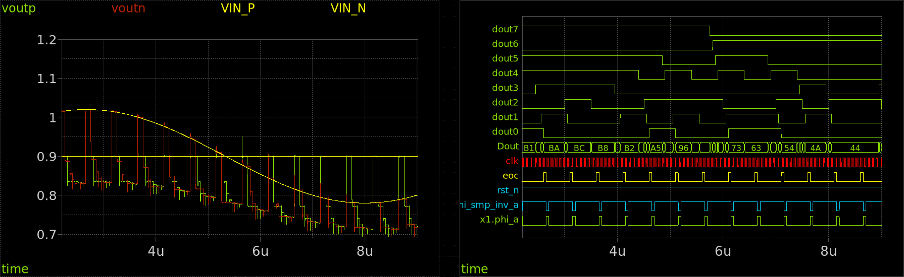

# Modulo 5 — Mixed-Signal Design: integrazione analogico-digitale



## Obiettivi

Al termine di questo modulo lo studente sarà in grado di:

- Analizzare i requisiti di switching di un CDAC a ridistribuzione di carica: resistenza di canale, charge injection, clock feedthrough e settling time
- Dimensionare un passgate CMOS per le bottom plate del CDAC usando la metodologia $g_m/I_D$ e verificare il settling con simulazione transitoria
- Comprendere il principio di funzionamento di un bootstrap switch e analizzarne il vantaggio in termini di linearità rispetto al passgate semplice
- Costruire in xschem il CDAC completo del Modulo 2 sostituendo gli switch ideali con transistor SKY130A reali
- Convertire il design VHDL del controller SAR (Modulo 4) in una shared library Verilator e integrarla in xschem come blocco `d_cosim`
- Simulare il SAR ADC completo in co-simulazione mixed-signal: ngspice per i blocchi analogici, Verilator per il controller digitale, loop di retroazione chiuso
- Misurare la sequenza di conversione bit per bit e confrontarla con il comportamento atteso

---

## Il SAR ADC completo

Questo modulo porta il progetto alla sua forma finale: i tre blocchi analogici — CDAC, comparatore Strong-ARM, switch di campionamento — e il controller digitale vengono collegati in un unico schema xschem e simulati insieme per la prima volta.


Il controller SAR — già sintetizzato e verificato nel Modulo 4 — viene integrato per la prima volta in un ambiente di simulazione analogico. La co-simulazione avviene con il meccanismo `d_cosim` di ngspice: il blocco digitale gira in Verilator (simulatore eventi), i blocchi analogici in ngspice (simulatore tempo continuo), e il loop di retroazione `out_comp_p → controller → dac_p[7:0]/dac_n[7:0] → CDAC` è chiuso fisicamente a ogni ciclo di clock. Il controller genera anche `phi_sample_n` (complemento di `phi_sample`) e `clk_comp` (clock gated del comparatore) come porte dedicate.

**Specifiche di riferimento:** 8 bit · $V_{DD} = 1.8\ \text{V}$ · $V_{FS,diff} = 256\ \text{mV}$ · 1 LSB = 1 mV · $V_{CM} = 0.9\ \text{V}$ · $f_s = 2\ \text{MS/s}$ · $f_{CLK,SAR} \approx 20\ \text{MHz}$

---

## Prerequisiti

- Ambiente Docker IIC-OSIC-TOOLS v2025.07 configurato e funzionante → [Modulo 0](../00_setup/)
- Modulo 1 completato: schematico e simbolo del comparatore Strong-ARM (Lab03), porte `out_comp_p`/`out_comp_n`, `vin_p`/`vin_n`, `clk`
- Modulo 2 completato: schematico e simbolo del CDAC con array MiM (`cdac.sch`, `cdac.sym`) — gli switch ideali vengono sostituiti con transistor SKY130A reali nel Lab01 di questo modulo
- Modulo 3 completato: layout DRC-clean del comparatore, familiarità con il concetto di estrazione parassitica
- Modulo 4 completato: file `sar_controller.vhd` aggiornato con tutte le porte del Modulo 5 (`out_comp_p`/`out_comp_n`, `phi_sample`, `phi_sample_n`, `clk_comp`, `dac_p[7:0]`, `dac_n[7:0]`), output LibreLane in `runs/`

---

## Struttura del modulo

| File | Argomento | Tempo stimato |
|------|-----------|---------------|
| [`lab01_switch_mosfet.md`](./lab01_switch_mosfet.md) | Switch MOSFET per il CDAC: teoria, passgate, bootstrap switch, CDAC completo | ~2.5 h |
| [`lab02_cosim_setup.md`](./lab02_cosim_setup.md) | Co-simulazione mixed-signal: conversione VHDL→Verilator, simbolo xschem, interfaccia adc/dac bridge | ~2 h |
| [`lab03_sar_adc_system.md`](./lab03_sar_adc_system.md) | Simulazione di sistema: schema top-level, sequenza di conversione, verifica bit per bit | ~2.5 h |

---

## Come lavorare

I lab di questo modulo hanno una struttura in cinque elementi ricorrenti:

1. **Teoria e motivazione** — il perché di ogni scelta di progetto, con richiami quantitativi alle specifiche del SAR ADC
2. **Procedura guidata** — comandi da terminale e passi in xschem in sequenza precisa
3. **Simulazione e lettura dei risultati** — cosa osservare, come interpretarlo
4. **Domande di riflessione** — valori da ricavare dai grafici, con placeholder `?`
5. **Collegamento al sistema** — come il blocco appena progettato si interfaccia con il resto del SAR ADC

Il workflow di questo modulo introduce una separazione netta tra due ambienti che vengono usati in sequenza:

```
Terminale (make)                    xschem
────────────────────────────────    ──────────────────────────────
make cosim_setup  (una tantum)  ──► schema top-level SAR ADC
  → sar_controller_behav.v          → co-simulazione Simulation → Run
  → sar_controller_behav.so         → forme d'onda in ngspice
  → sar_controller.sym
```

La pipeline `make cosim_setup` va eseguita una sola volta (o dopo modifiche al VHDL); la simulazione e il debugging si svolgono interamente in xschem.

---

## Avviare l'ambiente

```bash
# Verifica variabili PDK
echo $PDK          # atteso: sky130A
echo $PDK_ROOT     # atteso: /foss/pdks

# Crea le cartelle di lavoro
mkdir -p /foss/designs/modulo5/lab01/xschem/simulation
mkdir -p /foss/designs/modulo5/lab02/xschem/simulation
mkdir -p /foss/designs/modulo5/lab03/xschem/simulation

# Copia il Makefile nella cartella del lab02 (per la co-simulazione)
cp /foss/designs/utils/GHDL_Digital_sim/Makefile \
   /foss/designs/modulo5/lab02/Makefile

# Copia il controller VHDL aggiornato (procedura monotonica, con phi_sample_n e clk_comp)
cp /foss/designs/modulo4/lab01/src/sar_controller.vhd \
   /foss/designs/modulo5/lab02/src/
```

---

## Riferimenti utili

- [ngspice manual — XSPICE d_cosim](https://ngspice.sourceforge.io/docs/ngspice-manual.pdf) (cap. 12)
- [Verilator documentation](https://verilator.org/guide/latest/)
- [SKY130A PDK — device details](https://skywater-pdk.readthedocs.io/en/main/rules/device-details.html)
- [xschem documentation — cosimulation](https://xschem.sourceforge.io/stefan/pg_Installing_xschem.html)
- [Razavi — Design of Analog CMOS Integrated Circuits](https://www.mheducation.com/) cap. 13 (Sample-and-Hold)
- [Pelgrom — Analog-to-Digital Conversion](https://link.springer.com/book/10.1007/978-3-030-90808-9) cap. 8 (SAR ADC)
