# Lab01 — Switch MOSFET per il CDAC e il Sample & Hold

**Tempo stimato:** ~2.5 ore  
**Cartella di lavoro:** `/foss/designs/modulo5/lab01/xschem/`

---

## Obiettivo

In questo lab sostituiamo gli switch ideali del CDAC del Modulo 2 con transistor SKY130A reali. Alla fine del lab avremo:

- Un **T-gate** CMOS per pilotare le bottom plate del CDAC tramite la switch bank, con pin $V_{REF}$ per il riferimento del DAC
- Un **passgate** CMOS per la fase di campionamento, dimensionato per lavorare nel range $V_{CM} \pm 128\ \text{mV}$
- Un **CDAC completo** con switch reali, pronto per essere integrato nel sistema SAR ADC del Lab03

---

## Struttura delle cartelle

```bash
mkdir -p /foss/designs/modulo5/lab01/xschem/simulation
cd /foss/designs/modulo5/lab01/xschem

cat > xschemrc << 'EOF'
source /foss/pdks/sky130A/libs.tech/xschem/xschemrc
set netlist_dir [file normalize [file dirname [info script]]/simulation]
append XSCHEM_LIBRARY_PATH :[file dirname [info script]]
EOF

xschem &
```

Struttura finale del lab:

```
/foss/designs/modulo5/lab01/
└── xschem/
    ├── xschemrc
    ├── passgate.sch + .sym         ← Parte 2: switch di campionamento
    ├── tb_passgate.sch             ← Parte 2.3: analisi transiente nominale
    ├── tb_passgate_pvt.sch         ← Parte 2.4: analisi PVT
    ├── T_gate.sch + .sym           ← Parte 3: switch per bottom plate
    ├── switch_bank.sch + .sym      ← Parte 3: array di 8 T-gate
    ├── cdac_complete.sch + .sym    ← Parte 4: CDAC con switch reali
    ├── tb_cdac_complete.sch        ← Parte 4: testbench comparativo
    └── simulation/
```

> 💡 I due testbench del passgate sono mantenuti separati intenzionalmente: `tb_passgate.sch` contiene la simulazione transiente nominale con il blocco `TT_MODELS` standard, mentre `tb_passgate_pvt.sch` ha il blocco di simulazione PVT con il `foreach` su temperatura e VDD. Modificare l'uno non altera l'altro.

---

## Parte 1 — Teoria: switch MOSFET per un CDAC a 8 bit

### 1.1 Requisito di settling time

Il CDAC del Modulo 2 usa capacità `cap_mim_m3_1` con $W = L = 5\ \mu\text{m}$ e molteplicità $\text{MF}$ binaria. La capacità unitaria è:

$$C_u = W \times L \times C_{ox,MiM} = 5\ \mu\text{m} \times 5\ \mu\text{m} \times C_{ox,MiM}$$

dove la densità di capacità $C_{ox,MiM}$ della `cap_mim_m3_1` in SKY130A vale circa $2\ \text{fF}/\mu\text{m}^2$, quindi $C_u \approx 50\ \text{fF}$.

La capacità totale del ramo positivo del CDAC è:

$$C_{tot} = C_u \times (1 + 1 + 2 + 4 + 8 + 16 + 32 + 64 + 128) = 256 \times C_u \approx 12.8\ \text{pF}$$

Con $f_s = 2\ \text{MS/s}$, il periodo di conversione totale è $T_s = 500\ \text{ns}$. Questo tempo è suddiviso in **10 cicli di clock** a $f_{CLK,SAR} = 20\ \text{MHz}$: 1 ciclo di campionamento, 8 cicli di conversione bit per bit, e 1 ciclo di output/EOC. La finestra di campionamento è quindi esattamente **un ciclo di clock**:

$$T_{smp} = T_{CLK} = \frac{1}{f_{CLK,SAR}} = \frac{1}{20\ \text{MHz}} = 50\ \text{ns}$$

> 💡 Questo vale perché `phi_sample` e il clock del comparatore sono segnali **separati** generati dalla FSM del controller SAR. Lo switch di campionamento rimane chiuso per l'intero stato `ST_SAMPLE` (un ciclo di clock completo), poi si apre; il comparatore riceve il via libera solo nel ciclo successivo (`ST_CONV7`). Se invece campionamento e valutazione del comparatore condividessero lo stesso clock a duty cycle 50%, la finestra disponibile sarebbe $T_{smp} = T_{CLK}/2 = 25\ \text{ns}$ e il requisito su $R_{on}$ sarebbe il doppio più stringente ($R_{on} < 313\ \Omega$).

Quando lo switch di campionamento si chiude, il nodo di top plate del CDAC si carica verso $V_{IN}$ attraverso la resistenza di canale $R_{on}$ dello switch. Il circuito equivalente è un RC del primo ordine: la tensione sulla top plate evolve come:

$$V_{top}(t) = V_{IN} \cdot \left(1 - e^{-t/\tau}\right), \quad \tau = R_{on} \cdot C_{tot}$$

L'errore assoluto rispetto al valore finale $V_{IN}$ al termine della finestra di campionamento $T_{smp}$ è:

$$\Delta V(T_{smp}) = V_{IN} \cdot e^{-T_{smp}/\tau}$$

Questo errore si chiama **errore di settling** e lo indichiamo con $\varepsilon$ normalizzato al fondo scala $V_{FS}$:

$$\varepsilon = \frac{\Delta V(T_{smp})}{V_{FS}} = e^{-T_{smp}/\tau}$$

Per garantire la risoluzione a 8 bit, $\varepsilon$ deve essere inferiore a mezzo LSB riferito al fondo scala, ovvero:

$$\varepsilon < \frac{0.5\ \text{LSB}}{V_{FS}} = \frac{V_{FS}/2^{N+1}}{V_{FS}} = \frac{1}{2^{N+1}} = \frac{1}{512}$$

dove $N = 8$. Sostituendo $\varepsilon = e^{-T_{smp}/\tau}$ e risolvendo:

$$\frac{T_{smp}}{\tau} > \ln(512) \approx 6.24$$

$$R_{on} < \frac{T_{smp}}{6.24 \times C_{tot}} = \frac{50\ \text{ns}}{6.24 \times 12.8\ \text{pF}} \approx 625\ \Omega$$

Questo è il requisito sulla resistenza di canale dello **switch di campionamento**. Per gli switch delle bottom plate il carico è la singola capacità $C_k = 2^k \times C_u$, quindi il requisito è molto meno stringente — anche un NMOS minimo è sufficiente per i bit meno significativi.

### 1.3 Scelta del tipo di switch di campionamento

Il requisito $R_{on} < 625\ \Omega$ da solo non determina la topologia dello switch — è il **range del segnale** analogico da campionare che guida la scelta.

Il segnale di ingresso del nostro SAR ADC vive nell'intervallo $V_{IN} \in [V_{CM} - 128\ \text{mV},\ V_{CM} + 128\ \text{mV}] = [0.772,\ 1.028]\ \text{V}$. Questa finestra stretta di 256 mV è centrata su $V_{CM} = V_{DD}/2 = 0.9\ \text{V}$, che è esattamente il punto di simmetria del passgate CMOS. In questo punto NMOS e PMOS contribuiscono in modo bilanciato: la variazione di $R_{on}$ nell'intervallo $\pm 128\ \text{mV}$ attorno a $V_{CM}$ è inferiore al $\pm 6\%$, e la distorsione introdotta è trascurabile per 8 bit.

Per segnali che spaziano l'intera gamma $[0,\ V_{DD}]$ la situazione è diversa: $R_{on}$ del passgate varia di un fattore 3--4$\times$ e introduce distorsione non lineare significativa. In quel caso si ricorre al **bootstrap switch**, che mantiene $V_{GS}$ del transistor principale costante e pari a $V_{DD}$ indipendentemente da $V_{IN}$, garantendo $R_{on}$ costante su tutta la gamma. Il prezzo è una topologia più complessa (10--12 transistor) e la necessità di transistor a gate oxide spesso per gestire la sovratensione $V_{IN} + V_{DD}$ sul gate.

Nel nostro progetto useremo un **passgate** ($W_N = 2\ \mu\text{m}$, $W_P = 4\ \mu\text{m}$): il range di segnale ristretto e la simmetria attorno a $V_{CM} = V_{DD}/2$ rendono il passgate una scelta sufficiente e molto più semplice da realizzare.

> 💡 Il requisito $R_{on} < 625\ \Omega$ riguarda lo **switch di campionamento**, che durante la fase di campionamento deve caricare l'intero array $C_{tot} = 12.8\ \text{pF}$ (tutte le bottom plate sono a Vref durante ST_SAMPLE, quindi tutti i condensatori sono in parallelo tra top plate e Vref — la capacità totale vista dallo switch è la stessa $C_{tot} = 12.8\ \text{pF}$). Gli switch della switch bank (T-gate) hanno invece un carico molto minore: ogni switch pilota la bottom plate di un singolo condensatore $C_k = 2^k \times C_u$. Per il bit MSB ($C_7 = 128 \times C_u \approx 6.4\ \text{pF}$): $R_{on} < \frac{50\ \text{ns}}{6.24 \times 6.4\ \text{pF}} \approx 1.25\ \text{k}\Omega$, e per il bit LSB ($C_0 = C_u \approx 50\ \text{fF}$): $R_{on} < 160\ \text{k}\Omega$ — praticamente irrilevante. Il requisito per il T-gate è quindi molto meno stringente di quello per lo switch di campionamento.

### 1.2 Charge injection e clock feedthrough

Quando uno switch MOSFET si apre, la carica presente nel canale si ridistribuisce tra i terminali di source e drain. La variazione di carica sulla top plate del CDAC è:

$$\Delta Q_{ch} \approx -\frac{1}{2} C_{ox} W L (V_{GS} - V_{th})$$

Questa carica si somma alla carica campionata e introduce un errore di offset. Il clock feedthrough è un effetto analogo: la variazione rapida del gate si accoppia capacitivamente alla top plate attraverso $C_{GD}$:

$$\Delta V_{ft} = \frac{C_{GD}}{C_{GD} + C_{top}} \Delta V_{CLK}$$

Entrambi gli effetti si riducono minimizzando le dimensioni dello switch ($W$, $L$). Il passgate bilancia parzialmente la charge injection di NMOS e PMOS se i transitori di apertura sono simmetrici. Il bootstrap switch risolve il problema alla radice: il gate rimane a tensione costante rispetto al source durante la conduzione, eliminando la dipendenza da $V_{IN}$.

> ⚠️ Per un SAR ADC a 8 bit con $\Delta V_{LSB} = 1\ \text{mV}$, anche un'iniezione di carica di pochi femtocoulomb può causare errori di un LSB. Il dimensionamento degli switch è quindi un compromesso tra $R_{on}$ (che richiede $W$ grande) e charge injection (che richiede $W$ piccola).

---

## Parte 2 — Passgate CMOS per le bottom plate

### 2.1 Architettura e funzionamento

Il passgate (transmission gate) è costituito da un NMOS e un PMOS in parallelo con gate complementari. Quando il segnale di controllo $\text{CTRL} = 1$ (alto), il NMOS è attivo per $V_{in}$ bassa e il PMOS per $V_{in}$ alta: insieme coprono l'intera escursione $[0, V_{DD}]$ con $R_{on}$ quasi costante.

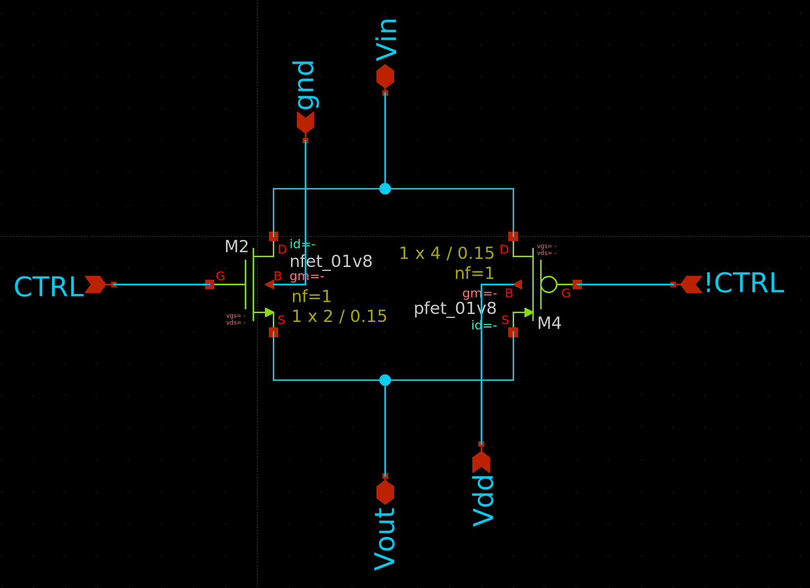
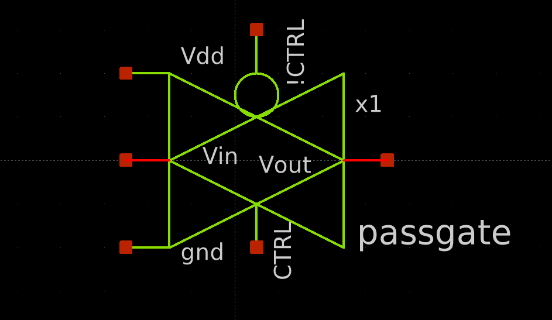


In SKY130A con $V_{DD} = 1.8\ \text{V}$, i transistor sono `nfet_01v8` e `pfet_01v8`. La resistenza di canale totale del passgate vale:

$$\frac{1}{R_{on,PG}} = \frac{1}{R_{on,N}} + \frac{1}{R_{on,P}}$$

dove, approssimativamente in saturazione profonda:

$$R_{on,N} \approx \frac{L_N}{\mu_n C_{ox} W_N (V_{DD} - V_{th,n})}, \quad R_{on,P} \approx \frac{L_P}{\mu_p C_{ox} W_P (V_{DD} - |V_{th,p}|)}$$

Con i parametri tipici di SKY130A — $\mu_n C_{ox} \approx 270\ \mu\text{A/V}^2$, $V_{th,n} \approx 0.5\ \text{V}$, $\mu_p C_{ox} \approx 90\ \mu\text{A/V}^2$, $|V_{th,p}| \approx 0.6\ \text{V}$ — e con $L = 0.15\ \mu\text{m}$ (lunghezza minima) e $W_N = 2\ \mu\text{m}$, $W_P = 4\ \mu\text{m}$:

$$R_{on,N} \approx \frac{0.15\ \mu\text{m}}{270\ \mu\text{A/V}^2 \times 2\ \mu\text{m} \times 1.3\ \text{V}} \approx 214\ \Omega, \quad R_{on,P} \approx \frac{0.15\ \mu\text{m}}{90\ \mu\text{A/V}^2 \times 4\ \mu\text{m} \times 1.2\ \text{V}} \approx 347\ \Omega$$

**Domanda:** con $W_N = 2\ \mu\text{m}$ e $W_P = 4\ \mu\text{m}$, calcola $R_{on,N}$, $R_{on,P}$ e $R_{on,PG}$ nelle tre condizioni operative rilevanti (NMOS dominante, entrambi attivi, NMOS a soglia). Il vincolo di settling è soddisfatto in tutte e tre?

| Condizione | $V_{GS,N}$ | $V_{SG,P}$ | $R_{on,N}$ | $R_{on,P}$ | $R_{on,PG}$ | $\tau$ (ns) |
|---|---|---|---|---|---|---|
| Inizio carica (Vout≈0V, Vin≈0.9V) | 1.8 V | 0.9 V | `?` Ω | `?` Ω | `?` Ω | `?` |
| Tracking (Vout≈0.9V, Vin≈0.9V) | 0.9 V | 0.9 V | `?` Ω | `?` Ω | `?` Ω | `?` |
| NMOS a soglia (Vout≈1.3V, Vin≈1.44V) | 0.5 V | 1.44 V | ∞ | `?` Ω | `?` Ω | `?` |

> 💡 Il worst case si verifica quando $V_{out} > V_{DD} - V_{th,n} \approx 1.3\ \text{V}$: l'NMOS si spegne e rimane solo il PMOS. Il requisito è soddisfatto se anche in questo caso $\tau = R_{on,P} \times C_{MSB} < 50\ \text{ns} / 6.24 \approx 8\ \text{ns}$.

### 2.2 Costruzione del passgate in xschem

Crea un nuovo schema: **File → New Schematic**, salvalo come `passgate.sch`.

Posiziona i componenti con `Shift+I`:

**NMOS** — `sky130_fd_pr/nfet_01v8.sym`:
- `name = M1`
- `W = 2`
- `L = 0.15`
- `nf = 1`
- `mult = 1`

**PMOS** — `sky130_fd_pr/pfet_01v8.sym`:
- `name = M2`
- `W = 4`
- `L = 0.15`
- `nf = 1`
- `mult = 1`

La connessione corretta del passgate è **anti-parallela** (a croce): il drain di M1 (NMOS) e il source di M2 (PMOS) vanno sullo stesso nodo, e analogamente il source di M1 e il drain di M2 vanno sull'altro nodo:

- **Nodo `Vin`**: drain di M1 (NMOS) ↔ source di M2 (PMOS)
- **Nodo `Vout`**: source di M1 (NMOS) ↔ drain di M2 (PMOS)
- **Gate di M1** (NMOS): `CTRL`
- **Gate di M2** (PMOS): `!CTRL`


> ⚠️ In SPICE ngspice la distinzione source/drain non è vincolante perché il simulatore scambia internamente i terminali in base alle tensioni applicate (il MOSFET è fisicamente simmetrico). Entrambe le connessioni producono risultati identici in simulazione. La connessione a croce è quella convenzionale nei textbook e quella che rende lo schema più leggibile, ma non è obbligatoria.

Aggiungi i pin di interfaccia. Usa `devices/iopin.sym` per i segnali bidirezionali e `devices/ipin.sym` per gli ingressi:

| Pin | Tipo | Connessione interna |
|-----|------|---------------------|
| `Vin` | `iopin` | drain di M1 (NMOS) / source di M2 (PMOS) |
| `Vout` | `iopin` | source di M1 (NMOS) / drain di M2 (PMOS) |
| `CTRL` | `ipin` | gate di M1 (NMOS) |
| `!CTRL` | `ipin` | gate di M2 (PMOS) |
| `VDD` | `ipin` | bulk (B) di M2 (PMOS) — deve essere a $V_{DD}$ |
| `GND` | `ipin` | bulk (B) di M1 (NMOS) — deve essere a GND |

> 💡 Usa `iopin` per i nodi di segnale del passgate perché la corrente può scorrere in entrambe le direzioni. I pin `VDD` e `GND` sono `ipin` (non `iopin`) perché trasportano solo corrente di polarizzazione del bulk — mai segnale.

> ⚠️ In SKY130A il terminale `B` del simbolo `nfet_01v8` e `pfet_01v8` è il bulk e deve essere collegato esplicitamente con `W`: per l'NMOS a `GND`, per il PMOS a `VDD`. Un bulk flottante causa risultati di simulazione errati e warning ngspice. Non omettere mai questi collegamenti nemmeno in un circuito di test.

**Genera il simbolo:** `Symbol → Make symbol from schematic` oppure tasto `A`. xschem crea automaticamente `passgate.sym`.

### 2.3 Testbench del passgate

Crea `tb_passgate.sch` (**File → New Schematic**, salva subito con **Ctrl+S**). Lo schema comprende:

- **`Vvdd`**: sorgente DC $V_{DD} = 1.8\ \text{V}$, tra `VDD` e `GND`
- **`Vvin`**: sorgente rampa `PWL(0 0.9 500n 1.8 500n 0.9 1000n 0)` — segnale analogico di test sul nodo `Vin`
- **`Vctrl`**: sorgente pulsata `PULSE(0 1.8 100n 1n 1n 200n 400n)` — segnale di controllo `CTRL`
- **`Vctrl_not`** (`vsource`): `PULSE(1.8 0 100n 1n 1n 200n 400n)` — sorgente complementare a `Vctrl` per il segnale `!CTRL`. Non usare buffer Verilog: nel testbench puramente analogico un secondo `vsource` complementare è la soluzione più semplice e priva di ambiguità
- **Istanza `passgate.sym`** — collegala con `W` a `Vin`, `Vout`, `CTRL`, `!CTRL`
- **Carico capacitivo** (`Shift+I` → `devices/cap.sym`): valore `12.8p`, tra `Vout` e `GND` — simula la capacità totale del CDAC vista dallo switch di campionamento ($C_{tot} = 256 \times C_u \approx 12.8\ \text{pF}$) — simula la capacità totale del CDAC vista dallo switch durante il campionamento (indipendente dallo stato delle bottom plate)
- **Resistore di polarizzazione** (`Shift+I` → `devices/res.sym`): valore `1G`, tra `Vout` e `GND` — necessario perché ngspice richiede un percorso DC su ogni nodo analogico. Non usare valori più bassi (es. 1 MΩ): con $C_{load} = 12.8\ \text{pF}$ si avrebbe $\tau = 12.8\ \mu\text{s}$, con scarica di 20 mV in 200 ns — comunque un errore di 20 LSB che maschera il comportamento del passgate

Blocco di simulazione — aggiungi un `code_shown` (`Shift+I` → `devices/code_shown.sym`) con `only_toplevel=true`:

```spice
.control
  save all
  tran 100p 1000n
  write tb_passgate.raw
  plot v(Vin) v(Vout) v(CTRL)
.endc
```

> 💡 Aggiungi il blocco `TT_MODELS` copiandolo da `top.sch` — stessa procedura descritta in Lab01 e Lab03 del Modulo 1.

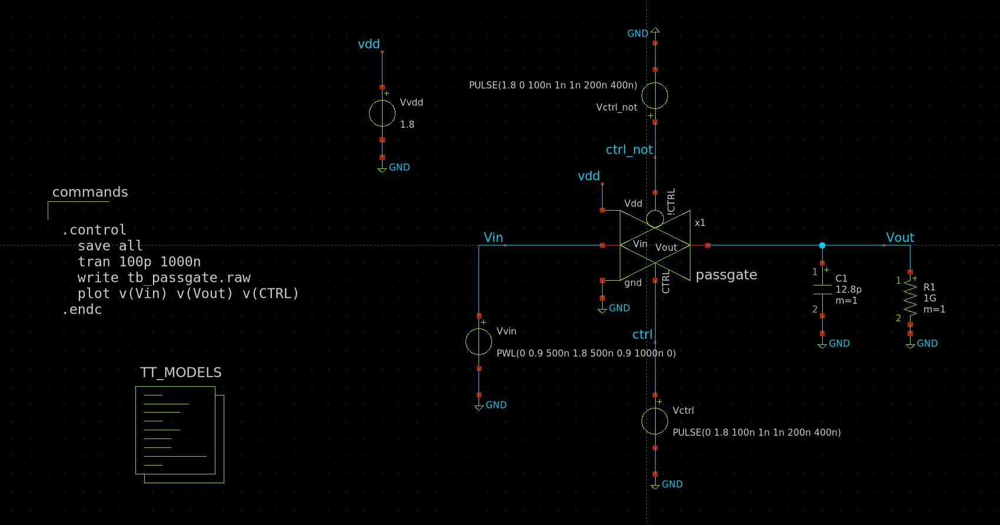

**Ctrl+S** → **Netlist** → **Simulate**. Osserva:

> 💡 Attiva **Simulation → Show netlist after netlist command** per visualizzare automaticamente la netlist generata ad ogni click su **Netlist** — utile per verificare connessioni e attributi prima di lanciare ngspice.

1. Quando `CTRL = 1` (switch chiuso): `Vout` insegue `Vin` con un ritardo determinato da $\tau = R_{on,PG} \times C_{tot}$
2. Quando `CTRL = 0` (switch aperto): `Vout` rimane al valore campionato (hold) — la scarica è trascurabile con R=1 GΩ

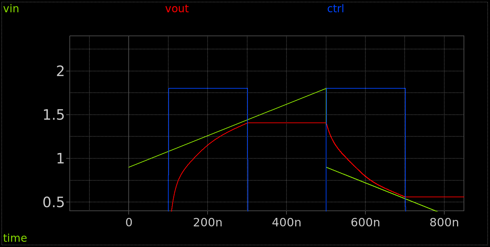

> 💡 **Interpretazione del grafico con rampa:** il comportamento che osservi riflette la struttura temporale del testbench, non un malfunzionamento del passgate. Con la rampa PWL e il clock su `CTRL`, si succedono tre regimi distinti:
>
> - **Prima chiusura (t=100ns):** `CTRL` sale quando `Vin` ha già rampato fino a ~1.08V (200ns di vantaggio). `Vout` parte da 0V e deve recuperare un divario di oltre 1V mentre `Vin` continua a salire → non riesce a convergere entro i 200ns disponibili. L'apertura a t=300ns lascia `Vout` in hold con un errore residuo significativo (~36mV).
>
> - **Fasi successive:** ad ogni riapertura `Vout` va in hold al valore raggiunto; alla chiusura successiva il divario da recuperare è minore → `Vout` insegue meglio. Il sistema converge iterativamente verso `Vin` di ciclo in ciclo.
>
> - **Plateau visibile nel grafico:** il tratto piatto di `Vout` durante i periodi di hold corrisponde alla tenuta del condensatore da 12.8 pF con R=1 GΩ — la scarica è trascurabile (ΔV ≈ 0.02 mV in 200 ns) ✓
>
> **Questa dinamica non è rappresentativa del SAR ADC reale**, dove `Vin` è un segnale lento (quasi costante a scala di $T_{CLK} = 50\ \text{ns}$). Nel SAR, `CTRL` si chiude con `Vin` già stabile e `Vout` che parte da una tensione vicina a quella del ciclo precedente — il divario da recuperare è di pochi mV, non centinaia di mV. L'errore di tracking stazionario $\varepsilon_{track} = \tau \times dV_{in}/dt \approx 0$ perché $dV_{in}/dt \approx 0$. La valutazione del settling time per il SAR si fa con lo scalino (testbench PVT della sezione 2.4), non con la rampa.

**Domanda:** il testbench usa un ingresso a rampa, non uno scalino. Questo cambia la misura del settling time: invece di osservare il transitorio su un ingresso fisso, vedi la differenza $V_{in}(t) - V_{out}(t)$ che include sia il transitorio iniziale sia l'**errore di tracking stazionario** $\varepsilon_{track} = \tau \times dV_{in}/dt$. Con una rampa da 0 a 1.8 V in 500 ns si ha $dV_{in}/dt = 3.6\ \text{MV/s}$. Stima l'errore di tracking nelle tre condizioni operative del passgate e compilala tabella:

| Condizione | $V_{out}$ | $V_{in}$ | $R_{on,N}$ | $R_{on,P}$ | $R_{on,PG}$ | $\tau$ (ns) | $\varepsilon_{track}$ (mV) |
|---|---|---|---|---|---|---|---|
| NMOS dominante | ≈ 0 V | ≈ 0.9 V | `?` Ω | `?` Ω | `?` Ω | `?` | `?` |
| Entrambi attivi | ≈ 0.9 V | ≈ 0.9 V | `?` Ω | `?` Ω | `?` Ω | `?` | `?` |
| NMOS a soglia | ≈ 1.3 V | ≈ 1.44 V | ∞ | `?` Ω | `?` Ω | `?` | `?` |

> 💡 Per misurare il settling time in modo preciso serve uno scalino in ingresso, non una rampa. Aggiungi una seconda sorgente `Vstep` con `PULSE(0.9 1.08 300n 1n 1n 500n 1u)` — un gradino di 180 mV centrato su $V_{CM}$ (pari all'escursione massima a 8 bit) — e misura il tempo che `Vout` impiega a rientrare entro 0.5 mV dal valore finale.

**Domanda:** misura l'errore di **charge injection** sul primo hold (R = 1 GΩ, $C = 6.4\ \text{pF}$). Considera che la scarica RC in 200 ns vale $\Delta V_{RC} = V_{out} \cdot (1 - e^{-200\ \text{ns}/12.8\ \text{ms}}) \approx 0.03\ \text{mV}$ — trascurabile (con R=1G, C=12.8pF, $\tau=12.8\ \text{ms}$). Quindi:

$$\Delta V_{inj} = \Delta V_{hold,misurato} - \Delta V_{RC} \approx \Delta V_{hold,misurato} = \texttt{?}\ \text{mV} = \texttt{?}\ \text{LSB}$$

> 💡 L'errore di charge injection cambia segno tra il primo hold (Vout ≈ 1.4 V, iniezione positiva) e il secondo (Vout ≈ 0.56 V, iniezione negativa). Questo comportamento dipendente da $V_{out}$ introduce **distorsione non lineare** — motivazione precisa per il bootstrap switch (descritto nella nota finale della Parte 4), dove $V_{GS}$ è costante e la charge injection diventa indipendente dal segnale.

### 2.4 Analisi PVT del passgate — primo test (transistor standard)

La simulazione PVT usa lo stesso metodo adottato nel Lab03 del Modulo 1 (sezione 5 — `tb_pvt.sch`): blocco 'Corner: tt' per selezionare il corner di simulazione (puoi prenderlo dalal schermata top.sch che riporta gli esempi del pdk Sky130A), VDD parametrica tramite `alterparam`, e accumulo delle simulazioni in un unico file `.raw` con il pattern `write` → `set appendwrite` dentro il loop.

**Setup del testbench PVT**

Con `tb_passgate.sch` aperto, vai su **File → Save as** e rinomina il file in `tb_passgate_pvt.sch`, mantenendo la cartella corrente `/foss/designs/modulo5/lab01/xschem/`. xschem aprirà automaticamente la copia appena salvata — puoi procedere subito con le modifiche.

Modifica `tb_passgate_pvt.sch` in quattro punti:

**1.** Rimuovi il blocco `TT_MODELS` e sostituiscilo con il blocco `Corner: tt`.

**2.** Nella sorgente `Vvdd` imposta `value` a `{vdd_param}` invece di `1.8`.

**3.** Aggiorna `Vctrl` e `Vctrl_not` in modo che lo switch rimanga chiuso per tutta la simulazione, **prima** del gradino su Vin:

```spice
Vctrl     PULSE(0          {vdd_param} 50n 1n 1n 900n 1000n)
Vctrl_not PULSE({vdd_param} 0          50n 1n 1n 900n 1000n)
```

**4.** Cambia `Vvin` da rampa a scalino verso $V_{CM} = 0.9\ \text{V}$, ritardato di 50 ns rispetto alla chiusura dello switch:

```spice
Vvin  PULSE(0 0.9 100n 1n 1n 800n 1000n)
```

> ⚠️ Nel testbench nominale `tb_passgate.sch` il clock su `Vctrl` è utile per visualizzare tracking e hold. Per la misura del settling time, invece, il clock falsifica il risultato: se Vout non raggiunge la soglia entro il primo mezzo periodo, va in hold e riprende solo al ciclo successivo, restituendo un valore errato. Con `Vctrl` fisso alto per tutta la simulazione, la misura è pulita.

> 💡 La sequenza temporale corretta è: t=50ns Vctrl sale → switch chiuso; t=100ns Vin fa il gradino 0→0.9V; da t=110ns in poi si misura il settling time. Il ritardo di 50ns tra la chiusura dello switch e il gradino su Vin rispecchia il comportamento reale del SAR.

**Blocco di simulazione PVT** — segue lo stesso pattern di `tb_pvt.sch` del Lab03 del Modulo 1:

```spice
.param vdd_param=1.8
.options savecurrents

.control
  save all
  set appendwrite
  shell rm -f tb_passgate_pvt.raw
  set outfile = pvt_passgate_tt.txt
  echo T_C VDD_V t_settle_ns > $outfile

  foreach T_val -40 27 125
    foreach VDD_val 1.62 1.8 1.98
      set t_save   = $T_val
      set vdd_save = $VDD_val
      alterparam vdd_param = $vdd_save
      reset
      set temp = $t_save

      tran 100p 1000n
      meas tran t_settle WHEN v(Vout) = 0.8995 RISE=1 TD=110n
      let t_settle_ns = (t_settle - 100e-9) * 1e9
      echo $t_save,$vdd_save,$&t_settle_ns >> $outfile
      echo T=$t_save VDD=$vdd_save t_settle=$&t_settle_ns ns
      write tb_passgate_pvt.raw v(Vout) v(Vin) v(ctrl) v(ctrl_not)
    end
  end
.endc
```

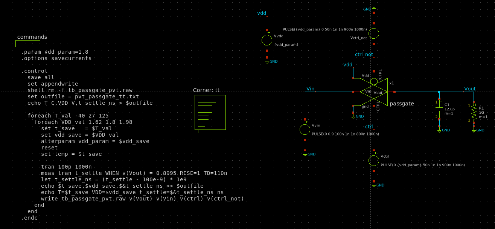

> ⚠️ Le variabili di `foreach` vengono distrutte da `reset`. Salvale con `set t_save = $T_val` e `set vdd_save = $VDD_val` prima di `reset`. Dopo `reset`, imposta la temperatura con `set temp = $t_save` — deve essere eseguito **dopo** `reset`.

> ⚠️ Il comando `write` specifica esplicitamente i vettori da salvare: questo garantisce che tutte le 9 simulazioni abbiano lo stesso numero di variabili (`n_vars` identico) e xschem possa sovrapporre tutte le tracce correttamente.

> ⚠️ `meas WHEN` non accetta espressioni con vettori sul lato destro — solo costanti. Con Vin fisso a 0.9V la soglia `0.8995` è una costante. Il tempo `t_settle_ns = (t_settle - 100e-9) * 1e9` corregge il ritardo del gradino.

Le forme d'onda si visualizzano con **Waves → External viewer** → `tb_passgate_pvt.raw`.

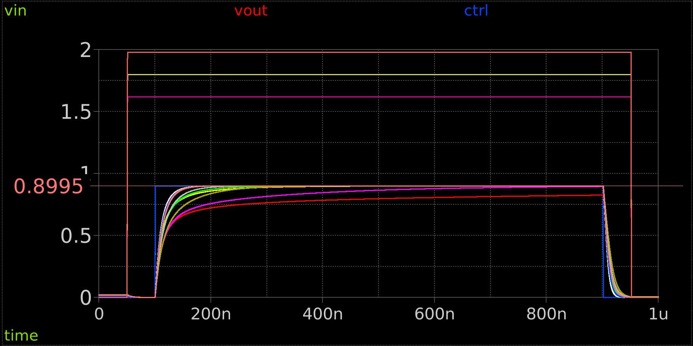

**Domanda A — Compilare la tabella al corner `tt` con transistor standard, $W_N = 2\ \mu\text{m}$, $W_P = 4\ \mu\text{m}$:**

| T (°C) | VDD (V) | $t_{settle}$ (ns) | Requisito (< 50 ns)? |
|--------|---------|-------------------|----------------------|
| −40 | 1.62 | `?` | `?` |
| −40 | 1.80 | `?` | `?` |
| −40 | 1.98 | `?` | `?` |
| 27 | 1.62 | `?` | `?` |
| 27 | 1.80 | `?` | `?` |
| 27 | 1.98 | `?` | `?` |
| 125 | 1.62 | `?` | `?` |
| 125 | 1.80 | `?` | `?` |
| 125 | 1.98 | `?` | `?` |

**Domanda B — Confronto con la teoria:**

In sezione 2.1 hai calcolato $R_{on,PG}$ e stimato $t_{settle} \approx 6.24 \times \tau = 6.24 \times R_{on,PG} \times C_{tot}$. Confronta con il valore misurato al punto nominale (T=27°C, VDD=1.80V):

$$t_{settle,teorico} = 6.24 \times R_{on,PG} \times 12.8\ \text{pF} = \texttt{?}\ \text{ns}$$
$$t_{settle,misurato} = \texttt{?}\ \text{ns} \quad \text{(fattore } \texttt{?}\times \text{ rispetto alla teoria)}$$

Perché il valore misurato è molto più grande? La formula $6.24\tau$ assume $R_{on}$ costante — ma durante la salita da 0 a 0.9V, il body effect aumenta $V_{th}$ e $V_{GS}$ dell'NMOS scende, rendendo il sistema fortemente non lineare.

**Domanda C — Comportamento inatteso con la temperatura:**

Osserva che a VDD=1.80V il settling time **migliora** passando da T=27°C a T=125°C. Spiega perché: a temperatura alta la mobilità scende (NMOS più lento), ma $V_{th}$ scende di circa $-2\ \text{mV/°C}$. Quale dei due effetti domina sull'overdrive residuo vicino a Vout=$V_{CM}$?

### 2.5 Tentativo di miglioramento: aumento delle dimensioni W

I risultati mostrano che con $W_N = 2\ \mu\text{m}$, $W_P = 4\ \mu\text{m}$ il requisito non è mai rispettato. Raddoppia le dimensioni — $W_N = 4\ \mu\text{m}$, $W_P = 8\ \mu\text{m}$ — aggiornando i parametri dei transistor in `passgate.sch` e rieseguendo la simulazione PVT.

**Domanda D — Compilare la tabella con $W_N = 4\ \mu\text{m}$, $W_P = 8\ \mu\text{m}$:**

| T (°C) | VDD (V) | $t_{settle}$ (ns) | Requisito? |
|--------|---------|-------------------|------------|
| 27 | 1.62 | `?` | `?` |
| 27 | 1.80 | `?` | `?` |
| 125 | 1.62 | `?` | `?` |
| 125 | 1.80 | `?` | `?` |

> 💡 Raddoppiare $W$ dimezza $R_{on}$ e quindi $\tau$, ma il sistema è non lineare: il miglioramento reale sul settling time non è esattamente 2×. La simulazione è l'unico modo per verificare.

**Domanda E — Limite fisico del sizing:**

Il miglioramento con $W_N=4\ \mu\text{m}$ è significativo ma ancora insufficiente. Spiega perché aumentare ulteriormente $W$ produce rendimenti decrescenti. Il problema non è di sizing ma fisico: a Vout=0.9V con VDD=1.62V, il body effect porta $V_{th,N} \approx 0.66\ \text{V}$ e l'overdrive residuo è solo:

$$V_{GS} - V_{th} = (1.62 - 0.9) - 0.66 = 0.06\ \text{V}$$

La corrente disponibile $\propto (V_{GS}-V_{th})^2 = (0.06)^2 = 0.0036\ \text{V}^2$ è minuscola indipendentemente da $W$. Aumentare $W$ di 10× migliorerebbe il settling di pochi ns.

### 2.6 Soluzione con transistor LVT

I transistor a bassa soglia (**LVT, Low Threshold Voltage**) sono varianti del processo con una dose di drogaggio del canale ridotta, che abbassa il $V_{th}$ a parità di geometria. In SKY130A i transistor LVT disponibili sono `nfet_01v8_lvt` e `pfet_01v8_lvt`, con:

$$V_{th,n,LVT} \approx 0.30\ \text{V} \quad \text{vs} \quad V_{th,n,std} \approx 0.50\ \text{V}$$
$$|V_{th,p,LVT}| \approx 0.42\ \text{V} \quad \text{vs} \quad |V_{th,p,std}| \approx 0.60\ \text{V}$$

Il vantaggio per il passgate è immediato: a Vout=0.9V con VDD=1.62V, con i transistor LVT:

$$V_{th,N,LVT}(V_{SB}=0.9) \approx 0.30 + 0.4(\sqrt{1.7} - \sqrt{0.8}) \approx 0.46\ \text{V}$$
$$\text{overdrive} = (1.62 - 0.9) - 0.46 = 0.26\ \text{V} \quad \text{vs} \quad 0.06\ \text{V con std}$$

Quattro volte più overdrive → corrente 16× maggiore nelle stesse condizioni critiche.

> ⚠️ I transistor LVT hanno $V_{th}$ più basso anche in stato di riposo: la corrente di leakage a $V_{GS}=0$ è maggiore rispetto ai transistor standard. Per circuiti ad alta velocità questo è accettabile; per circuiti low-power con lunghi periodi di hold può essere problematico. Nel nostro SAR ADC con $f_s = 2\ \text{MS/s}$ il leakage non è una preoccupazione.

> 💡 **Perché non usare sempre transistor LVT?** Se i transistor LVT hanno $V_{th}$ più basso e quindi conducono meglio, verrebbe naturale chiedersi perché non usarli sempre. I motivi principali sono tre:
>
> 1. **Corrente di leakage:** con $V_{th}$ più basso, la corrente subthreshold (corrente che scorre anche con $V_{GS} = 0$) è esponenzialmente più alta — tipicamente 10–100× rispetto ai transistor standard. In un circuito digitale con milioni di gate, questo si traduce in una potenza statica inaccettabile. Per questo i file di sintesi del controller SAR (Modulo 4) usano transistor standard `sky130_fd_sc_hd` e non celle LVT.
>
> 2. **Immunità al rumore (noise margin):** una $V_{th}$ più bassa significa che il transistor inizia a condurre con tensioni di gate più piccole, rendendo il circuito più sensibile al rumore. Per circuiti digitali ad alta densità questo può causare commutazioni spurie.
>
> 3. **Disponibilità e costo:** i transistor LVT richiedono un passo di processo aggiuntivo (impianto ionico per la regolazione della soglia) e non sono disponibili in tutti i processi. In SKY130A sono disponibili ma meno comuni dei transistor standard.
>
> Nel nostro caso li usiamo selettivamente **solo per lo switch di campionamento**, dove la velocità è critica e il numero di transistor è piccolo (4 in totale). Per tutto il resto del circuito si usano transistor standard.

> ⚠️ In SKY130A il `pfet_01v8_lvt` ha lunghezza minima $L_{min} = 0.35\ \mu\text{m}$ (contro $0.15\ \mu\text{m}$ del transistor standard). Questo riduce leggermente le prestazioni del PMOS LVT rispetto all'atteso, ma rimane comunque superiore al PMOS standard grazie al $V_{th}$ ridotto.

**Aggiornamento dello schema `passgate.sch`:**

Apri `passgate.sch` e sostituisci i transistor:
- `nfet_01v8` → `nfet_01v8_lvt` (mantieni $W_N$, $L_N = 0.15\ \mu\text{m}$)
- `pfet_01v8` → `pfet_01v8_lvt` (mantieni $W_P$, imposta $L_P = 0.35\ \mu\text{m}$)

Parti con le dimensioni $W_N = 4\ \mu\text{m}$, $W_P = 8\ \mu\text{m}$ — le stesse della sezione 2.5 — e riesegui la simulazione PVT.

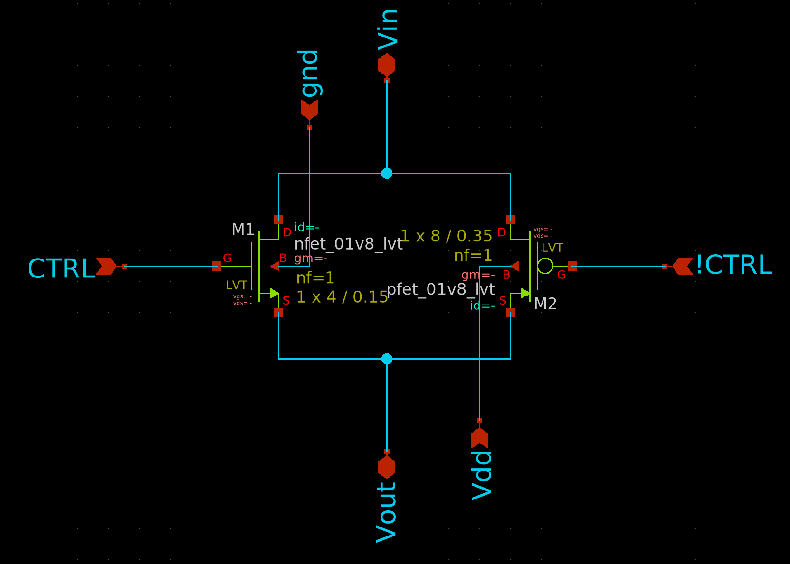

**Domanda F — Compilare la tabella con transistor LVT, $W_N = 4\ \mu\text{m}$, $W_P = 8\ \mu\text{m}$:**

| T (°C) | VDD (V) | $t_{settle}$ (ns) | Requisito? |
|--------|---------|-------------------|------------|
| −40 | 1.62 | `?` | `?` |
| −40 | 1.80 | `?` | `?` |
| −40 | 1.98 | `?` | `?` |
| 27 | 1.62 | `?` | `?` |
| 27 | 1.80 | `?` | `?` |
| 27 | 1.98 | `?` | `?` |
| 125 | 1.62 | `?` | `?` |
| 125 | 1.80 | `?` | `?` |
| 125 | 1.98 | `?` | `?` |

Osserva il miglioramento netto rispetto ai transistor standard: la riduzione di $V_{th}$ porta l'overdrive residuo da 0.06V a 0.26V nella condizione critica (VDD=1.62V, Vout=0.9V), con un impatto molto più efficace del semplice aumento di $W$.

**Domanda G — Refining finale delle dimensioni W (esercizio):**

Con i transistor LVT a $W_N = 4\ \mu\text{m}$ sei vicino alla specifica ma probabilmente non ancora dentro a tutte le condizioni di temperatura e VDD nominale. Trova le dimensioni $W_N$, $W_P$ minime che rispettino il requisito $t_{settle} < 50\ \text{ns}$ al punto nominale (T=27°C, VDD=1.80V) e ai corner `ss`:

$$W_N = \texttt{?}\ \mu\text{m}, \quad W_P = \texttt{?}\ \mu\text{m}$$

<details>
<summary>💡 Soluzione suggerita — espandi solo dopo aver trovato le tue dimensioni</summary>

Con transistor LVT ($W_N = 4\ \mu\text{m}$, $W_P = 8\ \mu\text{m}$) i risultati al corner `tt` con $C_{tot} = 12.8\ \text{pF}$ sono:

| T (°C) | VDD (V) | $t_{settle}$ (ns) |
|--------|---------|-------------------|
| −40 | 1.62 | ~133 |
| −40 | 1.80 | ~50 |
| −40 | 1.98 | ~31 |
| 27 | 1.62 | ~107 |
| 27 | 1.80 | ~51 |
| 27 | 1.98 | ~35 |
| 125 | 1.62 | ~93 |
| 125 | 1.80 | ~55 |
| 125 | 1.98 | ~41 |

Il punto nominale T=27°C, VDD=1.80V è praticamente in specifica (51 ns, 2% fuori). Per avere margine adeguato su tutta la gamma di temperatura a VDD nominale, dimensioni ragionevoli sono $W_N = 6\ \mu\text{m}$, $W_P = 12\ \mu\text{m}$ — che dovrebbero portare il punto nominale intorno a 34 ns con buon margine.

Il caso VDD=1.62V (−10% di tolleranza) rimane comunque fuori specifica anche con LVT: è il limite fisico del passgate semplice in questo scenario di test (scalino da 0 a 0.9V). Nel circuito reale, dove Vin parte già da una tensione vicina a $V_{CM}$, il settling è molto più rapido.

</details>

> 💡 **Nota sull'effetto body nell'analisi PVT con scalino da 0 a 0.9V:** il testbench misura lo scenario peggiore assoluto — la top plate del CDAC parte da 0V e deve raggiungere 0.9V in 50ns. Nel SAR ADC reale, la top plate parte dalla tensione campionata nel ciclo precedente, già vicina a Vin del segnale analogico. La variazione effettiva da campionamento a campionamento è di pochi mV (proporzionale alla derivata del segnale analogico rispetto a $T_s$), rendendo il settling molto più rapido di quanto misurato qui.

> 💡 **Nota sui transistor LVT nel progetto:** il passgate con transistor LVT andrà aggiornato anche nello schema `passgate.sch` che viene istanziato nel CDAC completo della Parte 4. Assicurati di usare le dimensioni finali ottimizzate anche lì.

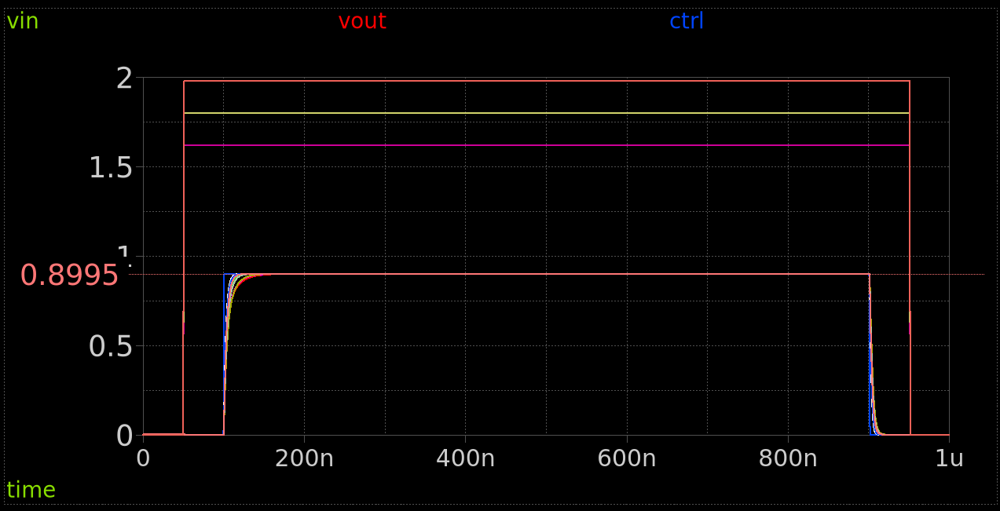

## Parte 3 — T-gate CMOS per la switch bank

### 3.1 Architettura del T-gate

Gli switch della switch bank commutano tensioni **digitali** — $V_{REF}$ o GND — e non richiedono la linearità richiesta allo switch di campionamento. La struttura adottata è il **T-gate**: due passgate completi (NMOS+PMOS ciascuno) con segnali di controllo in controfase, pilotati da un inverter locale, uno per ciascun livello di uscita ($V_{REF}$ e GND).

Quando il segnale di controllo $D[k] = 1$ (bit = 1, bottom plate a $V_{REF}$):
- Il **passgate superiore** (tra $V_{REF}$ e `Vout`) riceve: gate NMOS = $D[k]=1$, gate PMOS = $\overline{D[k]}=0$ → **conduce**
- Il **passgate inferiore** (tra GND e `Vout`) riceve: gate NMOS = $\overline{D[k]}=0$, gate PMOS = $D[k]=1$ → **spento**

Quando $D[k] = 0$ (bit = 0, bottom plate a GND):
- Il **passgate superiore**: gate NMOS = 0, gate PMOS = 1 → **spento**
- Il **passgate inferiore**: gate NMOS = 1, gate PMOS = 0 → **conduce**


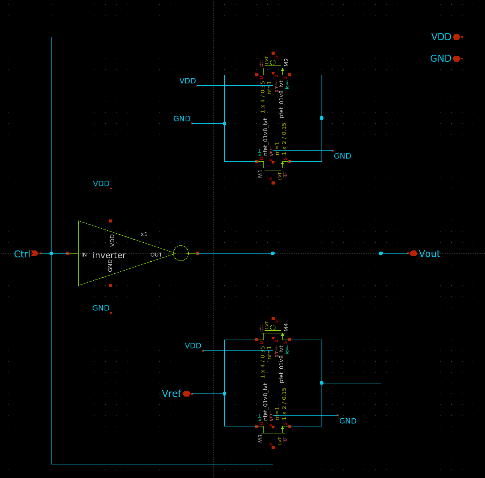

I due passgate sono entrambi NMOS+PMOS e la struttura funziona per qualsiasi $V_{REF}$, inclusi valori vicini a $V_{DD}$.

> 💡 Il T-gate ha una porta `Vref` esplicita: è questa la tensione che determina il passo del DAC. Con `Vref = 256 mV` si ottiene $V_{LSB} = 1\ \text{mV}$; con `Vref = VDD = 1.8\ \text{V}` si ottiene $V_{LSB} = 7\ \text{mV}$. Il circuito è identico — cambia solo la tensione applicata a questo pin.

**Domanda di riflessione — semplificazione con $V_{REF} = 256\ \text{mV}$:**

Con la nostra scelta di $V_{REF} = 256\ \text{mV}$, verifica se il PMOS del passgate superiore (quello tra $V_{REF}$ e `Vout`) è effettivamente necessario. Il PMOS ha source=$V_{REF}$=256mV, gate=$\overline{D[k]}$=0V quando deve condurre ($D[k]=1$):

$$V_{SG,P} = V_{REF} - 0 = 256\ \text{mV} \quad \text{vs} \quad |V_{th,p}| \approx 0.6\ \text{V}$$

Il PMOS non raggiunge la soglia → non conduce. Con $V_{REF} = 256\ \text{mV}$ il passgate superiore degenera in un semplice NMOS. In modo analogo, dimostra che anche il PMOS del passgate inferiore è inutile (GND = 0V → $V_{SG,P}$ ancora minore). Conclusione: con $V_{REF} = 256\ \text{mV}$ basterebbero **due soli NMOS** pilotati da $D[k]$ e $\overline{D[k]}$ — ma usiamo i passgate completi per generalità e didattica.

**Domanda di riflessione — singolo NMOS verso GND vs passgate completo:**

Per collegare la bottom plate a GND, confronta le due topologie:

- **Topologia A — singolo NMOS**: source connesso direttamente a GND, drain verso BP[k]
- **Topologia B — passgate completo**: NMOS + PMOS in parallelo, con GND sul lato ingresso e BP[k] sul lato uscita

**In termini di $R_{on}$**: quando BP[k] > GND, il terminale a tensione più bassa è GND — ngspice identifica automaticamente source = GND in entrambi i casi. Quindi $V_{GS} = V_{DD}$, $V_{SB} = 0$ e $R_{on}$ è identico. Le due topologie sono equivalenti in velocità.

**In termini di charge injection**: quando lo switch si apre, la carica del canale si ridistribuisce sul condensatore. Nel passgate completo, le iniezioni di NMOS e PMOS hanno segno opposto e si cancellano parzialmente — ma solo se il PMOS **conduce effettivamente**. Con $V_{REF} = 256\ \text{mV}$, il PMOS del passgate verso GND ha source = BP[k] $\leq 256\ \text{mV}$, gate = $D[k] = V_{DD}$ quando deve restare spento → $V_{SG} < 0$ → spento, ma la sua carica di gate si inietta comunque attraverso la capacità $C_{GD}$ (clock feedthrough) **senza contribuire alla conduzione**. In questo caso il passgate non cancella nulla, ma introduce un termine di iniezione aggiuntivo rispetto al singolo NMOS.

**Conclusione**: con $V_{REF} = 256\ \text{mV}$ il singolo NMOS verso GND è preferibile: stessa velocità, minore clock feedthrough. Il passgate completo è giustificato solo con $V_{REF}$ elevato (tipicamente $\geq V_{DD}/2$), dove il PMOS contribuisce attivamente e la cancellazione della charge injection è efficace.

### 3.2 Costruzione del T-gate in xschem

Il T-gate è composto da tre blocchi: un **inverter**, un **passgate** verso $V_{REF}$ e un **passgate** verso GND. Li costruiamo come sottocircuiti separati e poi li assembliamo nel T-gate.

**Passo 1 — Copia dell'inverter dal Modulo 1**

L'inverter è già stato progettato nel Modulo 1 (Lab01) e ne è stato realizzato il layout nel Modulo 3. Invece di ridisegnarlo, copia i file direttamente nella cartella di lavoro corrente:

```bash
cp /foss/designs/modulo1/lab01/xschem/inverter.sch    /foss/designs/modulo5/lab01/xschem/
cp /foss/designs/modulo1/lab01/xschem/inverter.sym    /foss/designs/modulo5/lab01/xschem/
```

> 💡 Copia **entrambi** i file `.sch` e `.sym` — xschem usa il simbolo `.sym` per istanziare il componente nello schema del T-gate, e il `.sch` per generare la netlist del subcircuito.

**Passo 2 — Nuovo passgate per il T-gate**

Il passgate della Parte 2 ha dimensioni $W_N = 2\ \mu\text{m}$, $W_P = 4\ \mu\text{m}$, ottimizzate per il campionamento su $C_{tot} = 12.8\ \text{pF}$. Per il T-gate il carico è molto minore — al massimo $C_{MSB} = 6.4\ \text{pF}$ (un solo condensatore, non l'intero array) — e come mostrato nella nota 💡 della sezione 3.3 il settling time è già $\approx 4\ \text{ns}$ con dimensioni minime. È quindi opportuno creare un passgate dedicato con dimensioni ridotte.

Crea `passgate_small.sch` (**File → New Schematic**, **Ctrl+S**) seguendo la stessa procedura della Parte 2, con le dimensioni:

**M1** — `nfet_01v8`: `W = 1`, `L = 0.15`
**M2** — `pfet_01v8`: `W = 2`, `L = 0.15`

Le porte sono identiche a quelle del passgate della Parte 2: `Vin` (`iopin`), `Vout` (`iopin`), `CTRL` (`ipin`), `!CTRL` (`ipin`), `VDD` (`ipin`), `GND` (`ipin`).

Genera il simbolo `passgate_small.sym` con **Symbol → Make symbol from schematic** oppure tasto `A`.

> 💡 Avere due passgate con nomi distinti (`passgate.sym` per il campionamento, `passgate_small.sym` per il T-gate) evita ambiguità quando si istanziano entrambi nel CDAC completo della Parte 4.

**Passo 3 — Assemblaggio del T-gate**

Crea `T_gate.sch` (**File → New Schematic**, salva con **Ctrl+S**).

Istanzia i tre sottocircuiti con `Shift+I`:

**Inverter** (`inverter.sym`):
- `in` → etichetta `ctrl` (nodo condiviso con il gate del passgate superiore)
- `out` → etichetta `ctrl_not` (nodo interno)
- `vdd` → `VDD`; `gnd` → `GND`

**Passgate superiore** (`passgate_small.sym`) — tra `Vref` e `Vout`:
- `Vin` → `Vref` (porta esterna)
- `Vout` → `Vout` (porta esterna / nodo di uscita)
- `CTRL` → `ctrl`
- `!CTRL` → `ctrl_not`
- `VDD` → `VDD`; `GND` → `GND`

**Passgate inferiore** (`passgate_small.sym`) — tra GND e `Vout`:
- `Vin` → `GND`
- `Vout` → `Vout` (stesso nodo del passgate superiore)
- `CTRL` → `ctrl_not`
- `!CTRL` → `ctrl`
- `VDD` → `VDD`; `GND` → `GND`

> ⚠️ I segnali `CTRL` e `!CTRL` del passgate inferiore sono **invertiti** rispetto al passgate superiore: quando $D[k]=1$ il passgate superiore (Vref) è attivo e quello inferiore (GND) è spento, e viceversa. Questo è il meccanismo di selezione del T-gate.

> ⚠️ I nodi `ctrl_not` è interno al T-gate — usa `devices/lab_wire.sym` per etichettarlo. Non aggiungerlo come porta esterna.

Aggiungi le porte esterne con `Shift+I` → `devices/ipin.sym` e `devices/iopin.sym`:

| Pin | Tipo |
|-----|------|
| `Vref` | `ipin` |
| `Vout` | `iopin` |
| `ctrl` | `ipin` |
| `VDD` | `ipin` |
| `GND` | `ipin` |

Genera il simbolo `T_gate.sym` con **Symbol → Make symbol from schematic** oppure tasto `A`.

### 3.3 Testbench del T-gate

Prima di procedere con la switch bank, verifica il funzionamento del T-gate con un testbench dedicato.

Crea `tb_T_gate.sch` (**File → New Schematic**, **Ctrl+S**). Lo schema comprende:

- **`Vvdd`** (`vsource`, DC): `value = 1.8` — alimentazione
- **`Vvref`** (`vsource`, DC): `value = 0.256` — tensione di riferimento DAC
- **`Vctrl`** (`vsource`, PULSE): `PULSE(0 1.8 100n 1n 1n 200n 600n)` — segnale di controllo che alterna 0→1→0
- **Istanza `T_gate.sym`** collegata a `Vref`, `Vout`, `ctrl`, `VDD`, `GND`
- **Carico capacitivo** (`devices/cap.sym`, `value=6.4p`): tra `Vout` e `GND` — simula la capacità del condensatore MSB ($C_7 = 128 \times C_u$), che è il carico peggiore per la switch bank
- **Resistore di polarizzazione** (`devices/res.sym`, `value=1G`): tra `Vout` e `GND`

Aggiungi il blocco `TT_MODELS` copiandolo da `top.sch`.

Blocco di simulazione (`code_shown`, `only_toplevel=true`):

```spice
.control
  save all
  tran 10p 700n
  write tb_T_gate.raw v(Vout) v(ctrl)
  plot v(Vout) v(ctrl)
.endc
```
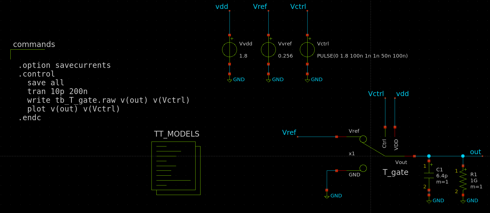

**Ctrl+S** → **Netlist** → **Simulate**.

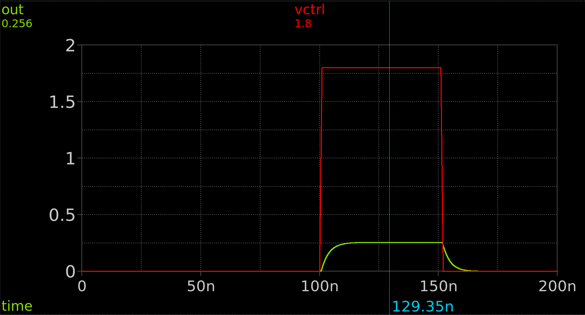

**Risultato atteso:**

- t=0–100ns: `ctrl=0` → T-gate connette GND → `Vout=0V` ✓
- t=100–300ns: `ctrl=1` → T-gate connette `Vref=256mV` → `Vout` sale verso 256mV
- t=300–500ns: `ctrl=0` → T-gate connette GND → `Vout` scende verso 0V
- t=500–700ns: `ctrl=1` → `Vout` risale a 256mV

**Domanda:** misura il tempo di settling per entrambe le transizioni (salita verso Vref e discesa verso GND) e confrontali con il requisito di 50 ns. Sono soddisfatti?

$$t_{settle, Vref} = \texttt{?}\ \text{ns} \quad t_{settle, GND} = \texttt{?}\ \text{ns}$$

> 💡 Il T-gate ha un carico di soli 6.4 pF (un singolo condensatore, il MSB) invece dei 12.8 pF del passgate di campionamento, e lavora con tensioni massime di 256mV invece di 900mV. L'overdrive dei transistor è molto più favorevole — ci si aspetta un settling time di pochi nanosecondi, ben al di sotto della specifica.

> 💡 Il comportamento del T-gate è **asimmetrico per costruzione**: quando `ctrl=1` il passgate superiore porta `Vout` verso `Vref=256mV`; quando `ctrl=0` il passgate inferiore porta `Vout` verso GND. Queste sono le uniche due condizioni operative — non c'è una fase di tracking su un segnale analogico continuo come nel passgate di campionamento. Entrambi i transistor della coppia attiva lavorano lontano dalla loro soglia → $R_{on}$ bassa e ben predicibile dalla formula lineare.

**Domanda:** Verifica che il comportamento del T-gate sia congruo con le aspettative anche cun una tensione `Vref=1.8V`. Il settling time è ancora accettabile?


### 3.4 Switch bank: 8 istanze di T-gate

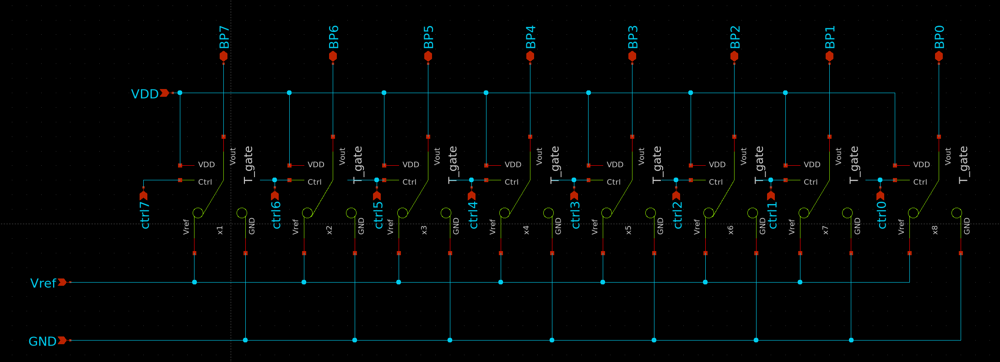

Crea `switch_bank.sch` (**File → New Schematic**, **Ctrl+S**) con 8 istanze di `T_gate.sym`, una per ogni bit da `BP0` (LSB) a `BP7` (MSB).

- Il pin `Vref` di ogni istanza è connesso alla porta globale `VREF` della switch bank
- Il pin `Vout` di ogni istanza è connesso alla porta `BP[k]` corrispondente
- Il pin `ctrl` riceve `dac_p[k]` direttamente dal SAR controller (il complemento `ctrl_not` è generato internamente all'inverter del T-gate — non serve come porta esterna)

Le porte di interfaccia della switch bank sono:

- `VREF` — ingresso (tensione di riferimento DAC, da sorgente esterna)
- `VDD` — ingresso (alimentazione per i bulk PMOS e per gli inverter)
- `GND` — ingresso
- `ctrl[7:0]` — ingressi dal SAR controller (`dac_p[7:0]`)
- `BP[7:0]` — uscite verso le bottom plate del CDAC

Genera il simbolo `switch_bank.sym` con **Symbol → Make symbol from schematic** oppure tasto `A`.

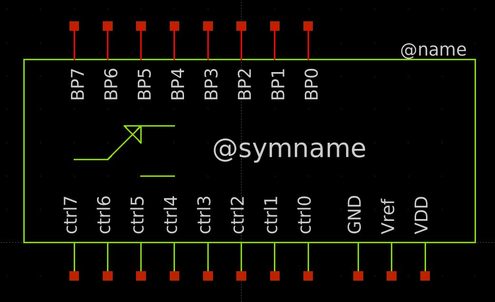

> 💡 Il T-gate per le bottom plate lavora in condizioni molto più favorevoli del passgate di campionamento. Con $V_{REF} = 256\ \text{mV}$, il source dell'NMOS superiore raggiunge al massimo 256 mV → $V_{SB,N} = 256\ \text{mV}$ → $V_{th,N}$ sale solo a $\approx 0.53\ \text{V}$ → overdrive = $V_{DD} - 256\ \text{mV} - 0.53\ \text{V} = 1.01\ \text{V}$. Per il bit MSB ($C_7 = 128 \times C_u \approx 6.4\ \text{pF}$): $R_{on,N} \approx 82\ \Omega$, $\tau \approx 0.52\ \text{ns}$, $t_{settle} \approx 4\ \text{ns} \ll 50\ \text{ns}$ ✓. Il T-gate non richiede dimensionamento critico.

---

## Parte 4 — CDAC completo con switch reali

### 4.1 Schema `cdac_complete.sch`

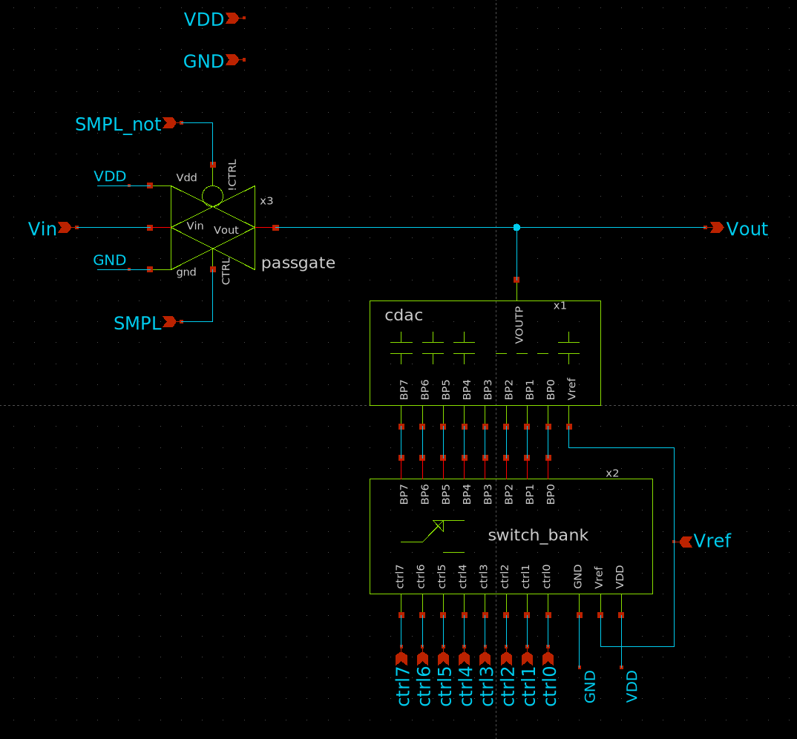

Crea `cdac_complete.sch` (**File → New Schematic**, **Ctrl+S**):

1. **Importa il CDAC del Modulo 2**: copia `cdac.sch` e `cdac.sym` dalla cartella `/foss/designs/modulo2/lab_cdac/xschem/`. Istanzia `cdac.sym`.

2. **Aggiungi il passgate di campionamento**: istanzia `passgate.sym` (dalla Parte 2, $W_N = 2\ \mu\text{m}$, $W_P = 4\ \mu\text{m}$). Collega `Vin` a `VIN`, `Vout` a `VOUTP`, `CTRL` a `phi_sample`, `!CTRL` a `phi_sample_not`, `VDD` e `GND` alle porte globali.

3. **Aggiungi la switch bank**: istanzia `switch_bank.sym`. Collega `BP[7:0]` ai pin `BP0..BP7` del CDAC, `VREF` alla porta esterna `VREF`, `ctrl[7:0]` a `dac_p[7:0]`.

4. **Porta VDD del CDAC**: il pin `VDD` del `cdac.sym` (bottom plate della capacità di terminazione) va connesso alla porta esterna `VDD`.

Porte di `cdac_complete.sym`:
- `VIN`, `phi_sample`, `phi_sample_not`, `dac_p[7:0]`, `VREF`, `VDD`, `GND` (ingressi)
- `VOUTP` (uscita → al comparatore)

Genera il simbolo con **Symbol → Make symbol from schematic** oppure tasto `A`.

### 4.2 Testbench: simulazione comparativa

Crea `tb_cdac_complete.sch` (**File → New Schematic**, **Ctrl+S**).

Il testbench simula la seguente sequenza con la **procedura monotonica**: (1) campionamento di $V_{IN+} = V_{CM} + 72\ \text{mV} = 0.972\ \text{V}$ con tutte le BP a Vref (`ctrl=1`); (2) ST_CONV7 — comparazione gratuita, nessuna commutazione del CDAC; (3) ST_CONV6 — si abbassa BP7 del ramo opportuno portando `ctrl7` a 0 (BP7 → GND); (4) secondo campionamento con tutte le BP di nuovo a Vref (`ctrl=1`).

**Sorgenti comuni ad entrambe le configurazioni:**

- **`Vvdd`** (`vsource`, DC): `value = 1.8` — alimentazione digitale e bulk PMOS
- **`Vvref`** (`vsource`, DC): `value = 0.256` — tensione di riferimento DAC
- **`Vvin`** (`vsource`, DC): `value = 0.972` — ingresso analogico ($V_{CM} + 72\ \text{mV}$, codice atteso D=72)
- **`Vphi`** (`vsource`, PULSE): `PULSE(1.8 0 0 1n 1n 49n 100n)` — campionamento nel primo ciclo di clock
- **`Vphi_not`** (`vsource`, PULSE): complemento di `Vphi`
- **`VBP7`** (`vsource`, PWL): 
  ```
  pwl 0 0 100n 0 101n 1.8 148n 1.8 149n 0 300n 0
  ```
  Segnale digitale 0→1.8V per il T-gate dell'MSB. La sequenza temporale è:
  - t=0–100ns: ctrl7=1.8V → BP7 a Vref (durante il campionamento, procedura monotonica)
  - t=101–148ns: ctrl7=0 → BP7 a GND (decisione MSB: abbasso il ramo opportuno)
  - t=149ns: ctrl7=1.8V → BP7 torna a Vref (reset per il secondo campionamento)

> ⚠️ È fondamentale riportare ctrl7 a 0 **prima** del secondo campionamento (phi=HIGH). Se ctrl7 rimane alto durante il campionamento, BP7 è connesso a Vref=256mV e il passgate deve combattere il condensatore da 128*$C_u$ per ricampionare Vin — il settling è molto più lento e il campionamento è perturbato. Questo rispecchia il comportamento reale del SAR controller con procedura di switching monotonica: la FSM porta tutti i segnali `dac_p[k]=1` nello stato ST_SAMPLE (tutte le bottom plate a Vref), non a 0.

- **`VBP6..VBP0`** (`vsource`, DC): `dc 0` — tutti gli altri bit a GND per tutta la simulazione

> 💡 `VBP7` e in generale tutti i segnali `ctrl[k]` sono segnali **digitali** (0/1.8V) prodotti dal controller SAR (`dac_p[7:0]`). È il T-gate internamente che decide se connettere `Vref` o GND alla bottom plate in base a questo segnale. Il parametro `.param vref` nel blocco di simulazione serve solo alla sorgente `Vvref` per variare il riferimento DAC tra le configurazioni A e B.

Aggiungi il blocco `TT_MODELS` copiandolo da `top.sch`.

**Blocco di simulazione** (`code_shown`, `only_toplevel=true`):

```spice
.param vref = 0.256

.control
  save all
  tran 10p 300n
  write tb_cdac_complete.raw
  plot v(VOUTP) v(VIN) v(phi_sample) v(BP7)
.endc
```
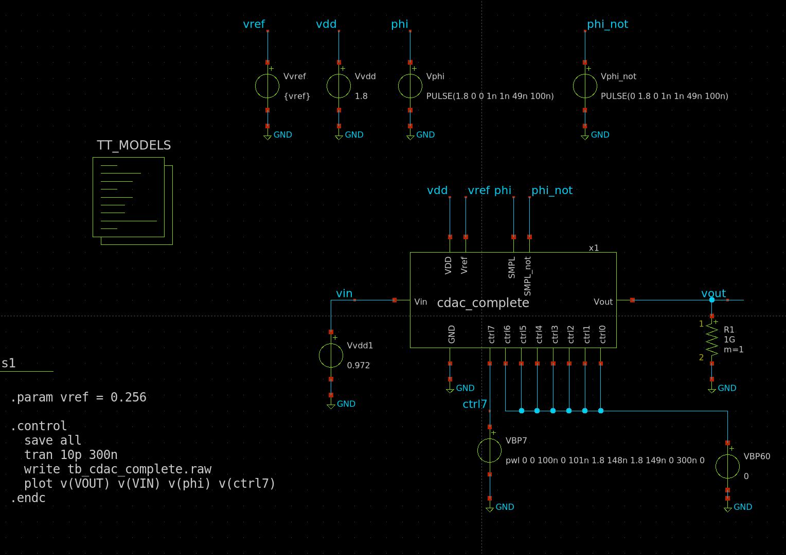

**Ctrl+S** → **Netlist** → **Simulate**.

**Domanda A** — Con `vref = 0.256` (256 mV, configurazione progettuale):

Misura la tensione `VOUTP` al termine del campionamento e dopo la commutazione di BP7.

$$V_{VOUTP,smp} = \texttt{?}\ \text{V} \approx V_{IN} = 0.972\ \text{V}$$

$$V_{VOUTP,MSB} = V_{IN} + \frac{128}{256} \times V_{REF} = 0.972 + 0.128 = \texttt{?}\ \text{V}$$

Verifica che il passo corrisponda a $128 \times V_{LSB} = 128 \times 1\ \text{mV} = 128\ \text{mV}$.


> 💡 Il segno del passo è **negativo** ($-128\ \text{mV}$): quando BP7 passa da Vref a GND (procedura monotonica), la bottom plate scende, e per conservazione della carica la top plate scende di $\Delta V = -V_{REF} \cdot C_7/C_{tot} = -128\ \text{mV}$. Con $V_{IN+} = 0.972\ \text{V}$: $V_{OUTP} = 0.972 - 0.128 = 0.844\ \text{V} > V_{CM} = 0.9\ \text{V}$... ma questo passo abbassa il ramo NEGATIVO (non il positivo). Per il ramo positivo: $V_{OUTP}$ rimane invariata, mentre $V_{OUTN}$ scende → il comparatore vede $V_{OUTP} > V_{OUTN}$ → bit MSB = 1 ✓

**Domanda B** — Cambia `vref = 1.8` (VDD, configurazione alternativa) ed esegui di nuovo la simulazione:

$$V_{VOUTP,MSB} = V_{IN} + \frac{128}{256} \times 1.8\ \text{V} = 0.972 + 0.9 = \texttt{?}\ \text{V}$$

Il passo dell'MSB vale ora $128 \times V_{LSB} = 128 \times 7\ \text{mV} = 896\ \text{mV}$. Verifica che il rapporto tra il passo misurato in B e quello misurato in A sia:

$$\frac{\Delta V_{MSB,B}}{\Delta V_{MSB,A}} = \frac{1.8\ \text{V}}{0.256\ \text{V}} = \texttt{?}$$

**Domanda C** — Ancora con `vref = 1.8`, osserva l'errore di campionamento: misura $V_{VOUTP,smp} - V_{IN}$ subito dopo l'apertura del passgate. Con $V_{REF} = V_{DD}$, le bottom plate durante la conversione raggiungono 1.8 V, e il passgate di campionamento deve trasmettere $V_{IN} \approx 0.972\ \text{V}$ con le bottom plate che variano su tutta la gamma $[0,\ 1.8\ \text{V}]$. Come cambia l'errore di campionamento rispetto alla configurazione A?

$$\Delta V_{smp,A} = \texttt{?}\ \text{mV}, \quad \Delta V_{smp,B} = \texttt{?}\ \text{mV}$$

> 💡 Con $V_{REF} = V_{DD}$, la tensione sulla top plate durante la conversione può variare tra $V_{IN} - 0.9\ \text{V}$ e $V_{IN} + 0.9\ \text{V}$, cioè tra circa 0.07 V e 1.87 V. In questa condizione il passgate lavora lontano dal suo punto di simmetria ($V_{CM}$) e la $R_{on}$ varia significativamente — introducendo distorsione non lineare nel campionamento. Il **bootstrap switch** risolve questo problema mantenendo $V_{GS}$ costante indipendentemente dal segnale, a costo però di una topologia molto più complessa (10+ transistor). Nel nostro progetto con $V_{REF} = 256\ \text{mV}$ il passgate è sufficiente, come verificato nella configurazione A.

---

---

Il file di soluzione completo è disponibile in [`soluzioni/lab01/`](./soluzioni/lab01).

## Extra Credit — Test di linearità del CDAC

In questo esercizio generi tutti i 256 codici digitali (da `00000000` a `11111111`) e verifichi che la tensione `VOUTP` segua una rampa a gradini perfettamente lineare, con passo costante di 1 mV per ogni LSB.

**Traccia dell'esercizio:**

L'obiettivo è costruire un testbench `tb_cdac_linearity.sch` in cui:

1. Il passgate di campionamento è **sempre aperto** (phi=0) — la top plate è floating fin dall'inizio
2. La condizione iniziale `.ic v(VOUTP)=0` forza Vout a 0V a t=0
3. Otto sorgenti VPULSE pilotano i segnali `ctrl0`..`ctrl7` con **periodo raddoppiato** da bit a bit — questa struttura genera automaticamente il conteggio binario da 0 a 255 in ordine crescente

La struttura delle sorgenti è:
- `ctrl0` (LSB): periodo = $2 T_{bit}$, cambia ogni $T_{bit}$
- `ctrl1`: periodo = $4 T_{bit}$, cambia ogni $2 T_{bit}$
- `ctrlk`: periodo = $2^{k+1} T_{bit}$, cambia ogni $2^k T_{bit}$
- `ctrl7` (MSB): periodo = $256 T_{bit}$, cambia ogni $128 T_{bit}$

Il tempo totale di simulazione è $256 \times T_{bit}$.

**Domanda:** quale valore di $T_{bit}$ garantisce il settling completo del CDAC a ogni step? Usa il settling time misurato nella sezione 2.4 come riferimento.

$$T_{bit} = \texttt{?}\ \text{ns} \quad (> t_{settle,worst\_case})$$

**Risultato atteso:** `VOUTP` deve mostrare una rampa a gradini da 0 mV a 255 mV, con 256 step di 1 mV ciascuno. Verifica graficamente che tutti i gradini abbiano la stessa altezza — la deviazione dalla linearità è visibile come irregolarità nei gradini.

$$V_{OUTP}(D) = D \times 1\ \text{mV}, \quad D = 0, 1, \ldots, 255$$

**Suggerimento:** per verificare la linearità in modo più rigoroso, esporta i dati con `wrdata linearity.txt v(VOUTP)` e analizzali in Python calcolando la differenza tra ogni valore misurato e la retta ideale $D \times V_{LSB}$.

<details>
<summary>💡 Soluzione — espandi solo dopo aver costruito il testbench</summary>

**Schema del testbench `tb_cdac_linearity.sch`:**

Sorgenti da aggiungere:

| Sorgente | Tipo | Valore |
|---|---|---|
| `Vvdd` | DC | `1.8` |
| `Vvref` | DC | `0.256` |
| `Vvin` | DC | `0` — non usato (phi=0) |
| `Vphi` | DC | `0` — passgate sempre aperto |
| `Vphi_not` | DC | `1.8` |
| `Vctrl0` | PULSE | `PULSE(0 1.8 {Tbit} 1n 1n {Tbit} {2*Tbit})` |
| `Vctrl1` | PULSE | `PULSE(0 1.8 {2*Tbit} 1n 1n {2*Tbit} {4*Tbit})` |
| `Vctrl2` | PULSE | `PULSE(0 1.8 {4*Tbit} 1n 1n {4*Tbit} {8*Tbit})` |
| `Vctrl3` | PULSE | `PULSE(0 1.8 {8*Tbit} 1n 1n {8*Tbit} {16*Tbit})` |
| `Vctrl4` | PULSE | `PULSE(0 1.8 {16*Tbit} 1n 1n {16*Tbit} {32*Tbit})` |
| `Vctrl5` | PULSE | `PULSE(0 1.8 {32*Tbit} 1n 1n {32*Tbit} {64*Tbit})` |
| `Vctrl6` | PULSE | `PULSE(0 1.8 {64*Tbit} 1n 1n {64*Tbit} {128*Tbit})` |
| `Vctrl7` | PULSE | `PULSE(0 1.8 {128*Tbit} 1n 1n {128*Tbit} {256*Tbit})` |

**Perché questo genera il conteggio binario 0→255:**

Ogni `ctrl_k` ha delay iniziale = $2^k \cdot T_{bit}$ e periodo = $2^{k+1} \cdot T_{bit}$. In ogni intervallo $T_{bit}$, lo stato dei bit evolve come un contatore binario:

| t | ctrl7..0 | D |
|---|---|---|
| 0.5·$T_{bit}$ | `00000000` | 0 |
| 1.5·$T_{bit}$ | `00000001` | 1 |
| 2.5·$T_{bit}$ | `00000010` | 2 |
| 3.5·$T_{bit}$ | `00000011` | 3 |
| ⋮ | ⋮ | ⋮ |
| 255.5·$T_{bit}$ | `11111111` | 255 |

**Blocco di simulazione:**

```spice
.param Tbit = 200n
.ic v(VOUTP) = 0
.options savecurrents

.control
  save all
  tran 1n {256*Tbit}
  write tb_cdac_linearity.raw v(VOUTP)
  set wr_singlescale
  set wr_vecnames
  wrdata linearity.txt v(VOUTP)
  plot v(VOUTP)
.endc
```

**Perché $T_{bit} = 200\ \text{ns}$:** il settling time peggiore misurato nella sezione 2.4 (corner `tt`, VDD=1.80V, T=27°C) è circa 50 ns per il passgate LVT. Il T-gate della switch bank è molto più veloce (≈ 4 ns). Con $T_{bit} = 200\ \text{ns}$ si ha un margine di 4× sul settling — sufficiente per il corner `ss` worst case.

**Verifica matematica della linearità:**

Con `.ic v(VOUTP)=0` (top plate a 0V, tutti i BPs a GND, terminazione a Vref), la carica iniziale sulla top plate è:

$$Q_0 = C_u \cdot (0 - V_{REF}) + 255 \cdot C_u \cdot (0 - 0) = -C_u \cdot V_{REF}$$

Per il codice $D$ (i cui bit selezionano BPs connessi a Vref):

$$Q_0 = (1 + D) \cdot C_u \cdot (V_{out} - V_{REF}) + (255 - D) \cdot C_u \cdot V_{out}$$

$$\Rightarrow \quad V_{out} = \frac{D}{256} \cdot V_{REF} = D \times 1\ \text{mV} \checkmark$$

**Analisi di linearità in Python** (dopo aver esportato `linearity.txt`):

```python
import numpy as np
import matplotlib.pyplot as plt

data = np.loadtxt('linearity.txt', skiprows=1)
time = data[:, 0]
vout = data[:, 1]

# Campiona Vout al centro di ogni Tbit (a 0.5, 1.5, 2.5, ... * Tbit)
Tbit = 200e-9
t_samples = (np.arange(256) + 0.5) * Tbit
v_samples = np.interp(t_samples, time, vout)

# Retta ideale
D = np.arange(256)
v_ideal = D * 1e-3  # 1 mV per LSB

# DNL: Differential Non-Linearity
step_measured = np.diff(v_samples) * 1000  # in mV
step_ideal    = 1.0  # mV
DNL = (step_measured - step_ideal) / step_ideal  # in LSB

print(f"DNL max: {DNL.max():.3f} LSB")
print(f"DNL min: {DNL.min():.3f} LSB")

# INL: Integral Non-Linearity
INL = (v_samples - v_ideal) * 1000  # in mV = LSB

fig, (ax1, ax2, ax3) = plt.subplots(3, 1, figsize=(10, 8))
ax1.plot(D, v_samples * 1000, label='Misurato')
ax1.plot(D, v_ideal * 1000, '--', label='Ideale')
ax1.set_ylabel('VOUTP (mV)'); ax1.legend()
ax2.stem(D[:-1], DNL); ax2.set_ylabel('DNL (LSB)')
ax3.plot(D, INL); ax3.set_ylabel('INL (LSB)')
ax3.set_xlabel('Codice D')
plt.tight_layout(); plt.savefig('cdac_linearity.png')
```

</details>


## Parte 5 — Domande di riflessione

1. Perché si usa un passgate (NMOS+PMOS) invece di un semplice NMOS per le bottom plate del CDAC, nonostante le tensioni commutate siano $0$ o $V_{DD}$ (dove anche il solo NMOS sarebbe sufficiente)?

2. Nella simulazione comparativa della Parte 4 hai osservato che con $V_{REF} = V_{DD} = 1.8\ \text{V}$ il passgate introduce distorsione maggiore rispetto a $V_{REF} = 256\ \text{mV}$. Spiega il meccanismo fisico: perché la variazione di $R_{on}$ del passgate dipende dalla tensione sulla top plate, e perché questa variazione è più grande con $V_{REF} = V_{DD}$? Qual è il vantaggio del bootstrap switch in questo contesto?

3. Nella Parte 2 hai misurato un errore di charge injection $\Delta V_{inj}$. Questo errore è sistematico (uguale per tutte le conversioni) o random? Qual è il suo effetto sulla curva di trasferimento del SAR ADC — causa un errore di offset, un errore di guadagno, o entrambi?

4. Il T-gate della switch bank ha un pin `VREF` esplicito. Con $V_{REF} = 256\ \text{mV}$, il PMOS del T-gate ha source a 256 mV e gate a 0 V quando conduce: calcola $V_{SG}$ e verifica che sia sufficiente per superare $|V_{th,p}| \approx 0.6\ \text{V}$. Cosa succederebbe se $V_{REF}$ fosse ancora più bassa, ad esempio 100 mV?

$$V_{SG,P} = V_{REF} - 0 = \texttt{?}\ \text{V} \quad (> |V_{th,p}|?\ \texttt{?})$$

5. Nella switch bank, tutti i T-gate hanno le stesse dimensioni ($W_N = 1\ \mu\text{m}$, $W_P = 2\ \mu\text{m}$ per il passgate interno, $W_N = 1\ \mu\text{m}$ per l'NMOS verso GND). Sarebbe più corretto usare switch più piccoli per i bit meno significativi (LSB) e più grandi per i bit più significativi (MSB)? Quali sono i tradeoff?
