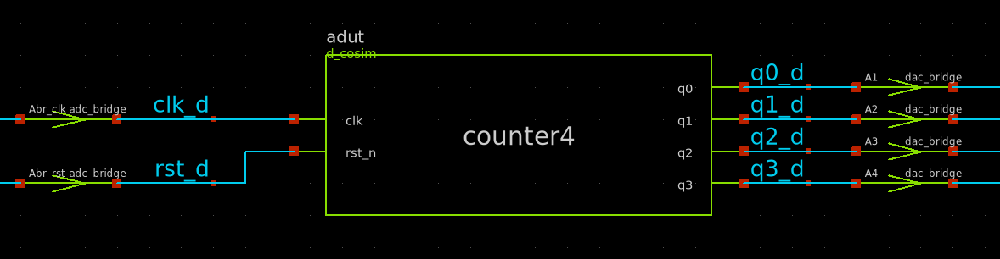
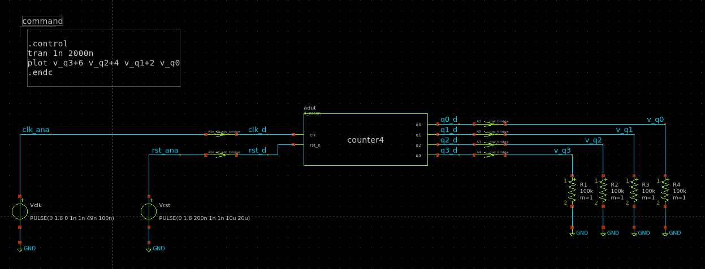
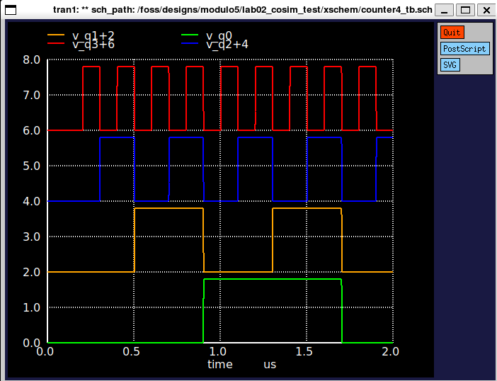

# Lab02 — Cosimulazione mixed-signal: pipeline VHDL → Verilator → ngspice

**Tempo stimato:** ~2 ore
**Cartella di lavoro:** `/foss/designs/modulo5/lab02_cosim_test/`

---

## Obiettivo

In questo lab impari il meccanismo di **cosimulazione mixed-signal** che permette a ngspice di simulare insieme blocchi analogici (CDAC, comparatore) e blocchi digitali descritti in VHDL (controller SAR del Modulo 4). Alla fine del lab avrai:

- Una **pipeline di build** completamente automatizzata (`make cosim_setup`) che converte un file VHDL in una shared library cosimulabile e nel relativo simbolo xschem
- Un **circuito di test** con un contatore a 4 bit (`counter4`) che dimostra il funzionamento end-to-end
- Familiarità con i **bridge analogico-digitale** (`adc_bridge`, `dac_bridge`) necessari per interfacciare i due domini

Il risultato di questo lab è la base operativa per il Lab03, dove il controller SAR del Modulo 4 sostituirà `counter4` nel sistema completo.

---

## Parte 1 — Architettura della cosimulazione

### 1.1 Il problema dell'integrazione mixed-signal

Il SAR ADC è per natura un sistema **mixed-signal**: i blocchi analogici (CDAC, switch di campionamento, comparatore) lavorano nel dominio del tempo continuo, mentre il controller digitale è una macchina a stati che evolve a fronti di clock. Tradizionalmente questi due domini si simulano separatamente:

- **Analogico**: ngspice (Modulo 1, 2, e Lab01 di questo modulo)
- **Digitale**: GHDL + GTKWave (Modulo 4)

Ma il SAR ADC ha un **loop di retroazione che attraversa i due domini**: il comparatore produce un bit, il controller lo legge e aggiorna i `dac_p[7:0]`, che pilotano la switch bank, che modifica `VOUTP`, che il comparatore valuta al ciclo successivo. Senza simulare insieme i due domini è impossibile verificare il sistema completo.

La soluzione è la **cosimulazione**: ngspice si fa carico dei nodi analogici, mentre un simulatore digitale gestisce l'evoluzione degli stati VHDL, e i due simulatori si sincronizzano agli istanti di sample.

### 1.2 La pipeline VHDL → ngspice

Il container IIC-OSIC-TOOLS fornisce gli strumenti di base (Yosys, GHDL, Verilator, ngspice). La pipeline che li orchestra è invece sviluppata nel repository del corso, nella cartella `utils/GHDL_Digital_sim/`:

```
sar_controller.vhd               ← codice sorgente
       │
       │ ghdl + yosys (sintesi behavioral)
       ▼
sar_controller_behav.v           ← Verilog behavioral, equivalente RTL
       │
       │ verilator (compilazione C++ + linking)
       ▼
sar_controller_behav.so          ← shared library caricabile da ngspice
       │
       │ d_cosim (XSPICE)
       ▼
ngspice                          ← simulazione mixed-signal completa
```

I tre passaggi sono automatizzati nel Makefile (`make cosim_setup`). Il risultato è una `.so` che ngspice carica tramite il modello `d_cosim` di XSPICE, ottenendo una porta digitale che si comporta esattamente come il VHDL originale.

### 1.3 I bridge analogico-digitale

Il blocco `d_cosim` lavora con segnali **digitali puri** (valori logici `0` e `1`), non con tensioni. Per interfacciarlo al resto del circuito ngspice (che lavora con tensioni continue) servono due tipi di bridge:

**`adc_bridge`** — converte tensione analogica → segnale digitale. Soglie configurabili `in_low` e `in_high`: tensioni < `in_low` = `0`, tensioni > `in_high` = `1`, tensioni intermedie = stato precedente (isteresi). Per SKY130A con $V_{DD} = 1.8\ \text{V}$ usiamo soglie a $0.7\ \text{V}$ e $1.1\ \text{V}$ (quasi simmetriche attorno a $V_{DD}/2$).

**`dac_bridge`** — converte segnale digitale → tensione analogica. Livelli configurabili `out_low` e `out_high`. Per SKY130A: `out_low=0`, `out_high=1.8`.



> 💡 I bridge introducono un piccolo ritardo di propagazione (default 1 ns). In simulazioni con clock fino a $\sim 50\ \text{MHz}$ è trascurabile. Per applicazioni più veloci si può ridurre con il parametro `t_rise`/`t_fall`.

---

## Parte 2 — Setup del progetto `lab02_cosim_test`

### 2.1 Creazione della struttura

Crea il progetto di test e le sottocartelle:

```bash
mkdir -p /foss/designs/modulo5/lab02_cosim_test/src
mkdir -p /foss/designs/modulo5/lab02_cosim_test/xschem/simulations

cd /foss/designs/modulo5/lab02_cosim_test
```

> 💡 La cartella `xschem/simulations/` è quella in cui xschem genera il netlist e dove ngspice esegue la simulazione (il CWD del processo ngspice è `simulations/`). I path relativi nel netlist (es. `./counter4_behav.so`) sono interpretati rispetto a questa directory.

### 2.2 Copia del file VHDL di test

Salva nel file `src/counter4.vhd` il seguente contatore binario a 4 bit con reset asincrono:

```vhdl
library IEEE;
use IEEE.STD_LOGIC_1164.ALL;
use IEEE.NUMERIC_STD.ALL;

entity counter4 is
    port (
        clk   : in  std_logic;
        rst_n : in  std_logic;
        q3    : out std_logic;
        q2    : out std_logic;
        q1    : out std_logic;
        q0    : out std_logic
    );
end entity counter4;

architecture rtl of counter4 is
    signal count_r : unsigned(3 downto 0);
begin
    q3 <= count_r(3);
    q2 <= count_r(2);
    q1 <= count_r(1);
    q0 <= count_r(0);

    process(clk, rst_n)
    begin
        if rst_n = '0' then
            count_r <= (others => '0');
        elsif rising_edge(clk) then
            count_r <= count_r + 1;
        end if;
    end process;
end architecture rtl;
```

> 💡 Le uscite sono segnali individuali (`q3`, `q2`, `q1`, `q0`) e non un bus a 4 bit. Questa scelta è didattica: evita di dover gestire l'espansione del bus nel netlist d_cosim, che è una funzionalità più avanzata che vedremo nel Lab03 con il SAR controller a 8 bit.

### 2.3 Copia del Makefile dalla cartella `utils` del corso

Il repository del corso PSEI include una cartella `utils/` con strumenti di build sviluppati durante il Modulo 4. Il Makefile in `utils/GHDL_Digital_sim/` automatizza la pipeline VHDL → Verilog → shared library. Copialo nel progetto:

```bash
cp /foss/designs/utils/GHDL_Digital_sim/Makefile .
```

Il Makefile contiene cinque target principali:

```bash
make cosim_setup    # pipeline completa: VHDL → .v → .so + simbolo xschem
make cosim_verilog  # solo passo 1: VHDL → Verilog behavioral
make cosim_build    # solo passo 2: Verilog → shared library .so
make cosim_sym      # solo passo 3: Verilog → simbolo xschem .sym
make clean_cosim    # rimuove tutti i file generati
```

Per il setup iniziale usiamo il target completo `cosim_setup`.

### 2.4 Copia dei simboli bridge

I simboli `adc_bridge1.sym` e `dac_bridge1.sym` da usare nel progetto sono nella cartella `utils/Cosimulation/` del repository del corso. Copiali nella cartella locale `xschem/` del progetto:

```bash
cp /foss/designs/utils/Cosimulation/adc_bridge1.sym xschem/
cp /foss/designs/utils/Cosimulation/dac_bridge1.sym xschem/
```

> ⚠️ xschem distribuisce simboli `adc_bridge` e `dac_bridge` di default nella libreria `devices/`, ma sono versioni semplificate con meno parametri configurabili. I simboli in `utils/Cosimulation/` sono la versione completa derivata dal materiale didattico del corso IHP Analog Academy, con tutti i parametri (soglie, livelli, ritardi) accessibili dal doppio-click sull'istanza. È quindi importante usare quelli, non quelli di default.

---

## Parte 3 — Esecuzione della pipeline di build

### 3.1 Lancio del setup

Dalla cartella `/foss/designs/modulo5/lab02_cosim_test/`:

```bash
make cosim_setup
```

Output atteso (tre passi numerati):

```
--> [1/3] VHDL → Verilog behavioral: counter4
--> Verilog behavioral scritto: xschem/simulations/counter4_behav.v

--> [2/3] Verilog → shared library Verilator: counter4_behav.so
--> Shared library scritta: xschem/simulations/counter4_behav.so

--> [3/3] Verilog → simbolo xschem: counter4.sym
Modulo     : counter4
Ingressi   : ['clk', 'rst_n']
Uscite     : ['q3', 'q2', 'q1', 'q0']
Simbolo    → xschem/counter4.sym
```

### 3.2 Verifica dei file generati

Tre file devono essere stati creati:

```bash
# Verilog behavioral: deve contenere "always @" e "module counter4"
grep -E "module|always|output" xschem/simulations/counter4_behav.v | head -5

# Shared library: deve esistere con dimensione di decine di KB
ls -lh xschem/simulations/counter4_behav.so

# Simbolo xschem: ASCII leggibile, deve contenere "d_cosim"
grep "d_cosim\|format\|clk\|rst_n" xschem/counter4.sym
```

> ⚠️ Se uno solo di questi tre controlli fallisce, fermati e risolvi il problema prima di aprire xschem. La causa più frequente è l'assenza del plugin GHDL di Yosys (`yosys-plugin-ghdl`) o di `verilator` nel container — entrambi sono installati di default in IIC-OSIC-TOOLS v2025.07 ma controllabili con `which yosys verilator ghdl`.

### 3.3 Test stadio 2 — caricamento `.so` da ngspice

Prima di passare a xschem, è prudente verificare che la `.so` sia caricabile da ngspice in modo isolato. Crea il file `xschem/simulations/mixed.cir`:

```spice
* Test caricamento counter4_behav.so via d_cosim

Vclk  clk    0  PULSE(0 1.8 0 1n 1n 49n 100n)
Vrst  rst_n  0  PULSE(0 1.8 200n 1n 1n 10u 20u)

* Blocco d_cosim
Acounter [ clk rst_n ] [ q3 q2 q1 q0 ] counter_model
.model counter_model d_cosim simulation="./counter4_behav.so"

* DAC bridges per visualizzare le uscite
Adac3 [ q3 ] [ v_q3 ] dac_model
Adac2 [ q2 ] [ v_q2 ] dac_model
Adac1 [ q1 ] [ v_q1 ] dac_model
Adac0 [ q0 ] [ v_q0 ] dac_model
.model dac_model dac_bridge out_low=0 out_high=1.8

R3 v_q3 0 100k
R2 v_q2 0 100k
R1 v_q1 0 100k
R0 v_q0 0 100k

.control
  tran 1n 2000n
  plot v_q3+6 v_q2+4 v_q1+2 v_q0
.endc

.end
```

Esegui da `xschem/simulations/`:

```bash
cd xschem/simulations
ngspice mixed.cir
```

Risultato atteso: 4 forme d'onda binarie sovrapposte verticalmente. Per i primi 200 ns tutte a 0 (reset attivo), poi `q0` alterna ogni 100 ns, `q1` ogni 200 ns, `q2` ogni 400 ns, `q3` ogni 800 ns. Pattern del contatore binario.

> 💡 Il file `mixed.cir` è utile per il debug: se la simulazione funziona qui ma non in xschem, il problema è nello schematico (collegamenti errati, simboli non trovati). Se non funziona neanche qui, il problema è a monte (pipeline di build).

---

## Parte 4 — Costruzione del testbench in xschem

### 4.1 Apertura di xschem

Lancia xschem **dalla cartella `xschem/`** del progetto, non dalla radice:

```bash
cd /foss/designs/modulo5/lab02_cosim_test/xschem
xschem &
```

> ⚠️ Lanciare xschem dalla cartella corretta è critico: xschem crea la sotto-cartella `simulations/` relativa al file `.sch`, e ngspice viene avviato con quella come CWD. Il path relativo `./counter4_behav.so` nel netlist funziona solo se la CWD di ngspice è `xschem/simulations/`.

Crea un nuovo schematico: **File → New Schematic** → salva subito come `counter4_tb.sch` nella cartella `xschem/`.

### 4.2 Componenti dello schematico

Devi posizionare 12 componenti in totale. Procediamo nell'ordine logico del flusso del segnale:

**Sorgenti (a sinistra):**

1. `Vclk` — `vsource`, `value = PULSE(0 1.8 0 1n 1n 49n 100n)` — clock 10 MHz
2. `Vrst` — `vsource`, `value = PULSE(0 1.8 200n 1n 1n 10u 20u)` — reset attivo basso

**ADC bridge (al centro a sinistra):**

3. `Abr_clk` — istanza di `adc_bridge1.sym`, parametri:
   - `in_low = 0.7`
   - `in_high = 1.1`
4. `Abr_rst` — istanza di `adc_bridge1.sym`, stessi parametri

**DUT (al centro):**

5. Istanza di `counter4.sym` (generato da `make cosim_sym`)

**DAC bridge (a destra):**

6, 7, 8, 9 — quattro istanze di `dac_bridge1.sym`, parametri:
   - `out_low = 0`
   - `out_high = 1.8`

**Carichi resistivi (a destra):**

10, 11, 12, 13 — quattro resistori da `100k` tra le uscite analogiche e GND

**Riferimento di massa:**

14 — istanza di `gnd` (`devices/gnd.sym`)

> ⚠️ I carichi resistivi sulle uscite analogiche dei `dac_bridge` sono **necessari**: senza di essi i nodi analogici sono floating, ngspice segnala errori di convergenza e la simulazione non parte. Un valore di 100 kΩ è abbondantemente sopra l'impedenza di uscita dei bridge e non perturba il segnale.

### 4.3 Connessioni

Riferimento delle etichette di nodo (usa `lab_wire.sym` o `label.sym`):

| Nodo | Funzione |
|------|----------|
| `clk_a` | Uscita di `Vclk`, ingresso di `Abr_clk` |
| `clk_d` | Uscita digitale di `Abr_clk`, ingresso `clk` di `counter4` |
| `rst_a` | Uscita di `Vrst`, ingresso di `Abr_rst` |
| `rst_d` | Uscita digitale di `Abr_rst`, ingresso `rst_n` di `counter4` |
| `q3_d`, `q2_d`, `q1_d`, `q0_d` | Uscite digitali di `counter4`, ingressi dei `dac_bridge` |
| `v_q3`, `v_q2`, `v_q1`, `v_q0` | Uscite analogiche dei `dac_bridge` |

I 4 resistori da 100 kΩ vanno da `v_qX` a GND.

### 4.4 Blocco di simulazione

Aggiungi un blocco `code_shown` (`Insert → Code` o tasto `Z`) con `only_toplevel=true`:

```spice
.options savecurrents

.control
  save all
  tran 1n 2000n
  write counter4_tb.raw v(v_q3) v(v_q2) v(v_q1) v(v_q0) v(clk_a) v(rst_a)
  plot v(v_q3)+6 v(v_q2)+4 v(v_q1)+2 v(v_q0)
.endc
```


### 4.5 Esecuzione

`Ctrl+S` → **Netlist** → **Simulate**.

Risultato atteso identico al test stadio 2 con `mixed.cir`: 4 forme d'onda binarie con pattern di contatore.



---

## Parte 5 — Domande di riflessione

**Domanda 1.** Misura il periodo di oscillazione di `q0`, `q1`, `q2`, `q3`. Verifica che ciascuno sia il doppio del precedente, come atteso da un contatore binario:

| Bit | Periodo misurato (ns) | Periodo atteso (ns) |
|-----|----------------------|----------------------|
| `q0` | `?` | 200 |
| `q1` | `?` | 400 |
| `q2` | `?` | 800 |
| `q3` | `?` | 1600 |

**Domanda 2.** A che istante temporale `q0` esegue la prima transizione 0→1? Considera che il reset (`rst_n`) sale a 1.8 V a $t = 200\ \text{ns}$, e che l'`adc_bridge` introduce un piccolo ritardo. Il controller VHDL del Modulo 4 ha lo stesso tipo di reset asincrono — questa misura ti dà un'idea del ritardo di propagazione complessivo della pipeline cosim.

$$t_{q_0,first\ rise} = \texttt{?}\ \text{ns}$$

**Domanda 3.** L'`adc_bridge` ha due parametri `in_low` e `in_high` con default 0.6 e 1.2 V (per IHP sg13g2 a $V_{DD}=1.2\ \text{V}$). Per SKY130A con $V_{DD} = 1.8\ \text{V}$ abbiamo usato 0.7 e 1.1. Cosa accadrebbe se lasciassi i default? Modifica i parametri di `Abr_clk` riportandoli a 0.6/1.2 e riesegui la simulazione. Cosa cambia nella forma d'onda di `q0`?

**Domanda 4.** Modifica `counter4.vhd` aggiungendo un'uscita `tc` (terminal count) che vale `'1'` quando `count_r = 1111`. Ricompila la pipeline con `make cosim_setup`. Senza ricostruire lo schema xschem, ricarica solo il simbolo (**Symbol → Reload symbols**) e nota che il nuovo pin `tc` è ora visibile. Aggiungi un `dac_bridge` per `tc` e rilancia la simulazione. Quante volte si attiva `tc` in 2 µs di simulazione?

$$N_{tc\ pulses} = \texttt{?}$$

---

## Riepilogo

In questo lab hai messo in funzione la pipeline di cosimulazione mixed-signal sviluppata nel Modulo 4:

- ✅ `make cosim_setup` automatizza VHDL → Verilog → `.so` → simbolo xschem
- ✅ `adc_bridge` e `dac_bridge` interfacciano il dominio digitale di `d_cosim` con il dominio analogico di ngspice
- ✅ Il file `mixed.cir` consente di testare la pipeline indipendentemente da xschem (debug a stadi)
- ✅ Il flusso è generale: lo stesso comando funziona per qualsiasi modulo VHDL, dal `counter4` al `sar_controller` del Modulo 4

Il file di soluzione completo è disponibile in [`soluzioni/lab02_cosim_test/`](./soluzioni/lab02_cosim_test).

Nel **Lab03** applicherai questa pipeline al `sar_controller` per chiudere il loop del SAR ADC completo: comparatore Strong-ARM (Modulo 1) + CDAC con switch reali (Lab01) + controller SAR (Modulo 4) — tutto simulato insieme in un unico schematico xschem.
