# Lab03 — Sistema SAR ADC completo: integrazione mixed-signal

**Tempo stimato:** ~2.5 ore
**Cartella di lavoro:** `/foss/designs/modulo5/lab03/`

---

## Obiettivo

In questo lab assembli per la prima volta l'intero **SAR ADC a 8 bit**, mettendo insieme tutti i blocchi progettati nei moduli precedenti. Alla fine del lab avrai:

- Un **top-level schematic** che integra: bootstrap-free passgate (Lab01) + CDAC (Modulo 2 con switch reali del Lab01) + comparatore Strong-ARM Latch (Modulo 1) + controller SAR (Modulo 4 via cosim Lab02)
- Una **simulazione di conversione completa**: dato un valore di $V_{IN}$ analogico, leggi il codice digitale a 8 bit prodotto dal controller
- Una **caratterizzazione di linearità del sistema**: sweep del segnale di ingresso e estrazione della curva di trasferimento dell'ADC reale

Questo è il momento in cui il progetto diventa un convertitore funzionante: tutti i moduli del corso convergono in un unico schematico simulabile.

---

## Parte 1 — Architettura del sistema

### 1.1 Schema a blocchi del SAR ADC differenziale
  
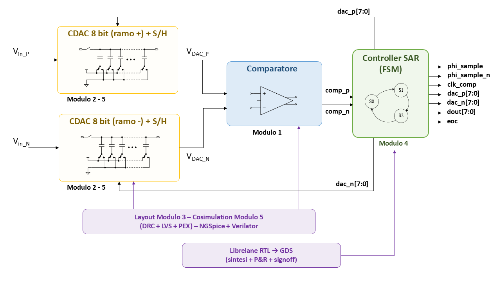

Il sistema è **completamente differenziale**: due CDAC speculari producono `VOUTP` e `VOUTN`, il comparatore Strong-ARM confronta i due e restituisce il bit deciso al controller, che pilota le switch bank di entrambi i rami con i bus complementari `dac_p[7:0]` e `dac_n[7:0]`.

> 💡 La simmetria differenziale cancella le perturbazioni di modo comune: charge injection del passgate, drift di temperatura, rumore di alimentazione — tutto ciò che agisce ugualmente sui due rami non perturba la decisione del comparatore. È il motivo per cui i SAR ADC differenziali raggiungono prestazioni migliori dei single-ended a parità di tecnologia.

### 1.2 Lista delle istanze

Tre tipi di blocchi convergono nello schematico:

**Blocchi analogici (`.sch` + `.sym` xschem):**

| Simbolo | Origine | Ruolo |
|---------|---------|-------|
| `cdac_complete.sym` | Lab01 Modulo 5 | 2 istanze: passgate + banco MiM + switch bank integrati in un unico blocco, ramo `+` e ramo `−` |
| `strongarm.sym` | Modulo 1 Lab03 | 1 istanza: comparatore dinamico |

**Blocco digitale (cosim):**

| Simbolo | Origine | Ruolo |
|---------|---------|-------|
| `sar_controller.sym` | Lab02 + Modulo 4 | 1 istanza: FSM di approssimazioni successive |

**Bridge:**

| Simbolo | N. istanze | Ruolo |
|---------|-----------|-------|
| `adc_bridge1.sym` | 4 | `out_comp_p`, `out_comp_n`, `clk`, `rst_n` → segnali digitali per il controller |
| `dac_bridge1.sym` | 28 | 1×`phi_sample` + 1×`phi_sample_n` + 1×`clk_comp` + 8×`dac_p` + 8×`dac_n` + 8×`dout` + 1×`eoc` → tensioni analogiche |

> 💡 Il controller produce direttamente `phi_sample_n` e `clk_comp` come porte dedicate. `phi_sample_n` alimenta `SMPL_not` di entrambi i `cdac_complete` (via un unico `dac_bridge`). `clk_comp = clk AND NOT phi_sample` alimenta il `clk` del comparatore Strong-ARM (via un secondo `dac_bridge`): pulsa ad ogni ciclo SAR durante la conversione e rimane basso durante il campionamento. `clk_d` e `rst_d` nel testbench sono sorgenti PULSE collegate direttamente a nodi digitali — nessun `adc_bridge` necessario per questi due.

---

## Parte 2 — Preparazione del controller SAR

### 2.1 Cartella di lavoro

```bash
mkdir -p /foss/designs/modulo5/lab03/src
mkdir -p /foss/designs/modulo5/lab03/xschem/simulations

cd /foss/designs/modulo5/lab03
```

### 2.2 Importazione del file VHDL dal Modulo 4

Copia il file VHDL del controller SAR già scritto e verificato nel Modulo 4:

```bash
cp /foss/designs/modulo4/lab01/src/sar_controller.vhd src/
```

> ⚠️ Verifica che il `sar_controller.vhd` che copi sia la versione **aggiornata** con le correzioni applicate dopo il Modulo 5: porte differenziali `out_comp_p`/`out_comp_n`, porta `phi_sample_n` (complemento registrato di `phi_sample`, necessario come clock del comparatore Strong-ARM), e inizializzazione `dac_n_r <= (others => '1')` in `ST_RESET` e `ST_SAMPLE`. Questo è dettagliato nel `PROMPT_AGGIORNAMENTO_MODULO4.md` prodotto a fine Lab01 di questo modulo.

### 2.3 Copia del Makefile e bridge

```bash
cp /foss/designs/utils/GHDL_Digital_sim/Makefile .

cp /foss/designs/utils/Cosimulation/adc_bridge1.sym xschem/
cp /foss/designs/utils/Cosimulation/dac_bridge1.sym xschem/
```

### 2.4 Generazione della pipeline cosim

```bash
make cosim_setup
```

Output atteso:

```
--> [1/3] VHDL → Verilog behavioral: sar_controller
--> Verilog behavioral scritto: xschem/simulations/sar_controller_behav.v

--> [2/3] Verilog → shared library Verilator: sar_controller_behav.so
--> Shared library scritta: xschem/simulations/sar_controller_behav.so

--> [3/3] Verilog → simbolo xschem: sar_controller.sym
Modulo     : sar_controller
Ingressi   : ['clk', 'out_comp_n', 'out_comp_p', 'rst_n']
Uscite     : ['dac_n7', 'dac_n6', ..., 'dac_n0', 'dac_p7', ..., 'dac_p0',
              'dout7', ..., 'dout0', 'eoc', 'phi_sample', 'phi_sample_n']
Simbolo    → xschem/sar_controller.sym
```

> 💡 Lo script `generate_sym.py` espande automaticamente i bus VHDL in pin singoli MSB-first: `dac_p : std_logic_vector(7 downto 0)` diventa 8 pin separati `dac_p7, dac_p6, ..., dac_p0`. `phi_sample` e `phi_sample_n` appaiono come pin singoli aggiuntivi. Questa scelta semplifica il routing in xschem rispetto ai bus aggregati con `bus_tap` — ogni bit ha il suo wire individuale, più verboso ma più facile da debuggare e visualizzare nei waveform.

> ⚠️ L'ordine in cui le porte appaiono nel netlist `d_cosim` è quello con cui Verilator le espone nella shared library — che riflette l'ordine di dichiarazione nel file Verilog generato da Yosys. Non è necessariamente l'ordine VHDL originale. Per scrivere correttamente i netlist `.cir` di test (sezione 2.5), apri il file `xschem/simulation/sar_controller_behav.v` e leggi la dichiarazione del modulo:
>
> ```bash
> head -40 xschem/simulation/sar_controller_behav.v
> ```
>
> Le righe `input` e `output` ti danno l'ordine esatto da usare nel blocco `Asar [ ... ] [ ... ] sar_model` del `.cir`. xschem invece, quando istanzi il simbolo, genera automaticamente il netlist nell'ordine corretto leggendo i pin del simbolo `.sym`.

### 2.5 Test stadio 2 — verifica del controller in isolamento

Prima di integrarlo nel SAR completo, verifichiamo che il `sar_controller` cosim risponda correttamente a stimoli digitali. Crea il file `xschem/simulations/sar_test.cir`:

> ⚠️ **Prerequisito obbligatorio:** apri prima il file `xschem/simulation/sar_controller_behav.v` e leggi la **prima riga** del file, dove c'è la dichiarazione `module sar_controller(...)`. L'ordine dei pin nella **port list** del modulo è quello che `d_cosim` usa per interpretare i nodi del `.cir`. ATTENZIONE: l'ordine della port list può differire da quello delle dichiarazioni `input`/`output` che appaiono più in basso nel file (Yosys mantiene l'ordine VHDL originale nella port list ma le dichiarazioni vengono spesso ordinate alfabeticamente). **Solo la port list conta** per il `.cir`.

```spice
* Test del sar_controller in isolamento (senza CDAC né comparatore)

* Sorgenti analogiche (tensioni)
Vclk    clk_a    0  PULSE(0 1.8 0 1n 1n 24n 50n)
Vrst    rst_a    0  PULSE(0 1.8 100n 1n 1n 100u 200u)

* Comparatore stub: out_comp_p=1, out_comp_n=0 (decisione: bit=1 sempre)
Vcmp_p  outp_a   0  DC 1.8
Vcmp_n  outn_a   0  DC 0

* ADC bridge: convertono le tensioni in segnali digitali per il d_cosim
Aclk    [ clk_a  ] [ clk_d  ] adc_model
Arst    [ rst_a  ] [ rst_d  ] adc_model
Acompp  [ outp_a ] [ outp_d ] adc_model
Acompn  [ outn_a ] [ outn_d ] adc_model
.model adc_model adc_bridge in_low=0.7 in_high=1.1

* Blocco d_cosim — l'ordine delle porte è quello della PORT LIST del modulo
Asar [ clk_d rst_d outp_d outn_d ]
+    [ phi_sample
+      dac_p7 dac_p6 dac_p5 dac_p4 dac_p3 dac_p2 dac_p1 dac_p0
+      dac_n7 dac_n6 dac_n5 dac_n4 dac_n3 dac_n2 dac_n1 dac_n0
+      dout7  dout6  dout5  dout4  dout3  dout2  dout1  dout0
+      eoc phi_sample_n ]
+    sar_model
.model sar_model d_cosim simulation="./sar_controller_behav.so"

* DAC bridge: convertono le uscite digitali in tensioni visualizzabili
Aphi   [ phi_sample   ] [ v_phi   ] dac_model
Aphin  [ phi_sample_n ] [ v_phi_n ] dac_model
Adout7 [ dout7 ]        [ v_dout7 ] dac_model
Adout0 [ dout0 ]        [ v_dout0 ] dac_model
Aeoc   [ eoc ]          [ v_eoc   ] dac_model
.model dac_model dac_bridge out_low=0 out_high=1.8

R1 v_phi   0 100k
R2 v_phi_n 0 100k
R3 v_dout7 0 100k
R4 v_dout0 0 100k
R5 v_eoc   0 100k

.control
  tran 1n 1500n
  plot v_phi+8 v_phi_n+6 v_dout7+4 v_dout0+2 v_eoc
.endc

.end
```

> 💡 Nel plot sono visibili sia `v_phi` che `v_phi_n`: devono essere perfettamente complementari in ogni istante — quando uno è alto (1.8 V) l'altro è basso (0 V) e viceversa. Questa è la verifica visiva più immediata che `phi_sample_n` funzioni correttamente prima di collegarlo al comparatore.

Esegui:

```bash
cd xschem/simulations
ngspice sar_test.cir
```

Risultato atteso: `phi_sample` alto per 50 ns, poi `eoc` alto a fine conversione (dopo 9 cicli di clock), `dout = 11111111`, e `v_phi_n` sempre complementare a `v_phi`.

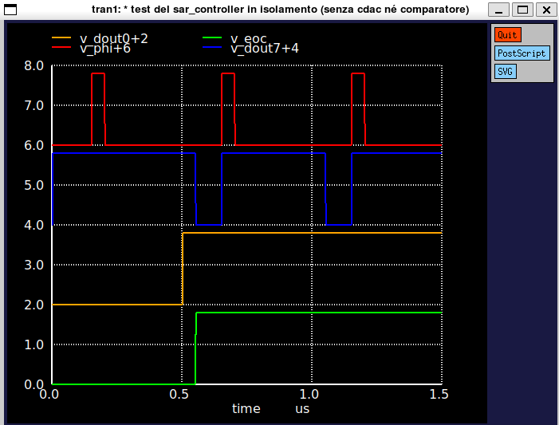

---

## Parte 3 — Costruzione del top-level schematic

> 💡 **Nota sulla notazione bus:** nelle sezioni che seguono usiamo la notazione concisa `dac_p[7:0]` per riferirci al bus a 8 bit del controller. Nello schematico xschem ogni bit è un pin separato (`dac_p7`, `dac_p6`, ..., `dac_p0`) con il suo wire individuale. Quando una sezione dice "collega `dac_p[7:0]` a `dac_p_d[7:0]`" significa: collega `dac_p7` a `dac_p_d7`, `dac_p6` a `dac_p_d6`, ..., `dac_p0` a `dac_p_d0`. Stesso discorso per `dac_n`, `dout`, `BP`, `ctrl`. È più verboso del bus aggregato, ma elimina ogni ambiguità di routing e rende immediato il debug osservando il singolo bit nei waveform.

### 3.0 Copia dei simboli e schematici dal Lab01

Tutti i blocchi analogici necessari per il top-level sono stati progettati e
verificati nel Lab01 di questo modulo. Prima di aprire xschem, copia l'intera
cartella di simboli nella directory di lavoro del Lab03:

```bash
XSCHEM_LAB01=/foss/designs/modulo5/lab01/xschem
XSCHEM_LAB03=/foss/designs/modulo5/lab03/xschem

# Crea la cartella di destinazione se non esiste
mkdir -p $XSCHEM_LAB03

# Copia tutti i simboli e gli schematici del Lab01
cp $XSCHEM_LAB01/cdac_complete.sch  $XSCHEM_LAB03/
cp $XSCHEM_LAB01/cdac_complete.sym  $XSCHEM_LAB03/
cp $XSCHEM_LAB01/cdac.sch           $XSCHEM_LAB03/
cp $XSCHEM_LAB01/cdac.sym           $XSCHEM_LAB03/
cp $XSCHEM_LAB01/passgate.sch       $XSCHEM_LAB03/
cp $XSCHEM_LAB01/passgate.sym       $XSCHEM_LAB03/
cp $XSCHEM_LAB01/switch_bank.sch    $XSCHEM_LAB03/
cp $XSCHEM_LAB01/switch_bank.sym    $XSCHEM_LAB03/
cp $XSCHEM_LAB01/T_gate.sch         $XSCHEM_LAB03/
cp $XSCHEM_LAB01/T_gate.sym         $XSCHEM_LAB03/
cp $XSCHEM_LAB01/inverter.sch       $XSCHEM_LAB03/
cp $XSCHEM_LAB01/inverter.sym       $XSCHEM_LAB03/
```

> ⚠️ `cdac_complete` istanzia internamente `cdac`, `switch_bank`, `passgate`,
> `T_gate` e `inverter` per nome di subcircuit. xschem risolve questi
> riferimenti cercando i file `.sch` nella stessa cartella dello schematico
> padre. Se uno qualsiasi di questi file manca, la netlisting fallisce con un
> errore del tipo `subckt cdac not found`. Copia sempre **tutti e 12 i file**
> (6 `.sch` + 6 `.sym`), non solo il `cdac_complete`.

In alternativa ai comandi da terminale, puoi usare il file manager grafico
dell'ambiente desktop: apri la cartella
`~/asic/modulo5/lab01/xschem/` (che corrisponde a
`/foss/designs/modulo5/lab01/xschem/` nel container), seleziona tutti i file
`.sch` e `.sym` elencati sopra, copialie incollali nella cartella
`~/asic/modulo5/lab03/xschem/`. Il risultato è identico ai comandi `cp`
mostrati sopra.

Copia anche il simbolo del comparatore Strong-ARM dal Modulo 1:

```bash
XSCHEM_MOD1=/foss/designs/modulo1/lab03/xschem

cp $XSCHEM_MOD1/strongarm.sch  $XSCHEM_LAB03/
cp $XSCHEM_MOD1/strongarm.sym  $XSCHEM_LAB03/
```

Verifica finale — la cartella deve contenere almeno questi file prima di aprire
xschem:

```bash
ls $XSCHEM_LAB03/*.sym
# Atteso (ordine alfabetico):
# adc_bridge1.sym
# cdac_complete.sym
# cdac.sym
# dac_bridge1.sym
# inverter.sym
# passgate.sym
# sar_controller.sym    (generato da make cosim_setup)
# strongarm.sym
# switch_bank.sym
# T_gate.sym
```


Crea il file `xschemrc` nella cartella `lab03/xschem/` in modo che xschem
riconosca il PDK SKY130A e cerchi i simboli nella cartella corretta:

```bash
cd /foss/designs/modulo5/lab03/xschem

cat > xschemrc << 'EOF'
# Carica la configurazione completa del PDK SKY130A
source /foss/pdks/sky130A/libs.tech/xschem/xschemrc

# Salva netlist e simulazioni nella cartella locale del progetto
set netlist_dir [file normalize [file dirname [info script]]/simulation]

# Aggiunge la cartella del progetto ai path di ricerca dei simboli
append XSCHEM_LIBRARY_PATH :[file dirname [info script]]
EOF
```

In alternativa, se hai già un `xschemrc` funzionante in un lab precedente
(ad esempio in `lab01/xschem/` o nel Modulo 1), puoi semplicemente copiarlo
con il file manager grafico o da terminale:

```bash
cp /foss/designs/modulo5/lab01/xschem/xschemrc    /foss/designs/modulo5/lab03/xschem/xschemrc
```

Il contenuto è identico in tutti i lab perché le variabili `[file dirname [info script]]`
e `[info script]` si risolvono a runtime nella cartella del file `xschemrc`
stesso — il file è quindi riusabile senza modifiche.

> 💡 Senza `xschemrc`, xschem apre la finestra di inserimento simboli
> mostrando solo la libreria globale del PDK, senza i simboli locali del
> progetto (`cdac_complete`, `strongarm`, `sar_controller`, ecc.). Con
> `xschemrc` correttamente configurato, la cartella `lab03/xschem/` appare
> direttamente nel path di ricerca e i simboli locali sono immediatamente
> accessibili con **Shift+I**.

### 3.1 Apertura di xschem

```bash
cd /foss/designs/modulo5/lab03/xschem
xschem &
```

Crea `sar_adc_top.sch` (**File → New Schematic**, **Ctrl+S**).

### 3.1b Porte esterne dello schematico

Prima di posizionare qualsiasi componente, definisci le **porte esterne** di
`sar_adc_top.sch`. Queste sono i segnali che attraversano il confine del
sotto-circuito e che xschem userà per generare il simbolo nella sezione 3.7.

Inserisci i pin con **Shift+I → `ipin.sym` / `opin.sym`** (libreria `devices`):

| Pin | Tipo | Descrizione |
|-----|------|-------------|
| `VDD` | `iopin` | Alimentazione 1.8 V |
| `GND` | `iopin` | Riferimento di massa |
| `VIN_P` | `ipin` | Ingresso analogico differenziale + |
| `VIN_N` | `ipin` | Ingresso analogico differenziale − |
| `VREF` | `ipin` | Tensione di riferimento per il CDAC (256 mV) |
| `clk` | `ipin` | Clock analogico SAR (~20 MHz), sorgente PULSE nel testbench; convertito in digitale da `adc_bridge` interno |
| `clk_comp` | `opin` | Clock gated per il comparatore: `clk AND NOT phi_sample`, via `dac_bridge` interno |
| `rst_n` | `ipin` | Reset analogico attivo alto, sorgente PULSE nel testbench; convertito in digitale da `adc_bridge` interno |
| `VOUTP` | `opin` | Top plate CDAC+ (per osservare la convergenza SAR nel testbench) |
| `VOUTN` | `opin` | Top plate CDAC− |
| `eoc` | `opin` | End-of-conversion: impulso analogico 0/1.8 V (via `dac_bridge` interno) |
| `dout7` .. `dout0` | `opin` | Codice di conversione, 8 pin singoli, 0/1.8 V (via `dac_bridge` interni) |

> 💡 `VDD` e `GND` sono dichiarati come `iopin` (pin bidirezionali) anziché
> come nodi globali. Questo è necessario per due motivi: durante il layout
> schematic-driven xschem crea automaticamente le porte di alimentazione
> corrispondenti, e durante LVS il tool (Netgen) può verificare la continuità
> della rete di alimentazione confrontando schematico e layout senza ambiguità.
> Nel testbench, `VDD` e `GND` vengono pilotati con sorgenti `vsource.sym`
> collegate ai rispettivi pin del simbolo `sar_adc_top`.

> ⚠️ `clk_d` e `rst_d` sono nodi digitali: nel top-level entrano direttamente
> nei pin `clk` e `rst_n` del blocco `sar_controller` (d_cosim), senza
> `adc_bridge`. Nel testbench saranno pilotati da sorgenti `PULSE` con livelli
> 0/1.8 V — lo stesso schema già verificato in `sar_test.cir` (Parte 2).

### 3.2 Istanza analogica ramo `+`

Posiziona nella metà superiore dello schema un'istanza di `cdac_complete.sym` (copia da `/foss/designs/modulo5/lab01/xschem/`):

| Porta | Connessione |
|-------|-------------|
| `Vin` | `VIN_P` (porta esterna del top-level) |
| `Vout` | `VOUTP` (top plate, ingresso `+` del comparatore) |
| `SMPL` | `phi_a` (versione analogica di `phi_sample`, da `dac_bridge`) |
| `SMPL_not` | `phi_smp_inv_a` (versione analogica di `phi_sample_n`, da `dac_bridge`) |
| `Vref` | `VREF` (porta esterna) |
| `ctrl[7:0]` | `dac_p_a[7:0]` (versione analogica di `dac_p[7:0]`, da 8 `dac_bridge`) |
| `VDD`, `GND` | globali |

> 💡 Il blocco `cdac_complete` integra al suo interno passgate, banco di condensatori MiM binari-pesati e switch bank con T-gate. Non è necessario istanziare blocchi separati: tutta la logica analogica del ramo è incapsulata in questo simbolo.

### 3.3 Istanza analogica ramo `−`

Seconda istanza di `cdac_complete.sym`, speculare, nella metà inferiore:

| Porta | Connessione |
|-------|-------------|
| `Vin` | `VIN_N` (porta esterna del top-level) |
| `Vout` | `VOUTN` (ingresso `−` del comparatore) |
| `SMPL` | `phi_a` (stesso nodo del ramo `+`) |
| `SMPL_not` | `phi_smp_inv_a` (stesso nodo del ramo `+`) |
| `Vref` | `VREF` |
| `ctrl[7:0]` | `dac_n_a[7:0]` (versione analogica di `dac_n[7:0]`, da 8 `dac_bridge`) |
| `VDD`, `GND` | globali |

> 💡 `SMPL` e `SMPL_not` sono gli stessi nodi analogici del ramo `+`: i due CDAC ricevono lo stesso segnale di campionamento dalla medesima coppia di `dac_bridge`. Il comparatore Strong-ARM riceve invece `clk_comp_a` come clock (sezione 3.4) — un segnale distinto che pulsa ad ogni ciclo SAR.

### 3.4 Comparatore Strong-ARM

Istanza di `strongarm.sym` (copia da `/foss/designs/modulo1/lab03/xschem/`):
- `inp` → `VOUTP`
- `inn` → `VOUTN`
- `clk` → `clk_comp_a`
- `outp` → `out_comp_p_a`
- `outn` → `out_comp_n_a`
- `VDD`, `GND` → globali

> ⚠️ Il comparatore Strong-ARM valuta sui **fronti di salita** del suo `clk` e deve ricevere un fronte ad ogni ciclo SAR durante la conversione per aggiornare la decisione bit per bit. Il segnale `phi_sample_n` da solo non è sufficiente: vale 1.8 V fisso per tutta la durata della conversione e il comparatore valuterebbe una sola volta. Il controller SAR genera direttamente la porta `clk_comp = NOT(clk) AND NOT(phi_sample)`: vale 0 durante il campionamento (comparatore in reset/precarica). Durante la conversione, vale 0 nel primo semiperiodo di clock (il CDAC ha tempo di assestarsi) e sale a 1 nel secondo semiperiodo, quando il comparatore valuta il CDAC assestato. Al fronte di salita successivo di `clk_SAR` il comparatore inizia la precarica — che richiede qualche nanosecondo — e il controller legge il risultato valido prima che `out_comp_p` torni a 1. Il nodo analogico `clk_comp_a` — prodotto dal suo `dac_bridge` — viene collegato al pin `clk` del comparatore. `phi_smp_inv_a` rimane connesso esclusivamente a `SMPL_not` dei due `cdac_complete`.

### 3.5 Controller SAR (cosim)

Istanza di `sar_controller.sym` (generato in 2.4):
- `clk` → `clk_d` (via `adc_bridge` interno)
- `rst_n` → `rst_d` (via `adc_bridge` interno)
- `out_comp_p` → `out_comp_p_d`
- `out_comp_n` → `out_comp_n_d`
- `phi_sample` → `phi_smp_d`
- `phi_sample_n` → `phi_smp_inv_d`
- `clk_comp` → `clk_comp_d`
- `dac_p[7:0]` → `dac_p_d[7:0]`
- `dac_n[7:0]` → `dac_n_d[7:0]`
- `dout[7:0]` → `dout_d[7:0]` (via `dac_bridge` interni → `dout7..dout0` porte esterne)
- `eoc` → `eoc_d` (via `dac_bridge` interno → `eoc` porta esterna)

### 3.6 Bridge analogico-digitale

**ADC bridge** (analogico → digitale): 4 istanze di `adc_bridge1.sym` con `in_low=0.7`, `in_high=1.1`:

| Istanza | Ingresso (analogico) | Uscita (digitale) |
|---------|---------------------|-------------------|
| `Abr_clk` | `clk` (porta esterna) | `clk_d` |
| `Abr_rst` | `rst_n` (porta esterna) | `rst_d` |
| `Abr_compP` | `out_comp_p_a` | `out_comp_p_d` |
| `Abr_compN` | `out_comp_n_a` | `out_comp_n_d` |

**DAC bridge** (digitale → analogico): 18 istanze di `dac_bridge1.sym` con `out_low=0`, `out_high=1.8`:

| Istanza | Ingresso (digitale) | Uscita (analogica) | Destinazione |
|---------|--------------------|--------------------|--------------|
| `Abr_phi` | `phi_smp_d` | `phi_a` | `CTRL` dei passgate |
| `Abr_phi_n` | `phi_smp_inv_d` | `phi_smp_inv_a` | `SMPL_not` di entrambi i `cdac_complete` |
| `Abr_clkcomp` | `clk_comp_d` | `clk_comp_a` | `clk` del comparatore Strong-ARM |
| `Abr_dp7..dp0` | `dac_p_d7..dac_p_d0` | `dac_p_a7..dac_p_a0` | `ctrl[7:0]` switch bank+ |
| `Abr_dn7..dn0` | `dac_n_d7..dac_n_d0` | `dac_n_a7..dac_n_a0` | `ctrl[7:0]` switch bank− |

> 💡 Le 16 istanze di `dac_bridge` per `dac_p` e `dac_n` richiedono di essere posizionate manualmente in xschem una per una. Per organizzare lo schema in modo leggibile, raggruppa i bridge verticalmente accanto al simbolo del controller: `dac_p7..dac_p0` in colonna a destra, `dac_n7..dac_n0` in un'altra colonna. Connetti ogni `dac_pK_d` a `dac_pK_a` con un wire breve.

**DAC bridge per le uscite digitali** (`dout[7:0]` e `eoc`): 9 istanze aggiuntive di `dac_bridge1.sym`:

| Istanza | Ingresso (digitale) | Uscita (analogica) | Porta esterna |
|---------|--------------------|--------------------|---------------|
| `Abr_dout7..Abr_dout0` | `dout_d7..dout_d0` | `dout7_a..dout0_a` | `dout7..dout0` |
| `Abr_eoc` | `eoc_d` | `eoc_a` | `eoc` |

> 💡 Con i `dac_bridge` interni, le porte `dout7..dout0` e `eoc` espongono
> direttamente tensioni analogiche 0/1.8 V. Nel testbench basta un semplice
> `plot v(dout7) v(dout0) v(eoc)` — nessun bridge aggiuntivo. I resistori di
> pull-down da 100 kΩ necessari per la convergenza del solver vengono aggiunti
> nel testbench (sezione 4.1), non nel top-level.

---

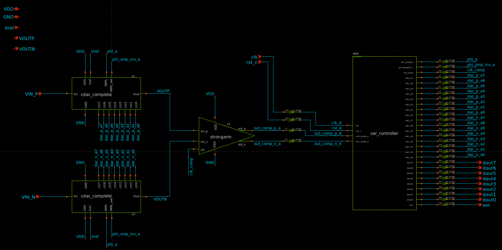

### 3.7 Generazione del simbolo `sar_adc_top.sym`

Con lo schematico completo e tutte le porte dichiarate, genera il simbolo che
verrà istanziato nel testbench:

1. Assicurati che `sar_adc_top.sch` sia aperto e salvato (**Ctrl+S**)
2. Dal menu: **Symbol → Make symbol from schematic** (oppure tasto **A** con
   nessun elemento selezionato)
3. xschem genera automaticamente `sar_adc_top.sym` nella stessa cartella,
   con un pin per ogni `ipin`/`opin` dichiarato nello schematico

Verifica il simbolo generato aprendo il file `.sym` (**File → Open**) e
controllando che compaiano tutti i 17 pin:

```
iopin:  VDD  GND
ipin:   VIN_P  VIN_N  VREF  clk  rst_n
opin:   VOUTP  VOUTN  eoc  clk_comp  dout7..dout0
```

> ⚠️ Se aggiungi o rinomini un pin nello schematico **dopo** aver già generato
> il simbolo, devi rigenerarlo: **Symbol → Make symbol from schematic** di
> nuovo. Il vecchio `.sym` non si aggiorna automaticamente. Se nel frattempo
> hai già istanziato il simbolo nel testbench, cancella l'istanza, ricarica il
> simbolo aggiornato con **Shift+I** e re-istanzialo.

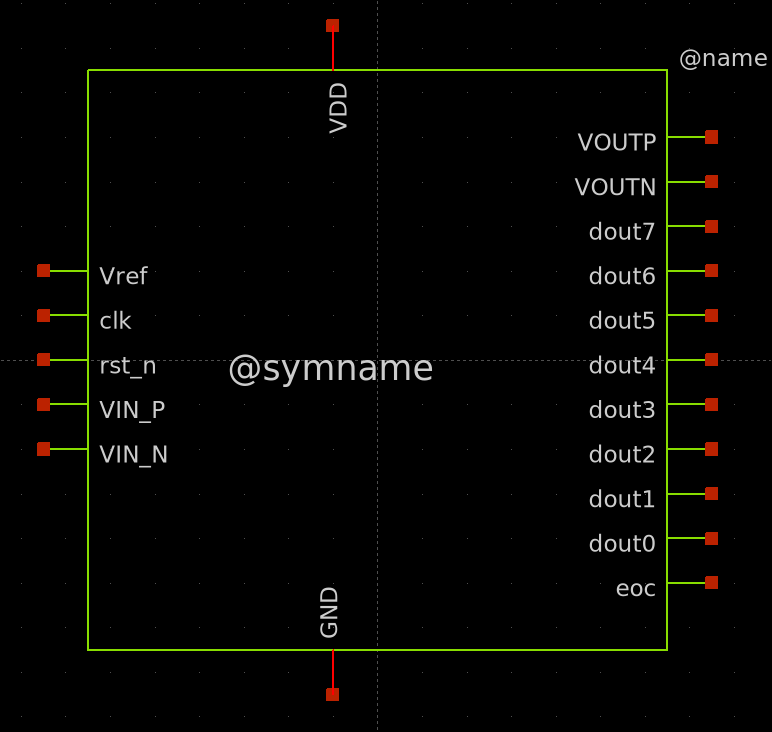

## Parte 4 — Testbench: simulazione di una conversione completa

### 4.1 Sorgenti del testbench

Apri lo schematico `sar_adc_top.sch` e crea un nuovo schema `sar_adc_tb.sch` che istanzia `sar_adc_top.sym` (genera prima il simbolo del top con **Symbol → Make symbol**).

**Blocco modelli di processo — obbligatorio:**

Prima di qualsiasi sorgente, piazza sul canvas il blocco `TT_MODELS` (**Shift+I → libreria `sky130A` → `TT_MODELS`**). Senza questo blocco ngspice non trova le definizioni dei transistor SKY130A (`sky130_fd_pr__nfet_01v8`, `sky130_fd_pr__pfet_01v8_lvt`, ecc.) e la simulazione termina immediatamente con errori del tipo `unknown device type`.

> 💡 `TT_MODELS` carica il corner tipico (TT) del PDK SKY130A. Se in futuro si volessero simulare corner di processo (FF, SS, FS, SF), basta sostituire questo blocco con il corrispondente `FF_MODELS`, `SS_MODELS`, ecc. — tutto il resto del testbench rimane invariato.

Sorgenti necessarie:

```spice
* Alimentazione
Vvdd     VDD     0  DC 1.8

* Riferimento DAC — parametrico per facilitare sweep e variazioni
.param vref_par=0.256
Vvref    VREF    0  DC {vref_par}

* Clock SAR a 20 MHz
Vclk     clk    0  PULSE(0 1.8 0 1n 1n 24n 50n)

* Reset asincrono: alto dopo 100 ns (controller libero di partire)
Vrst     rst_n  0  PULSE(0 1.8 100n 1n 1n 100u 200u)

* Pull-down 100 kΩ sulle uscite digitali convertite da dac_bridge
* (necessari per la convergenza del solver: senza carico il nodo e' floating)
Rdout7  dout7  0  100k
Rdout6  dout6  0  100k
Rdout5  dout5  0  100k
Rdout4  dout4  0  100k
Rdout3  dout3  0  100k
Rdout2  dout2  0  100k
Rdout1  dout1  0  100k
Rdout0  dout0  0  100k
Reoc    eoc    0  100k

* Ingressi analogici differenziali — esempio: Vdiff = +60mV centrato su 0.9V
* (codice atteso: D = 60mV / 2mV + 128 = 158)
Vinp     VIN_P   0  DC 0.930
Vinn     VIN_N   0  DC 0.870
```

### 4.2 Blocco di simulazione

```spice
.param vref_par=0.256

.options savecurrents
.ic v(VOUTP)=0.9
.ic v(VOUTN)=0.9

.control
  save all
  tran 1n 1000n
  write sar_adc_tb.raw
  plot v(VOUTP) v(VOUTN)
  plot v(dout7)+16 v(dout6)+14 v(dout5)+12 v(dout4)+10 v(dout3)+8 v(dout2)+6 v(dout1)+4 v(dout0)+2 v(eoc)
.endc
```

> 💡 Le condizioni iniziali `.ic v(VOUTP)=0.9` e `v(VOUTN)=0.9` sono importanti: senza di esse, all'avvio le top plate sono floating e ngspice può avere problemi di convergenza nella prima fase di reset prima che `phi_sample` salga. Con `.ic` impostiamo entrambi i nodi a $V_{CM}$ — punto di partenza pulito.

> 💡 `write sar_adc_tb.raw` senza argomenti salva tutti i segnali accessibili dal livello del testbench. I segnali interni a `sar_adc_top` (come `phi_a`, `out_comp_p_a`, `out_comp_n_a`) richiederebbero la notazione gerarchica `v(x1.phi_a)` — verbosa e fragile al cambio del nome dell'istanza. Con `save all` + `write` senza argomenti, GTKWave mostrerà comunque tutte le porte esterne del top (`VOUTP`, `VOUTN`, `dout7..dout0`, `eoc`) che sono i segnali di interesse per la verifica del sistema.

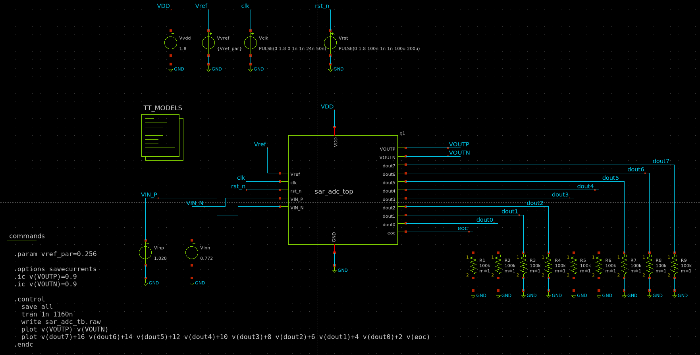

### 4.3 Lancio della simulazione

`Ctrl+S` → **Netlist** → **Simulate**.

Tempo atteso di simulazione: ~10-20 secondi. La cosimulazione mixed-signal è più rapida di quanto si potrebbe aspettare: ngspice risolve i blocchi analogici con passo adattivo, Verilator gestisce il controller digitale a eventi, e il coupling tra i due solver avviene solo ai fronti di clock.

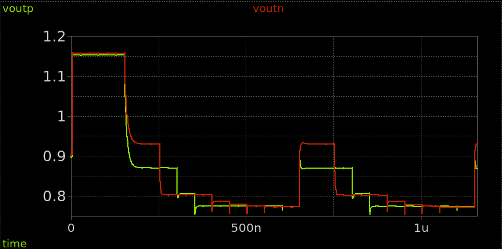

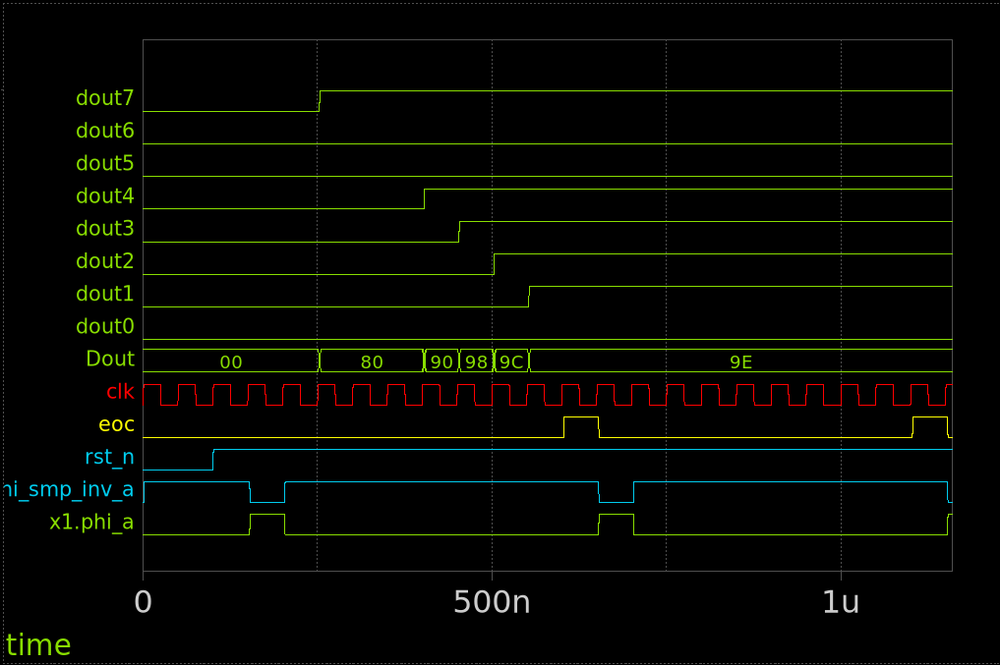

### 4.4 Lettura del codice di conversione

Il codice di uscita `dout[7:0]` è valido **dopo** che `eoc` è andato alto. In una conversione che dura 10 cicli di clock = 500 ns, `eoc` sale attorno a $t \approx 600\ \text{ns}$ (dopo il delay di reset di 100 ns).

Per leggere il codice, valuta `dout_dk` (pin singoli) a un istante $t$ tale che $eoc=1$:

```spice
.control
  ...
  let t_read = 800e-9
  let d7 = v(dout7) at t_read
  let d6 = v(dout6) at t_read
  let d5 = v(dout5) at t_read
  let d4 = v(dout4) at t_read
  let d3 = v(dout3) at t_read
  let d2 = v(dout2) at t_read
  let d1 = v(dout1) at t_read
  let d0 = v(dout0) at t_read
  let D = (d7>0.9 ? 128 : 0) + (d6>0.9 ? 64 : 0) + (d5>0.9 ? 32 : 0) + (d4>0.9 ? 16 : 0) + (d3>0.9 ? 8 : 0) + (d2>0.9 ? 4 : 0) + (d1>0.9 ? 2 : 0) + (d0>0.9 ? 1 : 0)
  echo "Codice di conversione: D=" $&D
.endc
```

**Verifica del risultato:**

In un SAR ADC differenziale a 2 CDAC speculari, la variazione differenziale totale è $2 \times V_{REF} = 512\ \text{mV}$ distribuita su 256 codici. Il passo di quantizzazione differenziale vale quindi:

$$V_{LSB,diff} = \frac{2 \cdot V_{REF}}{2^N} = \frac{512\ \text{mV}}{256} = 2\ \text{mV}$$

Il codice ideale per un ingresso differenziale $V_{diff} = V_{IN+} - V_{IN-}$ è:

$$D_{ideale} = \frac{V_{diff}}{V_{LSB,diff}} + 128 = \frac{V_{diff}}{2\ \text{mV}} + 128$$

Per $V_{IN+} = 0.930\ \text{V}$, $V_{IN-} = 0.870\ \text{V}$:

$$D_{ideale} = \frac{60\ \text{mV}}{2\ \text{mV}} + 128 = 30 + 128 = 158$$

> 💡 Il codice misurato può differire di ±1 LSB dall'ideale a causa del rumore di quantizzazione (errore inevitabile di un ADC ideale) e di non-linearità residue del CDAC (DNL/INL).

---

## Parte 5 — Test su più valori di $V_{IN}$

Per verificare il funzionamento del SAR ADC su tutto il range di ingresso, ripeti la simulazione per diversi valori di $V_{IN+} - V_{IN-}$:

| $V_{IN+}$ (V) | $V_{IN-}$ (V) | $V_{diff}$ (mV) | $D_{ideale}$ | $D_{misurato}$ |
|---------------|---------------|-----------------|--------------|----------------|
| 0.772 | 1.028 | $-256$ | 0 | `?` |
| 0.836 | 0.964 | $-128$ | 64 | `?` |
| 0.900 | 0.900 | 0 | 128 | `?` |
| 0.964 | 0.836 | $+128$ | 192 | `?` |
| 1.028 | 0.772 | $+256$ | 255 | `?` |

> 💡 Per cambiare il valore di $V_{IN}$ rapidamente, modifica solo i valori di `Vinp` e `Vinn` nel testbench e rilancia la simulazione. Le sorgenti DC permettono cambi istantanei senza dover modificare la struttura del circuito.

**Domanda di riflessione:** in quale di questi 5 punti il sistema è più sensibile a errori di non-linearità del CDAC? Ricorda che il MSB è il bit con il peso maggiore: se la commutazione di BP7 introduce un errore di carica, è più visibile vicino al codice $D=128$ (commutazione del MSB) che agli estremi del range.

---

## Parte 6 — Test con ingresso sinusoidale e analisi in frequenza

### 6.1 Motivazione

Il test con un ingresso sinusoidale è la verifica dinamica standard per un ADC: fornisce direttamente le metriche di qualità del convertitore — SNDR, SFDR ed ENOB — che sintetizzano in un unico numero quante bit effettive l'ADC riesce a fornire in condizioni reali. I test DC della Parte 5 verificano la linearità statica; questo test verifica come si comporta il sistema quando l'ingresso cambia tra una conversione e l'altra.

**Parametri del test:**

| Parametro | Valore | Motivazione |
|-----------|--------|-------------|
| $N$ campioni | 64 | Buon compromesso tra risoluzione FFT e tempo di simulazione (~3-5 min) |
| $f_s$ | 2 MS/s | Frequenza di campionamento del SAR ADC |
| $f_{in}$ | 93 750 Hz | $= 3/64 \cdot f_s$: campionamento coerente, 3 cicli interi in 64 campioni |
| Ampiezza $V_{IN\_P}$ | 120 mV | Con $V_{IN\_N} = V_{CM}$ fisso, $V_{diff,max} = \pm 120\ \text{mV}$; lascia margine rispetto al range utile di $\pm 127.5\ \text{mV}$ |
| $V_{IN\_N}$ | 0.9 V (fisso) | Modo comune; il segnale differenziale è portato interamente da $V_{IN\_P}$ |
| Durata simulazione | 32 µs | $N / f_s = 64 / 2\text{ MS/s}$ |

> 💡 Il campionamento è **coerente**: $f_{in} = M/N \cdot f_s$ con $M=3$ intero e $\gcd(M,N)=1$. Questa scelta permette di usare la FFT **senza finestra di Hanning**: la sinusoide compie esattamente 3 cicli completi nel record di $N=64$ campioni e tutta la potenza del segnale cade in un singolo bin FFT. Usare la finestra di Hanning con campionamento coerente sarebbe sbagliato: disperderebbe la potenza del segnale su più bin e, calcolando la potenza del segnale su un solo bin, si otterrebbe uno SNDR artificialmente bassissimo.

> 💡 **Perché $V_{IN\_N}$ fisso a $V_{CM}$?** In un sistema completamente differenziale l'approccio ideale sarebbe portare entrambi i rami con segnali di ampiezza $A/2$ e fase opposta, raddoppiando il range utile a $\pm 255\ \text{mV}$. Usare un solo ramo variabile è più semplice e sufficiente per verificare il comportamento dell'ADC: il circuito rimane simmetrico (entrambi i CDAC partono da $V_{CM}$) e il range utilizzato ($\pm 120\ \text{mV}$) copre comunque quasi metà della scala completa.

### 6.2 Testbench sinusoidale

Crea il file `sar_sine_tb.sch` in xschem copiando `sar_adc_tb.sch` e sostituendo le sorgenti DC con sorgenti sinusoidali:

```spice
* Ingresso sinusoidale su VIN_P, VIN_N fisso al modo comune
* SIN(Voffset Vampl freq Td Theta Phase)
* VIN_P = VCM + A*sin(2*pi*fin*t), ampiezza 120 mV
* VIN_N = VCM = 0.9 V (fisso)
* Vdiff = VIN_P - VIN_N = 120 mV * sin(2*pi*fin*t)
* Range utile: +/-127.5 mV -> ampiezza 120 mV lascia margine di 7.5 mV
Vinp  VIN_P  0  SIN(0.900 0.120 93750 0 0 0)
Vinn  VIN_N  0  DC 0.900
```

> ⚠️ La sinusoide parte a $t=0$ mentre il reset del controller è attivo fino a $t=100$ ns. I primi campioni verranno acquisiti con un ingresso già in movimento — questo non invalida il test perché l'ADC non ha memoria tra conversioni successive, ma conviene scartare i primi 2-3 campioni nell'analisi per essere sicuri che il controller sia fuori dal reset.

> 💡 `Vinn` è dichiarata come sorgente `DC 0.900` anziché come filo collegato a una tensione globale: questo garantisce che il nodo `VIN_N` abbia un driver DC esplicito nel netlist, evitando potenziali problemi di convergenza in ngspice con nodi ad alta impedenza.

Il blocco `.control` deve salvare le forme d'onda in formato ASCII con `wrdata`, più facile da leggere in Python rispetto al formato binario `.raw`:

```spice
.param vref_par=0.256

.options savecurrents
.ic v(VOUTP)=0.9
.ic v(VOUTN)=0.9

.control
  save all
  tran 1n 32.5u
  wrdata sar_sine.txt v(eoc) v(dout7) v(dout6) v(dout5) v(dout4) v(dout3) v(dout2) v(dout1) v(dout0)
.endc
```

> ⚠️ `wrdata` scrive un file ASCII con una riga per ogni punto temporale: `time  eoc  dout7  ...  dout0`. Il file sar_sine.txt viene salvato nella cartella `xschem/simulation/`. Lo script Python lo leggerà da lì.

> ⚠️ La durata 32.5 µs è leggermente maggiore di 32 µs per garantire che l'ultimo campione (il 64°) venga completato e il relativo EOC venga catturato prima della fine della simulazione.

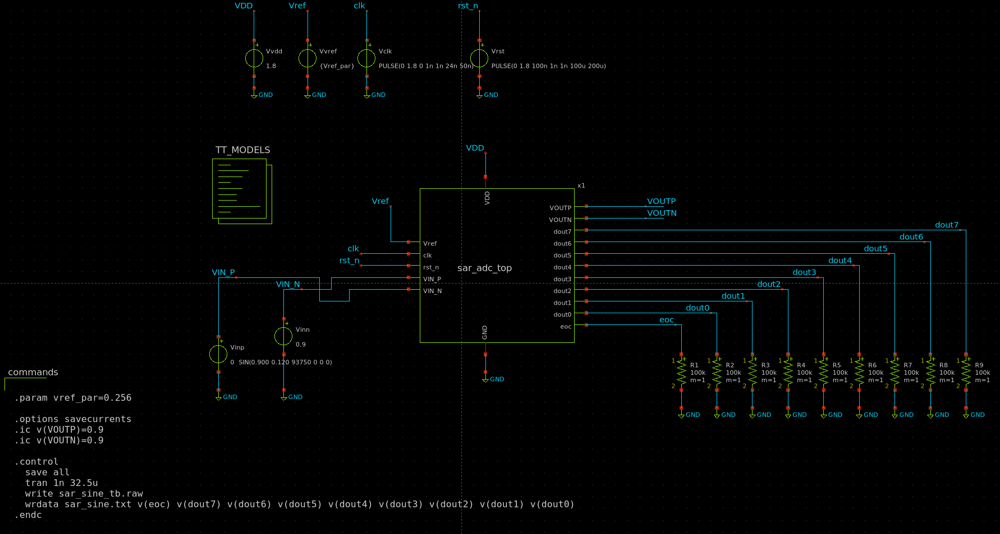

### 6.3 Script Python di analisi

Salva il file `analyze_sine.py` nella cartella `/foss/designs/modulo5/lab03/`:

```python
#!/usr/bin/env python3
"""
analyze_sine.py -- Analisi della risposta sinusoidale del SAR ADC
Legge l'output di wrdata da ngspice, estrae i codici dout a ogni EOC,
ricostruisce la sinusoide, calcola FFT e metriche di qualita' (SNDR, ENOB).

Note sul metodo:
  - Campionamento COERENTE (fin = 3/64 * fs): NON si usa la finestra di Hanning.
    La finestra disperderebbe la potenza del segnale su piu' bin, falsando lo SNDR.
  - Rilevamento EOC per GRUPPI di punti alti (non per fronti): piu' robusto con
    il passo adattivo di ngspice che puo' non avere punti esattamente sul fronte.
  - SNDR calcolato sommando la potenza del segnale sui 3 bin centrali del main lobe.

Uso:
    cd /foss/designs/modulo5/lab03
    python3 analyze_sine.py xschem/simulation/sar_sine.txt
"""

import sys
import numpy as np
import matplotlib.pyplot as plt

# =============================================================================
# 1. Lettura del file wrdata
# =============================================================================
fname = sys.argv[1] if len(sys.argv) > 1 else "xschem/simulation/sar_sine.txt"

rows = []
with open(fname, 'r') as f:
    for line in f:
        line = line.strip()
        if not line or line.startswith('#'):
            continue
        try:
            vals = [float(x) for x in line.split()]
            if len(vals) >= 10:   # time + eoc + 8 bit dout
                rows.append(vals)
        except ValueError:
            continue

data = np.array(rows)
print(f"Righe lette dal file: {len(data)}")

# Colonne: 0=time, 1=eoc, 2=dout7, ..., 9=dout0
time = data[:, 0]
eoc  = data[:, 1]
dout = data[:, 2:10]

# =============================================================================
# 2. Estrazione dei codici tramite RAGGRUPPAMENTO dei punti con EOC alto
#
#    Il passo adattivo di ngspice non garantisce un punto esattamente sul fronte
#    di salita di EOC. Invece di cercare i fronti, troviamo tutti i gruppi
#    consecutivi di punti con eoc > soglia e campioniamo dout al centro di
#    ciascun gruppo. Questo e' robusto al passo variabile del solver.
# =============================================================================
THRESHOLD = 0.9       # soglia 50% tra 0 V e 1.8 V
weights   = np.array([128, 64, 32, 16, 8, 4, 2, 1])

eoc_high = (eoc > THRESHOLD).astype(int)
transitions = np.diff(np.concatenate([[0], eoc_high, [0]]))
starts = np.where(transitions ==  1)[0]
ends   = np.where(transitions == -1)[0]

print(f"Periodi EOC alto rilevati: {len(starts)}")

codes = []
for s, e in zip(starts, ends):
    mid  = (s + e) // 2
    bits = (dout[mid] > THRESHOLD).astype(int)
    D    = int(np.dot(bits, weights))
    codes.append(D)

codes = np.array(codes, dtype=float)
N = len(codes)
print(f"Campioni estratti: {N}")
print(f"Codici: {[hex(int(c)) for c in codes[:8]]} ...")
print(f"Min={int(codes.min())} Max={int(codes.max())} Media={codes.mean():.1f} (atteso ~127.5)")

# =============================================================================
# 3. Ricostruzione nel dominio del tempo
# =============================================================================
fs  = 2e6      # frequenza di campionamento [Hz]
fin = 93750    # frequenza ingresso sinusoidale [Hz]
A   = 120.0    # ampiezza sinusoide [mV]

t_samples = np.arange(N) / fs * 1e6   # microsecondi

# Vdiff ricostruito: D = Vdiff/(2mV) + 127.5 -> Vdiff = (D-127.5)*2 mV
vdiff = (codes - 127.5) * 2.0

t_cont    = np.linspace(0, (N-1)/fs, 2000) * 1e6
vdiff_ref = A * np.sin(2 * np.pi * fin * t_cont / 1e6)

fig, axes = plt.subplots(2, 1, figsize=(12, 9))

ax1 = axes[0]
ax1.plot(t_cont, vdiff_ref, '--', color='gray', linewidth=1,
         label='Ingresso ideale')
ax1.step(t_samples, vdiff, where='post', color='steelblue',
         linewidth=1.5, label='Uscita ADC ricostruita')
ax1.set_xlabel('Tempo (µs)')
ax1.set_ylabel('$V_{diff}$ (mV)')
ax1.set_title(f'SAR ADC 8 bit — risposta sinusoidale '
              f'({fin/1e3:.2f} kHz, ampiezza {A:.0f} mV, {N} campioni)')
ax1.legend()
ax1.grid(alpha=0.4)

# =============================================================================
# 4. FFT e metriche dinamiche — SENZA finestra (campionamento coerente)
#
#    Con campionamento coerente (fin = M/N * fs, M intero) tutta la potenza
#    del segnale cade in un singolo bin FFT. La finestra di Hanning NON deve
#    essere usata: disperderebbe la potenza del segnale su piu' bin e
#    renderebbe il calcolo di SNDR errato per difetto.
#
#    SNDR: rapporto potenza segnale (3 bin centrali) / potenza tutto il resto.
#    I 3 bin coprono il main lobe anche in assenza di finestra, per robustezza
#    a piccoli errori di campionamento coerente.
# =============================================================================
X    = np.fft.rfft(codes - codes.mean())
freq = np.fft.rfftfreq(N, 1.0 / fs)
Xm   = np.abs(X)
Xdb  = 20 * np.log10(Xm / Xm.max() + 1e-12)

signal_bin = np.argmax(Xm)
print(f"\nPicco FFT: bin {signal_bin} = {freq[signal_bin]/1e3:.2f} kHz "
      f"(atteso bin {round(fin*N/fs)} = {fin/1e3:.2f} kHz)")

# Potenza segnale: 3 bin centrali (robustezza a piccolo leakage)
b0, b1 = max(0, signal_bin-1), min(len(Xm), signal_bin+2)
signal_power = np.sum(Xm[b0:b1] ** 2)
noise_power  = np.sum(Xm ** 2) - signal_power

sndr = 10 * np.log10(signal_power / noise_power) if noise_power > 0 else 99.0
enob = (sndr - 1.76) / 6.02

# SFDR: distanza dal picco alla seconda armonica piu' alta
Xdb_ns = Xdb.copy()
Xdb_ns[max(0, signal_bin-2):signal_bin+3] = -120
sfdr = -Xdb_ns.max()

# SNDR teorico per ADC ideale 8 bit alla stessa ampiezza
ampl_codes = (codes.max() - codes.min()) / 2
sndr_th = 6.02 * 8 + 1.76 + 20 * np.log10(ampl_codes / 127.5)

print(f"SNDR : {sndr:.1f} dB  (teorico ADC ideale 8 bit: {sndr_th:.1f} dB)")
print(f"ENOB : {enob:.1f} bit  (teorico: {(sndr_th-1.76)/6.02:.1f} bit)")
print(f"SFDR : {sfdr:.1f} dBFS")
print(f"Degrado rispetto all'ideale: {sndr_th-sndr:.1f} dB "
      f"(comparatore, charge injection, mismatch CDAC)")

ax2 = axes[1]
ax2.plot(freq / 1e3, Xdb, color='steelblue', linewidth=1)
ax2.axvline(x=freq[signal_bin] / 1e3, color='red', linestyle='--',
            linewidth=0.8, label=f'fin = {freq[signal_bin]/1e3:.1f} kHz')
ax2.set_xlabel('Frequenza (kHz)')
ax2.set_ylabel('Ampiezza (dBFS)')
ax2.set_ylim(-90, 5)
ax2.set_xlim(0, fs / 2 / 1e3)
ax2.set_title(f'Spettro FFT — SNDR={sndr:.1f} dB, '
              f'ENOB={enob:.1f} bit, SFDR={sfdr:.1f} dBFS')
ax2.legend()
ax2.grid(alpha=0.4)

plt.tight_layout()
out_png = fname.replace('.txt', '_analysis.png')
plt.savefig(out_png, dpi=150)
print(f"\nPlot salvato: {out_png}")
plt.show()

```

### 6.4 Esecuzione

```bash
# Avvia Xschem e apri il file sar_sine_tb.sch
cd /foss/designs/modulo5/lab03/xschem
xschem sar_sine_tb.sch &
# Simulation -> Run, oppure genera netlist e lancia ngspice (durata attesa: ~3-6 minuti):
ngspice -b simulation/sar_sine_tb.spice

# Analisi dei risultati
cd /foss/designs/modulo5/lab03
python3 analyze_sine.py xschem/simulation/sar_sine.txt
```
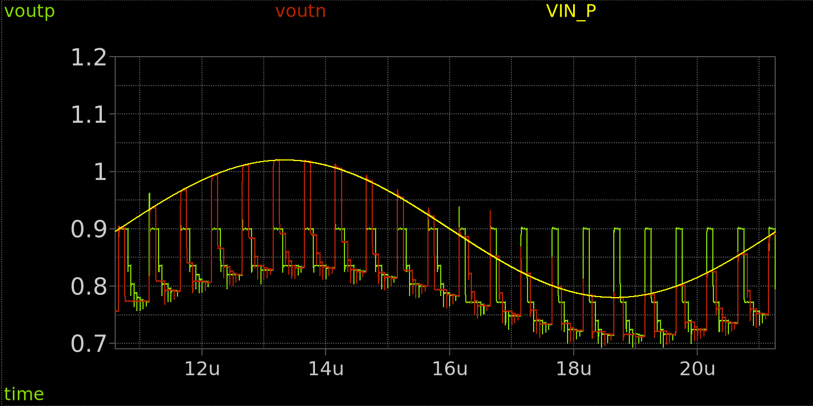

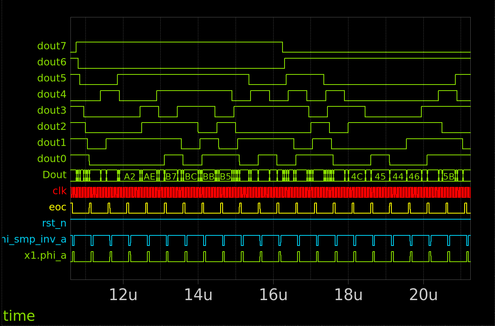

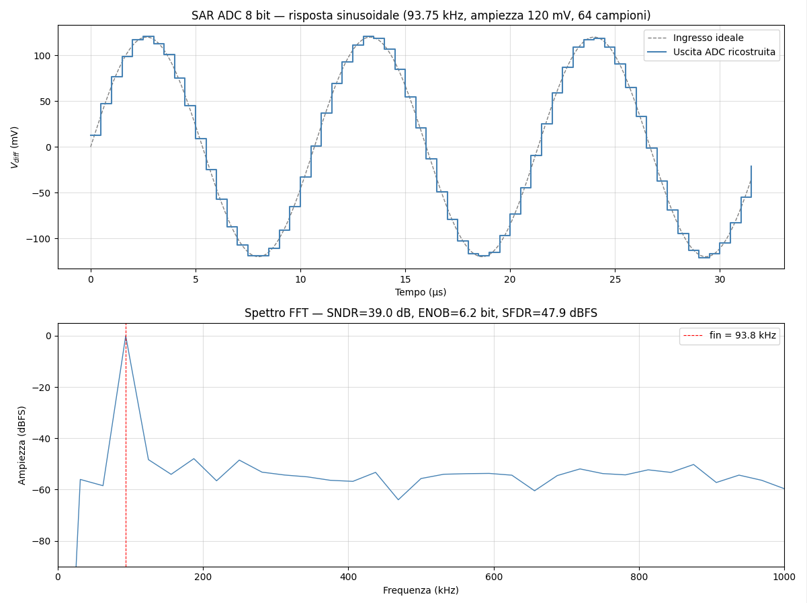

### 6.5 Interpretazione dei risultati

**Domanda 6.1** — Leggi il valore di ENOB stampato dallo script. Confrontalo con l'ENOB teorico di un ADC ideale a 8 bit: $\text{ENOB}_{ideale} = 8\ \text{bit}$, che corrisponde a $\text{SNDR}_{ideale} = 6.02 \cdot 8 + 1.76 = 49.9\ \text{dB}$. Di quanto si discosta il valore misurato? Le cause principali di degrado sono:

1. **Rumore di comparazione** del Strong-ARM Latch: jitter sul fronte di uscita introduce rumore
2. **Non-linearità del CDAC**: mismatch residuo dei condensatori MiM (già caratterizzato nel Modulo 2)
3. **Charge injection** del passgate di campionamento

**Domanda 6.2** — Osserva lo spettro FFT. Lo SNDR atteso per questo ADC in questa configurazione è circa 39 dB (ENOB ≈ 6.2 bit), mentre il valore teorico per un ADC ideale a 8 bit alla stessa ampiezza sarebbe 43.4 dB. Il degrado di ~4.5 dB è dovuto a rumore del comparatore, charge injection del passgate e non-linearità residue del CDAC. Riesci a vedere armoniche del segnale di ingresso (a $2 f_{in}$, $3 f_{in}$, ecc.) nello spettro? Lo SFDR tipico atteso è ~45-50 dBFS.

**Domanda 6.3** — Confronta la sinusoide ricostruita con quella ideale nel grafico temporale. Riesci a vedere la quantizzazione come una “scalettatura” attorno alla curva ideale? L'ampiezza di ogni gradino dovrebbe essere circa $V_{LSB,diff} = 2\ \text{mV}$. Il numero di gradini visibili per semiciclo è circa $120\ \text{mV} / 2\ \text{mV} = 60$ passi — ben visibili nel grafico.

---

## Extra Credit — Curva di trasferimento e DNL/INL del sistema

Con un tempo di simulazione di ~10-20 secondi per punto, uno sweep su 16 punti richiede circa 3-5 minuti — completamente praticabile nel lab. Uno sweep completo su tutti i 256 codici richiederebbe ~45-90 minuti: fattibile come extra credit lasciandolo girare in background.

L'approccio proposto è una caratterizzazione **a 16 punti** distribuiti uniformemente sul range, che permette di valutare linearità, DNL e INL del sistema reale.

<details>
<summary>💡 Soluzione — workflow di caratterizzazione automatizzata</summary>

**Strategia:** automatizzare il loop di simulazione con uno script bash che modifica solo i valori di `Vinp`/`Vinn` nel netlist e ngspice in batch mode.

**Script `sweep_linearity.sh`:**

```bash
#!/bin/bash
# Sweep di linearità: 16 punti, da Vdiff=-240mV a +240mV (passo 32mV)

OUTFILE=linearity_results.txt
echo "# Vdiff_mV  D_ideal  D_misurato" > $OUTFILE

VCM=0.900
for VDIFF_MV in -240 -208 -176 -144 -112 -80 -48 -16 16 48 80 112 144 176 208 240; do
    HALF=$(echo "scale=6; $VDIFF_MV / 2000" | bc)
    VINP=$(echo "scale=6; $VCM + $HALF" | bc)
    VINN=$(echo "scale=6; $VCM - $HALF" | bc)

    # D_ideale con V_LSB,diff = 2mV
    D_IDEAL=$(python3 -c "print(round($VDIFF_MV / 2.0 + 127.5))")

    sed -i "s/Vinp.*VIN_P.*0.*DC.*[0-9.]*/Vinp     VIN_P   0  DC $VINP/" sar_adc_tb.spice
    sed -i "s/Vinn.*VIN_N.*0.*DC.*[0-9.]*/Vinn     VIN_N   0  DC $VINN/" sar_adc_tb.spice

    ngspice -b sar_adc_tb.spice 2>/dev/null

    D_MEAS=$(grep "D=" ngspice.log | tail -1 | grep -oP 'D=\K[0-9]+')

    echo "$VDIFF_MV  $D_IDEAL  $D_MEAS" >> $OUTFILE
    echo "Vdiff=${VDIFF_MV}mV  D_ideal=$D_IDEAL  D_misurato=$D_MEAS"
done

echo ""
echo "Risultati salvati in: $OUTFILE"
```

**Analisi in Python:**

```python
import numpy as np
import matplotlib.pyplot as plt

data = np.loadtxt('linearity_results.txt')
vdiff_mv   = data[:, 0]
d_ideal    = data[:, 1]
d_measured = data[:, 2]

err = d_measured - d_ideal

step_meas  = np.diff(d_measured) / np.diff(vdiff_mv)
step_ideal = 0.5   # 1 LSB / 2 mV = 0.5 LSB/mV
DNL = (step_meas - step_ideal)

print(f"Errore max:  {err.max():.2f} LSB")
print(f"Errore min:  {err.min():.2f} LSB")
print(f"DNL max:     {DNL.max():.3f} LSB")
print(f"DNL min:     {DNL.min():.3f} LSB")

fig, (ax1, ax2) = plt.subplots(2, 1, figsize=(10, 6))
ax1.plot(vdiff_mv, d_measured, 'o-', label='Misurato')
ax1.plot(vdiff_mv, d_ideal, '--', label='Ideale')
ax1.set_xlabel('$V_{diff}$ (mV)')
ax1.set_ylabel('Codice D')
ax1.legend(); ax1.grid()

ax2.stem(vdiff_mv[:-1], DNL)
ax2.set_xlabel('$V_{diff}$ (mV)')
ax2.set_ylabel('DNL (LSB)')
ax2.grid()

plt.tight_layout()
plt.savefig('sar_adc_linearity.png')
print("Plot salvato: sar_adc_linearity.png")
```

**Risultato atteso:**

- Curva di trasferimento `D_misurato vs V_diff` praticamente lineare con pendenza $0.5\ \text{LSB/mV}$ (1 LSB ogni $V_{LSB,diff} = 2\ \text{mV}$)
- Errore max ≤ ±1 LSB rispetto al valore ideale (limite di quantizzazione + non-linearità residue del CDAC)
- DNL max ≤ 0.5 LSB su tutti i 16 punti
- Tempo totale sweep: ~3-5 minuti

Se l'errore supera i 2-3 LSB, le cause più probabili sono:
1. **Charge injection del passgate**: l'apertura dello switch perturba la top plate. Mitigabile con switch più piccoli o configurazione differenziale.
2. **Mismatch dei condensatori MiM**: già caratterizzato nel Modulo 2 con simulazione Monte Carlo. Il valore $3\sigma \approx 0.2\ \text{LSB}$ misurato è ben sotto il budget.
3. **Errore di settling**: se il T-gate o il passgate non hanno settling completo entro $T_{CLK}$, il valore campionato è errato. Verificabile riducendo `f_clk_sar` e osservando se l'errore migliora.

</details>

---

## Riepilogo

In questo lab hai assemblato e simulato il **SAR ADC a 8 bit completo**:

- ✅ Top-level con tutti i blocchi: passgate (Lab01), CDAC (Modulo 2), switch bank (Lab01), Strong-ARM (Modulo 1), controller (Modulo 4)
- ✅ Cosimulazione mixed-signal con `d_cosim`: il VHDL del controller gira in Verilator, il resto in ngspice, sincronizzati da xschem
- ✅ Verifica di una conversione completa: 8 bit di codice digitale corrispondenti al valore analogico differenziale
- ✅ Caratterizzazione di linearità (extra credit): DNL/INL del sistema completo

Il SAR ADC del corso è ora un convertitore funzionante: dato un segnale analogico differenziale all'ingresso, produce 8 bit di codice digitale con accuratezza di 1 LSB su un range di $\pm 128\ \text{mV}$ attorno a $V_{CM}=0.9\ \text{V}$.

Il file di soluzione completo è disponibile in [`soluzioni/lab03/`](./soluzioni/lab03).

I prossimi passi del corso saranno:
- **Modulo 6**: tape-out su TinyTapeout — il SAR ADC che hai appena progettato e simulato verrà fabbricato come chip reale, integrato in uno shuttle multiproject.
