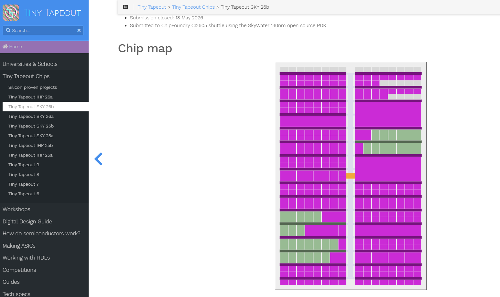

# Modulo 6 — Progetto TinyTapeout



## Obiettivi

Al termine di questo modulo lo studente sarà in grado di:

- Scegliere un progetto originale e mapparlo sull'architettura del tile TinyTapeout
- Preparare un repository GitHub conforme al template TinyTapeout (analog o digital-only)
- Integrare layout analogico e blocco digitale sintetizzato in un tile Magic TT (Variante A)
- Eseguire DRC, antenna check e LVS di integrazione a due passi (Variante A)
- Sintetizzare un design VHDL con LibreLane VHDLClassic e committare il gate-level (Variante B)
- Scrivere un test cocotb minimale per le GitHub Actions
- Esportare GDS e LEF e verificare il superamento delle tre GitHub Actions
- Compilare la documentazione del progetto (`README.md`, `docs/info.md`, `info.yaml`)
- Sottomettere il progetto su `app.tinytapeout.com`

---

## Il progetto d'esame

Questo modulo è il **modulo di esame** del corso. Lo studente sceglie un progetto originale e lo porta autonomamente fino alla sottomissione su TinyTapeout (shuttle SKY130A).


**Criteri di scelta del progetto:**

Il progetto deve **dimostrare padronanza di almeno uno degli strumenti principali del corso.** Può essere analogico, digitale o mixed-signal. Nelle prime ore del modulo è prevista una discussione col docente per validare la scelta prima di iniziare.

---

## Prerequisiti

- Ambiente Docker IIC-OSIC-TOOLS v2025.07 configurato e funzionante → [Modulo 0](../00_setup/)
- Moduli 1–3 completati per la Variante A (xschem, ngspice, Magic VLSI, Netgen, LVS/PEX)
- Moduli 1–4 completati per la Variante B (xschem, ngspice, LibreLane VHDLClassic)
- Account GitHub personale
- Progetto scelto e architettura definita (discussione col docente prima di iniziare)

---

## Struttura del modulo

Il percorso si divide in due varianti indipendenti. Segui la variante che corrisponde al tuo progetto — ignora l'altra.

### Variante A — Progetto analog o mixed-signal (analog TT template)

Per studenti il cui progetto include blocchi analogici o mixed-signal che richiedono layout manuale in Magic e tile TinyTapeout 1×2.

| File | Argomento | Tempo stimato |
|------|-----------|---------------|
| [`lab00_A_setup_repo_analog.md`](./lab00_A_setup_repo_analog.md) | Repository: clone da analog template, struttura cartelle, `info.yaml`, documentazione | ~45 min |
| [`lab01_A_tile_magic_integrazione.md`](./lab01_A_tile_magic_integrazione.md) | Tile Magic TT: inizializzazione, import GDS digitale, posizionamento, wiring, `project.v` | ~2.5 h |
| [`lab02_A_lvs_drc_export.md`](./lab02_A_lvs_drc_export.md) | LVS di integrazione (2 passi), DRC batch, antenna check, export GDS e LEF | ~1 h |
| [`lab03_actions_submission.md`](./lab03_actions_submission.md) | GitHub Actions, diagnostica errori, sottomissione su TinyTapeout | ~30 min |

### Variante B — Progetto digital-only (verilog TT template)

Per studenti il cui progetto è un design VHDL da sintetizzare con LibreLane VHDLClassic. Nessun layout manuale.

| File | Argomento | Tempo stimato |
|------|-----------|---------------|
| [`lab00_B_setup_repo_digital.md`](./lab00_B_setup_repo_digital.md) | Repository: clone da verilog template, struttura cartelle, `info.yaml`, `.gitignore`, documentazione | ~30 min |
| [`lab01_B_sintesi_librelane_tt.md`](./lab01_B_sintesi_librelane_tt.md) | `config.json` per il tile TT, sintesi LibreLane VHDLClassic locale, commit gate-level | ~1.5 h |
| [`lab02_B_projectv_cocotb.md`](./lab02_B_projectv_cocotb.md) | `project.v`, test cocotb (template), verifica locale con icarus | ~1 h |
| [`lab03_actions_submission.md`](./lab03_actions_submission.md) | GitHub Actions, diagnostica errori, sottomissione su TinyTapeout | ~30 min |

---

## Come lavorare

Il flusso di questo modulo è diverso dai precedenti: non esiste una procedura unica che tutti seguono. Ogni studente lavora su un progetto diverso e adatta comandi e configurazioni al proprio design. I lab forniscono la struttura e i comandi template — la loro applicazione al caso specifico è parte del lavoro d'esame.

Quando un comando o un file contiene `NOME` o la stringa `tt_um_psei_NOME`, sostituisci con il nome effettivo del tuo progetto (es. `tt_um_psei_filtro_rc`, `tt_um_psei_uart`, ecc.). Il nome deve sempre iniziare con `tt_um_` — requisito obbligatorio TinyTapeout.

> ⚠️ Il nome del modulo in `src/project.v`, il campo `DESIGN_NAME` in `rtl/config.json` (solo Variante B) e il campo `top_module` in `info.yaml` devono essere **identici** — carattere per carattere. Una sola differenza causa un fallimento delle GitHub Actions difficile da diagnosticare.

> 💡 Il container IIC-OSIC-TOOLS v2025.07 contiene tutti gli strumenti necessari per entrambe le varianti. Non è necessario installare nulla di aggiuntivo.

---

## Autenticazione Git con GitHub

Dal 2021, GitHub non accetta più username e password per le operazioni `git push` da riga di comando. Occorre usare uno dei due metodi seguenti. Il metodo con **Personal Access Token** è il più semplice e funziona identicamente su Windows, macOS e Linux — è quello consigliato per questo corso.

> ⚠️ Le credenziali vengono salvate **dentro il container**. La cartella home del container (`~`) non persiste al riavvio se non è montata sull'host. Per evitare di dover reinserire le credenziali ogni volta, il credential store va configurato su una cartella persistente — vedi il Metodo 1 di seguito.

### Metodo 1 — Personal Access Token (HTTPS) — consigliato

Un Personal Access Token (PAT) è una stringa generata da GitHub che sostituisce la password. Si usa con il normale URL HTTPS del repository.

**Genera il token su GitHub:**

1. Vai su [github.com → Settings → Developer settings → Personal access tokens → Tokens (classic)](https://github.com/settings/tokens)
2. Clicca **Generate new token (classic)**
3. Seleziona lo scope **repo** (accesso completo ai repository)
4. Copia il token generato — GitHub lo mostra **una sola volta**

**Configura Git nel container:**

```bash
# Salva le credenziali in una cartella persistente (montata sull'host)
git config --global credential.helper "store --file /foss/designs/.git-credentials"

# Clona il repository con HTTPS
git clone https://github.com/TUO_USERNAME/tt_um_psei_NOME.git

# Al primo push, Git chiede username e password:
#   Username: il tuo username GitHub
#   Password: incolla il PAT (non la password GitHub)
git push
```

Le credenziali vengono salvate in `/foss/designs/.git-credentials` — una cartella montata sull'host e quindi persistente tra i riavvii del container. I push successivi non richiedono più di reinserirle.

> ⚠️ Il file `.git-credentials` contiene il token in chiaro. Non committarlo mai nel repository — è già nel `.gitignore` generato da GitHub.

### Metodo 2 — Chiave SSH

Le chiavi SSH offrono autenticazione più robusta senza dover gestire token con scadenza. Il punto critico nel container è la persistenza: la chiave deve essere salvata in una cartella montata sull'host.

```bash
# Genera la coppia di chiavi in una cartella persistente
mkdir -p /foss/designs/.ssh
ssh-keygen -t ed25519 -C "tua@email.com" -f /foss/designs/.ssh/id_ed25519

# Configura SSH per usare questa chiave
mkdir -p ~/.ssh
cat >> ~/.ssh/config << 'EOF'
Host github.com
    IdentityFile /foss/designs/.ssh/id_ed25519
    AddKeysToAgent yes
EOF

# Mostra la chiave pubblica da aggiungere a GitHub
cat /foss/designs/.ssh/id_ed25519.pub
```

Copia l'output di `cat` e aggiungilo su GitHub: **Settings → SSH and GPG keys → New SSH key**.

Clona il repository con l'URL SSH (non HTTPS):

```bash
git clone git@github.com:TUO_USERNAME/tt_um_psei_NOME.git
```

> ⚠️ Il blocco `Host github.com` nel file `~/.ssh/config` si trova nella home del container e non persiste al riavvio. Aggiungi un alias nel tuo `.designinit` per ricrearlo automaticamente, oppure usa il Metodo 1 che non ha questo problema.

---

## Esempi di progetti pubblicati

Prima di scegliere il tuo progetto, è utile esplorare repository di progetti TinyTapeout già pubblicati. Forniscono ispirazione per l'architettura, modelli concreti di `info.yaml`, `project.v` e struttura del repo, e mostrano come altri designer hanno affrontato i vincoli del tile TT.

**Variante A — analog e mixed-signal**

| Repository | Descrizione |
|------------|-------------|
| [mattvenn/ttsky25b-analog-relax-oscillator](https://github.com/mattvenn/ttsky25b-analog-relax-oscillator) | Oscillatore a rilassamento analogico — esempio di progetto puramente analogico con tile TT 1×2. Riferimento per gli script Tcl Magic e il flusso LVS adottati anche in questo corso |
| [mattvenn/tt08-analog-r2r-dac-3v3](https://github.com/mattvenn/tt08-analog-r2r-dac-3v3) | DAC a R-2R a 8 bit a 3.3V — esempio di mixed-signal con interfaccia digitale e uscita analogica |

**Variante B — digital-only**

| Repository | Descrizione |
|------------|-------------|
| [johnisanerd/ttsky-verilog-siliconimist-demoscene](https://github.com/johnisanerd/ttsky-verilog-siliconimist-demoscene) | Effetto demoscene digitale puramente Verilog — esempio di progetto digital-only ben documentato |

> 💡 Questi repository mostrano anche come strutturare il `README.md` del proprio progetto, quali campi di `info.yaml` sono critici e come scrivere `docs/info.md` in modo efficace per la pagina pubblica TinyTapeout.

---

## Avviare l'ambiente

Prima di iniziare, verifica che il container sia in esecuzione e le variabili d'ambiente siano configurate:

```bash
echo $PDK          # atteso: sky130A
echo $PDK_ROOT     # atteso: /foss/pdks

# Crea la cartella di lavoro in cui clonerai il repo TT
mkdir -p /foss/designs/modulo6
cd /foss/designs/modulo6
```

---

## Riferimenti utili

- [TinyTapeout — documentazione ufficiale](https://tinytapeout.com/docs/)
- [TinyTapeout — analog template](https://github.com/TinyTapeout/ttsky-analog-template)
- [TinyTapeout — verilog template](https://github.com/TinyTapeout/ttsky-verilog-template)
- [TinyTapeout — date shuttle attive](https://tinytapeout.com/runs/)
- [app.tinytapeout.com — sottomissione](https://app.tinytapeout.com/)
- [LibreLane — documentazione](https://librelane.readthedocs.io/en/stable/)
- [Magic VLSI — manuale](http://opencircuitdesign.com/magic/magic_docs.html)
- [Netgen — documentazione](http://opencircuitdesign.com/netgen/)
- [cocotb — documentazione](https://docs.cocotb.org/)
