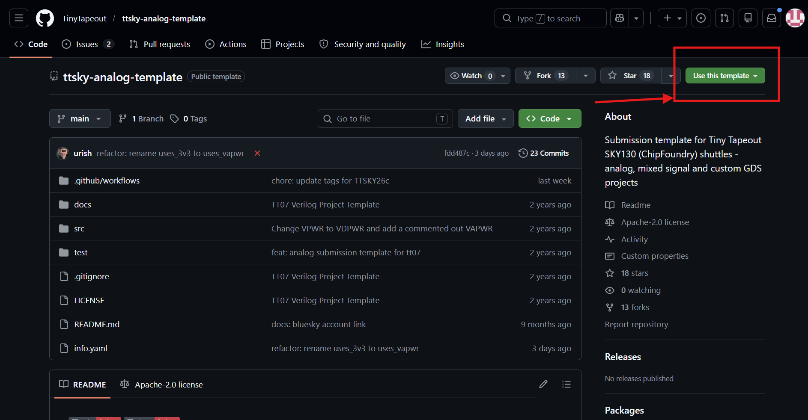
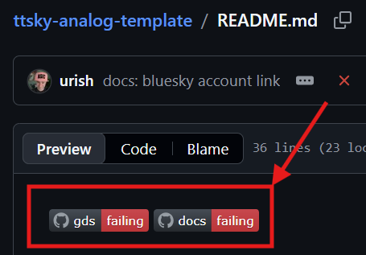

# Lab 00-A — Setup del repository (Variante A: analog / mixed-signal)

## Obiettivo

Creare il repository GitHub del progetto d'esame a partire dal template TinyTapeout per progetti analogici e mixed-signal, configurare i metadati obbligatori e predisporre la struttura di cartelle usata nei lab successivi.

---

## Parte 1 — Clone del template

### 1.1 Crea il repository su GitHub

Vai su [https://github.com/TinyTapeout/ttsky-analog-template](https://github.com/TinyTapeout/ttsky-analog-template) e clicca **"Use this template" → "Create a new repository"**.



Configura il repository:
- **Owner:** il tuo account GitHub personale
- **Repository name:** `tt_um_psei_NOME` dove `NOME` descrive brevemente il tuo progetto
- **Visibility:** Public (obbligatorio per TinyTapeout)

> ⚠️ Il nome del repository deve corrispondere al nome del modulo che userai in `project.v` e in `info.yaml`. Sceglilo con cura prima di procedere — cambiarlo dopo significa aggiornare riferimenti in più file.

> 💡 Esempi di nomi validi: `tt_um_psei_sar_adc`, `tt_um_psei_osc_rc`, `tt_um_psei_ldo`. Tutti iniziano con `tt_um_` — requisito obbligatorio della piattaforma.

### 1.2 Clona il repository nel container

```bash
cd /foss/designs/modulo6
git clone https://github.com/TUO_USERNAME/tt_um_psei_NOME.git
cd tt_um_psei_NOME
```

---

## Parte 2 — Struttura delle cartelle

Il template analog contiene solo i file minimi necessari per GitHub:

```
tt_um_psei_NOME/          ← quello che trovi dopo il clone
├── .github/
│   └── workflows/
│       ├── gds.yaml
│       └── docs.yaml
├── docs/
│   └── info.md
├── src/
│   └── project.v
├── test/
│   └── requirements.txt  ← dipendenze Python per le Actions (pytest, cocotb)
├── .gitignore
├── LICENSE
├── README.md
└── info.yaml
```

Tutte le cartelle di lavoro vanno create a mano. Esegui questi comandi dalla radice del repository clonato:

```bash
cd /foss/designs/modulo6/tt_um_psei_NOME

# Cartelle per schematici e simulazioni xschem/ngspice
mkdir -p xschem/simulation

# Cartelle per il layout Magic
mkdir -p mag/tcl
mkdir -p gds
mkdir -p lef

# Cartella per il blocco digitale sintetizzato (solo se mixed-signal)
mkdir -p rtl/src rtl/gl
```

Copia il Makefile e gli script Tcl dal repository PSEI:

```bash
cp /foss/designs/PSEI-ASIC-Lab/utils/mag_scripts/Makefile mag/
cp /foss/designs/PSEI-ASIC-Lab/utils/mag_scripts/tcl/* mag/tcl/
```

La struttura risultante deve essere:

```
tt_um_psei_NOME/
├── .github/workflows/        ← NON modificare (gds.yaml, docs.yaml)
├── docs/
│   └── info.md
├── src/
│   └── project.v
├── test/
│   └── requirements.txt
├── xschem/
│   └── simulation/
├── mag/
│   ├── Makefile
│   └── tcl/
│       ├── tt_analog_setup.tcl
│       ├── extract_for_lvs.tcl
│       ├── extract_for_sim.tcl
│       ├── lvs_netgen.tcl
│       ├── drc.tcl
│       ├── antenna.tcl
│       └── update_gds_lef.tcl
├── gds/                      ← popolata da make update_gds
├── lef/                      ← popolata da make update_gds
├── rtl/                      ← solo se mixed-signal
│   ├── src/
│   └── gl/
├── .gitignore
├── info.yaml
└── README.md
```

> 💡 Le cartelle `gds/` e `lef/` vengono create automaticamente da `make update_gds` tramite `mkdir -p` — non è necessario crearle a mano. Crearle subito serve solo ad avere la struttura visibile nel repository fin dal primo commit.

> 💡 Se il path del repository PSEI è diverso da `/foss/designs/PSEI-ASIC-Lab/`, sostituiscilo con il path corretto verificato con `ls /foss/designs/`.

---

## Parte 3 — `info.yaml`

Il file `info.yaml` contiene i metadati del progetto che TinyTapeout usa per la piattaforma e per il sito. Aprilo e compila i campi obbligatori:

```yaml
# info.yaml
---
# Il nome del progetto — visibile sulla pagina del chip TinyTapeout
project:
  title:    "Nome del tuo progetto"
  author:   "Cognome Nome"
  description: >
    Breve descrizione del progetto in inglese (2-3 frasi).
    Cosa fa il circuito? Quali specifiche principali?

  # CRITICO: deve corrispondere esattamente al nome del modulo in src/project.v
  top_module: "tt_um_psei_NOME"

  # Numero di pin analogici usati (ua[0]..ua[N-1])
  # 0 se il progetto è puramente digitale, anche in Variante A
  analog_pins: 2

  # Imposta a true solo se usi tensioni a 3.3V (raro con SKY130A a 1.8V)
  uses_3v3: false

# Mappatura pin — compila solo i pin che usi effettivamente
pinout:
  # Pin di ingresso digitale ui_in[7:0]
  ui_in:
    - {bit: 0, name: "clk_ext", description: "clock esterno alternativo"}
    # ...

  # Pin di uscita digitale uo_out[7:0]
  uo_out:
    - {bit: 0, name: "dout0", description: "bit 0 uscita digitale"}
    # ...

  # Pin analogici ua[7:0] — elenca solo quelli usati
  ua:
    - {bit: 0, name: "VOUTP", description: "uscita analogica positiva"}
    - {bit: 1, name: "VOUTN", description: "uscita analogica negativa"}
```

> ⚠️ Il campo `analog_pins` indica il numero di pin `ua[]` **effettivamente connessi al layout** — non il numero massimo disponibile. Se usi `ua[0]` e `ua[1]`, scrivi `analog_pins: 2`. TinyTapeout usa questo valore per configurare l'infrastruttura del chip.

> ⚠️ Il valore di `top_module` deve iniziare con `tt_um_` e corrispondere al nome del modulo in `src/project.v`. Verifica questo vincolo adesso, prima di scrivere qualsiasi altro file.

---

## Parte 4 — `docs/info.md`

Il file `docs/info.md` alimenta la pagina del tuo progetto sul sito di TinyTapeout. Compila le tre sezioni obbligatorie:

```markdown
<!---
Questo file viene pubblicato automaticamente sul sito TinyTapeout.
Scrivi in inglese, in modo chiaro e conciso.
-->

## How it works

[Descrivi il principio di funzionamento del circuito.
Puoi includere uno schema a blocchi in ASCII o un'immagine.
Esempio: "An 8-bit SAR ADC that samples a differential input
and outputs the digital code via successive approximation."]

## How to test

[Descrivi come testare il chip una volta ricevuto fisicamente.
Specifica i pin da connettere, le tensioni, gli strumenti necessari.
Esempio: "Apply a differential signal between ua[0] (VOUTP) and ua[1] (VOUTN).
Connect clk to ui_in[0]. Read the output code from uo_out[7:0]."]

## External hardware

[Elenca l'hardware esterno necessario per testare il chip.
Se non è necessario niente, scrivi "None".
Esempio: "Signal generator, oscilloscope, 1.8V power supply."]
```

---

## Parte 5 — `README.md` (relazione del progetto)

Il `README.md` alla radice del repository è la **relazione del progetto d'esame**, e quindi dovrà essere sufficientemente documentata. Sostituisci il contenuto del template con la struttura seguente (in inglese):

```markdown
# Titolo del progetto — breve descrizione in SKY130A 130nm

## Abstract

[2-3 frasi che descrivono il progetto, le specifiche principali
e il risultato ottenuto dalla simulazione o dal tapeout.]

## Architecture

[Schema a blocchi + descrizione dei blocchi principali.
Puoi usare ASCII art o un'immagine (preferibile) caricata in docs/.]

## Implementation

[Strumenti usati, PDK, scelte architetturali principali.]

## Simulation results

[Risultati di simulazione: SNDR, ENOB, waveform, simulazioni PVT e Montecarlo chiave, codice di conversione verificato, risposta in frequenza, ecc.
Includi almeno un'immagine o una tabella con i risultati numerici. ]

## How to test

[Istruzioni per testare il chip fisico dopo la produzione.
Copia dalla sezione corrispondente di docs/info.md.]

## External hardware

[Hardware esterno necessario. Copia da docs/info.md.]

## References

[Articoli di riferimento, PDK, tool.
Esempio:
- SkyWater SKY130 PDK: https://skywater-pdk.readthedocs.io/
- TinyTapeout: https://tinytapeout.com/
- IIC-OSIC-TOOLS: https://github.com/iic-jku/IIC-OSIC-TOOLS]
```

>⚠️ Nella scrittura del file `README.md`, non dimenticare di lasciare le action tags, che indicano pass/fail sulla verifica `gds` e `docs`.


---

## Parte 6 — Primo commit

Aggiungi e committa la configurazione iniziale:

```bash
git add info.yaml docs/info.md README.md
git commit -m "feat: project metadata and documentation skeleton"
git push
```

Verifica su GitHub che le tre GitHub Actions (`gds`, `docs`, `test`) siano visibili nella scheda **Actions**. A questo stadio potrebbero fallire — è normale, perché GDS e gate-level non sono ancora presenti. Le Actions diventano verdi al completamento del Lab02-A.

---

## Domande di riflessione

Prima di procedere al Lab01-A, verifica di aver risposto a queste domande:

1. Il valore di `top_module` in `info.yaml` coincide esattamente con il nome del modulo che scriverai in `src/project.v`?
2. Quanti pin analogici `ua[]` usa il tuo progetto? Il valore di `analog_pins` riflette questo numero?
3. Il progetto ha un blocco digitale sintetizzato separato? In caso affermativo, la cartella `rtl/` è stata creata?

Procedi al [Lab01-A](./lab01_A_tile_magic_integrazione.md) quando tutte e tre le domande hanno risposta definitiva.
