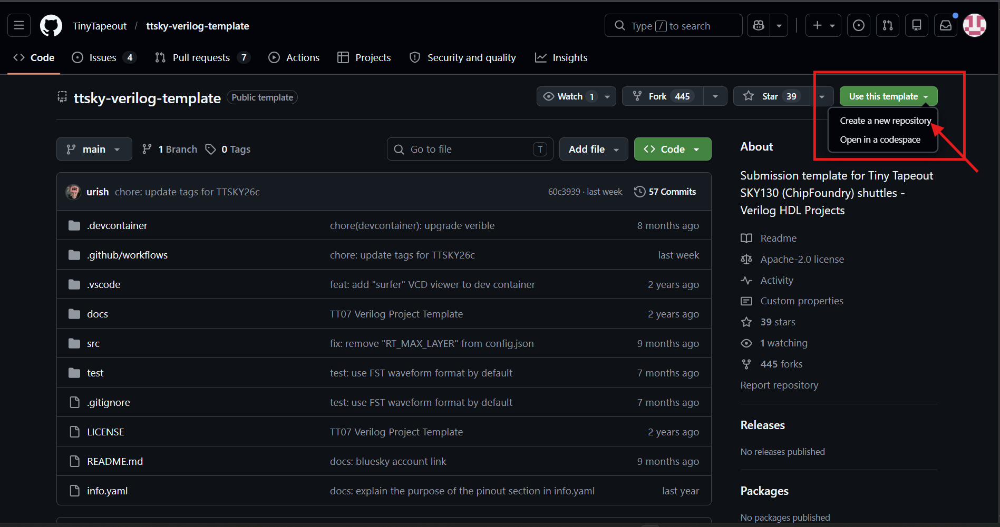

# Lab 00-B — Setup del repository (Variante B: digital-only)

## Obiettivo

Creare il repository GitHub del progetto d'esame a partire dal template TinyTapeout per progetti digital-only, configurare `.gitignore`, metadati e documentazione, e predisporre la struttura di cartelle per il flusso VHDL→LibreLane→gate-level.

---

## Parte 1 — Clone del template

### 1.1 Crea il repository su GitHub

Vai su [https://github.com/TinyTapeout/ttsky-verilog-template](https://github.com/TinyTapeout/ttsky-verilog-template) e clicca **"Use this template" → "Create a new repository"**.



Configura il repository:
- **Owner:** il tuo account GitHub personale
- **Repository name:** `tt_um_psei_NOME` dove `NOME` descrive brevemente il tuo progetto
- **Visibility:** Public (obbligatorio per TinyTapeout)

> ⚠️ Il nome del repository deve corrispondere al nome del modulo che userai in `project.v`, in `config.json` e in `info.yaml`. Sceglilo con cura prima di procedere.

> 💡 Esempi di nomi validi: `tt_um_psei_sar_ctrl`, `tt_um_psei_uart`, `tt_um_psei_pwm`. Tutti iniziano con `tt_um_` — requisito obbligatorio della piattaforma.

### 1.2 Clona il repository nel container

```bash
cd /foss/designs/modulo6
git clone https://github.com/TUO_USERNAME/tt_um_psei_NOME.git
cd tt_um_psei_NOME
```

---

## Parte 2 — Struttura delle cartelle

Il template include già `src/project.v`, `test/`, `docs/info.md`, `info.yaml` e `README.md`. Aggiungi la cartella `rtl/` dove risiederanno i sorgenti VHDL, il `config.json` e il Makefile di sintesi:

```bash
mkdir -p rtl/src rtl/gl
```

La struttura completa del repository sarà:

```
tt_um_psei_NOME/
├── .github/
│   └── workflows/
│       ├── gds.yaml          ← Action GDS/DRC/LVS (NON modificare)
│       ├── test.yaml         ← Action cocotb (NON modificare)
│       └── docs.yaml         ← Action documentazione (NON modificare)
├── src/
│   ├── project.v             ← top module TT (da personalizzare)
│   └── tt_um_psei_NOME.v     ← gate-level committato (generato da rtl/)
├── rtl/
│   ├── src/
│   │   └── mio_design.vhd    ← sorgenti VHDL del progetto
│   ├── config.json           ← configurazione LibreLane VHDLClassic
│   ├── Makefile              ← Makefile VHDL/sintesi
│   └── gl/
│       └── tt_um_psei_NOME.v ← copia di lavoro del gate-level
├── test/
│   ├── Makefile              ← Makefile cocotb
│   └── test.py               ← smoke test cocotb
├── docs/
│   └── info.md
├── info.yaml
└── README.md
```

> ⚠️ La cartella `rtl/runs/` generata da LibreLane può pesare centinaia di MB. Va aggiunta al `.gitignore` **prima** del primo commit — vedi Parte 3.

---

## Parte 3 — `.gitignore`

Apri o crea il file `.gitignore` alla radice del repository e aggiungi:

```gitignore
# Output LibreLane — molto grandi, non committare
rtl/runs/

# File intermedi GHDL
rtl/build/
rtl/sim/

# File temporanei Python
__pycache__/
*.pyc
```

Committa subito il `.gitignore`:

```bash
git add .gitignore
git commit -m "chore: add gitignore for rtl/runs and build artifacts"
git push
```

> ⚠️ Se esegui `git add rtl/` accidentalmente prima di aggiungere il `.gitignore`, rimuovi i file già tracciati con:
> ```bash
> git rm -r --cached rtl/runs/
> git commit -m "chore: remove accidental rtl/runs from tracking"
> ```

---

## Parte 4 — `info.yaml`

Apri `info.yaml` e compila i campi obbligatori:

```yaml
# info.yaml
---
project:
  title:    "Nome del tuo progetto"
  author:   "Cognome Nome"
  description: >
    Breve descrizione del progetto in inglese (2-3 frasi).
    Cosa fa il design digitale? Quali sono le specifiche principali?

  # CRITICO: deve corrispondere esattamente al nome del modulo in src/project.v
  # e al campo DESIGN_NAME in rtl/config.json
  top_module: "tt_um_psei_NOME"

  # Digital-only: nessun pin analogico
  analog_pins: 0
  uses_3v3: false

pinout:
  # Compila solo i pin che il tuo design usa effettivamente
  ui_in:
    - {bit: 0, name: "in0", description: "ingresso 0"}

  uo_out:
    - {bit: 0, name: "out0", description: "uscita 0"}

  uio:
    []   # lascia vuoto se non usi i pin bidirezionali
```

> 💡 Per un design digital-only, `analog_pins: 0` e il template `ttsky-verilog-template` non espone i pin `ua[]`. Non è necessario (né possibile) usarli.

---

## Parte 5 — `docs/info.md`

```markdown
## How it works

[Descrivi il principio di funzionamento del design digitale.
Esempio: "A Moore FSM implementing an 8-bit SAR ADC controller.
The FSM generates phi_sample, clk_comp, and dac_p/dac_n signals
that drive the CDAC and comparator of the SAR ADC."]

## How to test

[Descrivi come testare il chip.
Specifica i pin di ingresso da pilotare, la frequenza di clock,
la sequenza di reset, e cosa osservare sulle uscite.
Esempio: "Apply a 20 MHz clock to the clk pin (ui_in[0]).
Apply active-low reset on rst_n (ui_in[1]).
Connect the comparator output stub to ui_in[2].
Read dout[7:0] from uo_out[7:0] when eoc (uio_out[7]) goes high."]

## External hardware

[Esempio: "None — the design can be tested with a logic analyzer
and a function generator for the clock input."]
```

---

## Parte 6 — `README.md` (relazione del progetto)

Il `README.md` alla radice del repository è la **relazione del progetto d'esame**, e quindi dovrà essere sufficientemente documentata. Sostituisci il contenuto del template con la struttura seguente (in inglese):

```markdown
# Titolo del progetto — breve descrizione in SKY130A 130nm

## Abstract

[2-3 frasi sul progetto, specifiche e risultati.]

## Architecture

[Prima istanziazione, seconda istanziazione, Schema a blocchi, FSM, diagrammi temporali attesi del design.
Per la FSM: stati, transizioni, ingressi/uscite.]

## Implementation

[Strumenti: VHDL + GHDL + LibreLane VHDLClassic + TinyTapeout.
Scelte architetturali: tipo di FSM (Moore/Mealy), reset asincrono, ecc.]

## Simulation results

[Risultati del testbench VHDL: forma d'onda chiave, verifica del reset,
sequenza funzionale verificata, gate-leve simulation. Includi almeno un'immagine GTKWave.]

## How to test

[Copia da docs/info.md]

## External hardware

[Copia da docs/info.md]

## References

[PDK, tool, articoli di riferimento]
```

---

## Parte 7 — Primo commit

```bash
git add .gitignore info.yaml docs/info.md README.md
git commit -m "feat: project metadata, documentation skeleton and gitignore"
git push
```

---

## Domande di riflessione

Prima di procedere al Lab01-B, verifica:

1. Il valore di `top_module` in `info.yaml` è quello che userai come `DESIGN_NAME` in `rtl/config.json` e come nome del modulo in `src/project.v`?
2. La cartella `rtl/runs/` è nel `.gitignore`?
3. Il tuo design VHDL è già scritto e testato con GHDL (Modulo 4)? In caso contrario, completalo prima di procedere alla sintesi per TT.

Procedi al [Lab01-B](./lab01_B_sintesi_librelane_tt.md) quando tutte e tre le domande hanno risposta definitiva.
