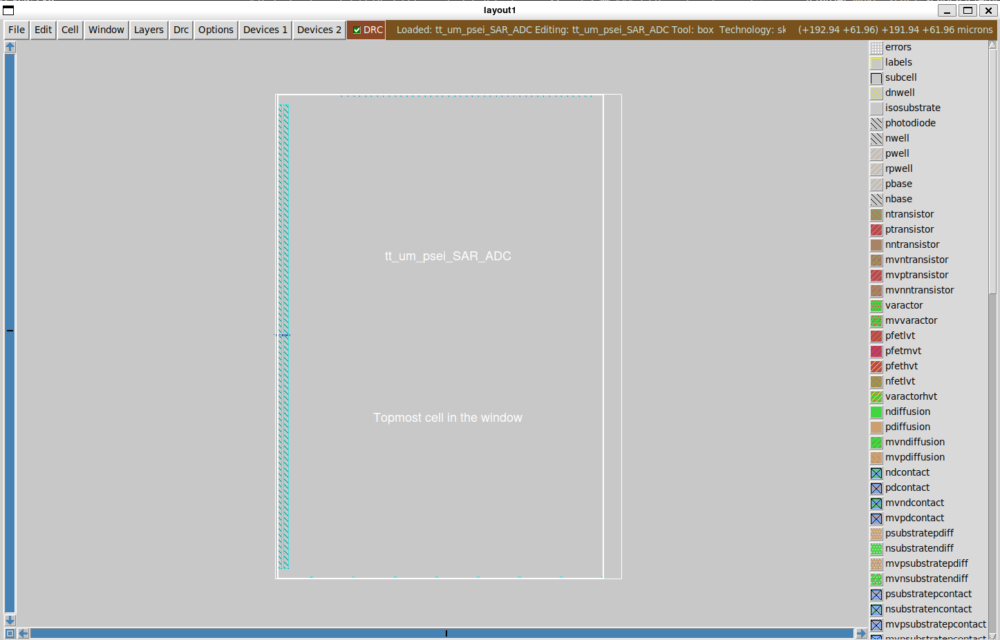
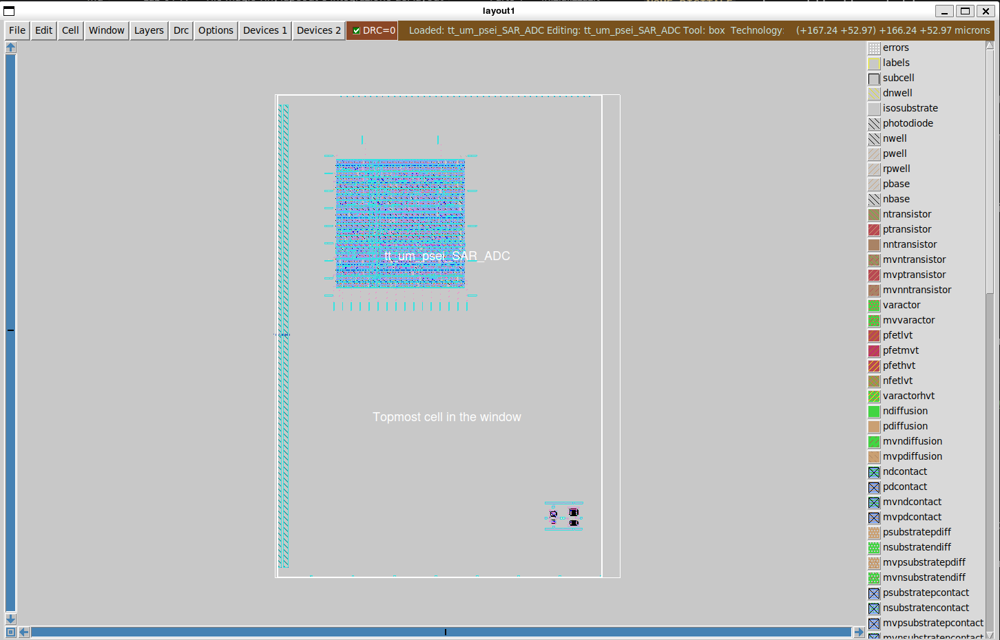
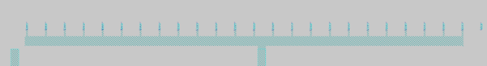

# Lab 01-A — Tile Magic TinyTapeout e integrazione del layout

## Obiettivo

Inizializzare il tile TinyTapeout in Magic, importare il GDS del blocco digitale sintetizzato con LibreLane, posizionare i blocchi nel tile, connettere alimentazione e pin, e aggiornare `src/project.v` per il LVS di integrazione.

---

## Prerequisiti di questo lab

- Lab00-A completato: repository clonato, `info.yaml` e documentazione configurati
- Layout del blocco analogico disponibile in formato `.mag` o da costruire nel lab
- GDS del blocco digitale disponibile in `gds/` (se il progetto include logica digitale sintetizzata)
- Script Tcl di `mag_scripts` presenti in `mag/tcl/`

> 💡 Se il tuo progetto è **puramente analogico** (nessun blocco digitale sintetizzato), salta la Parte 2 e passa direttamente alla Parte 3.

---

## Parte 1 — Inizializzazione del tile TinyTapeout

### 1.1 Struttura della cartella `mag/`

Prima di aprire Magic, verifica che la cartella `mag/` contenga il Makefile e gli script Tcl:

```
mag/
├── Makefile
└── tcl/
    ├── tt_analog_setup.tcl
    ├── extract_for_lvs.tcl
    ├── extract_for_sim.tcl
    ├── lvs_netgen.tcl
    ├── drc.tcl
    ├── antenna.tcl
    └── update_gds_lef.tcl
```

Se la cartella `tcl/` non è presente, copiala dal repository PSEI:

```bash
cp -r /foss/designs/PSEI-ASIC-Lab/utils/mag_scripts/tcl/ mag/
```

### 1.2 Inizializza il tile con `make start`

Il target `make start` scarica il template `.def` del tile TinyTapeout (160 × 225.76 µm, tile 1×2) e richiama `tt_analog_setup.tcl` in batch, creando il file `tt_um_psei_NOME.mag` con le power stripe `VDPWR` e `VGND` in `met4` e i pin digitali del wrapper TT sul bordo superiore.

Prima di eseguirlo, imposta `PROJECT_NAME` nel Makefile:

```bash
cd /foss/designs/modulo6/tt_um_psei_NOME/mag
nano Makefile
# → imposta: PROJECT_NAME ?= tt_um_psei_NOME
```

Dove `NOME` deve essere sostituito con il nome scelto per il progetto. Poi:

```bash
make start
```

> 💡 `make start` richiede accesso a internet per scaricare il template `.def` da GitHub. Verifica che il container abbia connessione prima di lanciarlo.

Apri il tile per verifica visiva:

```bash
make magic
```

Il Makefile apre `magic -rcfile $(MAGIC_RC) $(PROJECT_NAME).mag` — punta direttamente al tuo `.mag` e carica il PDK automaticamente.

> 💡 Appena aperto Magic, premi `v` (full view) per vedere l'intero tile. Dovresti vedere due strip verticali di metallo 4 — quella a sinistra è `VDPWR` (1.8 V), quella a destra è `VGND`. Per verificarlo: seleziona una strip con `s`, poi digita `what` nella command window Tcl.



**Domanda di riflessione:** Qual è il passo (pitch) tra le strip di `met4`? Misuralo con il box tool (click sinistro + click destro per definire l'area, coordinate leggibili nella status bar). `?` µm

---

## Parte 2 — Import del GDS del blocco digitale (LibreLane → Magic)

Questa parte riguarda solo i progetti che includono un blocco digitale sintetizzato con LibreLane. Il GDS generato dalla sintesi deve essere importato in Magic come **cella figlia indipendente**, usando l'opzione `gds readonly true` — questa opzione è critica.

Prima di procedere, chiarisci i nomi in gioco nel tuo progetto:

| Elemento | Nome | Esempio |
|---|---|---|
| Tile TinyTapeout (top-level Magic) | `tt_um_psei_NOME` | `tt_um_psei_sar_adc` |
| Blocco digitale (LibreLane `DESIGN_NAME`) | nome del sotto-blocco | `sar_controller` |
| GDS LibreLane | `DESIGN_NAME.gds` | `sar_controller.gds` |

Il blocco digitale ha un nome **diverso** dal tile top-level. Viene importato come cella figlia e poi posizionato dentro il tile. Nel seguito useremo `NOME_DIGITALE` per il nome del tuo blocco digitale.

### 2.1 Perché `gds readonly true`

Quando Magic importa un GDS generato da un flusso di sintesi a standard cell, le celle SKY130A interne (inverter, flip-flop, ecc.) vengono caricate in memoria. Se si salva il file `.mag` normalmente, Magic potrebbe riesportare quelle celle in formato editabile — introducendo DRC errors e invalidando la struttura gerarchica del GDS originale.

Con `gds readonly true`, Magic marca la cella come sola lettura: durante il GDS export finale (`make update_gds`) verrà sempre utilizzato il GDS originale di LibreLane, non una ri-esportazione da Magic. Il risultato è un file `.mag` che è essenzialmente un puntatore al GDS originale.

### 2.2 Copia il GDS in `gds/`

Il GDS del blocco digitale si trova nell'output di LibreLane. Copialo nella cartella `gds/` del repository:

```bash
# Sostituisci NOME_DIGITALE con il DESIGN_NAME del tuo config.json
cp rtl/runs/RUN_*/final/gds/NOME_DIGITALE.gds gds/
```

### 2.3 Procedura di import

Esegui questa procedura in una **sessione Magic temporanea** — non aprire il tile principale. Nel container IIC-OSIC-TOOLS il PDK è già configurato globalmente, quindi non serve passare il rcfile esplicitamente:

```bash
cd /foss/designs/modulo6/tt_um_psei_NOME/mag
magic -d XR &
```

Nella command window Tcl di Magic:

```tcl
# Indica a Magic di trattare il GDS come sola lettura
gds readonly true

# Leggi il GDS del blocco digitale
# NOME_DIGITALE = DESIGN_NAME impostato in rtl/config.json (es. sar_controller)
gds read ../gds/NOME_DIGITALE.gds

# Salva il file .mag nella cartella mag/ corrente — stesso nome del blocco
writeall force NOME_DIGITALE
```

Quando Magic chiede "You have unsaved cells — really quit?", rispondi **yes** e chiudi.

> ⚠️ Il `writeall force` crea `NOME_DIGITALE.mag` nella cartella `mag/` — **non** `tt_um_psei_NOME.mag` (quello è il tile, già esistente). I due file coesistono: il tile è il top-level, il blocco digitale è la cella figlia che verrà posizionata dentro al tile.

> ⚠️ Non modificare mai `NOME_DIGITALE.mag` — è usato solo come blackbox per il posizionamento nel tile.

> 💡 Se il GDS del blocco digitale non è ancora disponibile, generalo con LibreLane:
> ```bash
> cd rtl/
> librelane --flow VHDLClassic config.json
> cp runs/RUN_*/final/gds/NOME_DIGITALE.gds ../gds/
> ```

### 2.4 Verifica del file `.mag` creato

```bash
ls -lh mag/NOME_DIGITALE.mag
```

Il file deve essere presente. La sua dimensione è piccola (pochi kB) — conferma che non contiene la geometria copiata ma solo il riferimento.

---

## Parte 3 — Posizionamento dei blocchi nel tile

Riapri il tile principale:

```bash
cd mag/
make magic
```

### 3.1 Inserire il blocco analogico

Se il tuo blocco analogico è già in formato `.mag` (es. dal Modulo 3), inseriscilo nel tile:

**Menu → Cell → Place Instance** → seleziona il file `.mag` del tuo blocco analogico.

Il blocco appare nel cursore. Clicca per posizionarlo all'interno del boundary del tile. Per muoverlo dopo averlo posizionato: seleziona con `s`, poi `g` (grab) e muovi col mouse.

> 💡 Usa `x` (expand) per vedere la geometria interna del blocco, e poi `^z` (Ctrl+z per kontract) per tornare alla visione gerarchica. Lavorare in modalità gerarchica è più veloce per il posizionamento.

### 3.2 Inserire il blocco digitale (se presente)

Stessa procedura: **Menu → Cell → Place Instance** → seleziona `NOME_DIGITALE.mag` (il file creato nella Parte 2).

Posiziona il blocco digitale **nell'angolo superiore** del tile, vicino ai pin digitali del wrapper TT — in questo modo il wiring dei pin digitali sarà più corto.

> ⚠️ Assicurati che nessun blocco fuoriesca dal boundary del tile (`prboundary`). Il DRC segnala violazioni per geometrie fuori dai limiti del tile.



---

## Parte 4 — Wiring: alimentazione e pin

### 4.1 Alimentazione del blocco digitale

Il blocco digitale sintetizzato da LibreLane richiede connessioni di alimentazione sui layer `met4`. Le power stripe `VDPWR` e `VGND` sono già nel tile — devi connettere i pin `VPWR` e `VGND` del blocco digitale a queste stripe.

Per identificare quale strip è quale: seleziona con `s`, poi digita `what` nella command window Tcl.

Usa il wire tool (`w`) su layer `met4` per tracciare la connessione. Cambia layer nel pannello laterale o con il tasto `;` seguito dal nome del layer.

> 💡 I pin di alimentazione del blocco digitale sono sui bordi superiore e inferiore. Espandi il blocco con `x` per vederli. Seleziona un pin con `s` e digita `what` per verificarne il nome.

### 4.2 Pin analogici `ua[]`

I pin analogici `ua[0]`, `ua[1]`, ecc. del wrapper TinyTapeout sono sulla riga in basso del tile (bordo inferiore). Connettili alle uscite analogiche del tuo blocco (es. `VOUTP`, `VOUTN`).

Il layer per i pin analogici è tipicamente `met3` o `met4` — verifica il layer del pin del wrapper selezionandolo con `s` e digitando `what`.

> ⚠️ Il numero di pin analogici connessi qui deve corrispondere al valore di `analog_pins` in `info.yaml`. Se colleghi solo `ua[0]` e `ua[1]`, imposta `analog_pins: 2`.

### 4.3 Pin digitali

I pin digitali `ui_in[7:0]`, `uo_out[7:0]`, `uio[7:0]`, `clk`, `rst_n`, `ena` del wrapper TT sono sul bordo superiore del tile. Connettili ai pin corrispondenti del tuo blocco digitale (se presente).

>⚠️ Le **uscite** digitali non usate devono essere collegate a `VGND`. Un modo efficiente è tracciare una strip orizzontale di `met4` e connettere tutti i pin non usati a essa, poi connettere la strip a `VGND`.



### 4.4 Salva

```tcl
# Nella command window Tcl di Magic:
save tt_um_psei_NOME
```

---

## Parte 5 — Aggiornamento di `src/project.v`

Il file `src/project.v` è il top module Verilog del tile TinyTapeout. Viene usato dalle GitHub Actions per il LVS di integrazione (verifica che i pin del tuo blocco siano correttamente connessi al wrapper TT).

Il template include già la dichiarazione del modulo con tutte le porte — **non modificarla**. Aggiungi solo il corpo:

```verilog
module tt_um_psei_NOME (
    input  wire [7:0] ui_in,
    output wire [7:0] uo_out,
    input  wire [7:0] uio_in,
    output wire [7:0] uio_out,
    output wire [7:0] uio_oe,
    input  wire       ena,
    input  wire       clk,
    input  wire       rst_n,
    inout  wire [7:0] ua        // pin analogici — solo nel template analog
);
    // --- Segnali interni ---
    wire voutp, voutn;

    // --- Istanza blocco analogico ---
    mio_blocco_analogico u_analog (
        .VDD   (1'b1),          // VPWR: connesso a VDPWR nel layout
        .GND   (1'b0),          // VGND: connesso a VGND nel layout
        .VOUTP (voutp),
        .VOUTN (voutn)
        // ... altre porte
    );

    // --- Istanza blocco digitale (se presente) ---
    // tt_um_psei_NOME_ctrl u_ctrl (
    //     .clk   (clk),
    //     .rst_n (rst_n),
    //     ...
    // );

    // --- Mappatura pin TinyTapeout ---
    // Uscite digitali non usate: tie basso
    assign uo_out  = 8'b0;
    assign uio_out = 8'b0;
    assign uio_oe  = 8'b0;

    // Pin analogici
    assign ua[0] = voutp;
    assign ua[1] = voutn;
    // ua[2..7] non connessi — lasciare floating per progetti analog-only

endmodule
```

> ⚠️ L'istanza nel `project.v` deve rispecchiare esattamente la topologia del layout: stessi nomi di net, stesse connessioni di alimentazione. Netgen confronta il layout estratto con questo Verilog — ogni discrepanza è un errore LVS.

> 💡 La sintassi Verilog per l'istanza con port mapping nominale è identica concettualmente alla `port map` VHDL: `.nome_porta_modulo(nome_segnale_locale)`. Le porte non connesse si scrivono `.porta()` — non vanno omesse.

---

## Parte 6 — Prima verifica DRC interattiva

In Magic il DRC interattivo è **già attivo all'apertura**: le violazioni vengono rilevate automaticamente e segnalate con un layer a puntini bianchi sovrapposto alle geometrie problematiche. Il contatore degli errori è visibile nella barra del titolo della finestra di layout.

Per identificare e capire le violazioni:

1. Individua visivamente le zone con i puntini bianchi — sono le aree con DRC errors
2. Assicurati di essere nel box tool — è il tool attivo di default all'avvio; se hai cambiato tool (ad esempio per il wiring), premi la barra spaziatrice più volte fino a tornare al cursore a croce. Disegna una box sopra la zona con errori: click sinistro per il primo angolo, click destro per il secondo
3. Digita nella command window Tcl:

```tcl
drc why
```

Il comando `drc why` stampa il nome della regola violata e una breve descrizione per ogni errore presente nella box corrente. Esempio di output:

```
Metal3 spacing violation (m3.2):
  spacing = 0.140 um, minimum = 0.300 um
```

Ripeti per ogni zona con puntini bianchi fino ad aver identificato tutte le violazioni.

> 💡 Per saltare rapidamente da un errore al successivo senza muovere il mouse, usa il tasto `=` — sposta la view sull'errore DRC successivo e lo centra automaticamente.

> ⚠️ Il DRC interattivo di Magic è un controllo parziale. Le violazioni mostrate in tempo reale sono un sottoinsieme — il DRC completo si esegue con `make drc` nel Lab02-A e potrebbe rivelare violazioni aggiuntive.

Quando il numero di violazioni visibili è zero o limitato a zone note, salva e chiudi Magic:

```tcl
save tt_um_psei_NOME
quit
```

---

## Riepilogo dei file prodotti

Alla fine di questo lab, la cartella del progetto deve contenere:

```
mag/
├── tt_um_psei_NOME.mag          ← tile TT top-level con i blocchi posizionati
├── NOME_DIGITALE.mag            ← .mag del blocco digitale (readonly, se presente)
└── tcl/                         ← script Tcl invariati

src/
└── project.v                    ← aggiornato con istanza blocchi + pin mapping
```

Procedi al [Lab02-A](./lab02_A_lvs_drc_export.md).
