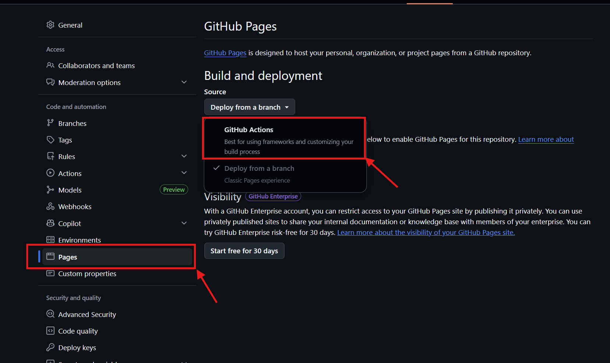

# Lab 03 — GitHub Actions e sottomissione su TinyTapeout

## Obiettivo

Verificare che le tre GitHub Actions (GDS, test, docs) siano verdi, diagnosticare e risolvere eventuali errori, e sottomettere il progetto su `app.tinytapeout.com` per la produzione su silicio.

Questo lab è comune alle due varianti. I file da committare differiscono — segui la sezione corrispondente alla tua variante.

---

## Parte 1 — File da committare prima del push finale

Verifica che tutti i file necessari siano tracciati da git.

### Variante A (analog / mixed-signal)

```bash
cd /foss/designs/modulo6/tt_um_psei_NOME

# Verifica lo stato dei file
git status

# Aggiungi i file che devono essere presenti
git add src/project.v
git add mag/tt_um_psei_NOME.mag
git add gds/tt_um_psei_NOME.gds
git add lef/tt_um_psei_NOME.lef
git add info.yaml
git add docs/info.md
git add README.md

git commit -m "feat: final layout, LVS PASS, DRC clean, GDS/LEF ready for submission"
git push
```

### Variante B (digital-only)

```bash
cd /foss/designs/modulo6/tt_um_psei_NOME

git add src/project.v
git add src/tt_um_psei_NOME.v   # gate-level
git add rtl/config.json
git add rtl/gl/tt_um_psei_NOME.v
git add test/test.py
git add test/Makefile
git add info.yaml
git add docs/info.md
git add README.md

git commit -m "feat: gate-level committed, cocotb test PASS, ready for submission"
git push
```

---

## Parte 2 — Attivazione di GitHub Pages

La GitHub Action `docs.yaml` genera la documentazione del progetto e la pubblica su GitHub Pages. Perché funzioni, devi abilitare Pages nel repository:

1. Vai al tuo repository su GitHub
2. Clicca **Settings** → **Pages** (pannello sinistro)
3. Sotto "Build and deployment", seleziona **Source: GitHub Actions**
4. Clicca **Save**

Se questo passaggio viene saltato, la `docs` Action termina con errore anche se il contenuto di `docs/info.md` è corretto.



---

## Parte 3 — Interpretazione delle GitHub Actions

Dopo il push, vai sulla scheda **Actions** del tuo repository. Vedrai tre workflow in esecuzione:

| Action | Cosa fa | Durata tipica |
|--------|---------|---------------|
| `gds` | Esegue il precheck TinyTapeout: DRC con KLayout, LVS, verifica pin, controllo antenna | 5–15 min |
| `test` | Esegue `test/test.py` con cocotb + icarus sul gate-level in `src/` | 2–5 min |
| `docs` | Genera PDF e pagina web da `docs/info.md` | 1–2 min |

Il badge accanto a ogni run è verde (✓) o rosso (✗). Per le submissione su TinyTapeout sono richieste **tutte e tre verdi**.

> 💡 Le Actions vengono riattivate automaticamente a ogni push. Se un'Action è rossa, correggi il problema, fai un nuovo push, e attendi che la Action rilanci.

---

## Parte 4 — Diagnostica: cosa fare se un'Action è rossa

### `docs` action rossa

Questo è quasi sempre il problema più semplice da risolvere. Cause comuni:

- **GitHub Pages non abilitato** — il caso più frequente. Torna alla Parte 2 e abilita Pages.
- **`docs/info.md` mancante o vuoto** — il file deve esistere e contenere almeno le tre sezioni ("How it works", "How to test", "External hardware").
- **Markdown non valido** — una sezione `##` mancante o un link rotto. Controlla la sintassi.

### `test` action rossa (Variante B)

Scarica i log dell'Action cliccando sulla run fallita → "test" → clicca sul job per espandere i log.

| Sintomo nel log | Causa | Soluzione |
|---|---|---|
| `Module 'tt_um_psei_NOME' not found` | `TOPLEVEL` nel `test/Makefile` non corrisponde al nome del modulo in `project.v` | Allinea i due nomi |
| `Error: Unable to open file: src/tt_um_psei_NOME.v` | Il gate-level non è stato committato in `src/` | `git add src/tt_um_psei_NOME.v && git push` |
| `assert failed: X/Z during reset` | Un'uscita rimane indeterminata; tipicamente `uio_oe` non assegnato | Aggiungi `assign uio_oe = 8'hFF;` in `project.v` |
| `assert failed: uscite non cambiano` | La logica non si attiva con gli ingressi del test | Adatta `test.py`: fornisci gli ingressi necessari prima di verificare le uscite |
| `cocotb: AttributeError` | Incompatibilità tra cocotb 1.9 (locale) e 2.0 (Actions) | Usa la sintassi compatibile con entrambe le versioni (vedi Lab02-B) |

### `gds` action rossa (Variante A)

Quando la `gds` Action fallisce, scarica i report dal link "Artifacts" in fondo alla pagina dell'Action fallita. Il file `precheck_reports.zip` contiene:

- `results.md` — riepilogo testuale (leggi questo per primo)
- `magic_drc.txt` — violazioni DRC riportate da Magic
- `drc_*.xml` — marker KLayout per visualizzare le violazioni nel GDS
- `lvs.log` — output del LVS eseguito dall'infrastruttura TT

**Violazioni DRC nwell/urpm:** sono le più comuni per progetti analogici SKY130A. Spesso causate da resistori polisilicio di piccole dimensioni. Correzione: usa resistori più grandi, oppure modifica i layer RPM/URPM con Magic seguendo le istruzioni nella documentazione TinyTapeout.

**Violazioni offgrid:** geometrie non allineate alla griglia. Correzione: in Magic, usa "Options → Grid → 0.005 µm" e sposta le geometrie sulla griglia.

**LVS MISMATCH nell'Action:** il LVS delle Actions usa `project.v` come riferimento. Se il `project.v` e il layout non sono allineati, vai a controllare:
1. I nomi delle net nel layout corrispondono ai nomi nel `project.v`?
2. Il `project.v` è l'ultimo aggiornato (non una versione precedente)?

**"GDS file not up to date":** hai modificato il `.mag` ma non rigenerato il GDS con `make update_gds`. Riesegui `make update_gds` e committa il nuovo GDS.

**"wrong # args: should be readnet":** il nome del modulo top in `project.v` non corrisponde al `PROJECT_NAME` passato al Makefile LVS nell'Action. Assicurati che `top_module` in `info.yaml` e il nome del modulo in `project.v` siano identici.

### `gds` action rossa (Variante B)

| Sintomo | Causa | Soluzione |
|---|---|---|
| `DESIGN_NAME mismatch` | `DESIGN_NAME` nel gate-level ≠ `top_module` in `info.yaml` | Allinea i valori nei tre file |
| `DRC violations` | Celle standard con violazioni (raro con LibreLane, può succedere con configurazioni anomale) | Controlla i report, verifica che `PL_TARGET_DENSITY` non sia eccessivamente alta |
| `Timing not met` | WNS < 0 — il design non rispetta il timing | Aumenta `CLOCK_PERIOD` in `config.json`, risintetizza, ricommitti il gate-level |
| `Gate-level empty` | `src/tt_um_psei_NOME.v` non è stato committato, oppure è il file vuoto del template | Verifica con `wc -l src/tt_um_psei_NOME.v` — deve avere centinaia di righe |

---

## Parte 5 — Quando tutte le Actions sono verdi

Quando i tre badge sono verdi, il repository è pronto per la sottomissione. Comunica al docente il link al tuo repository.

**Il docente:**
1. Effettua un fork del tuo repository su [github.com/Elettronica-UnivAQ](https://github.com/Elettronica-UnivAQ)
2. Sottomette il progetto su [app.tinytapeout.com](https://app.tinytapeout.com/) usando il fork
3. Ti comunica il numero di tile assegnato

> ⚠️ La sottomissione su `app.tinytapeout.com` richiede un token TinyTapeout acquistato dal docente. Non puoi sottomettere autonomamente — è il docente che effettua la sottomissione finale per tutti i progetti del corso.

> ⚠️ Ogni modifica al GDS (Variante A) o al gate-level (Variante B) dopo la sottomissione richiede di creare una **nuova revisione** su `app.tinytapeout.com` cliccando "Create new revision". Se modifichi il repository dopo la sottomissione iniziale senza creare una nuova revisione, la foundry fabbricherà la versione precedente.

---

## Verifica finale del repository

Prima di comunicare il link al docente, controlla questa lista:

- [ ] `info.yaml`: `top_module` corretto, `analog_pins` corretto (Var. A), `title` e `author` compilati
- [ ] `docs/info.md`: tutte e tre le sezioni compilate in inglese
- [ ] `README.md`: relazione completa con risultati di simulazione e immagini
- [ ] `src/project.v`: istanza corretta del design, uscite non usate collegate a 0
- [ ] GDS e LEF in `gds/` e `lef/` (solo Var. A)
- [ ] Gate-level in `src/` (solo Var. B)
- [ ] GitHub Pages abilitato (Settings → Pages → GitHub Actions)
- [ ] Tutte e tre le Actions verdi (✓ GDS, ✓ test, ✓ docs)

**Congratulazioni — il tuo progetto è pronto per la produzione su silicio.**

---

## Cosa hai realizzato

Il file GDS che hai appena committato verrà scritto su una maschera fotolitografica e impresso in silicio reale. Fino a una decina di anni fa questo richiedeva un budget aziendale di centinaia di migliaia di dollari, accesso a PDK proprietari sotto NDA, e l'uso di tool commerciali da licenza annua a sei cifre.

Oggi il tuo progetto è arrivato al tape-out con strumenti open-source che hai installato gratuitamente sul tuo computer, un PDK rilasciato pubblicamente da una foundry, e una piattaforma di tape-out condiviso pensata anche per studenti. Hai usato xschem per gli schematici, ngspice per le simulazioni, Magic VLSI per il layout, Netgen per il LVS, LibreLane per il flusso digitale, KLayout per il visualizzatore GDS — esattamente gli stessi strumenti con cui i progettisti professionisti che lavorano su silicon open-source progettano i chip che troviamo nei prodotti di tutti i giorni.

Non hai fatto un esercizio didattico. Hai fatto chip design vero.

---

## Cosa succede adesso

Tra il tuo "git push" finale e il chip fisicamente nelle tue mani passa tipicamente tra i sei e i nove mesi. La timeline indicativa è la seguente:

| Fase | Quando |
|------|--------|
| Chiusura della shuttle | data fissata su [tinytapeout.com/runs](https://tinytapeout.com/runs/) |
| Tape-out alla foundry | ~1 mese dopo la chiusura |
| Fabbricazione fisica | ~4–6 mesi |
| Dicing, packaging, assembly demoboard | ~1–2 mesi |
| Spedizione di chip e demoboard | a seguire |

> 💡 Annota la data di chiusura della tua shuttle e tornaci sopra di tanto in tanto su [app.tinytapeout.com](https://app.tinytapeout.com/). Lo stato del progetto si aggiorna man mano che la fabbricazione procede.

Quando il chip arriva, riceverai una demoboard che lo ospita e ti permette di testarlo dal vivo — quel momento, in cui il codice e gli schemi che hai scritto diventano segnali misurabili con un oscilloscopio, è il vero coronamento del lavoro fatto in queste 30 ore di laboratorio.

---

## Continuare il viaggio

Sei appena entrato in una community internazionale che progetta chip in modo aperto e collaborativo. Alcune direzioni in cui puoi continuare:

**Community e conferenze**
- [TinyTapeout Discord](https://tinytapeout.com/discord) — community attiva di chi sta facendo tape-out
- [FOSSi Foundation](https://fossi-foundation.org/) — fondazione dell'ecosistema silicon open-source
- [FSiC (Free Silicon Conference)](https://wiki.f-si.org/) e [Orconf](https://orconf.org/) — conferenze annuali della community

**Altri PDK open-source**
- **GF180MCU** — PDK 180nm di GlobalFoundries, rilasciato open-source nel 2022. Tensioni più alte (5V), utile per applicazioni di potenza e mixed-signal robusti
- **IHP-Open130** — PDK 130nm BiCMOS della foundry tedesca IHP, include transistor bipolari ad alta frequenza per applicazioni RF

**Progetti più ambiziosi**
- [ChipFoundry chipIgnite](https://chipfoundry.io/chipignite) — shuttle MPW su SKY130 con template Caravel, per design completi su area maggiore (mm² invece di tile 160×225 µm). Adatto per chi vuole portare in silicio progetti più complessi del singolo tile TT
- [OpenROAD Project](https://theopenroadproject.org/) — il motore di place-and-route open-source che gira sotto il cofano di LibreLane; ha un ecosistema autonomo per chi vuole approfondire il flusso digitale

**Risorsa storica**
- [Zero-to-ASIC Course](https://zerotoasiccourse.com/) di Matt Venn — il corso che ha aperto la strada al silicon open-source in ambito didattico e ha ispirato la struttura di questo laboratorio
